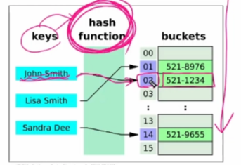

# 0127(data structure 2). md

---

## dictionary 자료형 메서드

### .get(key [ , default]) 메서드

: 키 연결된 값을 반환하거나 키가 없으면 None 혹은 기본 값을 반환

(get 메서드가 아닌 [  ] 로 연결된 값을 조회할 때, 해당 키 값이 없으면 Error 발생)

- None 혹은 선택 인자(원하는 값) 을 반환하기 원한다면 get 메서드 사용
- 

### .Keys( ) 메서드

: 딕셔너리 키를 모은 객체를 반환 ( 덩어리를 만들어준다 → 메모리 효율성 / ex) map, range, zip )


### .values ( ) 메서드

: 딕셔너리 값을 모은 객체를 반환 ( 덩어리로 만들어 준다 → 지연 평가 활용한‘ 최종 평가 ‘ 가 필요할 때 사용 )


### .items ( ) 메서드

: 딕셔너리 키 / 값 쌍을 모은 객체를 반환 ( 덩어리로 만들어 준다 )

→ 해당 메서드는 객체를 반환할 때 언패킹을 진행한다 (Key, value에 각각 언패킹)


### .pop(Key[ , default]) 메서드

: 키를 제거하고 연결됐던 값을 반환 ( 없으면 에러나 default를 반환 )


### .Clear ( ) 메서드

: 딕셔너리의 모든 키 / 값 쌍을 제거


### .setdefault(key[ , default]) 메서드

: 키와 연결된 값을 반환, 키가 없다면 default와 연결된 키를 딕셔너리에 추가하고 default를 반환

→ get의 조회 기능 + 추가 하는 기능

### .update( [other] )

: other가 제공하는 키 / 값 쌍으로 딕셔너리를 갱신하고 기존 키는 덮어쓴다

(other : 딕셔너리에 추가하거나 갱신할 키 - 값 쌍을 가진 데이터 객체를 의미하는 자리 표시자)


예시 코드와 같이 키워드 인자 형태로 전달도 가능하다

## defaultdict

: 파이썬 내장 모듈 collections에서 제공하는 딕셔너리의 확장판

사용 방법 : (예시) defaultdict (자료형) 형태로 선언

```python
from collections import defaultdict

text = 'banana'
counts = defaultdict(int) # 기본 값을 정수(0)로 설정

for char in text:
	# 키 확인 불필요! 없으면 0으로 자동 생성 후 + 1
	counts char += 1
	
prin(counts) # defaultdict(<class 'int'>, { 'b' : 1 , ' a ' : 3 ,,, } 
```

자주 쓰이는 곳:

- 숫자 세기 : defaultdict(int)
- 그룹핑 / 리스트 모으기 : defaultdict(list)

---

## Set 자료형 메서드

## .add (x) 메서드

: 세트에 x를 추가하는 메서드

→ 출력하는 순서가 뒤죽박죽이다 ( 정렬이 되지 않는다 )

( 딕셔너리와 다르게 우리가 작성한 순서 조차 보장이 되지 않고 출력 된다 )


## .update(iterable)

: 세트 자료형에 다른 iterable 요소를 추가한다


### .clear ( )

: 세트의 모든 항목을 제거한다

→ 항목이 제거 된 이후 빈 세트는 set ( ) 함수로 표기가 된다


### .remove(x)

: 세트에서 항목 x를 제거, 항목 x가 없을 경우 KeyError 발생


### .pop( )

: 세트에서 임의의 요소를 제거하고 반환한다

(리스트는 pop 사용시 마지막 요소 혹은 인덱스 입력한 요소를 제거하고 딕셔너리는 키에 해당 하는 값을 제거하지만, 세트는 임의의 요소를 제거한다. 그렇지만 완전히 무작위는 아니다(Hash))

### .discard(x)

: 세트 s에서 항목 x를 제거한다. remove 메서드와 달리 에러가 없다


### Set의 집합 메서드

: 메서드와 연산자 모두 기능은 동일 → 선택하여 사용


---

## 파이썬 문법 규격 (BNF)

: “Backus -Naur Form “

프로그래밍 언어의 문법을 표기하기 위한 표기법

대표적인 EBNF 메타기호

[ ] : 선택적 요소 라는 의미

{ } : 0번 이상 반복 이라는 의미

( ) : 그룹화 라는 의미

→ 사용하는 이유? 서로 다른 프로그래밍 언어, 데이터 형식, 프로토콜 등의 문법을 통일하여 정의하기 위함이다

---

## 해시 테이블

: 해시 테이블은 ‘키(key)’와 ‘값(value)’을 짝지어 저장하는 자료 구조이다



> 검색 / 삽입 / 삭제가 동일한 속도로 진행된다.
> 

### 해시 (Hash)

: 임의의 크기를 가진 데이터를 고정된 크기의 고유한 (고정된) 값으로 변환하는 것

- 생성된 해시 값(고유한 정수)은 해당 데이터를 식별하는 ‘지문’ 역할을 한다
- 파이썬에서는 이 해시 값을 이용하여 해시 테이블에 데이터를 저장한다
- 이 변환을 수행하는 것이 ‘해시 함수’ 이다

### 해시 함수 (Hash Function)

: 임의 길이 데이터를 입력 받아 고정 길이(정수)로 변환해주는 함수이다

이 ‘ 정수 ‘가 바로 해시 값

- 주로 해시 테이블을 구현할 때, 매우 빠른 검색 및 데이터 저장 위치 결정을 위해 활용한다
- ‘ 해시 알고리즘 ‘이라고도 부른다

이때, bucket의 위치가 요소의 위치를 결정한다. 따라서, ‘ 순서 ‘ 가 아닌 ‘ 버킷 위치(인덱스)(임의의 순서) ‘ 이다.

→ set는 순서를 보장하지 않는다

→ 요소가 버킷에 배치되는 순서가 매번 달라지지만, 순서가 있기에 random은 아니다.

→ 완전한 무작위는 아니라, 임의의 라는 의미의 무작위이다.

set에서 pop을 했을때 문자열이 아닌 숫자 (정수) 는 높은 확률로 1이 먼저 나오는 이유?

: 

python은 해시 값이 ' 정수 ' 이기에, set 안의 요소인 ' 정수 '를 굳이 다시 변환하지 않고 그대로 사용한다.

따라서, 이미 해당 정수값에 해당하는 버킷의 위치에 set 의 요소인 정수를 대입한다.

이때, 1이 대체로 버킷에 앞쪽에 위치 (버킷에 정수가 숫자 순서대로 위치하지는 않음) 하기에 1이 높은 확률로 출력된다.

**반면, 문자열은 해시 계산시 python의 해시 난수화(Hash Randomization)가 적용되므로, 실행마다 순서가 달라 질 수 있다.**

### hashable

: hash( ) 함수에 넣어 해시 값을 구할 수 있는 객체를 의미한다

- 대부분의 불변 타입은 해시 가능 (int, float, str, tuple / 단, 내부에 불변만 있을 경우)
- 가변형 객체 (list, dict, set)는 기본적으로 해시 불가능

→ 값이 변하면 해시 값도 달라질 수 있어 해시 테이블의 무결성이 깨지기 때문에 해시 불가

### 해시 테이블 정리

- 해시 테이블은 해시 값을 인덱스로 삼아 데이터를 저장, 검색
- 파이썬의 set은 순서가 없고, pop ( ) 시 어떤 요소가 반환될지 정해져 있지 않음
- dict은 파이썬 3.7+ 버전에서 삽입 순서가 보장되지만, 내부 구현은 여전히 해시 테이블
- 해시 함수는 정수/문자열 등 타입에 따라 다르게 동작하며, 문자열 해시 시 난수화로 실행마다 달라질 수 있음.
- hashable 객체만 set과 dict의 키로 사용 가능하며, 일반적으로 불변 타입이 이에 해당한다