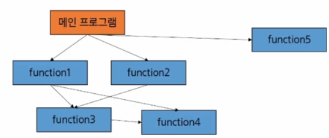
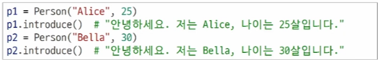
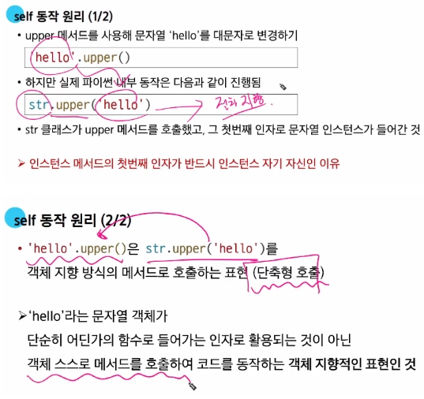
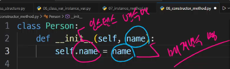
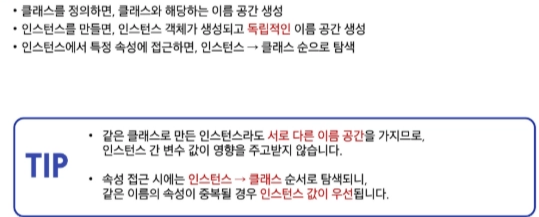
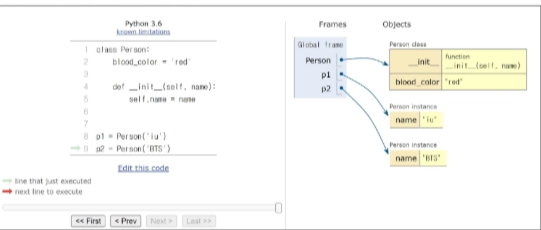
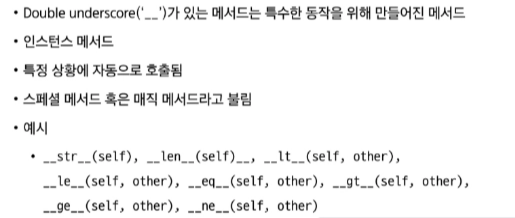
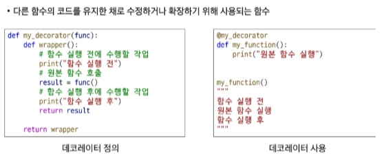

# 0128(OOP.01).md

### 매개 변수 전달 방법

- call by value :  값을 복사, 불변 변수(str, tuple, int, float) , 원본 수정 안됨
- call by reference : 주소 값을 복사, 가변 변수(list,dict,…) , 원본 수정됨

---

## 프로그래밍 패러다임

### 절차 지향과 객체 지향

### 절차 지향 프로그래밍(Procedural Programming)

: 함수와 로직 중심 작성, 데이터를 순차적으로 처리

- 변수와 함수를 별개로 다룬다

예시)

### 절차 지향 프로그래밍 특징

- 입력을 받고, 처리하고, 결과를 내는 과정이 위에서 아래로 순차적으로 흐르는 형태이다
- 순차적인 명령어를 실행한다
- 데이터와 함수(절차)의 분리이다
- 함수 호출의 흐름이 중요하다

### 절차 지향적 프로그래밍의 한계

1. 복잡성 증가
    - 프로그램 규모가 커질수록 데이터와 함수의 관리가 어렵다
    - 전역 변수의 증가로 인한 관리가 어렵다
2. 유지보수 문제
    - 코드 수정 시 영향 범위 파악이 어렵다

---

## 객체 지향 프로그래밍 (Object Oriented Programming)

: 클래스는 ‘ 설계도 ‘ 와 비슷한 개념, 인스턴스는 ‘ 설계도로 만든 실제 물건 ‘ 과 비슷한 개념

예시)

- 사람(객체) 안에  name, age와 이와 관련된 기능(메서드) 포함

예시)

### 객체 지향 프로그래밍 특징

- 프로그램을 데이터(변수)와 그 데이터를 처리하는 함수(메서드)를 하나의 단위(객체)로 묶어서 조직적으로 관리한다
- 데이터와 메서드의 결합이다

---

## 절차 지향과 객체 지향의 차이점

### 이 두 가지는 문자를 작성하는 패러다임일뿐, 대조되는 개념은 아니다

---

## 객체 (Object)

: 실제 존재하는 사물을 추상화 한 것 “ 속성 “ 과 “ 동작 “ 을 가진다

예시)

### 객체의 특징

- 속성 (Attribute)
    
    : 객체의 상태 / 데이터
    
- 메서드 (Method)
    
    : 객체의 행동 / 기능
    
- 고유성
    
    : 각 객체는 고유한 특성을 가진다
    

## 클래스 (Class)

: 객체를 만들기 위한 설계도(blueprint)이다. 데이터와 기능을 함께 묶는 방법을 제공한다

 (파이썬에서 타입을 표현하는 방법이기도 하다)

- class 키워드
- 클래스 이름은 파스칼 케이스(Pascal Case) 방식으로 작성한다

여기서, 클래스는 Snake_case로 작성하지 않고 Pascal case로 작성하는 이유는?

: 보통 Snake_case는 변수 / 함수( )를 정의할때 많이 작성한다.

이때, 클래스 또한 Snake_case로 작성한다면 파이썬은 어떤 것이 클래스인지 변수 / 함수 인지 구별하지 못한다.

따라서, 클래스는 Pascal_case 방식으로 작성하여 인스턴스를 만드는 클래스임을 식별하게 한다.

## 인스턴스 (Instance)

: 클래스를 통해 생성된 객체이다

- 같은 클래스로 여러 인스턴스를 만들 수 있다
- 각 인스턴스는 클래스 구조를 따라 동작하지만 서로 독립된 데이터를 가질 수 있다

예시)

여기서, p1,p2는 인스턴스 속성 즉, 두 가지(이름,나이)를 가지도 만들어진다.

이때, 동시에 같은 Person 클래스를 통하여 만들어져서 introduce라는 기능을 할 수 있다

(독립적으로) → 다른 인스턴스 이기에 독립된 데이터를 가졌기 때문

## 클래스와 인스턴스의 정의

- 클래스를 정의한다는 것은 공통된 특성과 기능을 가진 틀을 만드는 것이다
- 실제 활동하는 개별 객체들은 이 틀에서 생성된 인스턴스(instance)이다
- 공통된 특성과 기능을 가진 틀을 만드는 것은 곧 새로운 타입을 만드는 행위이다

예시)

+a 이때, 누군가는  ‘ 문자열 ‘ 을 생성해야한다.

그 ‘ 누군가 ‘ 가 → class 이다.

우리가 쓰는 데이터 타입들은 그것들을 만드는 class가 모두 존재한다.

### → 데이터들이 메서드를 호출할 수 있었던 이유

### 생성자 메서드

- 인스턴트 생성 시 자동 호출되는 특별한 메서드이다
- _ _ init _ _ 이라는 이름의 메서드로 정의한다
- 인스턴스 변수의 초기화를 담당한다

### 인스턴스 변수(속성)

- 모든 인스턴스가 공유하는 속성
- 클래스 내부에서 직접 정의

예시)

**파이썬은 인스턴스 변수와 클래스 변수를 어떻게 구분하나?** 

: 파이썬은 기능적으로 두 변수를 구분할 수 없다.

본인의 인스턴스 변수를 먼저 탐색 → 본인들을 만든 클래스 안에 변수를 탐색 하는 순서를 거쳐 변수를 입력 받는다.

→ **클래스 변수와 동일한 이름으로 인스턴스 변수 생성 시 클래스 변수가 아닌 인스턴스 변수에 먼저 참조하게 된다.**

이때, class.class-variable 로 클래스 변수를 참조 할 수 있다.

**(클래스 변수에 포함되어 있는 변수 이름은, 암묵적으로 인스턴스 변수에 사용하지 않는다.)**

## 메서드 (Method)

: 클래스 내부에 정의된 함수로, 해당 객체가 어떻게 동작할지를 정의한다

### 메서드의 종류

1. 인스턴스 메서드
2. 클래스 메서드
3. 스태틱 (정적) 메서드

## 인스턴스 메서드 (instance method)

: 인스턴스의 상태를 조작하거나 동작을 수행한다

(인스턴스마다 독립적으로 행동할 수 있게 만드는 것)

### 인스턴스 메서드의 구조

- 클래스 내부에 정의되는 메서드의 기본이다
- 반드시 첫 번째 인자로 인스턴스 자신(self)을 받는다
- 인스턴스의 속성에 접근하거나 변경이 가능하다

**self 동작 원리**

## 생성자 메서드 (constructor method)

: 인스턴스 객체가 생성될 때 자동으로 호출되는 메서드

  → 인스턴스 변수들의 초기값을 설정한다

## 클래스 메서드 (class method)

: 클래스 변수를 조작하거나 클래스 레벨의 동작을 수행한다

예시)

### 클래스 메서드 구조

- @classmethod ‘데코레이터’를 사용하여 정의
- 호출 시, 첫번 째 인자로 해당 메서드를 호출하는 클래스(cls)가 전달된다
- 클래스를 인자로 받아서 클래스 속성을 변경하거나 읽는 데 사용된다

## 스태틱 (정적) 메서드 (static method)

: 클래스, 인스턴스와 상관없이 독립적으로 동작하는 메서드

예시) 

### 스태틱 메서드의 구조

- @staticmethod ‘데코레이터’ 를 사용하여 정의
- 호출 시 자동으로 전달 받는 인자가 없다 (self, cls를 받지 않는다)
- 인스턴스나 클래스 속성에 직접 접근하지 않는 ‘ 도우미 함수 ‘와 비슷한 역할이다

예시)

## 메서드 정리

- **인스턴스 메서드**
    - 인스턴스의 상태를 변경하거나, 해당 인스턴스의 특정 동작을 수행

- **클래스 메서드**
    - 인스턴스의 상태에 의존하지 않는 기능을 정의
    - 클래스 변수를 조작하거나 클래스 레벨의 동작을 수행

- **스태틱 메서드**
    - 클래스 및 인스턴스와 관련이 없는 일반적인 기능을 수행

**+a 파이썬은 문법적인 제한이 강한 언어가 아니라서, 서로의 메서드를 사용할 수도 있다**

**하지만, 각자의 메서드는 OOP 페러다임에 따라 명확한 목적으로 설계된 것이기 때문에 클래스와 인스턴스 각각 올바른 메서드만 사용하는 것을 권장한다**

### 클래스와 인스턴스 간의 이름 공간

---

### 참고

### 매직 메서드 (magic method)

### 데코레이터 (Decorator)

