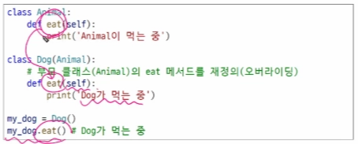
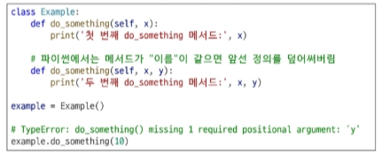
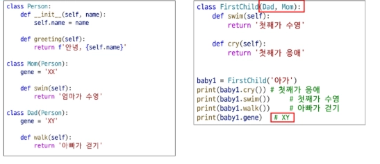
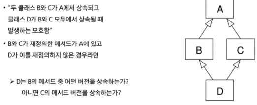

# 0129(OOP02, Exception).md

## 상속 (Inheritance)

: 한 클래스 (부모)와 속성과 메서드를 다른 클래스(자식)가 물려받는 것

- 부모 클래스와 자식 클래스 간의 상하 관계가 형성되고, 위쪽에 있는 부모 클래스가 본인의 속성과 메서드를 아래쪽에 있는 자식에게 넘겨주는 것

**상속이 필요한 이유**

1. **코드 재사용**
    - 상속을 통하여 기존 클래스의 속성과 메서드를 재사용할 수 있다
    - 기존 클래스를 수정하지 않고도 기능을 확장할 수 있다
2. **계층 구조**
    - 상속을 통해 클래스들 간의 계층 구조를 형성할 수 있다
    - 부모 클래스와 자식 클래스 간의 관계를 표현하고, 더 구체적인 클래스를 만들 수 있다
3. **유지 보수의 용이성**
    - 상속을 통해 기존 클래스의 수정이 필요한 경우, 해당 클래스만 수정하면 되므로 유지 보수가 용이해진다
    - 코드의 일관성을 유지하고, 수정이 필요한 범위를 최소화 할 수 있다

---

## 메서드 오버라이딩 (Method Overriding)

: 부모 클래스의 메서드를 같은 이름, 같은 파라미터 구조로 재정의하는 것

- 자식 클래스에서 메서드를 다시 정의하면, 부모 클래스의 메서드 대신 자식 클래스의 메서드가 실행된다
- 오버라이딩은 동일한 이름과 매개변수를 사용하지만, 내부 동작을 원하는 대로 바꿀 수 있게 해준다
- 부모 클래스의 기능을 유지하면서도 일부 동작을 맞춤형으로 바꾸고  싶을 때 유용하다

예시)

[참고] **오버로딩 (Overloading)** (python은 미지원)

→ 파이썬은 오버로딩을 지원하지 않기에

    첫번 째로 정의되었던 함수 def do_something(self, x)를 아예 취급하지 않는다 ( 없는 셈 친다 )

---

## 다중 상속

: 둘 이상의 상위 클래스로부터 여러 행동이나 특성을 상속받는 것

- 상속 받은 모든 클래스의 요소를 활용 가능하다
- 중복된 속성이나 메서드가 있는 경우 상속 순서에 의해 결정된다 ( 먼저 상속 받은 메서드를 상속 받는다 )

예시)

→ **먼저 상속 받은 클래스의 속성이나 메서드를 상속 받음**

→ **따라서, 속성이나 메서드를 탐색할 때 본인 → 아빠 → 엄마 순으로 탐색한다**

    **(이때, 앞 단계에서 찾고자 하는 속성이나 메서드를 발견하면 즉시 탐색이 종료된다)**

---

## 다이아몬드 문제 (The Diamond Problem)

### 파이썬에서의 해결책

- 파이썬은 MRO (Method Resolution Order) 알고리즘을 사용하여 메서드를 탐색할 클래스의 순서를 미리 정의 한다
- C3 Lineearization(선형화) 알고리즘을 적용하여 다음과 같은 원칙으로 순서를 결정한다

→

1. **자식 클래스 우선 : 부모 클래스보다 자식 클래스를 먼저 탐색한다**
2. **왼쪽 부모 우선 : 다중 상속 시, 리스트에 나열된 순서(왼쪽 → 오른쪽) 대로 탐색한다**
3. **중복 방문 방지 : 공통 부모 클래스는 모든 자식 클래스의 탐색이 끝난 뒤에 단 한번만 탐색한다**

                                                                     → **D(B, C) 순으로 상속 받을 시**

---

## MRO (Method Resolution Order)

: 파이썬의 메서드를 찾는 순서에 대한 규칙 ( 메서드 결정 순서 )

- MRO는 다중 상속에서 어떤 부모 클래스의 메서드를 먼저 사용할지 순서를 정의한다
- 파이썬은 미리 정해진 MRO를 통해 다중 상속 환경에서도 예측 가능한 방식으로 메서드 탐색이 이루어질 수 있도록 한다

---

## super ( ) 메서드

: MRO에 따라, 현재 클래스의 부모 클래스의 메서드나 속성에 접근할 수 있게 해주는 내장 함수이다

- super ( )를 사용하면 직접 부모 클래스 이름을 적지 않아도 MRO에 따라 자동으로 올바른 메서드를 찾아 실행할 수 있다
- 다중 상속에서 super ( )를 호출하면 상속 순서에 맞춰 여러 부모 클래스의 메서드를 순차적으로 실행할 수 있다 (위의 예시 문제 해결)
- 생성자나 오버라이딩된 메서드에서 super ( )를 호출하면 부모 클래스의 초기화나 로직을 그대로 활용 가능하다

### super ( ) 특징

- __단순히 “ 부모 클래스의 메서드를 호출 “ 하기 위한 용도 뿐만 아니라, 다중 상속이 있을 때도 올바른 순서(MRO)에 따라 상위 클래스의 메서드를 찾아 실행하기 위해 super ( )를 사용

### super ( )의 두 가지 사용 사례

1. **단일 상속 구조**
2. **다중 상속 구조**

#### 단일 상속 구조

**+a 아래와 같은 경우에도 동작은 하지만, 만일 부모 클래스의 이름이 추후에 변경된다면 오류가 발생할 수 있다 ( 추후 코드 수정에 어려울 수 있음 )**

### 다중 상속 구조

**따라서, Child 클래스는 인스턴스 변수 Child, ParentA, ParentB 총 세 가지를 생성한다**

### super ( )는 매우 유연한 메서드이다.

**ex) 시작점이 Child 클래스가 아니라 어딘지 모른다면, ParentA의 super ( ) 가 가리키는 다음 클래스는?**

         **→ “ 모른다 “ 첫 시작점을 알지 못하기에**

**→ MRO 순서 / 클래스의 상속을 잘 고려하여 설계를 해야한다**

---

## 에러와 예외

## 버그 (bug)

: 소프트웨어에서 발생하는 오류 또한 결함

  프로그램의 예상된 동작과 실제 동작 사이의 불일치를 뜻한다

## 디버깅 (Debugging)

: 소프트웨어에서 발생하는 버그를 찾아내고 수정하는 과정

  프로그램의 오작동 원인을 식별하여 수정하는 작업이다

- 디버깅은 코드 실행 과정에서 변수 값이나 흐름을 점검하며 문제의 정확한 위치와 원인을 찾아내는 과정이다
- 효과적인 디버깅을 위해 단계별로 코드를 실행하거나 로그를 출력하여 프로그램 상태를 확인하여야 한다

### 디버깅 방법

1. **print 함수 활용**
    - 특정 함수 결과, 반복 / 조건 결과 등을 나눠서 생각, 코드를 나눠서 생각할 수 있다

1. **개발 환경(text editor, IDE) 등에서 제공하는 기능 활용**
    - breakpoint, 변수 조회 등

1. **Python tutor 활용 (단순 파이썬 코드인 경우)**
2. **뇌 컴파일, 눈 디버깅 등**

## 에러 (Error)

: 프로그램 실행 중에 발생하는 예외 상황

- 프로그램을 실행할 때 예상치 못한 문제가 발생하면 오류가 생긴다
- 예를 들어, 존재하지 않는 파일을 읽으려 하거나 0으로 나누면 오류가 발생한다
    
    이러한 상황을 처리하지 않으면 프로그램이 중단된다
    

### 파이썬의 에러 유형

### 문법 에러 (Syntax Error)

: 프로그램의 구문이 올바르지 않은 경우 발생 (오타, 괄호 및 콜론 누락 등의 문법적 오류)

### 예외 (Exception)

: 프로그램 실행 중에 감지되는 에러

- 예외는 프로그램이 잘못된 동작을 시도할 때 자동으로 감지된다
- 예를 들어, 리스트에 없는 값을 꺼내려 하면 예외가 발생한다
- 이런 상황을 처리하지 않으면 프로그램은 즉시 종료된다

### 내장 예외 (Built-in Exceptions)

: 예외 상황을 나타내는 예외 클래스들

- 내장 예외는 파이썬에서 이미 정의되어 있으며, 특정 예외 상황에 대한 처리를 위해 사용한다
- 예를 들어 ZeroDivisionError는 0으로 나눌 때, FileNotFoundError는 없는 파일을 열 때 발생한다
    
    이러한 예외를 사용하면 오류에 맞는 적절한 처리 방법을 적용할 수 있다
    

## 예외 처리 (Exception Handling)

: 예외가 발생했을 때 프로그램이 비정상적으로 종료되지 않고, 적절하게 처리할 수 있도록 하는 방법

- 예외 처리를 통하여 오류가 발생해도 프로그램의 흐름을 안전하게 이어갈 수 있다
- Python에서는 try, except 구문을 사용하여 특정 예외를 잡아내고 원하는 동작을 수행할 수 있다
- 예외 처리를 구현하면 프로그램 사용자에게 오류 메시지를 보여주거나 대체 로직을 실행할 수 있다

### 예외 처리 사용 구문

- **try : 예외가 발생할 수 있는 코드 작성**
- **except : 예외가 발생했을 때 실행할 코드 작성**
- **else : 예외가 발생하지 않았을 때 실행할 코드 작성**
- **finally : 예외 발생 여부와 상관없이 항상 실행할 코드 작성**

예시)

## try - except 구조

- try 블록 안에는 예외가 발생할 수 있는 코드를 작성한다
- except 블록 안에는 예외가 발생했을 때 처리할 코드를 작성한다
- 예외가 발생하면 프로그램 흐름은 try 블록을 빠져나와 해당 예외에 대응하는 except 블록으로 이동한다

### 복수 예외 처리

## else & finally

- else 블록은 예외가 발생하지 않았을 때 추가 작업을 진행한다
- finally 블록은 예외 발생 여부와 상관없이 항상 실행할 코드를 작성한다

## 예외 처리 주의사항

- **모든 예외 처리는 클래스로 정의되어 있다 → ‘상속 구조”를 가진다**
- **“Exception“ 클래스는 최상위의 예외 처리 클래스이다**

      **→ 따라서 except Exception 코드 아래로는 모두 죽은 코드가 되어버린다**

 **(맨 아래에 except: 코드는 위에서 발생한 예외를 제외한 모든 예외를 포괄하는 의미를 가진다)**

**따라서, 작은 예외에서 부터 점점 범용 예외를 처리하도록 순서를 배치하여야 한다**

### 예외 객체 다루기

## as 키워드

- 예외 객체 : 예외가 발생했을 때 예외에 대한 정보를 담고 있는 객체이다
- except 블록에서 예외 객체를 받아서 상세한 예외 정보를 활용 가능하다

### try-except 와 if-else는 함께 쓸 수 있다

예시)

---

### 참고

---

**snake_case : num_of_student / c언어 , 파이썬에서 사용
Pascal_Case NumOfStudent / class 정의 할 때 모든 언어가 사용
camel_case : numOfStudent / Java에서 사용
Kaebab_case : num-of-student / 웹에서 사용**

**class 변수는 data 영역
instance 는 heap 영역
변수는 stack 영역에 생성**

---