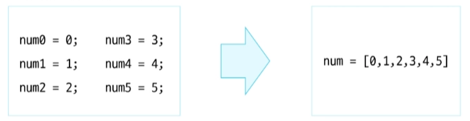
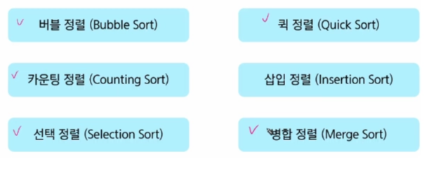
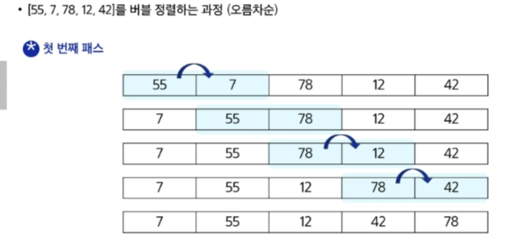
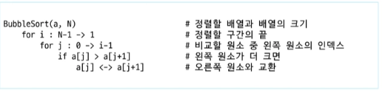
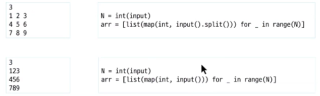

# 0202(algorithm List 1-1).md

# 알고리즘 (Algorithm)

## 알고리즘의 시간 복잡도

- 알고리즘의 작업량을 표현할 때 시간 복잡도를 표현한다
- 시간 복잡도 (Time Comlexity)
    - 실제 걸리는 시간을 측정
    - 실행되는 명령문의 개수를 계산 (연산 횟수)

## 시간 복잡도 표시

- 빅 - 오 표기법 (Big - O Notation) 을 언급하는 경우가 많다
- 시간 복잡도 함수 중에서 가장 큰 영향력을 주는 n에 대한 항만을 표시한다
- 계수 (Coefficient)는 생략하여 표시한다

## 배열 (Array)

: 일정한 자료형의 변수들을 하나의 이름으로 열거하여 사용하는 자료 구조

**배열의 필요성**

- 프로그램 내에서 여러 개의 변수가 필요할 때
    - 일일이 다른 변수명을 이용하여 자료에 접근하는 것은 매우 비효율적
- 배열을 사용하면 하나의 선언을 통해서 둘 이상의 변수를 선언한다
- 단순히 다수의 변수 선언을 의미하는 것이 아니다
    - 다수의 변수로는 하기 힘든 작업을 배열을 활용하여 쉽게 할 수 있다

### 1차원 배열

## 정렬 (Sort)

: 2개 이상의 자료를 키 (특정 기준) 에 의해 작은 값부터 큰 값( 오름차순 : asecnding ), 혹은 그 반대의 순서대로 ( 내림차순 : descending ), 재배열하는 알고리즘이다

### 정렬의 종류

### 버블 정렬 (Bubble Sort)

: 인접한 두 개의 원소를 비교하며 자리를 계속 교환하는 방식

(오름차순 순서)

1. 첫 번째 원소부터 인접한 원소까지 계속 자리를 교환하면서 맨 마지막 자리까지 이동한다
2. 한 단계가 끝나면 가장 큰 원소가 마지막 자리로 정렬된다
3. 교환하며 자리를 이동하는 모습이 물 위에서 올라오는 거품 모양과 같다고 하여 버블 정렬이라고 한다

**시간 복잡도**

: O (n^2)

예시)

**2차원 배열 입력값 받는 코드**

