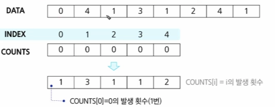
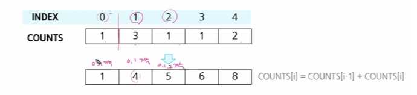
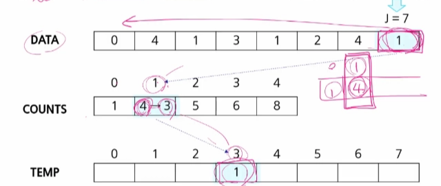
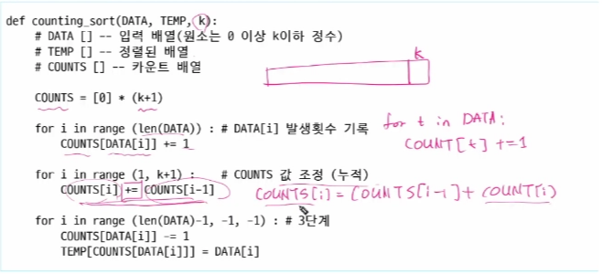
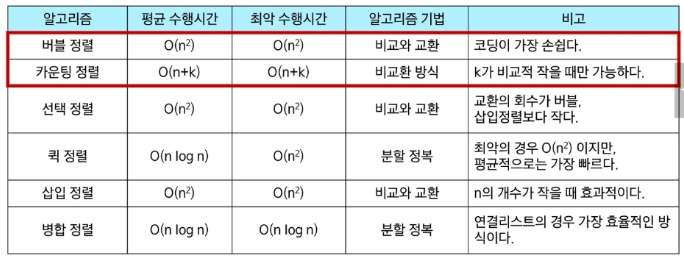
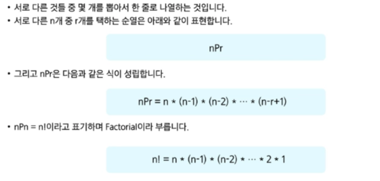
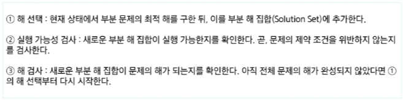

# 0203(algorithm List 2-2).md

## 카운팅 정렬 (Counting Sort)

: 항목들의 순서를 결정하기 위해 집합에 각 항목이 몇 개씩 있는지 세는 작업을 하여, 선형 시간에 정렬하는 효율적인 방식이다

**카운팅 정렬 제한 사항**

1. 정수나 정수로 표한할 수 있는 자료에 대해서만 적용가능
    1. 각 항목의 발생 회수를 기록하기 위해, 정수 항목으로 인덱스 되는 카운트들의 배열을 사용하기 때문이다
2. 카운트들을 위한 충분한 공간을 할당하려면 집합 내의 가장 큰 정수를 알아야 한다

**시간 복잡도**

- O(n + k) : n은 리스트의 길이, k는 정수의 최댓값

예시) 1단계 : data 리스트의 각 요소들의 값의 개수의 총합을 COUNTS 배열에 저장하는 단계

**n = 8**

**COUNTS = [0] * (max_v + 1)**

**for i in range(n) : # 모든 Data**

**COUNTS[ Data[ i ] ] += 1**

예시 2단계) : 정렬된 집합에서 각 항목의 앞에 위치할 항목의 개수를 반영하기 위해 COUNTS 원소를 조정

(누적합)

**for i in range(1, n)**

**COUNTS[ i ] = COUNTS[ i - 1] + COUNTS [ i ]**

예시 3단계) : data의 마지막 원소 1의 발생 횟수 COUNTS[1] 을 감소시키고 TEMP에 1을 삽입

for j in range(n-1, -1, -1):

COUNTS[ Data[ j ] ] -= 1

TEMP[ COUNTS[ Data[j] ] ] = Data [j]

**카운팅 정렬 알고리즘 코드 예시**

### 정렬 알고리즘 비교

## 완전 검색 (Exaustive Search)

: 문제의 해법으로 생각할 수 있는 “ 모든 경우의 수 “ 를 나열해보고 확인하는 기법이다

(Brute-force 혹은 generate-and-test 기법 이라고도 불린다. 모든 경우의 수를 테스트 한 후, 최종 해법을 도출하는 방법으로 일반적으로 경우의 수가 상대적으로 적을 때 유용하다)

**완전 검색의 필요성**

- 모든 경우의 수를 생성하고 테스트하기 때문에 수행 속도는 느리지만, 해답을 찾아내지 못할 확률이 적다.
- IM, A형 취득 까지는 완전 검색 주로 사용

## 순열 (Permutation)

**모든 경우의 수에 대하여 접근하여 코드를 작성하려면, 순열을 통하여 경우의 수를 미리 계산해보고 모든 경우의 수에 대한 접근을 통하여 작성할지 결정해야 한다.**

## 탐욕 알고리즘 (Greedy)

: 여러 경우 중 하나를 결정해야 할 때마다, 그 순간에 최적이라고 생각되는 것을 선택해 나가는 방식으로 진행하여 최종적인 해답에 도달하는 방식이다

**탐욕 알고리즘 특징**

- 최적해를 구하는 데 사용되는 근시안적인 방법
- 각 선택의 시점에서 이루어지는 결정은 지역적으로는 최적이지만, 그 선택들을  계속 수집하여 최종적인 해답을 만들었다고 하여, 그것이 최적이라는 보장은 없다.
- 일반적으로, 머릿속에 떠오르는 생각을 검증 없이 바로 구현하면 Greedy 접근이다

