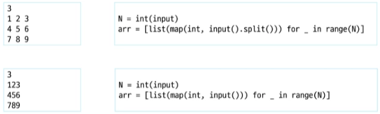
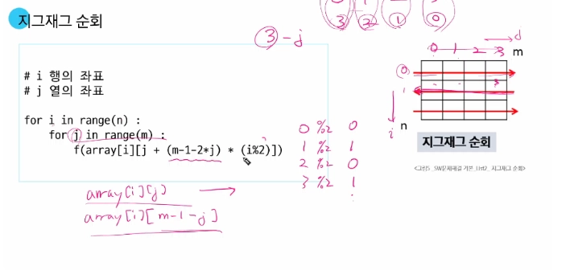
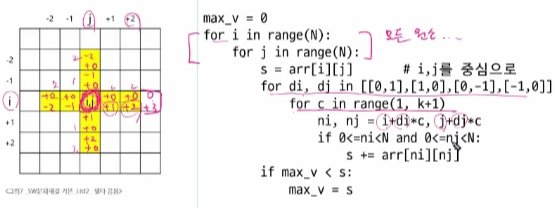
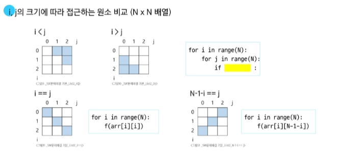
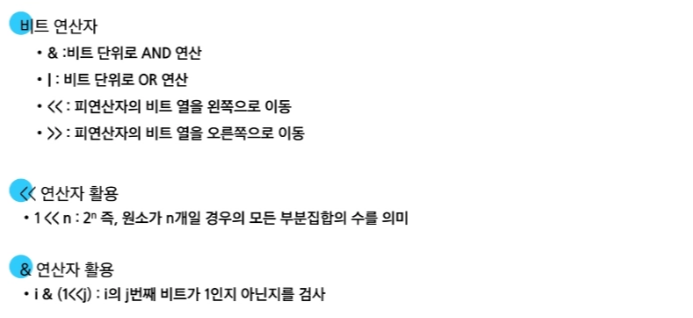

# 0204(algorithm List 2-1).md

## 2차원 배열

**입력을 2차원 배열에 저장하기**

### 배열 순회

: n x m 배열의 n * m 개의 모든 원소를 빠짐없이 조사하는 방법

### 행 우선 순회

### 열 우선 순회

### 지그재그 순회

위와 같은 방법 보다는 if 문을 활용하여, 짝수 홀수 일때로 나누어 지그재그 순회 하는 것이 수월하다.

아래 예시)

## 델타 (Delta)

### 델타를 활용한 2차원 배열 탐색

### 델타 응용

### 전치 행렬

## 부분 집합 (완전 검색)

## 비트 연산자

