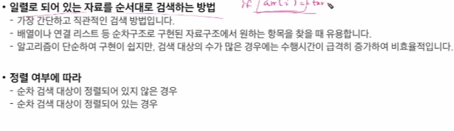
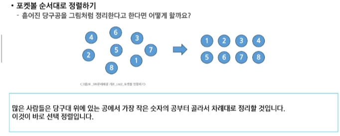

# 0205(algorithm List 2-2).md

# 검색과 정렬

## 검색의 종류 : 순차 검색, 이진 검색, 해쉬

: 저장되어 있는 자료 중에서 원하는 항목을 찾는 작업이다

(목적하는 탐색 키를 가진 항목을 찾는 것)

 

- 탐색 키

: 자료를 구별하여 인식할 수 있는 키

### 순차 검색

### 이진 검색

: - 자료의 가운데에 있는 항목의 키 값과 비교하여 다음 검색의 위치를 결정하고 검색을 계속 진행하는 방법

- 이진 검색을 하기 위해서는 자료가 정렬된 상태여야 한다

예시)

### 이진 검색 알고리즘

- 검색 범위의 시작점과 종료점을 이용하여 검색을 반복 수행한다
- 이진 검색의 경우, 자료에 삽입이나 삭제가 발생했을 때 배열의 상태를 항상 정렬 상태로 유지하는 추가 작업이 필요하다
    
    ( 복잡한 자료구조, 트리와 같은 자료구조에 주로 쓰인다 )
    

구현 예시)

## 선택 정렬

: 주어진 자료들 중 가장 작은 값의 원소부터 차례대로 선택하여 위치를 교환하는 방식

(오름차순의 경우)  

**정렬 과정**

- 주어진 리스트 중에서 최솟값을 찾는다
- 그 값을 리스트의 맨 앞에 위치한 값과 교환한다
- 맨 처음 위치를 제외한 나머지 리스트를 대상으로 위의 과정을 반복한다

**시간 복잡도**

- O (n^2)

(버블 정렬은 뒤에서 앞으로, 선택 정렬은 앞에서  뒤로 탐색 영역이 순차적으로 줄어든다)

코드 예시)

( 주의, 중간에 if를 통해 같은 값일 경우를 배제하려 하면, 의미 없는 연산이 늘어날 뿐이다 )

## 셀렉션 알고리즘

: 저장되어 있는 자료로부터 k번째로 큰 혹은 작은 원소를 찾는 방법이다