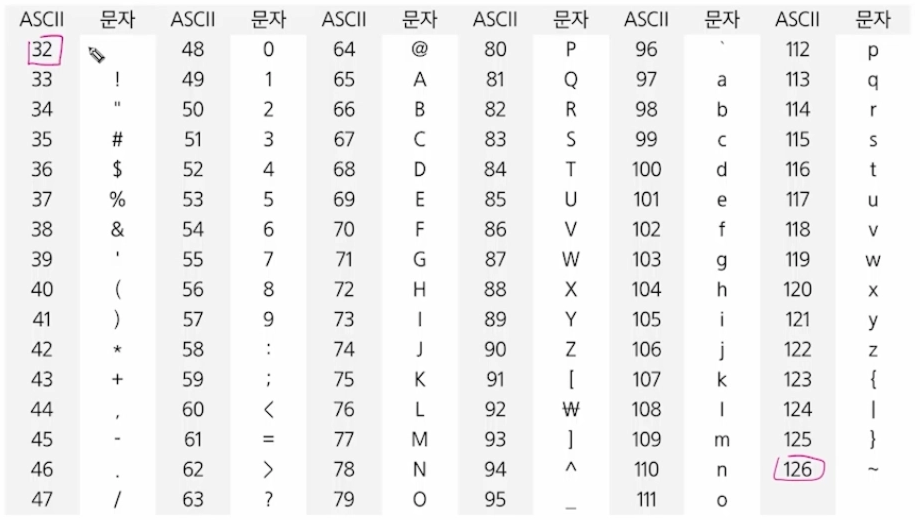
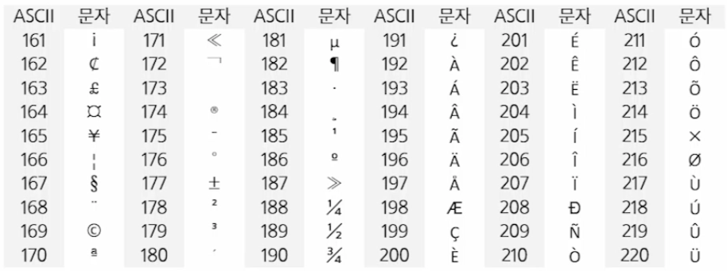
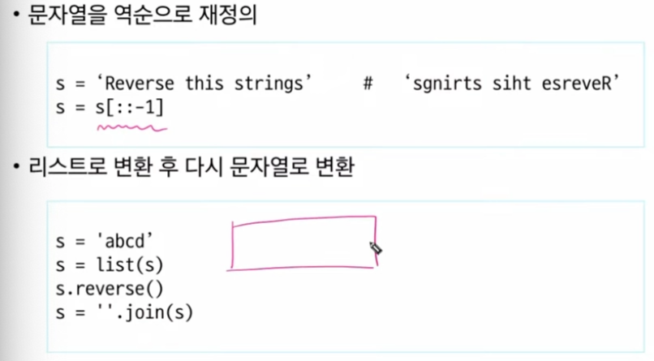
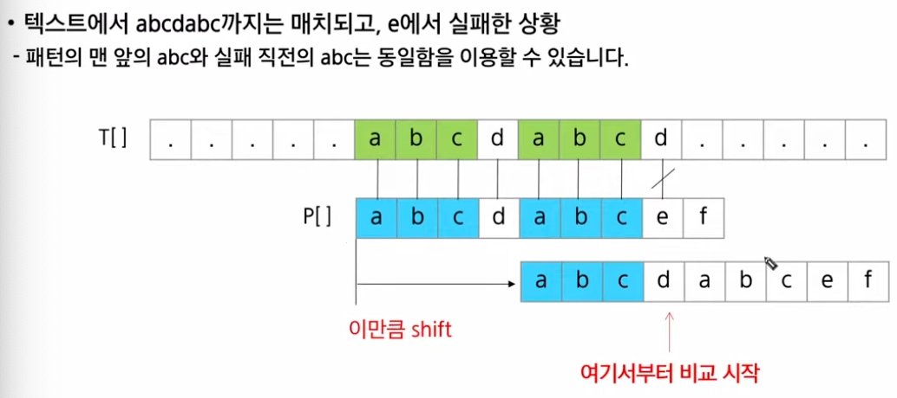
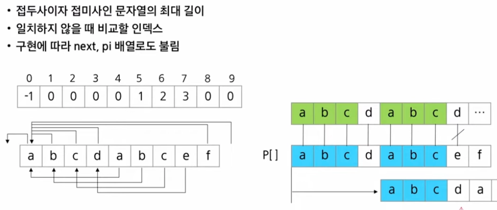
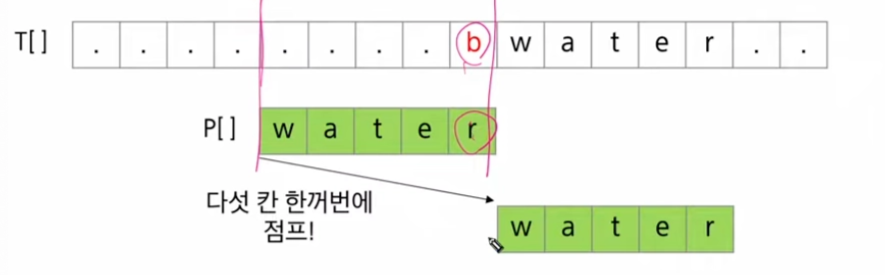
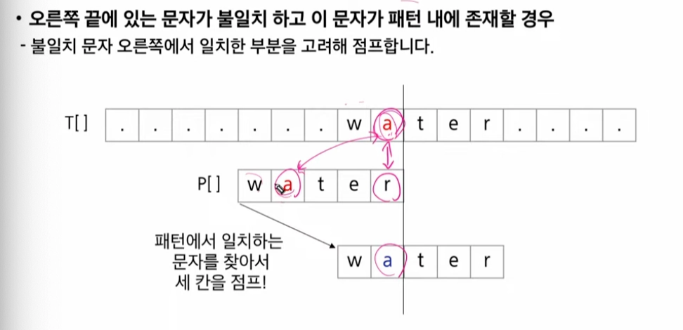
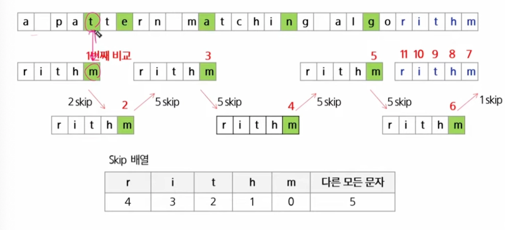

# 0206(algorithm String).md

## String

### 코드체계

: 문자에 대응되는 숫자를 정한 것

### 아스키코드 ASCII (American Standard Code for Information Interchange)

: 7-bit 인코딩으로 128문자를 표현하며, 33개의 출력 불가능한 제어 문자들과 공백을 비롯한 95개의 출력 가능한 문자들로 이루어져 있다

### 확장 아스키 (Exatended ASCII)

- 표준 문자 이외의 악센트 문자, 도형, 문자, 특수 문자, 특수 기호 등 부가적인 문자를 128개 추가
- 확장 아스키는 프로그램이나 컴퓨터 또는 프린터가 그것을 해독할 수 있도록 설계되어 있어야만 올바르게 해독될 수 있다

### 유니코드

: 다국어 처리를 위한 표준 코드 체계

- 이모지 (Emoji)도 유니코드 문자이다
- 비영리 단체인 유니코드 컨소시엄에서 관리한다

### 바이트 단위 저장 순서

- 바이트 단위 저장 순서가 정해지지 않은 경우 잘못된 해석 가능성
- 여러 바이트로 이루어진 데이터를 저장하는 방식을 Endian 이라고 한다.
- Big-endian은 상위 바이트 (MSB, Most Significant Byte) 를 가장 낮은 주소에 저장한다
- Little-endian은 하위 바이트 (LSB, Least Significant Byte) 를 가장 낮은 주소에 저장한다

### 유니코드 인코딩 (UTF : unicode Transformation Format) (일부)

- UTF-8 (in Web)
    - 최소 8-bit, 최대 32-bit (1 Byte * 4)
    - 필요한 크기에 따른
- UTF-16 (in windows, java)
    - 최소 16-bit, 최대 32-bit (2 Byte * 2)
- UTF -32 (in unix)
    - 최소 32-bit, 최대 32-bit ( 4Byte * 1)

### 문자열 (String)

: 문자들이 순서대로 나열된 데이터

- Length-Controlled 문자열
    - 문자열의 길이 정보를 함께 저장해서, 그 길이만큼 문자 데이터를 읽는 방식이다
    - Java, Python, 네트워크 패킷에 사용된다
- Delimited 문자열
    - 문자열은 끝을 나타내는 특정한 구분자(Delimiter)가 있어서, 구분자가 나올 때까지 문자열로 인식한다
    - C언어는 널 문자(null, ‘\0’)를 사용한다

### 파이썬의 str 클래스 구조

- 길이 외에 다른 정보도 저장
    - PyObject_HEAD : 모든 Python 객체가 상속하는 공통 구조이다
    - length : 문자열의 길이
    - hash : 문자열의 해시값으로, 딕셔너리 키로 쓸 때 사용한다
    - intrerned : 같은 문자열을 관리하는 플래그이다
    - kind : 문자열 인코딩의 크기이다
    - data : 문자열이 저장된 실제 메모리 주소를 가리키는 포인터이다

### C언어에서의 문자열

- 문자열은 문자들의 배열 형태로 구현된 응용 자료형이다
- 문자배열에 문자열을 저장할 때는 항상 마지막에 끝을 표시하는 널문자(’₩0’) 가 필요하다
- 문자열 처리에 필요한 연산을 함수 형태로 제공한다

### Java에서의 문자열의 문자

- 문자열 데이터를 저장, 처리해주는 클래스를 제공한다
- String 클래스
- 문자열 처리에 필요한 연산을 연산자, 메소드 형태로 제공한다

### C, Java, Python 3 문자열의 차이

- C는 아스키 코드로 저장
    - 한글을 출력할 수 있으나 콘솔의 도움을 받아야 한다
- Java는 유니코드 (UTF-16)로 저장
- Python 3는 유니코드 (UTF-8)로 저장

### 연산

### 문자열 뒤집기

join은 사용하려면 요소가 string 이어야만 한다.

### 회문

- 기러기, 토마토, 스위스와 같이 똑바로 읽어도 거꾸로 읽어도 똑같은 문장이나 낱말
    - 문자열 길이의 반만 비교하면 된다.

### 패턴 매칭

## 고지식한 알고리즘 (Brute Force) (완전 탐색)

- 단순한 방법
    - 본문 문자열을 처음부터 끝까지 차례대로 순회하면서 패턴 내의 문자들을 일일이 비교하는 방식이다

for 문으로 변경도 가능하다.

**브루트 포스의 시간 복잡도**

- 최악의 경우 텍스트의 모든 위치에서 패턴을 비교해야 하므로 O (MN) 이 된다.

### KMP 알고리즘

: 연구자인 Knuth, Morris, Pratt 세 사람의 이름에서 유래

- 패턴의 각 위치에서 매칭에 실패했을 때 돌아갈 위치를 미리 계산한다
    - 불일치가 발생한 글자의 앞 부분에 어떤 문자가 있는지를 미리 알고 있게 된다
    - 조건에 따라, 불일치가 발생한 앞 부분에 대하여 다시 비교하지 않을 수 있다
    - 불일치가 발생했을 경우 이동할 다음 위치를 계산하는 전처리가 필요하다
- 시간 복잡도 :
    - 패턴의 길이가 M일 때 전처리에 걸리는 시간은 O (M) 이다
    - 텍스트의 길이가 N일 때 검색은 최악의 경우 O (N) 이다
    - 결과적으로 O (M+N)이 된다
    - 만약 M이 고정된 값으로 매우 짧다면 평균적으로 O (N)이 된다

### LPS (Longest Prefix Which is also Suffix) 배열

### 보이어 - 무어 알고리즘

### 불일치 문자 휴리스틱 (Bad-Character Heuristic)

### Skip 배열

- 각 글자마다 불일치 시 건너뛸 문자열의 개수를 테이블에 정해놓고 탐색하는 배열

## 문자열 암호화

### 시저 암호 (Caesar cipher)

: 줄리어스 시저가 사용했다고 하는 암호

- 시저 암호에서는 평문에서 사용되고 있는 알파벳을 일정한 문자 수만큼 [평행이동] 시킴으로써 암호화
- 1 만큼 평행한 암호화의 예시

### 문자 변환표를 이용한 암호화 (단일 치환 암호화)

- 단순한 카이사르 암호화보다 훨씬 강력한 암호화 기법이다
    - 알파벳 하나를 다른 고정된 알파벳으로 바꾸는 방법이다

### 문자열 압축

- Run-length encoding 알고리즘
    - 같은 값이 몇 번 반복되는가를 나타내는 방식이다
    - 이미지 파일 포맷 중 BMP 파일의 압축 방법 중 하나로 사용한다

- 허프만 코딩 알고리즘
    - 더 효율적이고 일반적인 압축 방법이다
        - 자주 나오는 문자는 짧은 코드, 드물게 나오는 문자는 긴 이진 코드를 부여해 결과적으로 전체 데이터의 평균 코드 수를 최소화 하는 알고리즘이다