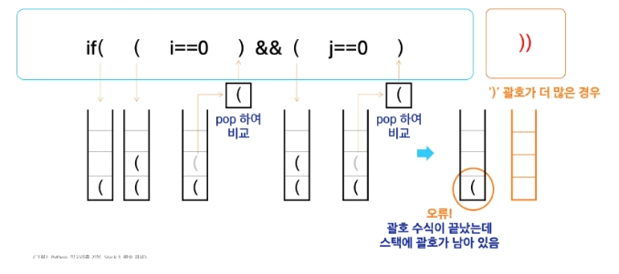

# 0209(Stack 1-1).md

# 스택 (Stack)

: 물건을 쌓아 올리듯 자료를 쌓아 올린 형태의 자료 구조 (대표적인 선형 자료구조 중 하나)

- 스택에 자료를 삽입하거나 혹은 스택에 있는 자료를 꺼낼 수 있다

### 선형 구조

: 자료 간의 관계가 1:1의 관계를 갖는다 (배열, 리스트 등)

### 후입선출 LIFO (Last In First-Out)

: 가장 마지막에 넣은 자료가 가장 먼저 나오는 것

### 스택을 프로그램에서 구현하기 위해 필요한 자료구조와 연산

- 배열을 사용해 구현할 수 있다
    - python에서는 리스트를 사용해 구현할 수 있다
- 저장소 자체를 스택이라고 부르기도 한다
    - 용도에 따라 메모리의 일부를 스택으로 부른다
- 스택에서 마지막 삽입된 원소의 위치를 “ **스택 포인터, top ” 라고 부르며, 데이터를 삽입하거나 꺼낼 때 기준이 되는 위치이다**

### 스택의 연산

- 삽입 (push)

: 저장소에 자료를 저장하는 연산으로, 보통 push라고 부른다

- 삭제 (pop)

: 저장소에서 삽입한 자료의 역순으로 꺼내는 연산으로 보통 pop 이라고 부른다

- 스택이 공백인지 아닌지를 확인하는 연산 (isEmpty)

: 스택이 비어 있으면 True, 아니면 False를 반환한다

- 스택의 top에 있는 item(원소)을 반환하는 연산 (peek)

: 삭제는 하지 않는다

### Push 연산

- append 메소드를 통해 리스트의 마지막에 데이터를 삽입한다

```python
s = []
def my_push(item):
		s.append(item)
```

- 인덱스 연산을 활용한 구현

```python
def my_push(item, size):
		global top
		top += 1
		if top == size:
				print('Overflow!')
		else:
				stack[top] = item
```

- 크기가 정해진 리스트와 인덱스 연산을 활용

```python
size = 10
stack = [0] * size
top = -1

my_push(10, size)        # my_push 함수를 이용
top += 1           # push(20)
stack[top] = 20
```

### Pop 연산

: 남은 데이터 중 가장 늦게 저장된 데이터를 삭제하는 연산

### 인덱스 연산을 이용한 pop 연산

- 크기가 정해진 리스트와 인덱스 활용

```python
def my_pop():
		global top
		if top == -1:
				print('Underflow')
				return 0 
		else:
				top -= 1
				return stack[top + 1]
				
print(my_pop)
```

### 스택 구현 시 고려 사항

- 1차원 배열을 사용하여 구현할 경우
    - 장점 : 구현이 용이하다
    - 단점 : 스택의 크기를 변경하기가 어렵다
- 해결 방법 : 저장소를 동적으로 할당하여 스택을 구현하는 방법을 사용한다

      (동적 연결 리스트를 이용하여 구현)

- 장점 : 메모리를 효율적으로 사용한다
- 단점 : 구현이 복잡하다

### 동적 메모리 할당

: 필요한 만큼 메모리를 할당하고 해제하여 유연하게 크기를 조절할 수 있다

### 연결 리스트

: 데이터와 다음 노드의 주소를 함께 저장하여 요소들이 순차적으로 연결된 자료 구조이다

### 메모리

: 컴퓨터에서 데이터를 저장하고 처리하기 위해 사용하는 일시적인 저장 공간이다

## Stack의 응용

### 괄호 검사

: 괄호의 조건을 스택을 이용하여 검사하는 것 (개수와 짝, 순서 등이 조건에 잘 맞는지,, )



## Function Call

: 프로그램에서의 함수 호출과 복귀에 따른 수행 순서를 관리한다


→ 가장 마지막에 호출된 함수가 가장 먼저 실행을 완료

→ 복귀 (후입선출 구조)

후입선출 구조의 스택을 이용하여 수행 순서를 관리한다!

이를 “ **스택 프레임 “ 이라고도 부른다**

- 시스템 스택
    - 함수 수행에 필요한 지역변수, 매개변수 및 수행 후 복귀할 주소 등의 정보를 저장한다
    - 함수 호출이 발생하면 스택 프레임(stack frame)에 저장하여 시스템 스택에 삽입한다


## 재귀호출

: 함수가 자신과 같은 작업을 반복해야 할 때, 자신을 다시 호출하는 구조

(반복적으로 자기 자신을 호출해야 하거나 전체를 부분 문제로 나눌 수 있는 경우에는, 일반적인 호출 방식보다 재귀호출 방식을 사용하여 함수를 만들면 프로그램의 크기를 줄이고 간단하게 작성할 수 있다)