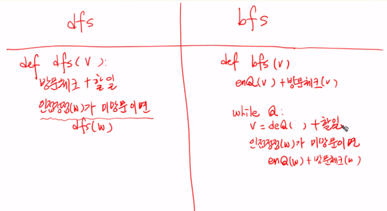

# 0213(Queue).md

## 큐 (Queue)

: 먼저 들어온 데이터가 먼저 나가는 선형 자료구조이다

( 스택과 마찬가지로 삽입과 삭제의 위치가 제한적인 자료구조로 큐의 뒤에서는 삽입만 하고, 앞에서는 삭제만 이루어지는 구조이다 )

### 큐 (Queue) 의 구조


### 큐의 기본 연산

- 삽입 : enqueue
- 삭제 : dequeue


### 큐의 연산 과정


## 선형 큐 (Linear Queue)

: 데이터를 일렬로 저장하며, 앞에서 꺼내고 뒤에 넣는 기본 큐 구조이다

- 구현
    - 배열이나 연결리스트로 구현할 수 있다
    - 배열로 구현한 경우 큐의 크기는 배열의 크기와 같다
    - front : 가장 최근에 삭제된 원소의 인덱스
    - rear : 마지막으로 저장된 원소의 인덱스
- 상태 표현
    - 초기 상태 : front = rear = -1
    - 공백 상태 : front == rear
    - 포화 상태 : rear == n - 1 ( n : 배열의 크기, n - 1 : 배열의 마지막 인덱스 )

### 선형  큐의 구현

1. 초기 공백 큐 생성 : create_queue( )
    - 크기 n인 1차원 배열 생성
    - front 와 rear를 -1로 초기화

```python
#  create_queue( )에 해당
q = [0] * n
front = -1
rear = -1
```

1. 삽입 : enqueue(item)
    1. 마지막 원소 뒤에 새로운 원소를 삽입하기 위해 rear 값을 하나 증가시켜 새로운 원소를 삽입할 자리를 지정
    2. 그 인덱스에 해당하는 배열 원소 q[rear]에 item을 저장

```python
def enqueue(item)
		global rear
		if is_full():
					print("Queue_Full")
		else:
					rear = rear + 1
					q[rear] = item
```

**(파이썬 내에 [queue.py](http://queue.py) 라는 파일이 이미 존재하므로 절대 다른 이름으로 만들어야 한다)**

1. 삭제 : dequeue( )
    - 가장 앞에 있는 원소를 삭제하기 위해
        1. front 값을 하나 증가시켜 큐에 남아있는 첫번째 원소로 이동
        2. 첫 번째 원소를 리턴 함으로써 삭제와 동일한 기능을 한다

```python
def dequeue():
			global front
			if is_empty():
						print("Queue_Empty")
			else:
						front = front + 1
						return q[front]
```

1. 공백 상태 및 포화 상태 검사 : is_empty( ), is_full( )
    - 공백 상태 : front == rear
    - 포화 상태 : rear == n-1 ( n : 배열의 크기, n-1 : 배열의 마지막 인덱스 )

```python
def is_empty():
			return front == rear

def is_full():
			return rear == len(q) - 1 
```

1. 검색 : qpeek( )
    - 가장 앞에 있는 원소를 겁색하여 반환하는 연산
    - 현재 front의 한자리 뒤 (front + 1)에 있는 원소 즉, 큐의 첫 번째에 있는 원소를 반환

```python
def qpeek():
			if is_empty():
						print("Queue_Empty")
			else:
						return q[front + 1]
```

### 선형 큐 이용시의 문제점

- 잘못된 포화 상태 인식

: 선형 큐를 이용하여 원소의 삽입과 삭제를 계속할 경우, 배열의 앞부분에 활용할 수 있는 공간이 있음에도

rear == n-1 인 상태 즉, 포화 상태로 인식하여 더 이상의 삽입을 수행하지 않게 된다


- 해결 방법 01
    - 매 연산이 이루어질 때마다 저장된 원소들을 배열의 앞부분으로 모두 이동시킨다
    
    ( 그러나, 이 방법은 원소 이동에 많은 시간이 소요되어 큐의 효율성이 급격히 떨어진다 )
    
    
    

- 해결 방법 02
    - 1차원 배열을 사용
    
    ( 논리적으로는 배열의 처음과 끝이 연결되어 원형 형태를 이룬다고 가정하고 사용한다 )
    

### 선형 큐와 원형 큐의 비교


## 원형 큐 (Circular Queue)

: 선형 큐의 공간 낭비를 막기 위해 처음과 끝이 연결된 구조이다

### 원형 큐의 구조

- 초기 공백 상태
    
    : front = rear = 0
    
- Index의 순환
    - front 또는 rear의 위치가 배열의 마지막 인덱스인 n-1을 가리킨다
    - 그 다음에는 논리적 순환을 이루어 배열의 처음 인덱스인 0으로 이동해야 한다
    - 이를 위해 나머지 연산자(&: mod)를 사용한다
- front 변수
    - 공백 상태와 포화 상태 구분을 쉽게 하기 위해 front가 있는 자리는 사용하지 않고 항상 빈자리로 둔다

### 원형 큐의 연산 과정


### 원형 큐의 구현

1. 초기 공백 큐 생성
    - 크기 n인 1차원 배열 생성
    - front와 rear를 0으로 초기화

```python
cq = [0] * n
front = rear = 0
```

1. 삽입 : enqueue(item)
    - 마지막 원소 뒤에 새로운 원소를 삽입하기 위해
        1. rear 값을 조정하여 새로운 원소를 삽입할 자리를 지정
            
             rear ← (near + 1) mod n
            
        2. 그 인덱스에 해당하는 배열 원소 cq[rear]에 item을 저장

```python
def enqueue(item):
			global rear
			if is_full():
						print("Queue_Full")
			else:
						rear = (rear + 1) % len(cq)
						cq[rear] = item
```

1. 삭제 : dequeue( )
    - 가장 앞에 있는 원소를 삭제하기 위해
        1. front 값을 조정하여 삭제할 자리를 지정
            
            front ← (front + 1) mod n
            
        2. 새로운 front 원소를 리턴 함으로써 삭제와 동일한 기능을 한다

```python
def dequeue():
			global front
			if is_empty():
						pirnt("Queue_Empty")
			else:
						front = (front + 1) % len(cq)
						return cq[front]
```

1. 공백 상태 및 포화 상태 검사 : is_empty( ), is_full( )
    - 공백 상태 : front == rear
    - 포화 상태 : 삽입할 rear의 다음 위치 == 현재 front
        
        (rear + 1) mod n == front
        

```python
def is_empty():
			return front == rear

def is_full():
			return (rear + 1) % len(cq) == front
```

## 연결 큐 (Linked Queue)

: 연결 리스트를 이용해 구현한 큐이다

예시)


### 연결 큐의 구조

- 단순 연결 리스트 (Linked List)를 이용한 큐
    - 큐의 원소 : 단순 연결 리스트의 노드
    - 큐의 원소 순서 : 노드의 연결 순서, 링크로 연결되어 있음
    - front : 첫 번째 노드를 가리키는 링크
    - rear : 마지막 노드를 가리키는 링크
- 상태 표현
    - 초기 상태 : front = rear = NULL
    - 공백 상태 : front = rear = NULL

### 연결 큐의 연산 과정


### 덱 (deque)

: 컨테이너 자료형 중 하나로 양쪽 끝에서 빠르게 추가와 삭제를 할 수 있는 리스트류 컨테이너

(연결 리스트를 직접 만들지 않아도 된다)

### deque의 연산

- append(x) : 오른쪽에 x 추가
- popleft( ) : 왼쪽에서 요소를 제거하고 반환, 요소가 없으면 Index Error

```python
from collections import deque

q = deque()
q.append(1)          # enqueue()
t = q.popleft()      # dequeue()
```

## 우선순위 큐 (Priority Queue)

: 우선순위를 가진 항목들을 저장하는 큐이다

(FIFO 순서가 아니라, 우선순위가 높은 순서대로 먼저 나가게 된다)

(우선 순위 큐의 적용 분야로는 시뮬레이션 시스템, 네트워크 트래픽 제어, 운영체제의 태스크 스케줄링이 있다)

### 우선순위 큐의 연산


### 배열을 이용한 우선순위 큐

- 배열을 이용하여 자료를 저장
- 원소를 삽입하는 과정에서 우선순위를 비교하여 적절한 위치에 삽입하는 구조이다
- 가장 앞에 최고 우선순위 원소가 위치한다
- 문제점 :
    - 배열을 사용하므로, 삽입이나 삭제 연산이 일어날 때 원소의 재배치가 발생한다
    - 이에 소요되는 시간이나 메모리 낭비가 크다

→ 효율적인 우선순위 큐는, 트리 구조인 힙(Heap)을 이용한다

## 큐의 활용

## 버퍼 (Buffer)

: 데이터를 한 곳에서 다른 한 곳으로 전송하는 동안 일시적으로 그 데이터를 보관하는 메모리의 영역이다

**버퍼링**

: 버퍼를 활용하는 방식 또는 버퍼를 채우는 동작을 의미한다

### 버퍼의 자료 구조

- 버퍼는 일반적으로 입출력 및 네트워크와 관련된 기능에서 이용된다
- 순서대로 입력/출력/전달 되어야 하므로 FIFO 방식의 자료구조인 큐가 활용된다

예시) 키보드 버퍼 ‘’’


## 너비 우선 탐색 (Breadth First Search, BFS)

: 탐색 시작 정점에 인접한 정점들을 모두 차례로 방문한 후에, 방문했던 정점을 시작점으로 하여 다시 인접한 정점들을 차례로 방문하는 방식이다

(인접한 정점들에 대해 탐색을 한 후, 차례로 다시 너비우선탐색을 진행해야 하므로, 선입선출 형태의 자료구조인 큐를 활용한다)


### BFS 알고리즘


아래는 중복 인큐를 방지하기 위하여 visited의 용도를 살짝 바꾸어 중복을 없앤 BFS 코드

( 정점 개수 대로 큐를 선언하여 사용할 수 있는 편리함이 있다 )


또한 방문한 곳에서 인접한 정점을 인큐할 때 거리별로 그룹화 시키는 표시를 남긴다

( 출발점으로 부터의 거리를 찾기가 용이하다 )

