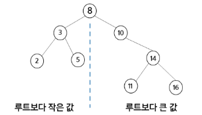

# 0220(BST (Binary Search Tree)).md

## 이진 탐색 트리 (BST, Binary Search Tree)

- 최대 O(log n)의 빠른 속도로 값을 검색할 수 있는 자료 구조이다
- 데이터를 빠르게 검색할 수 있도록(탐색 작업의 효율을 높이도록) 체계적으로 저장한다

→ 빠르게 검색될 수 있도록, 특정 규칙을 갖는 이진 트리 형태로 값을 저장한다

- 모든 원소는 서로 다른 유일한 키를 갖는다
- key (왼쪽 서브트리) < key (루트 노드) < key (오른쪽 서브트리)
- 왼쪽 서브트리와 오른쪽 서브트리도 이진 탐색 트리이다
- 중위 순회를 하면 오름차순으로 정렬된 값을 얻을 수 있다
- 

**왼쪽 서브트리와 오른쪽 서브트리의 높이가 비슷할수록 효율적이다**

예시) →

### 연결리스트 vs BST

### 탐색 연산

순서

1. 루트에서 시작
2. 탐색할 키 값 x를 루트 노드의 키 값과 비교
    1. (키 값 x = 루트 노드의 키 값) 인 경우 : 원하는 원소를 찾았으므로 탐색 연산에 성공한 경우이다
    2. (키 값 x < 루트 노드의 키 값) 인 경우 : 루트 노드의 왼쪽 서브트리에 대해서 탐색 연산을 수행한다
    3. (키 값 x > 루트 노드의 키 값) 인 경우 : 루트 노드의 오른쪽 서브트리에 대해서 탐색 연산을 수행한다
3. 서브트리에 대해서 순환적으로 탐색 연산을 반복한다

예시)

### 삽입 연산

순서

1. 먼저 탐색 연산을 수행
    - 삽입할 원소와 같은 원소가 있으면 삽입할 수 없으므로, 같은 원소가 있는지 탐색한다
2. 탐색 실패한 위치에 원소를 삽입

예시)

### 삭제 연산 (힙 연산 필요)

### 이진 탐색 트리의 성능

- 탐색(searching), 삽입(insertion), 삭제(deletion) 시간은 트리의 높이만큼 시간이 걸린다
    - O(h), h : BST의 깊이(height)
- 평균의 경우
    - 이진 트리가 균형적으로 생성되어 있는 경우
    - O(log n)
- 최악의 경우
    - 한쪽으로 치우친 경사 이진 트리의 경우
    - O(n)
    - 순차탐색과 시간복잡도가 같다

다른 검색의 성능 예시)

+a   “ 레드 - 블랙 트리 “ (완전 이진 트리에 가깝게 균형을 맞추어주는 알고리즘)

## 힙 (Heap)

: 완전 이진 트리에 있는 노드 중에서 키 값이 가장 크거나 작은 노드를 찾기 위해서 만든 자료구조이다

- 최대 힙 (Max Heap)
    - 키 값이 가장 큰 노드를 찾기 위한 힙
    - 항상 { 부모 노드의 키 값 > 자식 노드의 키 값 } 조건을 만족한다
    - 루트 노드 : 키 값이 **가장 큰** 노드
- 최소 힙 (Min Heap)
    - 키 값이 가장 작은 노드를 찾기 위한 힙
    - 항상 { 부모 노드의 키 값 < 자식 노드의 키 값 } 조건을 만족한다
    - 루트 노드 : 키 값이 **가장** **작은** 노드

예시)

**→ “ 완전 이진 트리 “ (완전 이진 트리의 구조가 깨지면 힙이 될 수 없다)**

반대로 힙이 아닌 이진 트리 예시)

## 힙 연산

### 삽입

: **“ 노드번호 = 인덱스 “** 배열의 형태로 저장하여

last를 기록 및 삽입할 자식의 인덱스에 2를 나누어 부모 인덱스에 위치한 값과 비교하여 조건을 만족하는지 확인해야 한다.

→ 마지막 정점의 정보를 가지고 있다면 추가할 수 있다

또한, 힙의 조건을 깨뜨리지 않아야 한다

( “ 완전 이진 트리 “ 유지, 부모 > 자식 유지)

### 힙 연산 -삭제

- 힙에서는 루트 노드의 원소만을 삭제할 수 있다
- 루트 노드의 원소를 삭제하여 반환한다
- 힙의 종류에 따라 최댓값 또는 최솟값을 구할 수 있다

→ 최대 힙 이라면 가장 큰 값을 순차적으로 삭제 및 추출 가능

→ 최소 힙 이라면 가장 작은 값을 순차적으로 삭제 및 추출 가능

### 힙을 활용한 우선순위 큐

- 완전 이진 트리로 구현된 자료구조로서, 키 값이 가장 큰 노드나 가장 작은 노드를 찾기에 적합한 자료구조이다

예시)

## DFS / BFS 비교

참고)

**heap 라이브러리는 최소 힙만을 지원한다**

**→ 최대 힙은 최소 힙을 만든상태에서 수동적으로 만들어야한다**

**또한, heap 라이브러리는 사용하면 직접 구현할 때와는 다르게 heap 인덱스 0번도 채워서 사용한다**