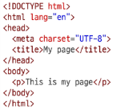
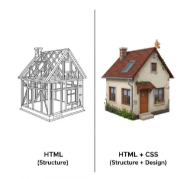
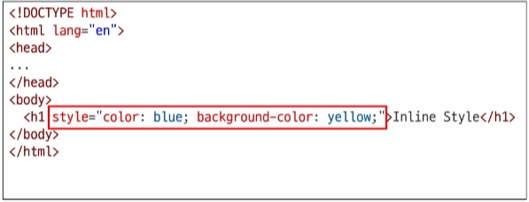
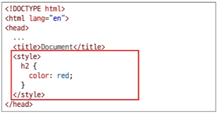
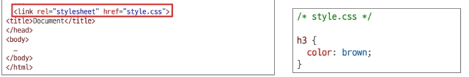
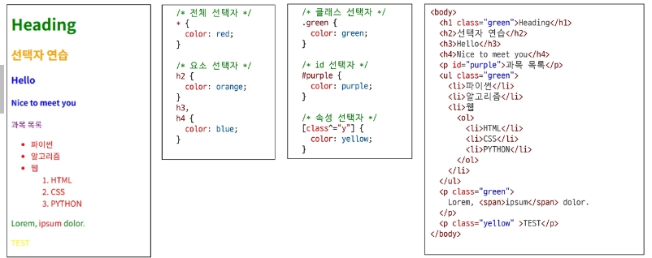
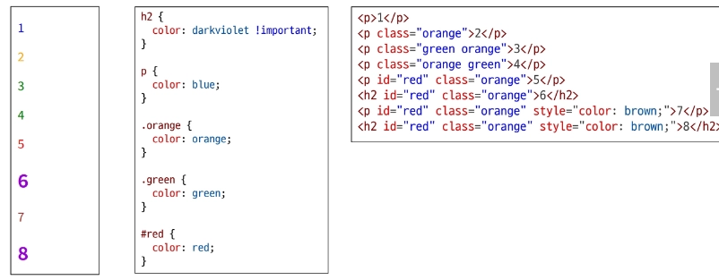

# 0224(HTML / CSS).md

## World Wide Web (WWW)

: 인터넷으로 연결된 컴퓨터들이 정보를 공유하는 거대한 정보 공간이다

### Web

: Web site, Web application 등을 통해 사용자들이 정보를 검색하고 상호 작용하는 기술이다

### Web site

: 인터넷에서 여러 개의 Wed page가 모인 곳으로, 사용자들에게 정보나 서비스를 제공하는 공간이다

### Web page

: HTML , CSS 등의 웹 기술을 이용하여 만들어진, “ Web site “ 를 구성하는 하나의 요소이다

- HTML : 구조
- CSS : 디자인 , 스타일링
- Javascript(j .s) : 상호작용 (동작)

## 웹 구조화

## HTML (HyperText Markup Language)

: 웹 페이지의 **의미**와 **구조**를 정의하는 언어

### HyperText

: 웹 페이지를 다른 페이지로 연결하는 링크이다

- 참조를 통해 사용자가 한 문서에서 다른 문서로 즉시 접근할 수 있는 텍스트
- 비선형성 / 상호연결성 / 사용자 주도적 탐색

### Markup Language

: 태그 등을 이용하여 문서나 데이터의 구조를 명시하는 언어이다

- 인간이 읽고 쓰기 쉬운 형태이며, 데이터의 구조와 의미를 정의하는 데 집중

ex) HTML , Markdown

## Structure of HTML

### HTML의 구조

- <!DOCTYPE html>
    - 해당 문서가 html로 문서라는 것을 나타낸다
- <html> </html>
    - 전체 페이지의 콘텐츠를 포함한다
- <title> </title>
    - 브라우저 탭 및 즐겨찾기 시 표시되는 제목으로 사용한다

예시)

- <head> </head>
    - HTML 문서에 관련된 설명, 설정 등 컴퓨터가 식별하는 메타데이터를 작성
    
    → “ 메타데이터 “ : 데이터를 설명하는 데이터
    
    - 사용자에게 보이지 않는다
- <body> </body>
    - HTML 문서의 내용을 나타낸다
    - 페이지에 표시되는 모든 콘텐츠를 작성
    - 한 문서에 하나의 body 요소만이 존재한다

### 개발자 도구

여는 법 (3 가지)

→ 크롬 브라우저에서 우클릭 후 “ 검사 “ 버튼 클릭

→ F12 

→Ctrl + Shift + i

### HTML Element (요소)

- 하나의 요소는 **여는 태그**와 **닫는 태그** 그리고 그 안의 **내용**으로 구성된다
- 닫는 태그는 태그 이름 앞에 슬래시(/)가 포함된다
    - 닫는 태그가 없는 태그 또한 존재 → 내용이 없다는 뜻

### HTML Attributes (속성)

- 사용자가 원하는 기준에 맞도록 요소를 설정하거나 다양한 방식으로 요소의 동작을 조절하기 위한 값이다
- 목적
    - 나타내고 싶지 않지만 추가적인 기능, 내용을 담고 싶을 때 사용한다
    - CSS에서 스타일 적용을 위해 해당 요소를 선택하기 위한 값으로 활용된다
- 작성 규칙
    - 속성은 요소 이름과 속성 사이에 공백이 있어야 한다
    - 하나 이상의 속성들이 있는 경우에는 속성 사이에 공백으로 구분한다
    - 속성 값은 열고 닫는 따옴표로 감싸야 한다

### HTML 기본 틀 자동완성 단축키

→ ! Tab 혹은 Enter

### HTML 크롬으로 자동연동 단축키

→ alt + b (vscode 화면에서)

## Text Structure

### HTML Text Structure

- HTML의 주요 목적 중 하나는**” 텍스트 구조”**와 **“의미”**를 제공 하는 것
- 예를 들어 h1 요소는 단순히 텍스트를 크게만 만드는 것이 아닌, 현재 문서의 최상위 제목이라는 **“의미”**를 부여하는 것

### 대표적인 HTML Text Structure

- Heading & Paragraphs
    - h1~6 , p
- Lists
    - ol, ul, li
- Emphasis & Importance
    - em, strong

예시)

이때, <strong>태그와 <b> 태그의 차이는 **“ 의미 “** 의 차이다

strong 태그는 **“ 중요하다 “** 라는 **강조의 의미**를 담고 있다

하지만, b 태그는 그냥 굵게 적은 표기이다

→ 이러한 차이점은 스크린 리더(컴퓨터)가 읽을때 다르게 읽는다

## 웹스타일링

## CSS (Cascading Style Sheet)

: 웹 페이지의 디자인과 레이아웃을 구성하는 언어이다

### Cascade

- 계단식
- 한 요소에 동일한 가중치를 가진 선택자가 적용될 때, CSS에서 마지막에 나오는 선언이 사용된다

### CSS 적용 방법

1. 인라인 (Inline) 스타일 (거의 사용하지 않음 및 권장하지 않음)
2. 내부 (Internal) 스타일 시트
3. **외부 (External) 스타일 시트 (주로 많이 사용 및 권장)**

### 인라인 스타일

### 내부 스타일 시트

### 외부 스타일 시트

## CSS 구문 및 선택자

### CSS 구문

- 선택자 (Selector)
    - ‘누구를’ 꾸밀지 지정하는 부분
- 선언 (Declaration)
    - ‘어떻게’ 꾸밀지에 대한 구체적인 한 줄의 명령
    - 속성과 값이 한 쌍으로 이루어지며, 세미콜론(;) 으로 끝난다
- 속성 (Propety)
    - 바꾸고 싶은 스타일의 종류를 나타낸다
- 값 (Value)
    - 속성에 적용할 구체적인 설정을 나타낸다

예시)

### CSS Selectors 종류

- 기본 선택자
    - 전체 (*) 선택자 (’*’)
        - HTML 모든 요소를 선택
    - 요소 (tag) 선택자
        - 지정한 모든 태그를 선택
    - 클래스 (class) 선택자 (’.’)
        - 주어진 클래스 속성을 가진 모든 요소를 선택
    - 아이디 (id) 선택자 (’#’)
        - 주어진 아이디 속성을 가진 요소를 선택
        - 문서에서 주어진 아이디를 가진 요소가 하나만 있어야 한다
    - 속성 (attr) 선택자 (’ [ ] ‘ 대괄호 )
        - 주어진 속성이나 속성값을 가진 모든 요소 선택
        - 속성의 존재 여부, 값의 일치 / 포함 등 다양한 조건으로 요소를 정교하게 선택 가능

예시)

- 결합자 (Combinators)
    - 자손 결합자 (”  “ (space))
        - 첫 번째 요소의 자손 요소들 선택
        - 예시) p span은 
 안에 있는 모든 를 선택 (하위 레벨 상관 없이)
    - 자식 결합자 (” > “)
        - 첫 번째 요소의 직계 자식만 선택
        - 예시) ul > li 은 <ul> 안에 있는 모든 <li>를 선태 (한단계 아래 자식들만)

## 명시도 (Specificity)

: 결과적으로 요소에 적용할 CSS 선언을 결정하기 위한 알고리즘이다

- 명시도는 ‘ 선택자 ‘ 들의 점수 싸움
- 선택자에 가중치를 계산하여 어떤 스타일을 적용할지 결정한다
- 동일한 요소를 가리키는 2개 이상의 CSS 규칙이 있는 경우, 가장 높은 명시도를 가진 선택자가 승리하여 스타일이 적용된다

### 명시도의 순서

1. Importance
    
    : 다른 우선순위 규칙보다 우선하여 적용하는 키워드이다
    
    (Cascade 구조를 무시하고 강제로 스타일을 적용하는 방식으로, 사용을 권장하지 않음)
    
    - !.important 로 사용
2. Inline 스타일
3. 선택자
    1. id 선택자 > class 선택자 > 요소 선택자
4. 소스 코드 선언 순서

**→ 좁게 선택할수록 “ 높은 명시도”**

**→ 넓게 선택할수록 “ 낮은 명시도”**

예시)

## CSS Declaration ( 선언 : 값과 단위 )

: 선택된 요소에 적용할 스타일을 구체적으로 명시하는 부분이다

### CSS 선언의 목적

- 선택자는 ‘ 어떤 요소에 ‘ 스타일을 적용할지 결정하는 규칙
- 선택자로 요소를 선택했으니, 이제는 중괄호 { } 안에 ‘ 무엇을 ‘ 할지 정의
- 이 ‘ 무엇을 ‘ 에 해당하는 부분이 바로 **“ 선언 (Declaration) “**이다

## 상속

### CSS 상속

: 기본적으로  CSS는 상속을 통해 부모 요소의 속성을 자식에게 상속해 재사용성을 높인다

- 상속 되는 속성
    - Text 관련 요소 (font , color , text-align), opacity, visibility 등
- 상속 되지 않는 속성
    - Box model 관련 요소 (width , height , border , box-sizing …)
    - position 관련 요소 (position , top / right / bottom / left, z-index) 등

CSS 상속 예시)

## CSS Box Model

: 웹 페이지의 모든 HTML 요소를 감싸는 사각형 상자 모델이다

- 내용(content), 안쪽 여백(padding), 테두리(border), 외부 간격(margin)으로 구성되어 요소의 크기와 배치를 결정한다
- 요소의 크기, 배치, 간격을 결정하는 규칙
- 원은 네모 박스를 깎은 것이다

예시)

### shorthand 속성 (단축 속성)

### Box - sizing 속성 (박스의 크기 계산법)

**→ 위 사진에서 왼쪽 그림이 박스의 기본값, 오른쪽 그림이 대체 상자 모델로 변경한 값(border-box선언)이다**

## HTML 스타일 가이드

## CSS 스타일 가이드

## MDN

: Mozilla Developer Network

모르는 기능 찾아볼때는 다른 블로그 보다 공식 문서가 더 명확, 정확

→ 검색 내용 뒤에 mdn 키워드 추가하여 검색 후 열람

