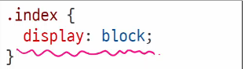

# 0225(CSS Layout).md

## CSS Box Model

### display 속성 (박스의 화면 배치 방식)

### block 타입

: 하나의 독립된 덩어리처럼 동작하는 요소

- 항상 새로운 행으로 나뉜다 (한 줄 전체를 차지, 너비 100%)
- width, height, margin, padding 속성을 모두 사용할 수 있다
- padding, margin, border로 인해 다른 요소를 상자로부터 밀어낸다
- width 속성을 지정하지 않으면 박스는 inline 방향으로 사용 가능한 공간을 모두 차지한다
    - 상위 컨테이너 너비를 100%로 채우는 것
- 대표적인 block 타입 태그
    - h1~6, p, div, ul, li

## block 타입의 대표: “div”

- 다른 HTML 요소들을 그룹화하여 레이아웃을 구성하거나 스타일링을 적용할 수 있다
- 헤더, 푸터, 사이드바 등 웹 페이지의 다양한 섹션을 구조화 하는 데 가장 많이 쓰이는 요소이다

### inline 타입

: 문장 안의 단어처럼 흐름에 따라 자연스럽게 배치되는 요소

- 줄 바꿈이 일어나지 않는다 (콘텐츠의 크기만큼만 영역을 차지한다)
- width와 height 속성을 사용할 수 없다
- 수직 방향(상하)
    - padding, margin, border가 적용되지만, 다른 요소를 밀어낼 수는 없다
- 수평 방향(좌우)
    - padding, margin, border가 적용되어 다른 요소를 밀어낼 수 있다
- 대표적인 inline 타입 태그
    - a, img, span, strong

## inline 타입의 대표: “span”

- 자체적으로 시각적 변화는 없다
    - 스타일을 적용하기 전까지는 특별한 변화는 없다
- 텍스트 일부 조작
    - 문장 내 특정 단어나 구문에만 스타일을 적용할 때 유용하다
- 블록 요소처럼 줄 바꿈을 일으키지 않으므로, 문서의 구조에 큰 변화를 주지 않는다

## Normal flow

: 일반적인 흐름 또는 레이아웃을 변경하지 않은 경우 웹 페이지 요소가 배치되는 방식이다.

아래 워드 문서에서의 Normal flow 예시)

## 기타 display 속성

1. inline-block
2. none
3. flex

## inline-block 타입

: inline과 block의 특징을 모두 가진 특별한 display 속성 값이다

- block과 inline의 특징을 합친 것이다 (줄 바꿈 없이, 크기 지정 가능)
- width 및 height 속성 사용 가능
- padding, margin 및 border로 인해 다른 요소가 상자에서 밀려난다

## None타입

: 요소를 화면에 표시하지 않고, 공간조차 부여되지 않는다

예시)

→ 추후 사용자와 상호작용을 위하여 만들어 놓는 것 (J.S에서 상호작용 주로 설정)

## CSS Position

### CSS Layout

- 각 요소의 **“위치”**와 **“크기”**를 조정하여 웹 페이지의 디자인을 결정하는 것
- 요소들을 상하좌우로 정렬하고, 간격을 맞추고, 전체적인 페이지의 뼈대를 구성한다
- 핵심 속성 : display(block, inline, flex, grid, … )

### CSS Position

- 요소를 Normal Flow에서 제거하여 다른 위치로 배치하는 것이다
- 다른 요소 위에 올리기, 화면의 특정 위치에 고정시키기 등
- 핵심 속성 : position (static, relative, absolute, fixed, sticky, … )

### Position 이동 방향

### Position 유형

### 1. Position : static

- 요소를 Normal Flow에 따라 배치
- top, right, bottom, left 속성이 적용되지 않는다
- 기본 값

### 2. Position: relative (상대적 위치)

- 요소를 Normal Flow에 따라 배치한다
- 자신의 원래 위치(static)을 기준으로 이동한다
- top, right, bottom, left 속성으로 위치를 조정한다
- 다른 요소의 레이아웃에 영향을 주지 않는다

       (요소가 차지하는 공간은 static일 때와 같다)

### 3. Position: absolute(절대적 위치)

- 요소를 Normal Flow에서 제거한다
- 가장 가까운 relative 부모 요소를 기준으로 이동한다
    - 만족하는 부모 요소가 없다면 body  태그를 기준으로 한다
- top, right, bottom, left 속성으로 위치를 조정한다
- 문서에서 요소가 차지하는 공간이 없어진다

→ 가장 가까운 div에 relative가 되어 있다면 해당 div의 위치를 기준으로 이동한다.

만약, 아무것도 relative가 안되어 있다면, body를 기준으로 이동한다

**또한, absolute는 기존 레이아웃을 깨뜨리기 때문에 잘 생각하여 사용하여야 한다**

### 4. Position: fixed

- 요소를 Normal Flow에서 제거한다
- 현재 화면영역(viewport)을 기준으로 이동한다
- 스크롤을 해도 항상 같은 위치에 유지된다
- top, right, bottom, left  속성으로 위치를 조정한다
- 문서에서 요소가 차지하는 공간이 없어진다

### 5. Position: sticky

- relative와 fixed의 특성을 결합한 속성이다
- 스크롤 위치가 임계점에 도달하기 전에는 relative처럼 동작한다
- 스크롤 위치가 임계점에 도달하면 fixed처럼 화면에 고정된다
- 다음 sticky 요소가 나오면 이전 sticky 요소의 자리를 대체한다
    - 이전 sticky 요소와 다음 sticky요소의 위치가 겹치게 되기 때문이다

## z-index

: 요소의 쌓임 순서를 정의하는 속성이다

- 정수 값을 사용하여 Z축 순서를 지정한다
- 값이 클수록 요소가 위에 쌓이게 된다
- static이 아닌 요소에만 적용된다
- 기본값이 auto로 부모 요소의 z-index  값에 영향을 받는다
- 같은 부모 내에서만 z-index 값을 비교하고, 값이 같다면 HTML 문서 순서대로 쌓인다
- 부모의 z-index가 낮으면 자식의 z-index가 아무리 높아도 부모보다 위로 올라갈 수 없다

예시)

## CSS Flexbox

: 요소를 행과 열 형태로 배치하는 1차원 레이아웃 방식이다

→ ‘ 공간 배열 & 정렬 ‘

### 박스 표시 (Display) 타입

1. outer display 타입
    - block 타입 : 블록 타입은 하나의 독립된 덩어리처럼 동작하는 요소이다
    - inline 타입 : 문장 안의 단어처럼 흐름에 따라 자연스럽게 배치되는 요소이다
2. Inner display 타입
    - 박스 내부의 요소들이 어떻게 배치될지를 결정한다
    - CSS Felxbox (속성 : flex)

### Flexbox 구성요소

- main axis
- cross axis
- flex container
- flex item

### main axis (주 축)

- flex item들이 배치되는 기본 축이다
- main start에서 시작하여 main end 방향으로 배치한다 (기본 값)

### cross axis (교차 축)

- main axis에서 수직인 축이다
- cross start에서 시작하여 cross end 방향으로 배치한다 (기본 값)

### Flex Container

- display : flex; 혹은 display: inline-flex; 가 설정된 부모 요소이다
- 이 컨테이너의 1차 자식 요소들이 Flex Item이 된다
- flexbox 속성 값들을 사용하여 자식 요소 Flex Item들을 배치하는 주체이다

### Flex Item

- Flex Container 내부에 레이아웃 되는 항목이다
- 자유로운 순서 변경 및 정렬이 가능하다

## Flexbox 속성

- Flex Container 관련 속성
    - display
    - flex-direction
    - flex-wrap
    - justify-content
    - align-items
    - align-content
- Flex Item 관련 속성
    - align-self
    - flex-grow
    - flex-basis
    - order

**→ 자식의 요소에게 각각 집약적으로 속성을 줄 때 주로 사용한다**

### flex-wrap 응용

- 반응형 레이아웃

예시)

## 마진 상쇄 (Margin collapsing)

: 두 block 타입 요소의 margin top과 bottom이 만나 더 큰 margin으로 결합되는 현상이다

→ 위아래 (상하) 만 상쇄된다. (좌우)는 상쇄되지 않는다.

### 박스 타입 별 수평 정렬

## Flexbox 속성 종합 정리자료

