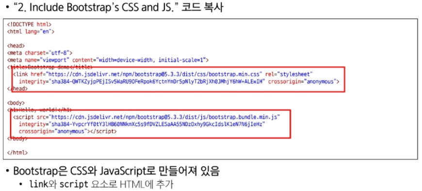
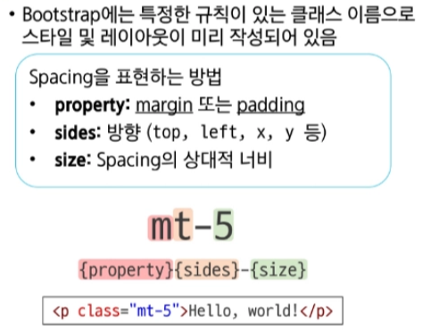
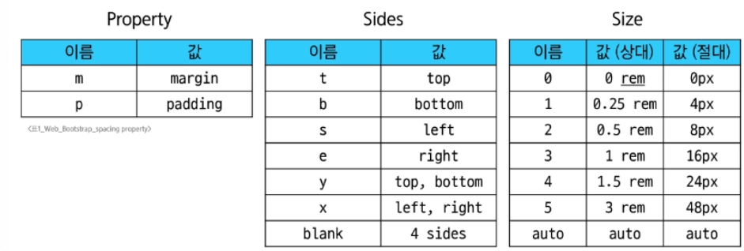
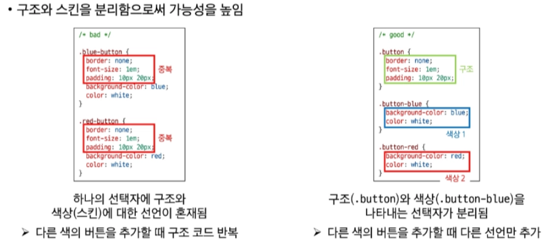
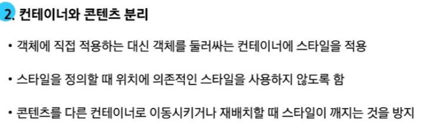

# 0226(Bootstrap).md

# Bootstrap

: CSS 프론트엔드 프레임워크 (Toolkit)

- 모바일, 태블릿, 데스크탑 등 다양한 기기 환경에서 웹 페이지가 적절하게 표시될 수 있도록 반응형 웹 디자인을 지원하는 도구(기술) 이다.
- 프레임워크 : 소프트웨어 개발 시 효율성을 높이기 위해, 공통적으로 필요한 기능과 정해진 구조(뼈대)를 미리 제공해주는 ‘ 반제품 ‘ 형태의 개발 환경이다.

## Bootstrap 설치 및 사용 방법

## CDN (Content Delivery Network) - “ 콘텐츠를 더 빠르게, 사용자와 가깝게”

### 문제점

- 멀리 있는 서버의 데이터를 사용자가 받으려면 물리적인 거리로 인해 지연(Latency)이 발생한다

### 해결책

- CDN은 사용자와 가까운 곳에 데이터를 미리 저장해두고 전달하여 물리적 거리의 한계를 극복한다

### 작동 원리

- 오리진 서버 (Origin Server) : 원본 데이터가 저장된 메인 서버
- 엣지 서버 (Edge Server) : 전 세계 주요 거점에 분산 배치된 서버

### 프로세스

1. 사용자가 웹 사이트에 접속 (요청)
2. 사용자와 가장 가까운 엣지 서버가 요청을 감지
3. 엣지 서버에 저장된 복사본을 즉시 전송

### 장점

- 속도 향상 : 데이터 이동 경로가 짧아져 로딩 속도가 상승한다
- 서버 부하 분산 : 트래픽이 엣지 서버로 분산되어서 오리진 서버의 과부하 및 다운을 방지한다
- 안정성 : 특정 서버에 장애가 생겨도 다른 경로로 우회하여 서비스를 유지한다

## Bootstrap  기본 사용법

## Reset CSS

: 모든 HTML 요소 스타일을 일관된 기준으로 재설정하는 간결하고 압축된 규칙 시트이다

- HTML, Element, Table, List 등의 요소들에 일관성 있게 스타일을 적용시키는 기본 단계이다

## Bootstrap 활용

### Color

## Component

: 재사용 가능한 독립적인 부품으로, 더 크고 복잡한 시스템을 구축하기 위해 사용되는 소프트웨어의 기본 단위

### 컴포넌트의 특징 및 장점

- 사용성
    - 한번 잘 만들어 둔 컴포넌트(예시 : 검색창) 는 여러 페이지에서 반복해서 사용할 수 있다
- 독립성
    - 각 컴포넌트는 자체적으로 작동하는 데 필요한 모든 코드(HTML/ CSS / JS)를 가지고 있다
    - 따라서 다른 컴포넌트에 미치는 영향을 최소화한다
- 유지보수 용이성
    - 특정 기능(예시 : 로그인 버튼) 을 수정해야 할 때, 전체 코드를 뒤집을 필요 없이 해당 컴포넌트만 찾아 수정하면 되므로 관리가 매우 편리하다

## Semantic Web

: 웹 데이터를 의미론적으로 구조화된 형태로 표현하는 방식

(요소의 시각적 측면이 아닌 요소의 목적과 역할게 집중하는 방식이다)

### Semantic in HTML

### HTML Semantic Element

: 기본적인 모양과 기능 이외의 의미를 가지는 HTML 요소

(검색엔진 및 개발자가 웹 페이지의 콘텐츠를 이해하기 쉽게 해준다)

## Semantic in CSS

### CSS 방법론

: CSS를 효율적이고 유지 보수가 용이하게 작성하기 위한 일련의 가이드라인

### OOCSS (Object Oriented CSS)

: 객체 지향적 접근법을 적용하여 CSS를 구성하는 방법론

