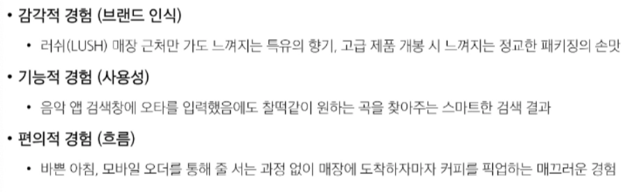
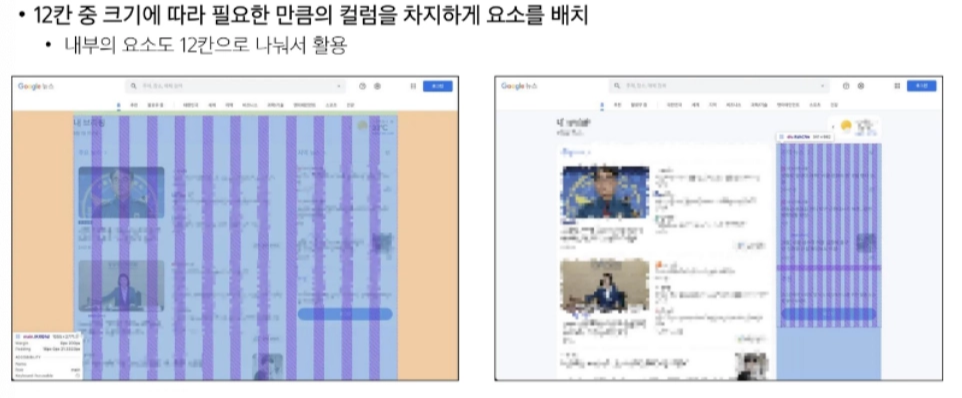
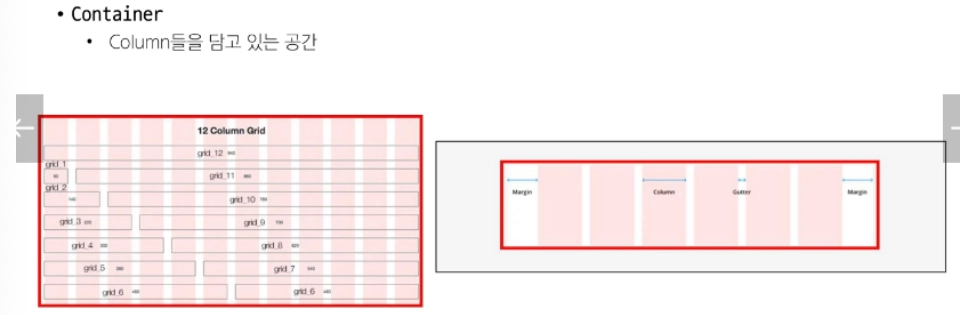
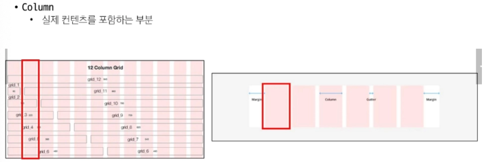
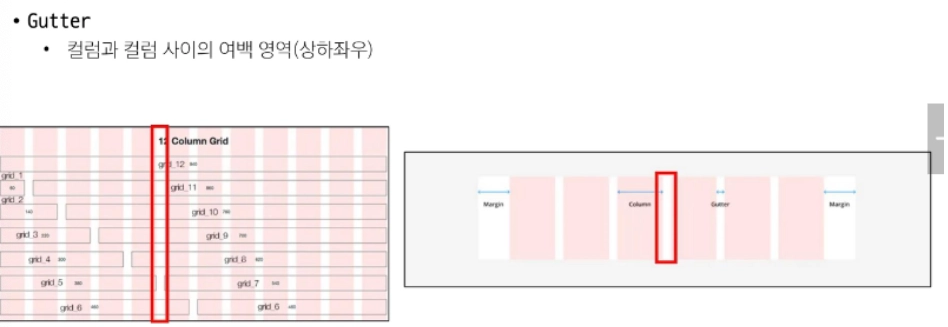
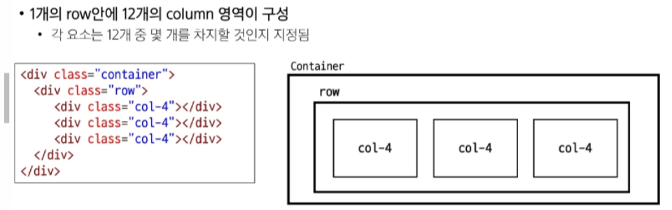
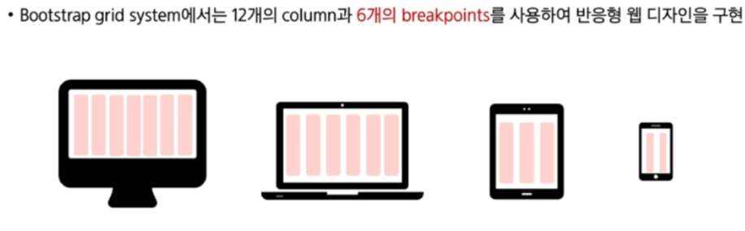
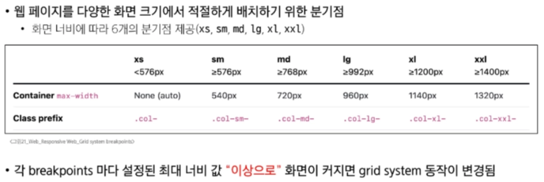
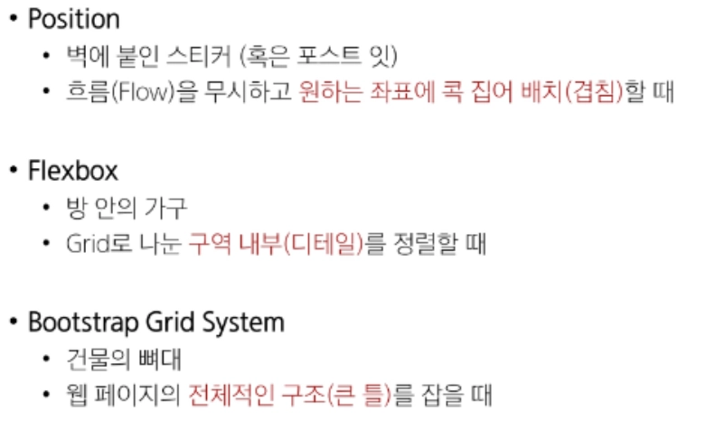

# 0227(Reseposive Web).md

## Responsive Web

### 반응형 웹 디자인

: 디바이스 종류나 화면 크기에 상관없이, 어디서든 일관된 레이아웃 및 사용자 경험을 제공하는 디자인 기술

## UI / UX

- UX (User Experience) : 사용자가 서비스를 이용하며 느끼는 ‘만족감’ 이자 ‘경험’
- UI (User Interface) : 사용자와 서비스가 만나는 ‘화면 디자인’과 ‘배치’

**반응형 웹의 존재 이유**

→ 다양한 화면 크기에 맞추어 UI를 유연하게 변경함으로써, 어떤 환경에서도 사용자에게 최적의 UX를 제공하는 것

### UX (User Experience)

: 제품이나 서비스를 이용하는 사람들이 느끼는 전체적인 경험과 만족도를 개선하고 최적화하기 위한 디자인과 개발 분야

### UI (User Interface)

: 서비스와 사용자 간의 상호작용을 가능하게 하는 디자인 요소들을 개발하고 구현하는 분야

## Bootstrap Grid system

: 웹 페이지의 레이아웃을 조정하는 데 사용되는 12개의 컬럼으로 구성된 시스템

( 12→ 적절한 크기 중 가장 약수가 많은 수로 여러 조합으로 화면을 나눌 수 있 기에 선정된 숫자 )

### Grid system 구조와 문법

### Gutters

: Grid system에서 column 사이에 여백 영역

## Grid system for responsive web

- Bootstrap grid system에서는 12개의 column과 6개의 breakpoints를 사용하여 반응형 웹 디자인을 구현한다

### Breakpoints

### Breakpoint 키워드 주의사항

- ~이상으로 모두 적용하는 범위임을 항상 명심하고 사용하여야 한다

### CSS Layout 종합 정리

### Grid Cards

