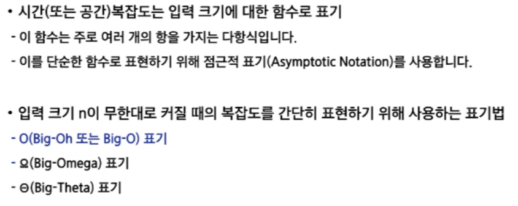
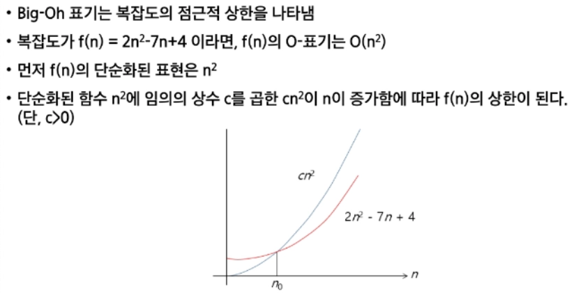

# 0304(SW 문제해결).md

## SW 문제해결

### 문제해결 과정

1. 문제를 읽고 이해한다
2. 문제를 익숙한 용어로 재정의한다
3. 어떻게 해결할지 계획을 세운다. (문제를 해결할 수 있는 자료구조, 알고리즘 생각)
4. 계획을 검증한다
5. 프로그램으로 구현한다
6. 어떻게 풀었는지 돌아보고, 개선할 방법이 있는지 찾아본다

- 히든 테스트 케이스 종류
    - 엣지 케이스 (문제에서 숨겨져 있는 조건에 맞는 케이스)
    - 시간 초과 (입력값이 최대일 때 메모리 및 주어진 시간을 초과하는 경우)

## 복잡도 분석

### 알고리즘

: 유한한 단계를 통한 문제를 해결하기 위한 절차나 방법

- 공간적 효율성과 시간적 효율성
    - 공간적 효율성은 알고리즘이 필요로 하는 메모리 공간을 말한다
    - 시간적 효율성은 알고리즘이 작업을 완료하는데 걸리는 시간을 말한다
    - 효율성을 뒤집어 표현하면 복잡도(Complexity)가 된다. 복잡도가 높을수록 효율성은 저하된다

- Big-O : 최악의 케이스
- Big-Omege : 최선의 케이스
- Big-Theta : 평균적인 케이스

→ 알고리즘에서 더 좋은 성능이라는 것은, 빅-오 표기법이 보여주는 표면적인 수치가 무조건 맞지는 않는다.

경우에 따라 모두 성능이 다르다!