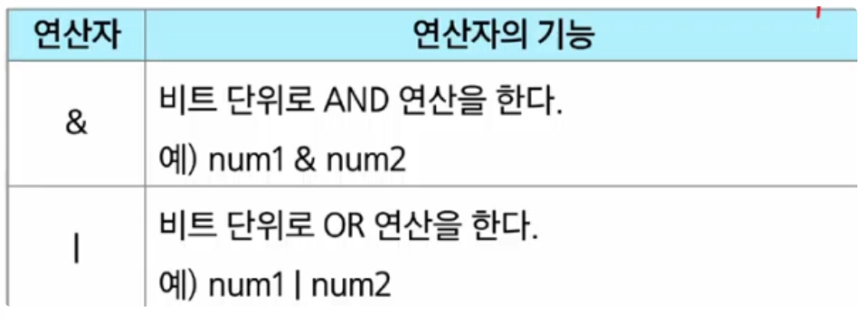
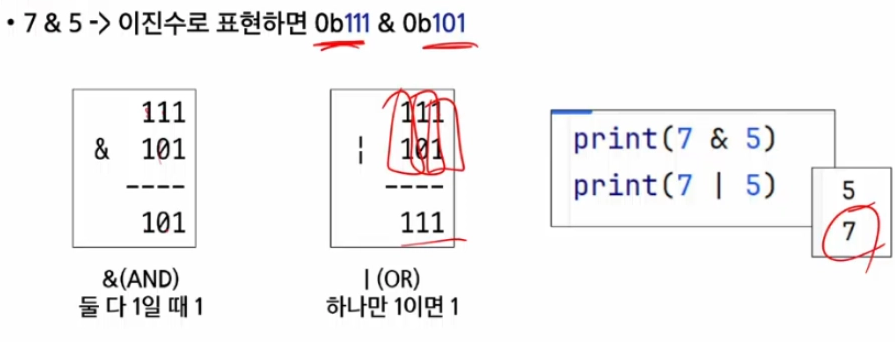
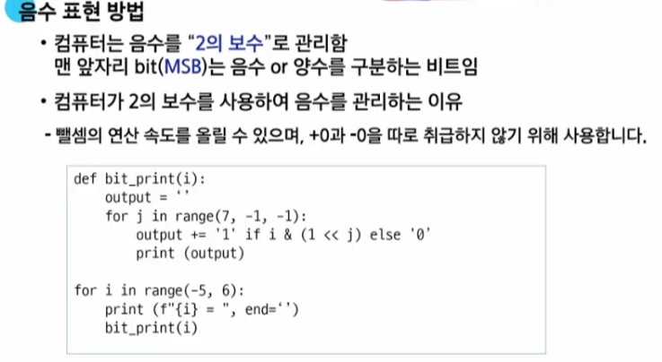
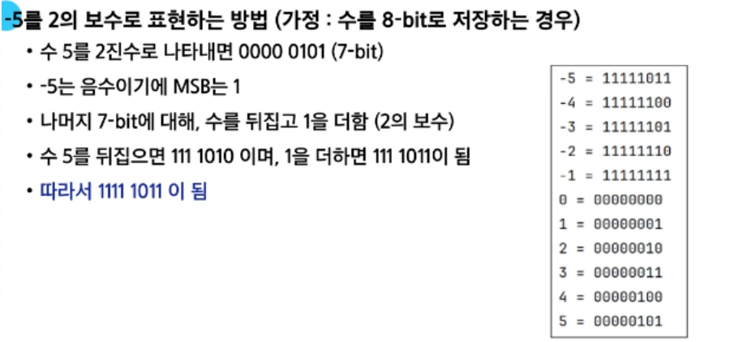

# 0305(비트 연산).md

## 비트 연산

: 컴퓨터의 CPU 내부적으로 비트 연산을 사용하여 덧셈, 뺄셈, 곱셈 등을 계산한다

(사람이 사용하는 사칙연산이랑은 다른 개념)

비트 연산 AND 와 OR 연산

- a AND b : a, b 둘 다 1일 때만 결과가 1, 그 외에는 0
- a OR b : a, b 둘 중 하나만 1이면 결과가 1, 그 외에는 0

- ^ : XOR(Exclusive-OR) 연산자, 둘 다 1이거나 0인 경우는 0이다

### 쉬프트 연산자

- Left Shift ‘<<’ : 특정 수 만큼 비트를 왼쪽으로 밀어낸다
- Right Shift ‘>>’ : 특정 수 만큼 비트를 오른쪽으로 밀어낸다 (우측 비트들이 제거된다)

→ 각 자리의 숫자가 1인지 아닌지 판단이 가능하다

- Bitwise NOT (complement) 연산자
    - ~연산자 : 모든 비트를 반전 시킨다
    - 만약 8-bit일 때 ~ (0001 1111) 이라면 값은 1110 0000이 된다

## 실수

