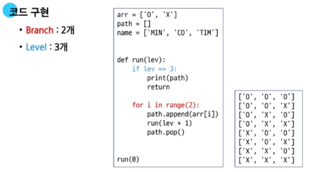
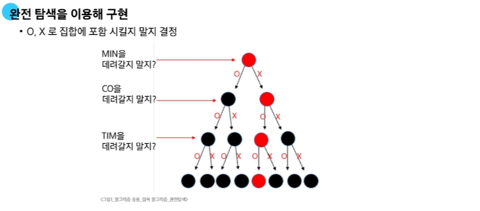
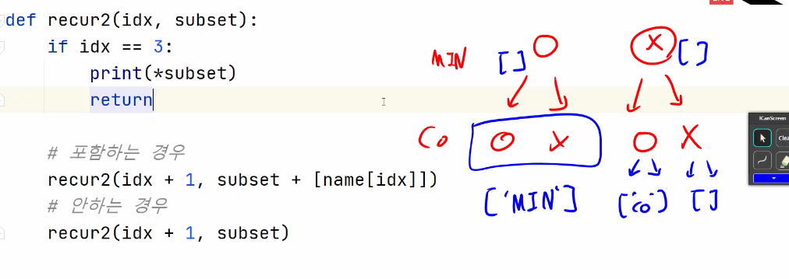
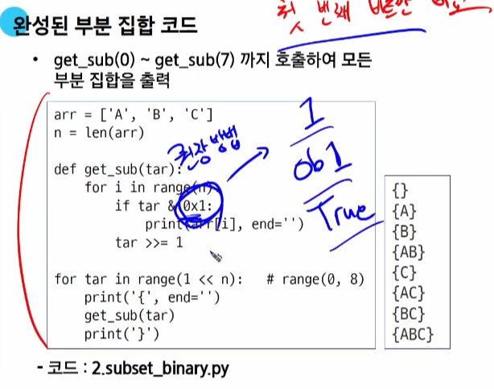

# 0310(부분 집합, 그리디).md

## 조합적 문제

## 부분 집합 (Powerset)

: 어떤 집합의 공집합과 자기자신을 포함한 모든 부분

(구하고자 하는 어떤 집합의 원소의 개수가 n일 경우 부분집합의 수는 2^n개이다)

**집합에서 부분 집합을 찾아내는 구현 방법**

1. 완전 탐색 (Brute-Force)
    - 재귀호출을 이용한 완전탐색으로 부분 집합을 구할 수 있다
    - 실전보다는 완전 탐색 학습용으로 추천되는 방법이다
2. Binary Counting
    - 2진수와 비트 연산을 이용하여 부분 집합을 구할 수 있다
    - 모든 부분 집합이 필요할 때 추천되는 방법이다

Depth(Level)와 Branch 수 설정 후 구현!

아래 예시에서 Branch → 데려갈지 / 안데려갈지



### 완전 탐색으로 예시 구현



1. 새로운 리스트를 만들어서 인자로 넘겨주는 방식

→ 호출 방법 recur2(idx, [ ])



1. append와 pop을 사용하는 방식 (권장되지 않는다)

→ append는 사용할 시 스택의 메모리가 계속 늘어나며 저장하기에, 메모리가 두 배로 늘어난다

    (pop을 한다고 한들, 늘어난 메모리는 그대로 남아있고 공간만 비워지기 때문에)

 


전체코드)


### 바이너리 카운팅(Binary Counting)으로 예시 구현

→ 요소 리스트는 그대로 두고, 비트를 이동시키며 확인하는 방법

(진행 방향, 비트를 0 → N 으로)



## 바이너리 카운팅(Binary Counting)

- 원소 수에 해당하는 N개의 비트열을 이용하여 부분집합을 표시 (XOR 비트 연산자 이용)

→ 연산 이후 각 자리의 수가 1이라면, 해당 요소를 **포함한다**


→ 비트는 그대로 두며 리스트의 요소 인덱스를 옮겨가며 확인하는 방법

(진행 방향, 리스트 요소의 인덱스를 N-1 → 0 으로)

```python
arr = [1, 2, 3, 4]
n = len(arr)

def get_subset1(target):
        # 1. 0 ~ 부분 집합의 수 만큼 반복
        # - i : 부분 집합의 번호
       for i in range(1 << n):
             # i를 이진수로 생각하고, 각 자리 수를 비교
            for idx in range(n):
                  if i & (1 <<  idx):
                         print(arr[ idx ], end = ' ')
           print()

get_subset1( )
```

## 조합 (Combination)

: 서로 다른 n개의 원소 중 r개를 **순서 없이** 골라낸 것

→ 요소의 순서가 다르더라도 같은 요소들을 포함하고 있다면 모두 같은 것으로 간주하고 cnt는 1회만 한다

예시 문제)


풀이 코드)

```python
arr = ['A', 'B', 'C', 'D', 'E']
N = 3

path = [ ] 
# N명을 뽑는다 Depth : N
# 5명 중 한명을 선택 -> branch : 5
# 1. 전체 순열 코드부터 시작
# 2. 직전 선택을 다음 재귀호출로 넘겨주고,
#      그 다음부터 선택하도록 구성한다
def recur(cnt, prev):
        if cnt == N:
             print(*path)
             return
         
        # (중복 제거된 조합)이전에 선택했던 것 다음 거부터 탐색하자!       
        #  -> 상태 공간 트리 그림을 그려서 규칙을 파악하자!
        for i in range(prev + 1, len(arr)):
        # (중복 선택 가능한 조합) 선택했던 것부터 탐색!
    # for i in range(prev, len(arr)):
                 path.append(arr[i])
                 recur(cnt + 1, i)            # 이전 선택을 함께 전달
                 path.pop

recur(0, -1)   #  (중복 제거된 조합)
#  recur(0, 0)   # (중복 선택 가능한 조합)
```

## 탐욕 알고리즘 (Greedy)

: 결정이 필요할 때, 현재 기준으로 가장 좋아 보이는 선택지로 결정하여 답을 도출하는 알고리즘

### 그리디 검증

→ 도대체 어떤 문제가 그리디 알고리즘으로 풀이되는 문제인가?

**“규칙성”**을 찾아야 한다

- 규칙을 찾지 못하면 그리디로 풀이하지 못한다

만약, 규칙을 찾았다면, 그리디로 풀이해도 괜찮은가? **X**

→ 세 단계의 검증 과정 필요

[검증하는 단계]

1. 탐욕적 선택 조건 (Greedy Choice Property)
    - 그리디는 “현재 상태에 최적”  한 것을 선택하는 것
        
        → 각 단계의 최적해 선택이 이 후 단계에서의 선택에 영향을 주지 않아야 한다
        
        → 즉, 각 단계 규칙이 변경되면 안된다
        
        → 예시) 거스름돈 동전 교환 문제
        
         a. 가장 큰 동전(500원)으로 가능한 만큼 거슬러준다
        
         b. 가장 큰 동전(100원)으로 가능한 만큼 거슬러준다
        
        ‘’’’’’’’’
        
        → 각 단계의 규칙이 유지되며 이전에 구했던 최적해 선택이 각 단계에 영향을 주지 않아야 한다
        

1. 최적 부분 구조 (Optimal Substructure)
    - 각 단계의 최적해 선택을 합하면 전체 문제의 최적해가 되어야 한다
        
        → 증명을 통하여 해결해야 한다 [ 직접 증명 (귀납법 등) / 간접 증명 (귀류법 등) ]
        
    - 예시) 거스름돈 동전 교환 문제
        1. [명제] 가장 큰 동전부터 순서대로 고르면 최소 동전 수가 나온다
        2. [간접 증명] 최적해보다 더 작은 수의 동전으로 표현 가능하다 (가정)
            
            → N원을 더 작은 수의 동전으로 표현할 수 있다
            
            → 동전이 배수로 있기 때문에 숫자가 더 작으면 무조건 더 큰 수의 동전이 나온다
            
            → 수학적으로 모순 (더 작은 수로 나누었는데 몫이 더 작다)
            
            → 원래 명제가 참이다
            

1. 반례가 없는가?
    - 엣지 케이스 등

**이때, 모든 검증을 거치며 Greedy로 풀이할 수 없다면? D.P혹은 완전탐색으로 방향성 전환**

### Greedy 문제 예시)

### 화장실 문제 (Greedy 유형)


- 접근법 : 사용 시간이 적은 사람부터 들어가게 한다! (Greedy)

---

### Knapsack 문제


---

**이때, 물건의 개수에 제한이 생긴다면?**

**그리디로 접근 불가능**


---

**반면, 물건을 원하는 만큼 자를 수 있다면?**

**그리디를 적용하여 풀이 가능**


- 접근법 : kg당 값이 많이 나가는 것 부터 담기

---

### 활동 선택 문제 (Greedy 유형)


- 접근법 : 종료시간이 빠른것부터 배정