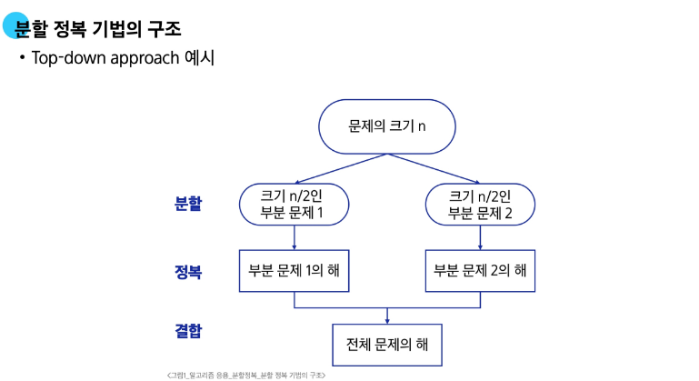

# 0311(분할 정복).md

## 분할 정복

: 문제를 작은 하위 문제로 나누고(분할) 각각을 해결(정복)한 뒤, 그 결과를 결합(통합)하여 원래의 문제를 해결하는 알고리즘 기법

→ 한번에 답이 나오지 않는다면? 한번 분할해본다

- 분할 정복 기법의 설계 전략
    - 분할(Divide) : 해결할 문제를 여러 개의 작은 부분으로 나눈다
    - 정복(Conquer) : 나눈 작은 문제를 각각 해결한다
    - 통합(Combine) : (필요하다면) 해결된 해답들을 모은다



## 병합 정렬 (Merge Sort)

: 여러 개의 정렬된 자료의 집합을 병합하여 한 개의 정렬된 집합으로 만드는 방식이다

→ 복사해서 붙여넣는 비파괴 형식의 정렬 알고리즘

→ 연결리스트 없이 배열만을 사용하여 구현한다면 **‘비효율적’** 이다

- top-down 방식
- 시간 복잡도 : O(n log n)

병합 정렬 예시)


코드 예시)

```python
# 2. 병합하는 과정 (이때, 정렬하면서 병합)
# - 왼쪽, 오른쪽 리스트 중 작은 원소부터 정답 리스트에 추가
def merge(left, right):
      # 두 리스트를 합한 크기만큼 나온다
      result = [ 0 ] * (len(left) + len(right)) 
      l = r = 0    # 현재 바라보고 있는 인덱스
      
      # 두 리스트에서 비교할 대상이 남을 때 까지 반복
      while l < len(left) and r < len(right):
            if left[ l ] < right[ r ]:
                  result[ l + r ] = left[ l ]
                  l += 1
            else:
                  result[ l + r ] = right[ r ]
                  r += 1

      # 남은 데이터들을 모두 result에 추가
      while l < len(left):
            result[ l + r ] = left[ l ]
            l += 1

      while r < len(right):
            result[ l + r ] = right[ r ]
            r += 1

      return result

# 1. 분할하는 과정
# - depth : 리스트의 길이가 1이 되면 끝 (종료 조건)
# - branch : 왼쪽과 오른쪽으로 리스트를 분할 (2개)
def merge_sort( li ):
      if len( li ) == 1:
            return li

      mid = len( li ) // 2
      left = li[ : mid]   # 왼쪽 절반 리스트
      right = li[mid : ]   # 오른쪽 절반 리스트

      left_list = merge_sort(left)
      right_list = merge_sort(right)

      merge_list = merge(left_list, right_list)
      return merge_list

arr = [69, 10, 30, 2, 16, 8, 31, 22]
sorted_arr = merge_sort(arr)
print(sorted_arr)
```

## 퀵 정렬 (Quick Sort)

: 기준 값을 중심으로 주어진 배열을 두 개로 분할하고, 각각을 정렬하여 전체 배열을 정렬하는 방식

- 시간 복잡도 : O(n log n)
- Partitioning 이라는 과정을 반복하면서, 빠른 속도로 정렬이 되는 알고리즘이다

### Partitioning

1. 작업 영역을 정한다
2. 작업 영역 중 가장 왼쪽에 있는 수를 Pivot으로 지정한다 (Pivot을 **“기준”**으로 해석한다)
3. Pivot을 기준으로
    - 왼쪽에는 Pivot보다 작은 수를 배치한다 (정렬 안됨)
    - 오른쪽에는 Pivot보다 큰 수를 배치한다 (정렬 안됨)


**이때, Pivot의 위치만 확정 (Fix)**

→ 한 번의 파티셔닝 이후, 왼쪽과 오른쪽 부분 배열에 대해 재귀적으로 파티셔닝을 반복하여 정렬을 진행한다

### Partition의 종류

### Hoare-Partition


Hoare-Partition 코드 예시 세 가지(Pivot 왼쪽/ 중간/ 오른쪽 설정)

```python
arr = [3, 2, 4, 6, 9, 1, 8, 7, 5]
# arr = [11, 45, 23, 81, 28, 34]
# arr = [11, 45, 22, 81, 23, 34, 99, 22, 17, 8]
# arr = [1, 1, 1, 1, 1, 0, 0, 0, 0, 0]

# [참고] 피벗의 위치를 다양하게 고르는 경우 3가지를 함수로 만들었습니다.

# 피벗: 제일 왼쪽 요소
# 이미 정렬된 배열이나 역순으로 정렬된 배열에서 최악의 성능을 보일 수 있음
def hoare_partition1(left, right):
    pivot = arr[left]  # 피벗을 제일 왼쪽 요소로 설정
    i = left + 1
    j = right

    while i <= j:  # 교차가 되면 끝
        while i <= j and arr[i] <= pivot:  # i 는 pivot 보다 큰 값을 검색 (작거나 같으면 i += 1)
            i += 1

        while i <= j and arr[j] >= pivot:  # j 는 pivot 보다 작은 값을 검색 (크거나 같으면 j -= 1)
            j -= 1

        if i < j:  # swap
            arr[i], arr[j] = arr[j], arr[i]

    # pivot 과 j 위치를 swap
    arr[left], arr[j] = arr[j], arr[left]
    return j

# 피벗: 제일 오른쪽 요소
# 이미 정렬된 배열이나 역순으로 정렬된 배열에서 최악의 성능을 보일 수 있음
def hoare_partition2(left, right):
    pivot = arr[right]  # 피벗을 제일 오른쪽 요소로 설정
    i = left
    j = right - 1

    while i <= j:
        while i <= j and arr[i] <= pivot:
            i += 1
        while i <= j and arr[j] >= pivot:
            j -= 1
        if i < j:
            arr[i], arr[j] = arr[j], arr[i]

    arr[i], arr[right] = arr[right], arr[i]
    return i

# 피벗: 중간 요소로 설정
# 일반적으로 더 균형 잡힌 분할이 가능하며, 퀵 정렬의 성능을 최적화할 수 있습니다.
def hoare_partition3(left, right):
    mid = (left + right) // 2
    pivot = arr[mid]  # 피벗을 중간 요소로 설정
    arr[left], arr[mid] = arr[mid], arr[left]  # 중간 요소를 왼쪽으로 이동 (필요 시)
    i = left + 1
    j = right

    while i <= j:
        while i <= j and arr[i] <= pivot:
            i += 1
        while i <= j and arr[j] >= pivot:
            j -= 1
        if i < j:
            arr[i], arr[j] = arr[j], arr[i]

    arr[left], arr[j] = arr[j], arr[left]
    return j

def quick_sort(left, right):
    if left < right:
        pivot = hoare_partition1(left, right)
        # pivot = hoare_partition2(left, right)
        # pivot = hoare_partition3(left, right)
        quick_sort(left, pivot - 1)
        quick_sort(pivot + 1, right)

quick_sort(0, len(arr) - 1)
print(arr)

```

### Lomuto Partition


Lomuto Partition 코드 예시)

```python
# 퀵 정렬 중 lomuto partition 을 활용한 코드입니다.
# i, j 가 hoare 와는 다르게 앞에서부터 함께 이동한다는 점을 이해해주시면 됩니다.
#  - hoare 와 동일하게 i 는 pivot 보다 큰 값을, j 는 작은 값을 찾아나갑니다.

arr = [3, 2, 4, 6, 9, 1, 8, 7, 5]

def lomuto_partition(left, right):
    pivot = arr[right]

    i = left - 1
    for j in range(left, right):
        if arr[j] <= pivot:
            i += 1
            arr[i], arr[j] = arr[j], arr[i]

    arr[i + 1], arr[right] = arr[right], arr[i + 1]
    return i + 1

def quick_sort(left, right):
    if left < right:
        pivot = lomuto_partition(left, right)
        quick_sort(left, pivot - 1)
        quick_sort(pivot + 1, right)

quick_sort(0, len(arr) - 1)
print(arr)

```

### Hoare-Partition과 Lomuto Partition

**주로 Hoare-Partition을 사용한다**

→ Lomuto는 특정 케이스에서 느려지는 경향이 있다

### 퀵 정렬의 시간 복잡도

- 평균 : O (N log N)
    - 실제 연산 시간이 효율적이다
    - 데이터가 많을 수록 효율적이다
- 최악 : O (N^2)
    - 반대로 정렬 될 수록 최악의 시간 복잡도를 갖는다

→ Pivot을 무엇으로 설정하느냐에 따라 시간 복잡도는 달라진다 (데이터 분포에 따라 달라진다)

### 병합 정렬과 퀵 정렬의 차이


## 이진 검색 (Binary Search)

: 자료의 가운데에 있는 항목의 키 값과 비교하여 다음 검색의 위치를 결정 후 검색을 계속 진행하는 방법이다

### 이진 검색의 과정

1. 자료의 중앙에 있는 원소를 고른다
2. 중앙 원소의 값과 찾고자 하는 목표 값을 비교한다
3. 목표 값이 중앙 원소의 값보다 작다면, 자료의 왼쪽 반에 대해서 새로 검색을 수행한다
    
    목표 값이 중앙 원소의 값보다 크다면, 자료의 오른쪽 반에 대해서 새로 검색을 수행한다
    
4. 찾고자 하는 값을 찾을 때까지 1-3의 과정을 반복한다

예시)


### 이진 검색 구현

1. 반복문 (반복문으로만 구현할 자신이 있다면? 반복문으로 구현하는게 더 빠르다)

반복문 예시 코드)

```python
arr = [7, 4, 2, 9, 11, 23, 19]

# [주의!] 이진 검색은 항상 정렬된 데이터에 적용
arr.sort()  # 2, 4, 7, 9, 11, 19, 23

def binary_search_while(target):
    left = 0                # 검색 시작점
    right = len(arr) - 1    # 검색 끝점
    cnt = 0                 # 검색 횟수 추가

    # 교차가 되는 순간이 탐색 못한 순간
    while left <= right:
        mid = (left + right) // 2
        cnt += 1

        # 정답을 찾으면 종료
        if arr[mid] == target:
            return mid, cnt

        # arr[mid] 가 target 보다 더 큰 경우 (target 이 왼쪽에 위치)
        # - 왼쪽을 탐색
        if target < arr[mid]:
            right = mid - 1
        # arr[mid] 가 target 보다 작은 경우 (target 이 오른쪽에 위치)
        # - 오른쪽을 탐색
        else:
            left = mid + 1

    return -1, cnt

targets = [9, 2, 20]

for target in targets:
    result = binary_search_while(target)
    if result == -1:
        print(f'{target}은 배열에 없습니다')
    else:
        print(f'{target}은 {result}위치에 있습니다.')

```

1. 재귀호출 (반복문보다는 일반적으로 느리다 → 스택에 메모리가 누적되기 때문에)

재귀호출 예시 코드)

```python
# [참고] 이진 검색 재귀 호출
def binary_search_recur(left, right, target):
    # left, right 를 작업 영역으로 검색
    # left <= right 만족하면 반복
    if left > right:
        return -1

    mid = (left + right) // 2
    # 검색하면 종료
    if target == arr[mid]:
        return mid

    # 한 번 할 때마다 left 와 right 를 mid 기준으로 이동시켜 주면서 진행
    # 왼쪽을 봐야한다
    if target < arr[mid]:
        return binary_search_recur(left, mid - 1, target)
    # 오른쪽을 봐야한다.
    else:
        return binary_search_recur(mid + 1, right, target)
```

## 분할 정복 정리


- 현재 우리가 배운 이진 검색으로만 풀 수 없는 문제 유형들
    - 중복된 숫자가 존재하는 문제들
        - 범위 값 검색
        - N 이상인 개수
        - A~B 사이 값을 가진 데이터의 수
- 위와 같은 문제를 만났다면 이때, 이진 검색으로 가능한 것
    - A가 첫 번째로 시작하는 위치
    - A를 초과하는 값이 시작하는 위치

### 이진 검색과 함께 필수 학습 키워드

- Lower Bound
- Upper Bound
- parametric Search