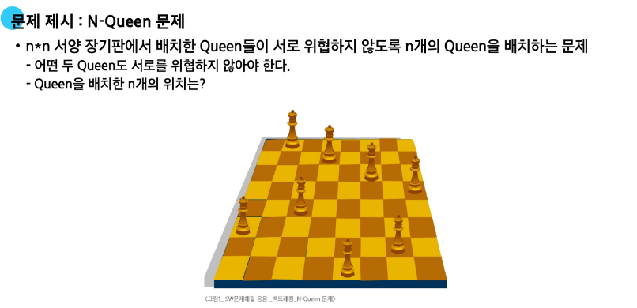

# 0312(백트래킹 Backtracking 응용, 트리).md

## 백트래킹 응용

## 백트래킹

- 여러 가지 선택지(옵션)들이 존재하는 상황에서 한 가지를 선택한다
- 선택이 이루어지면 새로운 선택지들의 집합이 생성된다
- 이런 선택을 반복하면서 최종 상태에 도달한다

### 백트래킹 순서

1. 전체를 보는 코드 (검증 / 시간초과가 나는지)
    
    → 시간 복잡도 계산을 통해서 검증 (python의 경우 3천만번 정도 연산하는데에 1초가 소요된다)
    
2. 유망하지 않은 후보를 자른다 (가지치기) (” 유망하지 않다 “ 를 검사할 수 있는 값들을 같이 넘겨주어 검사)

문제 예시01) N-Queen 문제 (while과 for문 말고도 visited를 대각선으로 생각하여 풀이도 가능)

### 백트래킹과 깊이 우선 탐색(DFS) 과의 차이

- 깊이 우선 탐색이 모든 경로를 추적하는데 비해 백트래킹은 불필요한 경로를 조기에 차단한다

→ 가지치기 (Pruning)

**보통의 DFS는 N이 10보다 작다면 가능**

**반면 백트래킹은 가지치기에 따라 최대 N이 12~15이하라면 가능**

**N이 그 이상이다? DFS나 백트래킹으로 풀이하는 문제가 아니다**

문제예시02) {1, 2, 3, 4, 5, 6, 7, 8, 9, 10}의 powerset 중 원소의 합이 10인 부분집합을 모두 출력하시오.

**→ 접근법 : powerset의 합이 10이면 출력 후 종료 / 이미 powerset의 합이 10이 넘는다면?return (가지치기)**

**→파리미터 : cnt /  현재 부분집합의 합 / 현재 부분집합**

**→ recur(cnt, total, subset):**

**이때, 포함 하는 경우, recur(cnt + 1, total + 현재값, subset + [현재값])**

         **포함 하지 않는 경우, recur(cnt + 1, total, subset)**

## 트리 (Tree)

:  비선형 구조 (폐루프를 이루는 구조) / 사이클이 없는 그래프 (시작 노드로 다시 돌아갈 수 없는 구조)

사이클 : 한 노드에서 출발해서 다시 해당 노드로 돌아올 수 있는 구조

사이클이 없다면 생기는 특징

- 계층 구조 (사원 관리 시스템, 파일 시스템)
- 자식이 2개 이하인 구조가 가장 많이 활용된다 (이진 트리도 학습해야 한다)

*** 주의 사항 : 동일한 그래프라도 “ root “ 가 다르면 다르게 보인다**

## 이진 트리 (Binary Tree)

: 모든 노드들이 최대 2개의 서브트리를 갖는 특별한 형태의 트리

### 이진 트리를 저장하는 방법

1. 1차원 리스트
    - 부모 노드 번호를 기준으로 자식 노드 번호를 찾아간다
    - 부모 노드 번호가 1번부터 시작
        - 왼쪽 자식 : 부모 인덱스 * 2
        - 오른쪽 자식 : 부모 인덱스 * 2 + 1
    - 부모 노드 번호가 0번부터 시작
        - 왼쪽 자식 : 부모 인덱스 * 2 + 1
        - 오른쪽 자식 : 부모 인덱스 * 2 + 2
2. 연결 리스트
    - 실제 개발에서 쓰이는 방식 (문제 풀이에서는 조금 구현이 어렵다)
    - class로 왼쪽 오른쪽을 정의한다
3. 그래프와 동일하게 표현
    - 인접 행렬
        - 연결되지 않은 정보까지 같이 저장한다
    - 인접 리스트
        - 연결된 정보만 저장한다

## 순회 (Traversal)

: 트리의 각 노드를 중복되지 않게 전부 방문(visit)하는 것

- 전위 순회 (Preorder-Traversal) VLR
- 중위 순회 (Inorder-Traversal) LVR
- 후위 순회 (Postorder-Traversal) LRV

## 힙 (Heap)

: 왼전 이진 트리에 있는 노드 중에서 키 값이 가장 큰 노드나 키 값이 가장 작은 노드를 찾기 위해서 만든 자료 구조

- 최대 힙 (max heap)
    - 키 값이 가장 큰 노드를 찾기 위한 힙이다
    - 루트 노드는 키 값이 가장 큰 노드
    - 부모 노드의 키 값 > 자식 노드의 키 값
    - heapq.heappush(max_heap, -num)
    - - (heapq.heappop(max_heap))
- 최소 힙 (min heap)
    - 키 값이 가장 작은 노드를 찾기 위한 힙이다
    - 루트 노드는 키 값이 가장 작은 노드
    - 부모 노드의 키 값 < 자식 노드의 키 값
    - heapq.heappush(min_heap, num)
    - heapq.heappop(min_heap)