# 0317(AI / ML / DL).md

## AI(Artificial Intelligence)

: 주어진 환경/ 데이터를 인지, 학습,추론을 통해 목표 달성을 하도록 예측, 행동, 선택, 계획하는 시스템이다

### ML이 아닌 AI 시스템의 예시

- 규칙 기반 시스템
- 휴리스틱 기반 (최적화) 알고리즘

## ML(Machine Learning)

- AI 범주 내에서 데이터로부터 학습하여 목적을 달성하는 접근 방법론
- 예시) 생셩형 AI, 언어 모델, 이미지 분류 모델, 추천 시스템

## DL(Deep Learning)

: ML 범주 내에서 신경망 (Neural Network) 함수를 사용한 학습 방법론

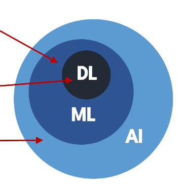

## 2. 데이터와 학습의 이해

## 2-1. 데이터 구성요소 (Feature / Label)

### 데이터가 왜 중요한가?

- 머신 러닝은 규칙을 직접 코딩하지 않고, 데이터에서 규칙을 학습한다
- 데이터 (Feature, Label)의 분포와 관계가 머신 러닝의 학습 결과를 결정한다

### Featur (피처, 특성)

- 모델이 예측에 사용하는 입력정보
- 예측, 판단의 근거/ 단서

### Label (라벨, 목표값)

- 모델이 예측하려는 정답
- 학습의 목표값

## 3. 단일 피쳐 기반 학습

## 3-1. 1D 피쳐 기반 학습

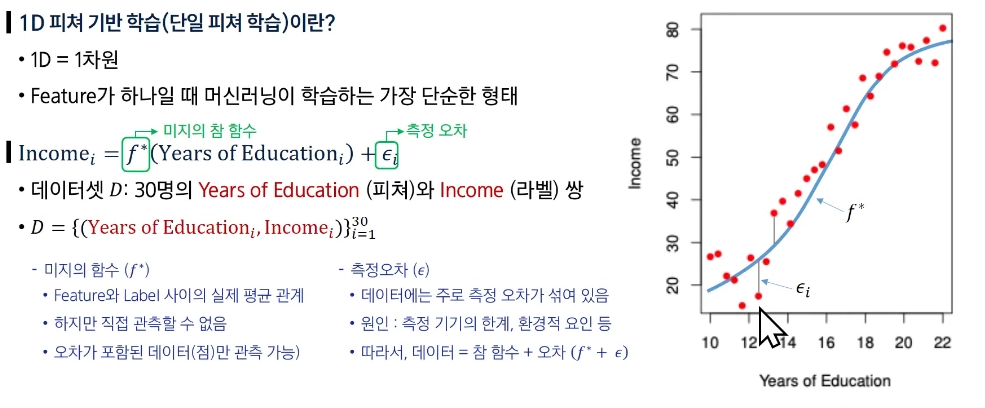

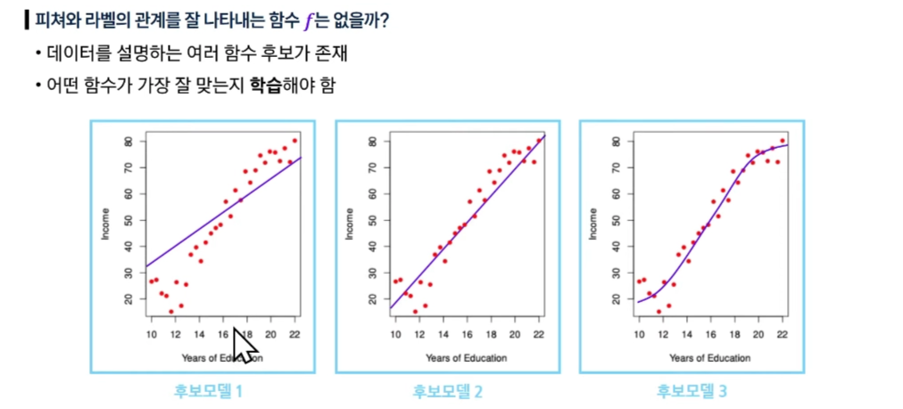

## 3-2. 모델과 가설 공간

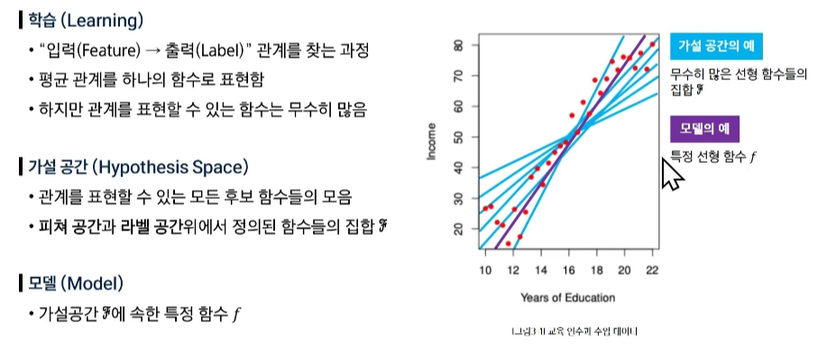

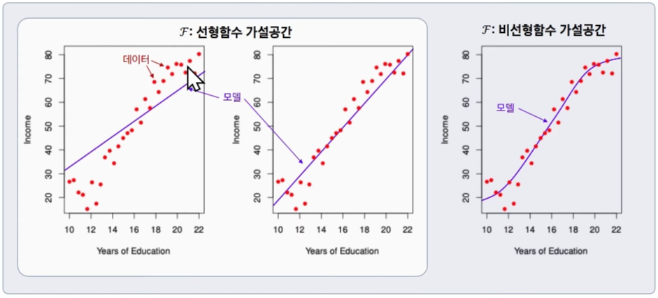

## 3-3. 학습이란

### 학습

- 주어진 데이터에서 정답을 가장 잘 맞출 수 있도록 모델의 규칙을 조금씩 조정해가는 과정이다
- 데이터 D → 가설 공간 → 선택된 모델 f

### 학습에 필요한 3가지

1. 데이터 (Data)
    - 학습할 예시들 (학력-수입 쌍 30개)
    - 입력(특성)과 정답(라벨) 쌍으로 된 정답 모음
2. 가설 공간 (Hypothesis Space)
    - 선택할 수 있는 모든 후보 함수들의 집합
    
    > 이 중에서 가장 좋은 함수를 찾아야 해
    > 
3. 선택 기준 (손실 함수)
    - 어떤 함수가 더 좋은지 판단하는 척도
    - 예측값과 실제값의 차이를 측정

### 학습 과정

1. 가설 공간에서 하나의 함수를 선택
2. 그 함수로 데이터의 모든 예시를 예측
3. 손실 함수로 틀린 정도를 계산
4. 더 적게 틀리도록 함수의 파라미터 조정
5. 반복하여 최적의 모델을 완성

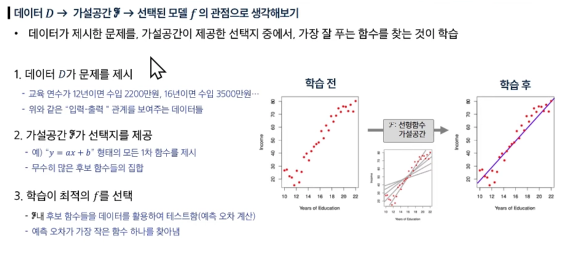

## 4. 복수 피쳐 기반 학습

## 4-1. 2D 피쳐 기반 학습

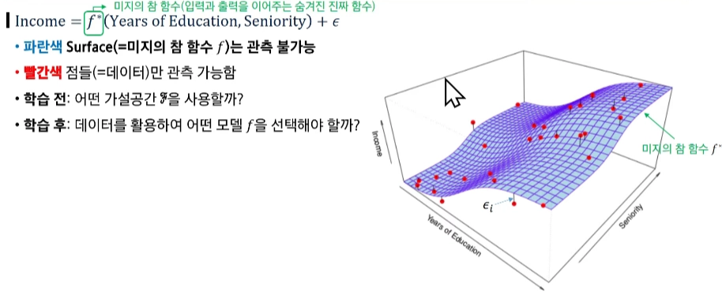

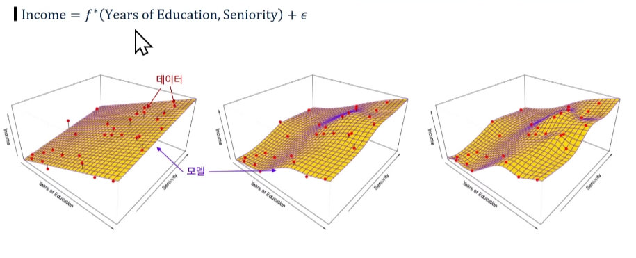

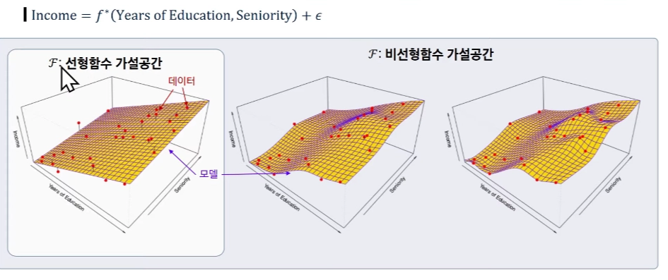

**비선형함수 가설공간은 선형함수 가설공간을 포함한다**

## 4-2. 일반적 용어 정리 및 모델 가정

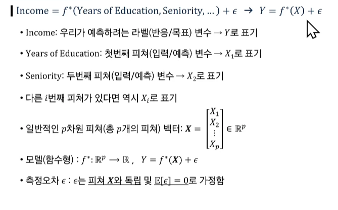

- 측정 오차 →e “ 앱실론 ”

## 4-3. 왜 f(.)를 학습하는가?

> **예측**
> 
- 잘 학습된 f가 있으면, 새로운 입력 X = x 에서 반응 / 목표 Y를 예측할 수 있다

> **중요 특성 파악**
> 
- 피쳐들 X = (X1, X2, … , Xp) 중 어떤 특성이 Y를 설명하는데 중요하고, 어떤 것은 덜 중요(무관)한지 알 수 있다

→ 예시) 근속 연수, 교육 연수는 소득에 큰 영향을 줄 수 있지만, 혼인 여부는 영향이 거의 없을 것이다

> **해석 가능성**
> 
- f의 복잡도에 따라 각 구성요소 Xi(X값이1 증가할때마다)가 Y에 어떻게 영향을 미치는지 (증가/ 감소 방향, 민감도 등)이해할 수 있다

---

# 지도학습은 무엇인가?

> **지도 학습 : “ 처음 보는 문제도 잘 푸는 AI 만들기 “**
> 
- 정의 : 입력 (feature) + 정답(label)을 가지고 예측 규칙을 배우는 방법
    - 정답이 있는 예시 데이터로 AI를 훈련시켜서, 새로운 문제에도 정확한 답을 할 수 있게 만드는 방법이 지시 학습이다
- 목표 : 훈련 데이터 뿐만 아니라, 처음 보는 데이터에서도 예측 성능 향상

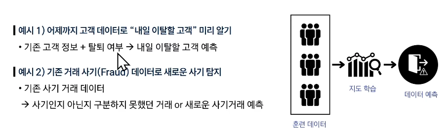

## 1. 지도학습의 개념

## 1-1. 지도학습 (Supervised Learning) 이란?

> **지도학습 (Supervised Learning) 이란?**
> 
- 정답 라벨이 있는 훈련 데이터를 사용하여 예측 모델을 학습하는 방법
- 목표 : 훈련 데이터로 학습한 모델이 새로운 데이터에서도 정확한 예측을 수행하게 하는 것

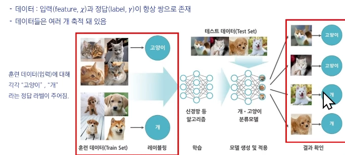

## 1-2. 지도학습의 종류 (회귀 vs 분류)

> **회귀 (Regression)**
> 
- 예측하고 싶은 결과값이 숫자일 때 사용
- 예시) 가격, 점수, 온도

> **분류 (Classification)**
> 
- 예측하고 싶은 결과값이 범주일 때 사용한다
- 예시) 스팸/정상, 질병 유/무

## 1-3. 지도학습 용어

> **특성 (Feature, x)**
> 
- 예측에 사용되는 설명 변수
- 예측 함수 f의 input으로 들어가는 변수

→ 예시) 집값 예측 에서의 feature {지역, 평수, 방수, 연식}

이메일 스팸 필터링 에서의 feature{제목, 내용 텍스트, 송신인}

> **라벨 (Label, y)**
> 
- 맞춰야 하는 정답(실제값)

→ 예시) 집값, 스팸 / 정상 이메일

> **예측값(y_hat)**
> 
- 학습 과정에서 모델이 내놓은 결과 (숫자 또는 범주)
    - y의 추정치

> **오류 (Error)**
> 
- 예측값(y_hat)과 라벨(y)의 차이 : y_hat - y
    - 오류 ≠ 측정 오차 . 즉, 예측값과 실제값의 차이(오류)를 줄이는 것이 지도학습의 목표이다

## 2. 회귀 (Regression)

## 2-1. 회귀(Regression) 문제

> **회귀 (Regression)**
> 
- 정의 : 입력(feature)으로부터 숫자(input)를 얼마나 정확히 예측할까?
- 특징 : 라벨 및 예측 모델의 출력은 연속적인 수치

## 2-2. 회귀 오류 : 평균 제곱 오차 (MSE)

> **예측이 얼마나 정확한지 어떻게 알 수 있을까?**
> 
- 모델의 예측 정확도를 숫자로 측정하는 지표 필요

> **평균 제곱 오차 (Mean Squared Error)**
> 
- 각 데이터에서 정답(y.i)과 예측(y_hat.i)의 평균 제곱 차이 값
- 틀린 정도를 제곱해서 더 큰 오류에 패널티를 부여
    
    → 전체 평균 오류 수준을 한눈에 볼 수 있다
    
    
    

> **참고 : MSE 단위가 제곱이라 해석이 어렵다면?**
> 
- 원래 데이터와 같은 단위라서 해석이 쉬운 RMSE(MSE의 제곱근) 도 사용한다

## 2-3. 회귀 설명력: R^2 (결정 계수)

> **결정 계수(R^2)**
> 
- Label(y)의 분산 중에서 Feature로 설명되는 비율이다
- “평균만 쓰는 단순한 예측” 보다 모델이 실제값을 얼마나 더 잘 맞추는지를 0~1 사이 값으로 나타낸다
- 1에 가까울수록 설명력이 높고, 낮을수록 설명력이 낮다

> **R^2가 음수가 나올 수 있을까?**
> 

→ 나올 수 있다. : 예측값(y_hat.i)들이 평균값 y-  보다도 못한다면 가능하다

## 2-4. MSE vs R^2

> **MSE vs R^2**
> 
- MSE, R^2 둘 다 모델의 정확도를 평가하기 위한 정량 지표이다.

차이점 →

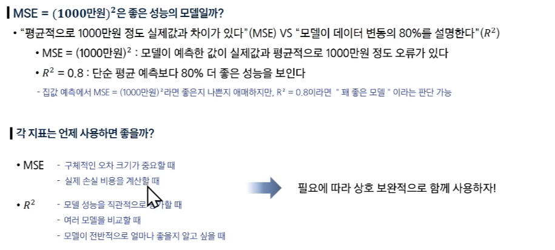

## 3. 분류 (Classification)

## 3-1. 분류(Classification) 문제

> **분류(Classification)**
> 
- 정의 : 입력 특성 (Feature) 으로부터 출력이 범주값(카테고리)으로 나타나는 예측 문제
- 특징 : 범주 라벨 (이진/ 다중)
    - 분류 모델에서 라벨은 미리 정해진 범주(카테고리) 중 하나의 값을 갖는다

> **이중 라벨 예시 1) 스팸 메일 분류**
> 
- Feature : 내용, 메일주소, 작성자 …
- Label : 스팸 / 정상

> 이**중 라벨 예시 2) 의학 예시**
> 
- Feature : 종양 반경, 면적, 색상 …
- Label : 악성 / 양성

> **다중 라벨 예시) 학점 예측**
> 
- Feature : 출석률, 과제 점수, 중간고사 점수
- Label : 학점 (A/B/C)

## 3-2. 분류 정확도(Accuracy)

> **분류 모델의 예측 정확도는 어떻게 평가할까?**
> 
- 분류 모델은 Label이 범주로 되어 있기 때문에 MSE나 R^2를 사용하기 어렵다

> **정확도**
> 
- 전체 예측 중에서 올바르게 맞춘 예측의 비율

> **정확도 예시 : II (고양이) 분류**
> 
- 실제(y.i) : 고양이, 예측(y_hat.i) : 고양이 → ll = 1 (맞춤)
- 실제(y.i) : 고양이, 예측(y_hat.i) : 강아지 → ll = 0 (틀림)

> **정확도가 99%이면 좋은 모델일까?**
> 
- 불균형 데이터 (양성 1%, 음성 99%)에서는 전부 음성이라 해도 정확도가 99%로 보일 수 있다

> **정확도의 함정 : 불균형 데이터 문제**
> 

## 3-3. 혼동 행렬 (Confusion Matrix)

> **혼동 행렬**
> 
- 예측과 실제 값 사이의 관계를 행렬 형태로 표현
- TP : 실제 양성, 예측도 양성
- TN : 실제 음성, 예측도 음성
- FP : 실제는 음성인데 양성이라 함 (오탐)
- FN : 실제는 양성인데 음성이라 함 (누락)

> **정밀도 (Precision)**
> 
- “양성이라 판정한 것 중” 진짜 양성의 비율 = TP / (TP + FP)

> **재현율(Sensitivity or Recall)**
> 
- “진짜 양성 가운데” 잡아낸 예측 양성 비율 = TP / (TP+FN)

> **F1-score**
> 
- 정밀도와 재현율의 조화 평균

## 4. 학습의 목적

## 4-1. 학습의 목적

> **학습의 목적 : 새로운 문제 해결하기**
> 
- 목적 : 훈련 데이터로 학습한 모델이 새로운 데이터에서도 정확한 예측을 수행하도록 하는 것

> **훈련이 잘 되었는지 어떻게 확인할까? (모델 성능을 어떻게 평가할까?)**
> 
- 학습 모델의 성능 평가는 모델이 처음 보는 (학습에 사용되지 않은) 데이터로 평가
    - “이 모델이 훈련 상황 외에 새로운 상황에서도 잘 동작 할까?” (일반화)를 검증
- 훈련 데이터에서 성능이 아무리 좋아도, 새로운 데이터에서 성능이 떨어지면 실전엔 사용할 수 없다
    - 일반화(Generalization) 오류의 최소화 지향
        
        → 새로운 데이터에서  틀리는 걸 최대한 줄여야 한다!
        

## 4-2. 오버피팅(Overfitting) 이란?

> **오버피팅 (Overfitting)**
> 
- 훈련 데이터의 **우연한 패턴 / 잡음까지 외워버려서 (초록색 함수) 훈련에서는 잘 맞지만 테스트에서는 성능이 나빠지는 현상**
- 현상 : 훈련 오류 급격히 낮음, 테스트 오류 높음 / 요동

> **오버피팅이 왜 안 좋은가?**
> 
- 표본(sample) 의존, 불안정 : 훈련 데이터는 모집단의 일부 표본이라 우연한 잡음이 섞인다.
    
    이 것에만 과하게 맞추어 학습하면 샘플 몇 개만 바뀌어도 예측이 크게 흔들림 (분산 ↑)
    
- 일반화 실패 : 보지 못한 데이터(테스트) 오류가 커진다.
    
    → 모(population)집단 성능과 격차가 벌어진다.
    

## 4-3. 오버피팅에 대한 오해

> **오버피팅 ≠ 분포 변화(distribution Shift)로 인한 에러 증가**
> 
- **분포 변화로 인한 오류** : 훈련 데이터 분포와 테스트 분포가 다름으로 (환경 / 계절 / 센서 변경 등) 성능이 떨어지는 현상
- **분표 변화로 인한 에러 증가는** **모델이 과적합(오버피팅)하지 않아도 발생 가능하다**

## 4-4. 오버피팅 vs 언더피팅

> **오버피팅 vs 언더피팅 (균형 잡기)**
> 
- 오버피팅 : 모델이 너무 복잡함
    
                     → 잡음까지 학습 (테스트 성능 나쁨)
    
- 언더피팅 : 모델이 단순하거나 학습이 완료되지 않는다
    
                     → 중요한 패턴을 놓침 (오류 큼)
    
    
    

> **해결 실마리**
> 
- 더 많은 데이터, 테스트 데이터를 활용한 모델 선정, 교차 검증 필요

---

# 교차 검증(Cross-Validation)

## 1. 테스트 성능 평가

> **훈련 오류 vs 테스트 오류**
> 
- 훈련 오류 : 모델을 학습시킨 같은 데이터에 다시 적용해 계산한 오류
- 테스트 오류 : 학습에 쓰지 않은 새 관측치에 대해 모델을 적용했을 때의 평균 예측오륲
    - 훈련 오류 = 문제집 접수, 테스트 오류 = 시험 점수 | 문제집만 잘 보면 시험을 잘 본다고 장담X
- 보통 훈련 오류는 테스트 오류와 다르며, 특히 훈련 오류는 테스트 오류를 (심하게) 과소평가하는 경우가 많음
    - 예시 : 암기 vs 응용 시험

- 파란색 선 : 훈련 오류
- 빨간색 선 : 테스트 오류
- 훈련 오류는 계속 ↓, 테스트 오류는 U자형
- 목적 : 테스트 오류의 U자형의 바닥이 되도록하는 적절한 모델 찾기
    - 너무 많이 답을 외우지도(과적합), 너무 대충 공부하지도 않은(과소적합) 딱 적당히 공부해서 점수가 가장 잘 나오는 지점 찾기

> **테스트 예측 오류 계산**
> 
- 이상적 케이스 : 충분히 큰 별도 테스트 데이터셋 → 현실에선 구하기 어려움
- 현실에서는 테스트만을 위한 데이터를 갖기에 데이터 자체가 부족할 수 있음

> **대안 : 재표본화(resampling) 를 통한 테스트 오류 측정**
> 
- 데이터를 나눠 여러 번 “훈련→평가”를 반복해 테스트 오류를 가늠
    - 시험용 문제가 따로 없다면?! → 기존 문제집의 문제들을 활용해 모의고사를 보자!
- 방법 : 검증셋(hold-out), K겹 교차검증(K-fold Cross-Validation)
- 장점 : 별도의 테스트 데이터 없이 데이터를 더 효율적으로 사용하여 일반화 오차 추정

## 2. 검증셋(Validation Set) 접근

## 2-1. 검증셋(Validation Set) 방법

> **검증셋(홀드아웃) 방법**
> 
- 가용 샘플들을 무작위로 훈련셋과 검증셋(hold-out)으로 분할
    - 문제집의 문제들을 모의고사용과 학습용으로 나누고 모의고사는 딱 1번만 보기
- 훈련셋으로 모델 적합, 검증셋으로 예측 후 검증 오류를 계산
- 검증 오류는 보통 정량 반응은 MSE, 범주 반응은 오분류율(또는 F1-score)을 측정한다

## 2-2. 검증셋 절차

> **검증 절차**
> 
- 데이터 순서 무작위 셔플링 후 두 부분으로 분할 : 왼쪽(파랑) = 훈련셋, 오른쪽(주황) = 검증셋
- 학습은 훈련셋에서, 성능 평가는 검증셋에서 수행

## 2-3. 검증셋 방법 예

> **예시 : 자동차 데이터**
> 
- 목표 : 선형(1차) 모델부터 고차항(다항식) 모델 비교
- 392개 데이터를 무작위로 196개 훈련셋 / 196개 검증셋으로 분할 (일반적으로 반으로 나눌 필요는 없음)
- 좌측 패널 : 단 한 번 분할 시의 MSE 곡선
- 우측 패널 : 여러번 (셔플 후) 다른 분할의 MSE 곡선

## 2-4. 검증셋 접근의 한계

> **예시에서 보이는 검증셋 방법의 단점이 무엇일까?**
> 
- 어떤 표본이 훈련/검증에 들어가느냐에 따라 검증 기반 테스트 오류 추정치가 매우 가변적
- 검증 접근에서는 훈련셋(=전체의 일부)만으로 모델을 적합하므로, 전체 데이터를 학습했을 때보다 성능이 낮게 추정(즉, 테스트 오류를 과대 추정)될 수 있음

> **왜 전체 데이터로 학습한 모델의 테스트 오류를 과대 추정하는 경향이 있을까?**
> 

→ 학습에 데이터를 부분만 사용하기 때문이다

## 3. K-겹 교차 검증(K-fold Cross-Validation)

## 3-1. K-겹 교차검증

> **K-겹 교차 검증(K-fold Cross-Validation)**
> 
- 테스트 오류 추정의 표준적 접근
    - 문제집을 5등분 해서 서로 다른 모의고사를 5번 보는 것
- 추정치는 모델 선택과 최종 모델의 테스트 오류 규모 파악에 활용
- 데이터 전체를 크기 동일한 K개 폴드로 무작위 분할

- k=1, … , K에 대해 반복 후, 평균 오류로 테스트 오류를 추정

> **K-겹 교차 검증 단계**
> 
- 데이터를 먼저 셔플링한 뒤, 총 n개의 데이터를 겹치지 않는 K개 그룹으로 분할
- 각 그룹이 번갈아 검증셋(주황), 나머지는 훈련셋(파랑)
- K개의 MSE를 평균해 테스트 오류를 추정

## 3-2. K-겹 교차 검증 오류 계산

> **K-겹 교차 검증 오류 계산**
> 
- 폴드 집합 C.1, … , C.k, 각 폴드 크기 n.

## 3-3. Leave-One_Out 교차 검증

> **Leave-One-Out 교차 검증에서 검증셋 크기는? 1**
> 

> **Leave-One-Out 교차 검증**
> 
- 훈련셋(파랑) : 관측치 하나만 제외한 나머지 전부
- 검증셋(주황) : 제외한 1개 관측치
- 이 과정을 n번 반복해 나온 n개의 MSE 평균으로 테스트 오류를 추정

## 3-4. K-겹 교차 검증 비교

> **Leave-One-Out 교차 검증 vs 10-겹 교차 검증**
> 
- 자동차 데이터에서 LOOCV와 10-겹 CV결과 비교 (다항 차수에 따른 MSE 곡선)
    - 99문제 학습 후 1문제로 평가하기 100번 반복 VS 90문제 학습 후 10문제로 평가하기 10번 반복
- 두 방법의 경향과 최적 차수가 비슷하다

> **시뮬레이션 : 참/추정 테스트 MSE**
> 
- 파랑 : 참(test) MSE, 검은 점선 : LOOVC 추정, 주황 : 10-겹  CV 추정
- 10-겹 CV 추정 : 테스트 성능에 추정의 좋은 대안

# 비지도 학습은 무엇인가?

## 1. 비지도 학습

> **비지도학습이란?**
> 
- 정의 : 레이블(정답) 없이 데이터의 구조/패턴/집단 (잠재 서브그룹)을 찾아내는 학습
- 대표 과제 : 군집화 (clustering), 차원축소(PCA 등), 밀도추정/이상치 탐지
- 출력 : “정답 예측”이 아니라 구조/요약/표현(embedding)

> **핵심 질문**
> 
- 무엇을 비슷함/ 다름으로 볼 것인가 (거리, 유사도 선택)
- 전처리(스케일 표준화 등)를 어떻게 할 것인가
- 출력 : “정답 예측”이 아니라 구조/요약/표현(embedding)

> **비지도 vs 지도학습**
> 
- 지도학습 : 입력 + 라벨(정답)로 예측 모델 학습
    - 예 : 가격 예측, 악성 종양 예측
- 비지도학습 : 입력만으로 구조 학습
    - 예 : 고객 세그먼트
- 비지도학습 예
    
    **클러스터링** : 서로 비슷한 데이터끼리 묶어 동질 그룹 만들기
    
    - 예 : 비슷한 뉴스 분류(without label)

## 2. 클러스터링 (Clustering)

> **클러스터링(Clustering) 이란?**
> 
- **클러스터링** : 데이터 안에서 하위 집단(클러스터)을 찾는 기법들의 총칭
- 집단 내부는 서로 유사, 집단 간은 상이하도록 데이터를 분할
    - 집단 내부 : 비슷한 성격끼리 묶이도록 만드는 것
        - 예시 : 쇼핑몰에서 “비슷한 취향의 고객 그룹” 만들기
    - 집단 사이 : 서로 다른 부류는 확실히 다르게 구분
        - 예시 : 고가 제품만 사는 고객 vs 할인 제품만 사는 고객
- 유사/상이는 문제 , 도메인에 따라 달라진다
- 특성에 따라 클러스터가 잘 안 보이거나, 알고리즘마다 결과가 달라질 수 있다

> **예시 : 마케팅 세그먼테이션**
> 
- 다수의 지표(가구 소득, 직업, 도심 거리 등)를 가진 많은 사람들에 대해 특정 광고/상품에 더 반응할 하위집단을 식별하고자 한다
- 시장 세분화 작업 자체가 클러스터링에 해당한다

> **두 가지 대표 클러스터링 기법**
> 
- **K-평균(K-means)** : K(클러스터 수)를 미리 정해 분할
- **계층적 군집(Hierarchical)** : K를 사전에 고정하지 않음

## 3. K-means 클러스터링

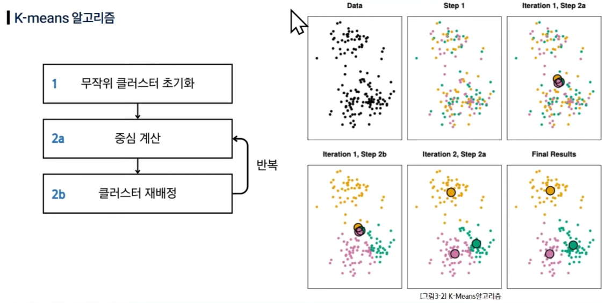

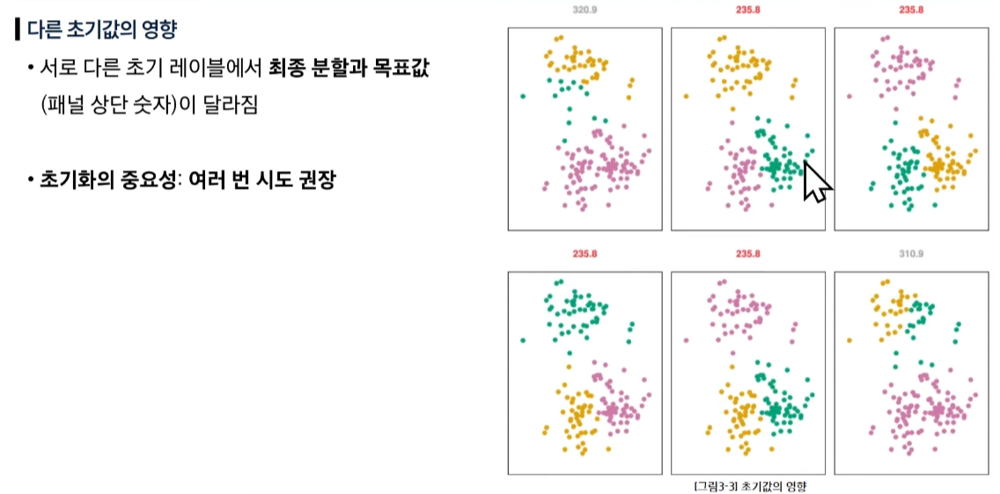

## 4. 계층적 군집**(Hierarchical)**

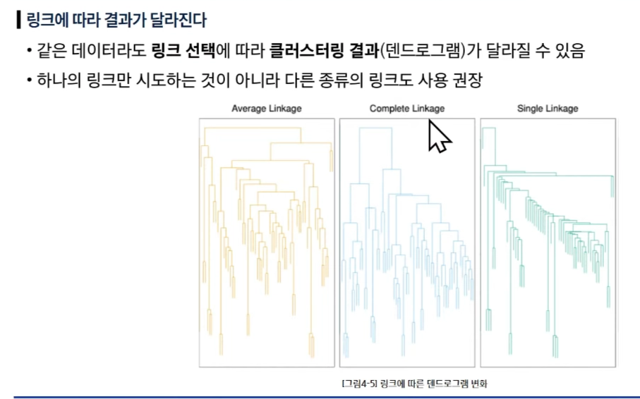

## 5. 클러스터링시 주의점

