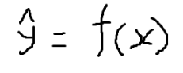

# 0317(선형 회귀 / 로지스틱 회귀).md

# **0-2 수업 내용**

- 0-2 수업 주제는 "AI를 위한 Math" 보다는 **머신러닝 기초** 라고 생각하면 더 맞습니다.
- 업스테이지 실습/과제 교안에서는 아래와 같은 네 가지 내용을 다룹니다.
    - 데이터 정규화
    - **선형 회귀 (Linear Regression)**
    - **로지스틱 회귀 (Logistic Regression)**
    - 아담 옵티마이저
- 이 챕터에서 다음 내용을 자세히 다룹니다.
    - 머신러닝 개념
    - 머신러닝 모델 1 : **선형 회귀**
    - 머신러닝 모델 2 : **로지스틱 회귀**
- EASY 버전이므로 수식을 최대한 줄이거나, 과감히 생략했습니다.

# **1. 머신러닝 개념**

### **정의 (암기하세요)**

1. 데이터를 기반으로 최적의 모델을 계산하여 완성합니다.
2. 이를 활용해 새로운 데이터를 예측하거나 분류할 수 있게 하는 방법입니다.

### **모델이란?**

- 모델은 수식입니다.
- 모델은 입력 데이터와 출력 데이터 관계를 수식으로 표현한 함수입니다.
    - x : 입력값
    - f : 모델
    - y hat(햇, 모자) : 모델 예측 결괏값



[image.png](data:image/png;base64,iVBORw0KGgoAAAANSUhEUgAAAPkAAABoCAYAAAAzdVZ2AAAAAXNSR0IArs4c6QAAAARnQU1BAACxjwv8YQUAAAAJcEhZcwAADsMAAA7DAcdvqGQAAAbbSURBVHhe7d09ku00EIZhh4Q3ZEmELIGQJRCyA0JCQpZAyBJYAiEhISFUw7hoPiRbtlu/fp8qBXPnlseWuvVn+5xtAwAAAAAAAAAAAAAAAAAAAAAAAIABfbFt28/btn2lvwCwht+2bftz27Y/9BcA5mejuCX4XgAsxBL8d5IcWNc+Td/L9/ofAMxLp+kkOIpY4Pz6UdipHZuO4sChPbl90LBTO66vGcVxlY4Ke2E0H5Nvrx/1l0CKJjej+bg+lzb6TP8DkOKD5hv5GWP5zrXNL/pLIOVTIqn1Z4zDT9W/1F8CyoIk9TCF/5l1+Vi0rYBDuuH208e/21p8/zfW5WMhyVHs24MRm3X5mPQBGCBL77OmbsMQTOPRmReQ5YPFpuip2zAE03h8m/AADA75YEkluPHrcpu+oz86XhTRhyly/P1YNt/6K2034O9p3h4oRw9T2Ajvg4pbaX3xEEyaf++CF6sSG25nD1NwK20cPASTpi9WvT7ZdcPtjN5Ke23FDcC3A/6lMboXG5RsUHsVvcea23BTOpqT6H2Q5MdyyW7Pg7zCk88C08oj0fu403ZvpPH6ikRPJfjVe6xacazP2yPJy9ks1Zajvs6WXqfrU1JXE3znE/3uMXCfBqz/OVeWDuwTqURfdnDyF0lyzskSVRO4tCwb2AUs0X+Q+liy0/MbZxhX6nP2Ikpkx24JMuPXMenm8XK77vs0O7Kx8dzTpG7ZnvbBIjM/Aal7SlaW34xDf08SvCUb9XTjNvXW4uhSic47GagqFXRWciN0jyTXzxywkntrcQa6GTfbjKQJviK3n9ZJrgm+yk69Jbpfo69yXWH4itx+Wia5vuMw8+id4vcXiGfRMtDwX63q3l5p9SPdagluUrfWWJ9/aBVo+L8WdW/TVr8haK+0rpbgnt4xYNreKNCQVrvudQ1uJfqV1lp7OnvndHV9retzpu0NAg15Nete1+BWSl5FvqrGno52TlePrXc5Xn//vGag4VjNutfPGag1RffXcGXETck9TJS7BXlEN+KmWZ/XmBrVDDQcq1X3dz9n4I6oqXHqzconndO098/91CjqWd1agYZzvu4jO259S7EmnRrfjUs9Z3sC726C73R9PsVo7k/YSsRao1UwPOF3iK9uxIwsahRUvk3vTHWv0ri8kkypKXrkOetu+/C017TyNNH9sVpJNeyVMkVjFdD2jFLjmEf0OkpvXaWm6NHnrKP503xpQtcaT0+8VuUeeZLgViJ7+t78dUWpccwzmkwlHbFO0Wu17ZSbcJGJ3iMgtOcvKRFrtBFF17/eOmtJ2/VsaeX/b43k3mm+lHRAQ9ATt3In0XsFBP4RXf9+dOzx+qiOmrmpe+vOyPKl5d8Lk0r0vZz1orspL3wh0fXvj9dj5mN/U58h9yNnaj+mVWcUXdfNHCX6Udk7gWkvfBHR9R99vLt06m5yG22tOiM9n6mkes+Sorc+0F50/Ucf7wk9l1YbbTl6PlPTXjRX/BclLnHhE4qu/+jjPaHnorHXmp7Pa7z2wgcRWf+tN7PO6Lnoz631/vvdvPbCBxFZ/7131pW/Nn2evofef7+b1174ICLr3x+r1WbWEX8+uh7vofff7+a1Fz6IyPqPPFYEfz6+9FiPm9Hqp5nXXvggIus/8lhP6fR8hHMb4Ry6eO2FDyKy/v2xSh6EqiV3P/yslD7AdZf/W6+QevII7UXW/9UXRGrR9bdNz/WZjLNSI+H98V9BG2KE3dg3igw8fT6ildSAsZd9/a3nVlIiOypdPryCv+BV3/CaQXTg+eNFj4QpZ1PzUqlOIGqDLnWOr9Djgo96/CulxlSuF39dEWpP2a+0YVSSPqWz1lHOq6peU5fS4CgpNQK4B39NEXREjFCa2KMmzwznGCbXWK1oAD4pqzSWv6Yo0cfUkTBVRm2PXgNac7nkHrlx3qJGAPpjPl3WaJLMEje5mF+SNbJuOszSUG9QIwB1Xf4k0TVRZpDaaFs23vWtpKUvdlI1EkiXRU/2L/yxZomb1PJilnO/RL+udtkLnZh2wpE00af4hNIA+mlHy8a8rkdW/7raWdV+NXS6Lxa4SOM8VaZlF5f7TrRPielK9NfV4jkdcWp0wvoJpal4mZnGuZapR3H/nWieJbNuONT4ulo8o9N0K7XoJtxKtA73ssQTnBocuWkLCT4mHYFqjji6Nl+F3tpbjiZzqqw2NVuFjuItRhw/ms/+SHBuQFuO7pprqTky4Jnam20p+q0mVmZN9lSCLxnvOgVb+mIXolPMFqO4yX0u/4xrdI19Yh5D0bV4ayQIUJlfZpFgwIL2kZQEBwAAAAAAAAAAAAAAAAAAAAAAAAAAAACgs78AzLSxeEoEJHQAAAAASUVORK5CYII=)

- Seaborn 에서 기본적으로 제공하는 "tips"라는 데이터셋인데, 미국 레스토랑에서 사람들에게 받은 가격별 팁 데이터입니다.
- 선형 회귀는 "추세선"을 찾아내는 머신러닝 모델입니다.
- 아래 차트와 같이 추세선의 수식이 "선형회귀모델"이 됩니다.

```python
import seaborn as sns
import matplotlib.pyplot as plt

# 예시 데이터 : 팁스
# https://raw.githubusercontent.com/mwaskom/seaborn-data/master/tips.csv
tips = sns.load_dataset("tips")

# 모델 예시 (선형 회귀 모델)
# reg plot은 추세선을 그려주는 기능을 가지고 있습니다.
sns.regplot(x="total_bill", y="tip", data=tips, ci=None, line_kws={"color": "red"})
print()
```


### **학습과 추론?**

- 추세선을 만들어내면 (모델을 만들어내면), 예측을 할 수 있습니다.
- 모델을 만드는 과정을 "학습" 이라고 합니다.
- 만든 모델을 가지고 예측하는 것을 "추론" 이라고 합니다.
- 모델이 만들어 졌으니, 위 차트를 보고 답변을 해보세요.
- 50달러치 식사를 하면, 어느정도 TIP을 받을 수 있을까? --> 정답 약 $6

### **머신러닝 정의 다시 살펴보기**

- 머신러닝의 정의는 다음과 같습니다.
    - 데이터를 기반으로 최적의 모델을 계산하여 완성합니다.
    - 이를 활용해 새로운 데이터를 예측하거나 분류할 수 있게 하는 방법입니다.
- 머신러닝이 무엇인지 이해가지요?
    - 참고로 LLM에서 사용되는 신경망도 머신러닝의 일종입니다.

# **2. 선형 회귀 모델 이해하기**

- 선형 회귀 모델은 피쳐(feature)의 추세선 or 추세면입니다.
    - 피쳐라고 하면 대상에서 값으로 표현하면서 모델에 입력되는 변수를 뜻합니다.
    - 사람이 대상이면 "키, 몸무게, 나이" 이런 값들이 피쳐(feature)라고 할 수 있습니다.
- 선형회귀모델을 만드는 방법을 생각해봅시다.
    - 선형회귀모델은 피쳐가 1개면 무조건 선입니다. 2개면 면 입니다.
    - 피쳐 2개는 머리가 아프니, 1개일 때만 생각해봅시다.
    - 선이면 "직선의 방정식으로 이뤄짐"에 틀림이 없습니다.
    
    
    
    [image.png](data:image/png;base64,iVBORw0KGgoAAAANSUhEUgAAAKcAAABWCAYAAACq2IZQAAAAAXNSR0IArs4c6QAAAARnQU1BAACxjwv8YQUAAAAJcEhZcwAADsMAAA7DAcdvqGQAABGWSURBVHhe7d17UFT1/8fx57JcFpFriEJcbCXBLJU0TM20UBgjmykrp6apzDK60GQ1NdXUaPWfzdgfXw1LHa3ULDPRvBWgIVJEmiFILneW6yKXXXZhYW+/f2Qnzi7IZcH11+cxc/4573MOuOfFZz/nfD7nKLPZbDYEwQ15SFcIgrsQ4RTclgin4LZEOAW3JcIpuC0RTsFtiXAKbkuEU3BbIpyC2xLhFNyWCKfgtkQ4Bbc1ZuE0mUxcvnwZk8kkLQnCkIxJOI1GI5cvX+aDDz6gvb0dMfFJGAmXh9NsNlNdXc0HH3zAmTNnKC0tpaenR7qZIFyTy8Op0Wj48ccfiY2NJSMjg02bNlFbWyvdTBCuyeXhbG5upqSkhHXr1pGcnExsbCwnT56krq5OuqkgDMql4TQajVy5coXAwECmTp2Kr68v69evp6CggJycHBobG6W7CMKAXBrOpqYmSkpKuP/++/Hy8gIgOjqadevWcfbsWbKzs9Hr9dLdBMEpl4VTr9dTWFhIfX09d911l329TCYjMTGRlStXUlJSwoULF7Barf32FQRnXBbO5uZmVCoVc+fOJTIysl9NoVBwzz33EB8fT3Z2NhUVFf3qguCMy8JZVVWF1WrlzjvvxMPD8bBBQUEsXbqUm266iczMTPv2gjAQxxSNUFtbG6GhocTGxkpLdjExMSxfvhy9Xs/WrVtRq9WYzWbpZsINwGw2YzQapatdSuaq59a1Wi0Wi4WQkBBpyYFarWbHjh2Ul5ezceNGYmJi8PT0lG4muLHa2loaGxuZP3++tOQyLms5AwICCA4Olq52KjIykvT0dBITE/noo49ob2+XbiK4udLSUg4fPixd7VIuC6dMJkMmk0lXOyWTyQgODubZZ59l06ZNQw614D6sVisWi0W62qVcFs7h8vDwICAggLCwMPGVLjh13cIpCNciwim4LRFOwW2JcApuy23CaTabMZvNYta8YOc24WxsbKSiooLu7m5pSXARm812Q/3xu004L126xNmzZ9FqtdKS4CKtra1UVFRgMBikJbc06nCWlZVRXFyMTqeTloal72tdTAZxZDQaqa6uHvXjLjU1NZw4cYIrV65IS8Oi1+vR6XT4+flJSy416nCazWaOHz+OWq2WloZFr9fj6emJt7e3tHRddXd3o1Kp2LlzJ2lpabz66qukp6fz1ltv8eeff0o3d2C1Wmlvb6e8vByVSkVRUREnT57kxIkT5ObmUlxcTGtr64CjLRaLhSNHjrBjx45RNwA9PT10dXWN+nFtg8GATqcjPj5eWnKpUYczPDyclpYWampqpKVhUavVBAQEMHHiRGnpujAajRQVFfHVV1+xe/duGhoayM3N5c4772TZsmUsX76cKVOmSHdzYDKZKCoq4ocffuDHH3/k+PHjlJWVUVlZyblz5zhw4ABbtmwhJyfH4eu2paWFAwcOkJeXx7x58xzmyV4vfX9Ivr6+cLUvW1lZyddff01GRgYZGRlkZmZSX18v2XN4Rh3OoKAgpkyZQktLC11dXdLykLW1taFQKFAoFNLSuOrt7aWkpITDhw9z9OhRdDodCxcuJCUlBYPBQEdHB0uWLCElJWVIYfHw8OCWW27h3nvvZcmSJSxbtoyVK1eycuVKVqxYwbJlywgJCeHUqVOcOXPGftGi1WrZv38/+fn5JCcns3jxYoKCgqSHv+5MJhP//PMPu3btory8HIPBQGdnJ6dOneKnn36ioaFBusuQyTds2LBBunK4Ojo6qK+vJyoqakQfoNVq5dixYyiVSqZPny4tw9VtNBoNGo2G5uZmqqurqa6uRq1W91saGxvx9PQcUQvc29tLQUEBhw4dorGxkQULFvDggw8ye/ZsAA4ePEhtbS2pqakEBgZKd3dKLpcTGBhIVFQUkZGRREREEBQURGBgIKGhoURHRzNz5kyMRiPHjh0jISEBHx8fTp48SVZWFmvXrmX+/PkEBARIDz1sarWa2tpaZsyYMaSpjQPp7OykrKwMf39/pkyZwpYtW7BarTz//PMkJyeTmJiIt7c32dnZdHR0MH369BE1OqNuOQGUSiV6vX7Es9v1ej16vZ4JEyb0W2+1WtHpdFRWVlJaWsr+/fv54osv+Pzzz/nf//7Hli1bHJZt27ZRWlra7zjXYrPZ6Onp4cKFC2zdupX4+HjS09NJSUmxn0QPDw98fX3H5F6sn58fCQkJKJVKjh07Rl1dHbt37+bZZ59l5syZDp+Lu7BarXR2dlJQUMArr7xCVFQUnp6e+Pj4kJSUxFNPPcWpU6c4d+6cdNchcUk4b7nlFoKCgsjLyxtRp12tVttbkn/r7e0lLy+Pt99+m/T0dAwGA8nJyTz99NNs3LiRPXv2OCw7duxg6dKl/Y5zLSaTCZVKxccff8zq1at56KGHCA8P77eNj48Pd99995jNoIqKimLhwoXs3buX/fv3M2/ePObOnTuib4DRsFqtQ25g+i4WlUolISEhyOVye00ul3PHHXfw2GOPkZOT02+/oXJJOL29vUlJScHT05OjR49Ky9dkMpnw8vJyOPEKhYIHHniA77//nuzsbN59913uv/9+5s6dS0xMTL9tR+PKlSts2LCBtLQ0UlJSnH6F+vv7s27dOoff0VXkcjmTJ08mLCyMPXv28NJLLzn9PcaSxWKhpaWFjo4OacmpmpoaMjIyeOmll/Dx8ZGWCQ4OZvbs2VRVVUlLQ+KScAJMnTqV+Ph4CgsLh916Njc34+vrO+BtpOFMZB6unp4e6urqkMvlLF68eMC+kUwmw8fHh+LiYqqqqsbk/U8xMTG89957RERE4Ofn5/RBweGy2WxUVFRw/vx5Ll++jFqtpqSkhD///NO+7Nu3j4yMDNasWcOHH344pKdju7q6aGpqIiwsjNmzZ/drNf9tNOdt9P/6qzw9PZkxYwZBQUHk5+dLy4M6ffo0CQkJhIWFSUtjrqamhu3bt5OWloafn9+AH6bRaOTkyZMkJiaSnZ1Na2urdJNR8/LyYsKECRQXF1NfXz+ih//a2trIzc3ls88+4+WXX+app55i06ZN7N27lxMnTlBeXs6RI0c4cOCAfamrq8Pf359Vq1bx5ptvctttt0kP66C5uZlff/2V1NRU+ws0XM1l4eRqv2n+/PkcO3aMzs5Oadkpi8VCZWUlN99885iPOEjZbDZ0Oh06nY758+cP2lKZTCbUajUPPfQQpaWlIw7PtSgUCmbMmEFNTc2Iji+TydBqtYSGhvLYY4+RlpZGWloaL7zwAo8++ii33XYbTz75JGvXrrUvTzzxBCkpKSxbtgylUjmk89DT04NcLichIUFacpmBz8YI+Pn5ER8fT2BgICdOnLhmx7ovHH33NwcLx1jQarXU1tYSFxc3aKtpNpu5cuUKFRUVLFiwgKVLl9pvpruaXC4nNDSUw4cPo9FoBhw5GsjEiRNZvHgxqamp3HfffSxevJg5c+YQFxfHzTffzOTJk4mOjubWW2+1L5GRkYSGhuLn5zfkPnXfuR7s285gMFBXVzdgV+laXJ6GKVOmsHLlSn7++Wdqa2sH/eu32Ww0NzcTGBjotEM91mpqaigoKGD58uXSUj9arZbc3FwiIiKIjo7mkUceoauri7///ttl736y2Wy0t7fzxx9/YDQa0Wg0HDx4kIaGhkE/QykvLy+CgoLG5KHBuro6CgsLUalUmEwmIiIiBg1zS0sLp06d6vd6ouFweTh9fX2JjY1l5syZ7Nu3j87OzgHvC1qtVpqamrjpppsGvBjqY7VaaWtrQ61W22/A/3tRqVRcuHCB8+fPc/78eVQq1TW7Fmq1GoPBQGJiorRkZzabqa+v5/Tp0zz88MMoFArCw8NJTk6mvLx8xFei/9b3b/v999/JzMzk4Ycf5rXXXqOoqIhDhw5RU1NDb2+vdLdxp9FoyMzM5Pvvv6esrAyDwTDgJBKj0YhKpUKlUpGUlCQtD4lLRoikfHx8mDZtGtu2bUOpVBIWFua002yxWPj999/x9vbmjjvucOjrWK1WDAYDGo2GlpYWcnJyyMrKorCwkHPnzvVbzpw5Q1ZWFrm5ueTl5VFTU0NcXNygIyGlpaW0traSnJwsLdm1traSk5ODp6cnzzzzjL3rMXnyZH777Tf0ej233377gFer19I38pWTk0N2djYrVqzgiSeeICoqitjYWH744QeqqqoICwujp6cHnU5HV1cXCoVi2D9ztCNE/v7+KJVKFAoFpaWlqFQqvL29CQsLQ6vV9luqqqrIzMykt7eXtWvXSg81JC5744eUyWSisLCQLVu28P777xMXF+fwYfb09PDpp58ya9YslixZ4nBfz2g0kp2dzZdffolOpyMpKYl58+Y5bMfVFjsuLs4+GWEoMjMzKSws5JNPPpGW4GqrmZ+fz969e1m/fj1xcXH96rt27aKsrIy1a9eiVCr71YbCZrPR1tbGzp07KSsrY82aNdx99939+r5qtZrdu3dz/vx5ex8+NDSUjRs3Eh4ePqx+en5+Pnl5eTzyyCODvjboWhoaGjh06BANDQ0UFxej1+sdGh+z2czChQt54403hjzUKzVm4eRqq7B9+3YaGhp4+umnHU5gd3c3zz//PO+//z7Tp0932n+xWCxYLBZsNhseHh54eHgMeOEynBMFcOjQIbKysti8ebPTDzcvL4/MzExmzZrVr9Xs09raytdff41cLic9Pb1fbShaW1vZvHkzJpOJ5557jltvvdXhZ9hsNod5rjKZDC8vrwE/h4G4KpwdHR388ccf+Pv7M3fu3AG7bR4eHnh6eg779+wzvLM5TB4eHqxevdrekZbOcu+7CAgMDHRoVfvI5XK8vb3x8fHBy8sLuVxuD6l0Ga5p06YxYcIETp8+3W99a2srGRkZfPvttyQlJfHoo486PX5wcDBz5syhsrLS6RCdRqOhvr6+36MnfXcotm/fzosvvsikSZN45ZVXUCqVTn9GXxB9fHzsi7e394hPuCv4+/tz7733kpCQYD83zpaR/AH925i2nFw9GX///TfffPMN8fHxpKamEh4eTnt7O1u3biUrK4s9e/YQEREh3XXMdXZ2kp+fz86dO4mMjLS3nhqNhpCQEFatWsXMmTOddiP66HQ6srOz+e6773j88cfx8vKira2Nv/76C41GQ3JyMqtWrbKPkVssFv766y+OHz9OUlISsbGxhISEOP3WcLXKykouXrzIokWLHOYxuKMxDydX+5aXLl3i6NGjBAQEkJqaCsD69evRarXs27fvuoSzr8938eJFDAaDveWyWCzExsYSHR09pBlBjY2N/Prrr2i1WvsxJk2axMSJE5k2bVq/4FutVrRaLZ2dnYSFhY34HuBIdHV1YbFY7K2vuxuXcHL1hF+8eJFffvkFk8mETCaz/88bX331lcMsoBuJ1WrFaDTa35bn5eVFcHCwQz9WGJ5xCydXA1pbW0teXh5arZbw8HAOHjzI5s2bBx1pEP6bxjWc/9bV1cWZM2fIz8/n9ddfH5MRDeHG5nh5OE56e3u5dOkScXFxN0T/Rxh/1zWc5eXlxMXFib6Z4NR1C2ffFDSlUinCKTh1XcJpNpvtt24UCsWobtQK/39dl3B2dHRw9uxZ7rvvvnG5+SzcmK5LOFtaWuwvCxho2FIQxj2c3d3d1NfX2+d9OhtPFgSuRzj1ej319fXMmjVLXAgJgxrXcPbN+G5oaLihhyuF8TGu4ezu7iY/P5/GxkYWLVokLQtCP+Mazra2Nrq7u1mxYsWIXvgl/LeMWzhtNhvnzp2jurp6VLOwhf+OcQtnSUkJRUVFLFq0iKioKGlZEByMSzibmpo4cOAAISEhLFiwYFwn2Ao3rjELp8lkoqCggKamJo4cOYLJZGLJkiVMmjRJuqkgODVm8zkNBgPvvPMOMTExNDQ0sHr1ambPnj2sR3eF/7YxazllMhmTJk2isrKSNWvWMGfOHBFMYVjGrOUUhNEas5ZTEEZLhFNwWyKcgtsS4RTclgin4LZEOAW3JcIpuC0RTsFtiXAKbkuEU3Bb/wc+mZr9ALWgdwAAAABJRU5ErkJggg==)
    
- 목표는 "점들과 떨어져 있는 거리의 합이 최소"인 선을 찾아내는 것이고, a, b 값을 찾아내면 되는 것이죠.
- 실제 y 값과 예측된 y값과의 차이를 오차(Error) 라고 합니다. 아래 그림에서 세로 직선이 오차입니다.
- 각 점별로 오차의 합이 최소가 되는 직선을 찾으면, 최고의 추세선임에 틀림이 없습니다.


- a, b 값을 2중 for문 돌리면서 "오차의 합'이 최소가 되는 a, b 를 쉽게 찾아낼 수 있을 것 같습니다.
- 이 방법은 Grid Search라고 하는데, 실무에서 잘 쓰이지 않습니다.

```python
import numpy as np
import pandas as pd
import seaborn as sns

# 샘플 데이터 (Seaborn tips dataset)
tips = sns.load_dataset("tips")
X = tips["total_bill"].values
y = tips["tip"].values

# 검색 범위 설정
a_values = np.linspace(0, 2, 100) # 기울기(a) 후보 (0 ~ 0.5 사이 100개)
b_values = np.linspace(0, 5, 100) # 절편 후보(b) (0 ~ 5 사이 100개)

best_a, best_b = None, None
min_error = float("inf")

# 2중 for문으로 Grid Search
for a in a_values:
    for b in b_values:
        #예측하기
        y_hat = a * X + b # 직선 방정식으로 y 예측 값들 한꺼번에 계산

        error = np.sum(np.abs(y - y_hat)) # Error 계산 = 오차의 합

        if error < min_error:
            min_error = error
            best_a, best_b = a, b

print("최적 기울기 a:", best_a)
print("최적 절편 b:", best_b)
print("최소 '오차의 합':", min_error)
```

`최적 기울기 a: 0.12121212121212122
최적 절편 b: 0.5555555555555556
최소 '오차의 합': 179.96868686868686`

- 추세선을 잘 찾았는지 그려봅시다.

```python
sns.scatterplot(x=X, y=y, s=30, color="blue", alpha=0.6)  # s: 점의 크기

# 우리가 찾은 회귀선 (빨간색)
x_line = np.linspace(0, 50, 100)
y_line = best_a * x_line + best_b

plt.plot(x_line, y_line, color="red")

plt.title("Linear Regression (with Grid Search)")
plt.xlabel("Total Bill")
plt.ylabel("Tip")
print()
```


# **3. MAE (Mean Absolute Error)**

- 방금은 오차의 합이 최소가 되는 것을 구했습니다.
- '오차의 합'을 기준으로 하면 좋은 a, b 값을 구할 순 있습니다.
- 하지만 오차의 합 값 자체는 의미가 없습니다. 데이터에 양이 많아지면 값이 커지거든요.
    - (위 데이터에서 구한 "최소오차의합"인 179.9 라는 수는 별 의미가 없는 수 입니다.)
- '오차의 평균' 은 데이터가 많던 적던, **예측 모델과 실제 값들의 차이**를 수치로 잘 설명할 수 있겠습니다.
- 평균은 np.mean( ) 함수를 사용하면 쉽게 구할 수 있습니다.

```python
import numpy as np
import pandas as pd
import seaborn as sns

# 샘플 데이터 (Seaborn tips dataset)
tips = sns.load_dataset("tips")
X = tips["total_bill"].values
y = tips["tip"].values

# 검색 범위 설정
a_values = np.linspace(0, 2, 100) # 기울기(a) 후보 (0 ~ 0.5 사이 100개)
b_values = np.linspace(0, 5, 100) # 절편 후보(b) (0 ~ 5 사이 100개)

best_a, best_b = None, None
min_error = float("inf")

# 2중 for문으로 Grid Search
for a in a_values:
    for b in b_values:
        #예측하기
        y_hat = a * X + b # 직선 방정식으로 y 예측 값들 한꺼번에 계산

        # error = np.sum(np.abs(y - y_hat)) # Error = 오차의 합
        error = np.mean(np.abs(y - y_hat)) # Error = 오차의 평균 <--- 이 부분이 달라졌어요!

        if error < min_error:
            min_error = error
            best_a, best_b = a, b

print("최적 기울기 a:", best_a)
print("최적 절편 b:", best_b)
print("최소 '오차의 평균':", min_error)
```

`최적 기울기 a: 0.12121212121212122
최적 절편 b: 0.5555555555555556
최소 '오차의 평균': 0.7375765855274051`

- 결과는 크게 달라지지 않지만, 여기서 구한 0.73 이라는 수치는 의미가 있습니다.
- 만든 모델이 실제 값과 얼만큼 차이가 있는지를 표현할 수 있습니다.

# **4. MSE (Mean Sequre Error)**

- MAE는 오차 값에 적절히 값이 반영되는데요..
- 오차가 크게 발생하면, 아주 큰 에러가 발생했다!! 라고 강조하고 싶어졌습니다.
- 그래서 오차에 제곱을 하여, 오차 값에 크게 반응하도록 만들어봅시다.

```python
import numpy as np
import pandas as pd
import seaborn as sns

# 샘플 데이터 (Seaborn tips dataset)
tips = sns.load_dataset("tips")
X = tips["total_bill"].values
y = tips["tip"].values

# 검색 범위 설정
a_values = np.linspace(0, 2, 100) # 기울기(a) 후보 (0 ~ 0.5 사이 100개)
b_values = np.linspace(0, 5, 100) # 절편 후보(b) (0 ~ 5 사이 100개)

best_a, best_b = None, None
min_error = float("inf")

# 2중 for문으로 Grid Search
for a in a_values:
    for b in b_values:
        #예측하기
        y_hat = a * X + b # 직선 방정식으로 y 예측 값들 한꺼번에 계산

        # error = np.sum(np.abs(y - y_hat)) # Error = 오차의 합
        # error = np.mean(np.abs(y - y_hat)) # Error = 오차의 평균 (MAE)
        error = np.mean((y - y_hat) ** 2) # Error = 오차 제곱의 평균 (MSE) <--- 이 부분이 달라졌어요!

        if error < min_error:
            min_error = error
            best_a, best_b = a, b

print("최적 기울기 a:", best_a)
print("최적 절편 b:", best_b)
print("최소 '오차 제곱의 평균':", min_error)
```

```
최적 기울기 a: 0.10101010101010102
최적 절편 b: 1.0101010101010102
최소 '오차 제곱의 평균': 1.0373996209821346
```

```python
sns.scatterplot(x=X, y=y, s=30, color="blue", alpha=0.6)

# 우리가 찾은 회귀선 (빨간색)
x_line = np.linspace(0, 50, 100)
y_line = best_a * x_line + best_b

plt.plot(x_line, y_line, color="red")

plt.title("Linear Regression (with Grid Search)")
plt.xlabel("Total Bill")
plt.ylabel("Tip")
print()
```


- 잘 됩니다~.
- 머신러닝 학자들은 MSE를 가장 흔하게 사용합니다. MSE 를 꼭 기억해주세요.

# **5. 정규방정식**

- 지금까지 2중 for문 돌려서 좋은 a, b 값을 찾아냈습니다. 더 좋은 방법이 있습니다.
- MSE 값이 최소가 되는 a, b 를 미분 방정식으로 **한방에 구할 수 있습니다!** (2중 for 안돌리고요)
- 아래 방정식을 **정규방정식** 이라고 합니다.


```python
import numpy as np
import seaborn as sns

# 데이터 불러오기
tips = sns.load_dataset("tips")
X = tips["total_bill"].values.reshape(-1,1) # 세로로 긴 행렬 (n,1) 형태로 변경
Y = tips["tip"].values.reshape(-1,1) # 세로로 긴 행렬인 (n,1) 형태로 변경

# X 행렬에 앞에 [1] 추가
X_b = np.c_[np.ones((X.shape[0], 1)), X]   # [[1, x1], [1, x2], [1, x3]....]

# 정규방정식 계산: [b, a] = (X^T·X)^(-1)·X^T·Y
b, a = np.linalg.inv(X_b.T @ X_b) @ (X_b.T) @ (Y)

print("절편 b:", b)
print("기울기 a:", a)
```

`절편 b: [0.92026961]
기울기 a: [0.10502452]`

- Grid Search보다 MSE값이 작게 나오는 최고의 a, b 값을 한방에 계산했습니다.

```python
y_hat = a * X + b

# MSE 계산
mse = np.mean((Y - y_hat) ** 2)
print("MSE:", mse)
```

`MSE: 1.036019442011377`

- 정규방정식으로 구한 a, b 값으로 선형회귀 모델을 그려보았습니다.


# **6. 정규방정식의 단점**

- 아까 이거 기억나실까요? 역행렬이라고 했던 것.. 역행렬이 뭔지 설명은 안드렸지만, 아래 기호는 기억이 나실겁니다.

[image.png](data:image/png;base64,iVBORw0KGgoAAAANSUhEUgAAAEYAAABWCAYAAABy+OAfAAAAAXNSR0IArs4c6QAAAARnQU1BAACxjwv8YQUAAAAJcEhZcwAADsMAAA7DAcdvqGQAABASSURBVHhe7ZzbcxNl2MB/m815Y5qY0iTt0tJQewAREIRCVcogiMLY8XCFjo7jhRfqjXeON17qjH+AXngaL3TGw6AyiKIgUM5QCrTBUtvSprXNoWnaps05+13Y3Y9WilB6+j74zeQqu+3ml32ffd7ned+g3IXkcjllaGhI+e2335Ta2lrF6XQqb7/9tjI+Pq4do+MuRxAEABRF0V4Ad60YQRAQRRFRFBEEgUwmQzKZvCdGp9NhsViw2WwYDAZisRh9fX1ks9l/3p96wt2AIAgYDAaKiopYtmwZkiTR29tLc3Mz6XQa7lYxAAaDAZfLxdKlS5EkiXA4TEdHB5lMBu5WMYIgoNPpkCQJu92O0WgkkUgwMjJCPp+Hu1UM1wVfvV6PIAj3nkq3yj0x0/D/Qow6BPL5/KQhcf3QuF3+T4vJ5/Mkk0lGR0cZGhoiGo0yODjI4OAg0WiU4eFhxsbGyGQyty1IUG73jHlE/caz2eykb19RFJLJJNFolI6ODjo6OohEIloOwkRwtVqtyLLMpk2bWLp0KUaj8bq//g8fffQRn3zyCYODgzQ0NPDuu+9SWFi4+MRcfzmZTIaRkRH6+/sZGxsjl8sBkMvlCIfDtLe309zczJUrVwgGg1oOwoQYm83Ggw8+yJtvvkldXR333Xef9r7KohWjxobr40Mmk2FsbIxIJEJbWxtNTU2EQiFtSGSzWfr7+/nrr78YHR3FZDJht9sxGAyaWJ1Oh8FgYOnSpbz22mvU19djt9un/vvFKUaVkEgkGB4eJpvNks/n6e/v5/z58xw5coSWlhZisZj2noogCBiNRnw+H/X19ezYsQO3241O979hUz3G5XJhs9kQRVF7T2VRislmswQCAQ4dOsTXX3/N6Ogo2WyWTCbD+Pg4Y2NjpNNpHA4HDocDi8WCTqfThsm6devYvHkz1dXVOJ1OzGazVkZQUbPc64Vdz6IUk0qluHTpEl988QVfffUVqVQKRVEwm80UFhZSXl5OWVkZNTU1VFRU4HK5tDKBKIo4nU7uv/9+JEm66Ye/GYtSTCaTobe3lzNnztDc3KwFV7PZjNPppKSkhOLiYoqLi1myZIkmYDZZlGLy+TzZbJZEIsHY2NikwKnX6zGZTBiNRvR6vTaEpg6VO2U6MbOr/zbR6XQYjUYKCgooLi6mpKSEkpISvF4vS5YswW63YzabJ4mZLxZUzGLmnphpmHMxahxR85AFDGm3xZyLicfjdHR00N7eTiwWm5SkLWbmXMzVq1fZv38/e/fu5cKFC6RSqUUpZ2pgn1MxiqJw4cIF9u3bxzfffMP+/fu5du0a8Xhca1MsNHq9HqPRiNFoxGAwaILmTEw+nyeVShEKhRgYGKCzs5Njx47x/fffc/ny5UmF54XE5XJRXFyMLMsUFRVhMBgAEN977733ph58pyiKQi6XY3BwkN9//53Lly8TCoUIhUI0NzcTCATw+Xx4PB6tGL1QWK1WCgsLWb16NbW1tbjd7n/ypqkHzgbqrDkYDBIMBkmlUrjdbmpqalAUhebmZvx+P5FIRJsGLBRFRUXU1dVRX1+Pz+dDr9fDXA6lbDZLJBLRKmvLly9nx44deDwe7UkVDAYXXIzZbMblclFYWIjVatXmYnMmJp/PE4/HGRsbI5/PU1paSl1dHbIsIwgC3d3dBIPBBQ/C6kxdFMVJ0445EaNMVOJyuRzZbBZBECgoKKC8vBxZltHr9fT39zMwMEAikZh6+qJgTsSoXJ/liqLIfffdR1lZGWazmVgsRjAYZHR0dNI5i4U5E5PP50kkEuTzefR6PQaDAavVSkVFBZIkMTIyQjAYJBaLLcppwpyIURSFdDqN3+8nHo/j9XqRZRmz2YzP58Nut5NIJOjv7ycSiSyKfGYqsy5Gmaj6JxIJLly4QDwep6qqipqaGoxGIx6Ph8rKSsxmMz09Pfz555+Mjo4uOjlzIiYej9PZ2UlnZyc6nY7q6moqKirQ6/U4HA62bduGLMsMDAzQ3NzMX3/99a8uwEIz62JyuRyRSIQTJ04wNDREUVERPp+PoqIiRFHEYrFQV1fHgw8+iCAItLS0cOTIEYaGhmbUSp0rZl1MOp2mr6+PY8eOkU6nqaio0OKL2gRzu91s3LgRn89HX18f+/bt49y5c0Sj0UUjZ9bFxONxurq6aGtrw2AwsHz5cjwejzY5U5tgGzduZP369VitVlpbW/nwww85efIk0WiUXC634HJmVYyiKIRCIdra2kilUng8HsrKynA4HFo/iImcpry8nCeeeIKtW7diNpu5fPkyX375JSdOnGBwcHDBq32zJkadOA4MDNDR0UEul6OsrAxZlrHZbJOOFSZWIqxZs4bnn3+eZ555BoPBwNmzZ/nyyy85fPjwgid+sypmeHiYQCBAX18foiiyYsUKvF4vZrN50rFq29TpdLJ27VqeffZZGhoakCSJixcvcujQIS5fvkwymZx03nwya2JyuZxWkIpEIlitVh5++GGWLFmiTeWnorZZ165dy0svvcS6desAuHDhAkePHiUUCi1YvJk1Mdlslu7ubjo6OkgkEng8HlauXElBQcG0bVV1Zmu321m7di1btmxBlmWCwSCnTp2ipaVF62fPNze+4hmQzWa5cuUKbW1tSJLEhg0bKCkpwWKx3LRCJwgCer0eSZLYsmULa9asQRRF/H4/R44c0ZaHzLecOxajBt1gMIjf7+fvv/9GlmV27979n1KmUlJSwq5du9iwYQPDw8McP34cv98/qa89X8yKmGQyybFjx7h69SoWi4XKykqqqqpuuObtZlgsFh566CE2btyI1+ulv7+f/fv3L8hE847F5HI5gsEgx48fp7e3l6KiIlatWjVpLcutIooiDoeDmpoaVqxYQSKR4OjRowQCgUlbZuaDOxKjKAqpVIrW1lauXLlCNptl2bJlVFdX33B103+hxpvS0lIeeughLBYL165do7W1lXA4PK/14RmLUSZKl8PDw5w+fZpwOIzT6aSyspLS0tIZL9vQ6XQUFRVRVVWFLMtkMhnOnj1LV1cXqVRq6uFzxh2JGR8fp7e3l0uXLhGPx5FlmaqqKpYsWTIjKUyIUevDDzzwgPaEUldozhczFpPP5xkaGqKlpUXb57Nq1SptCMwUdZLpdrtZs2YNkiQxMDBAe3s7wWBw3uLMjMWoi5DPnj1LLBbD5XJRXV3N0qVLp810b4eCggJWr16NLMuk02k6Ojq4du0aiURiXuTMSEw+n9fqLmfOnCGXy1FbW0tVVRU2m+2Gw0iNSZlMhnQ6TTKZJJlMMj4+zvDwMAMDAwQCAQKBAJFIBEVRKC4u5vHHH0eSJDo6Orh48SK9vb0kk8k5nyrMqHedzWbp6enh8OHDHDhwAKfTyZ49e1i3bt0NpwD5ic0QQ0NDBINBenp6tFdXVxd+v5/GxkaOHTtGU1MT4XBYW9Jqs9loamqit7eXeDxOLpfDarUiSRJGo/Ff/2u2mNGqzZGREQ4ePMinn35KY2MjtbW1vPPOO1p8UbPhkZER4vE48XicaDTKwMAAoVBI6yel02lSqRRDQ0N0dnYyODiIXq+nrq6OPXv2sGPHDlKpFB988AG//PIL4XCY4uJitm/fzo4dO1i1ahVOp/O286Vb4ZbFqIcpikJXVxeffvopn3/+OclkkmeffZZdu3bh9XrR6XRkMhmi0ShtbW20t7fT3d1NJBJhfHxcG0JqCfP6uZLVasVms7F+/XoaGhp49NFHESbqwt999x0HDx6ku7sbs9nMY489xmuvvcbatWux2+2zfufckpj8xDq6XC5HLpfj0KFDfP755/z2228IgoDb7Z5Uccvn81p7NpPJkMvl0Ol0mEymSS910Y7b7WbTpk3axNPhcEwaKplMhkAgwM8//8zXX39Na2srFouFt956i+eee07rQMwmtyRGbY41NzcTi8VobGyksbGRzs5OFEXRdn2od4AgCJhMJjweD16vF6/XS3FxMV6vF7fbjdvtpqioSCuQq3eMJEkYDIZJDXZhYiNnOp0mFApx4sQJPv74Y1paWlizZg1vvPEGO3fuxGQyTb3sO+KmYtTG2dWrVzlw4AB//PEH8Xhc6yBmMhnsdjs1NTWsXr0au92ufRh1X3NhYSEulwuHw4HNZsNms2kSbjc2qI/tb7/9ls8++wyA119/nRdffFFbhDRb3FSMWpU7dOgQn332GRcvXtQet4IgIMsy27Zt4/HHH2flypWaGCYyWKPReMNl77oZbojI5XJEo1HOnj3L+++/T3t7O9u3b+fll19m06ZNSJI09ZQZ859Xp8YVs9msjX+j0ahV3V555RV2797NihUrWLZsmfYqLS3F4/HgdDqRJAmTyYTBYNAEzQSdTofNZqOiooKqqipMJhOtra2cPn2aYDA4q6WJm+Yx6hPDarVy//33U1payujoKKOjo8iyzNNPP01DQwMWi+W2h8VMUK/HZDIRDodpa2ujt7eXTCaD2+3G5/PN2nX851dntVqprKykoaGBPXv2aKu8KysrWbdu3axdyK0iCAIWi4Xt27ezfv16JEmipaWFH374ga6uLpLJ5KzcOTcVo8YDURS1mm4wGMRisfDAAw9QUVEx9ZR5QRRF3G43e/bs4dFHH0WZWE/80Ucf0d/fTzqdvmM5NxWjks/niUaj/Prrr8RiMWRZ1ta5zDRe3AnCRMNu5cqVPPnkk6xfv17Lxg8fPszAwMAdF7Vu6VMlk0n6+vo4deoU6XSa8vJybR/zfA6j6xFFkYKCAh555BHq6+u1tsvPP//MpUuXGB4ennrKbXFTMcrEIqBYLMbVq1cJBAJYrVbKy8u1hcILiSiKyLJMbW0ttbW1mM1mzp8/z7lz5+jv77+ju+Y/xSQSCXp6emhqatIaaaWlpTidzgUZRtejDqmKigq2bNmCz+cjFovh9/sJBAJ31Ky76SdTE7zz589z8uRJMpkMPp+PsrKyG+56XygKCgpYtWoVO3fuxGq10t3dTU9PD/F4fMZBeFox6nTg5MmT7Nu3j2AwiN1u56mnntKSq8WCKIoUFhaydetWHA4Hf//9N6dOndIy9ZncNdOKSafTNDU1cfDgQfx+Py6Xi1dffZXa2loKCwsXPL5cjzqkysvL2bhxI5Ikcfr0aX788Ufa29tnNKRuKEaZ6C42NjZy/vx5RFFk8+bNvPDCC8iyjMlkWrCn0Y1QM2KHw8EzzzzD6tWrSSQSNDY2snfvXnp6eib9UsitcEMxAMPDw/z555+EQiGtXlJdXT1pI8JiQpgodWzatIlt27ZRUVFBOBzmwIEDHD16lMHBwdsaVv/6hMrEr2309PQQjUbR6XR4PB6WL18+aQfYYkOYWFLicrnYsmUL9fX1eDweurq6+Omnn+jp6bmtNu8kMWrekkwm8fv9DA4OIkkSXq93Rr3o+UaYqAMtW7aM7du3s3nzZsbHx7l48SLhcJh0On3LYm5aj7mb+ddQusc/3BMzDffETMM9MdNwT8w03BMzDffETMP/AEz/YMaP9lEjAAAAAElFTkSuQmCC)


- 정규방정식에는 역행렬이 들어가는데, 이 역행렬을 계산하는데 되게 느립니다.
- 역행렬을 구할 수 없을 때도 있습니다.
- 피쳐가 늘어날수록 연산이 불가능 할정도로 연산량과 메모리 사용량이 많습니다.
- 역행렬 구하기 힘들고, 구할 수 없을 때도 있어서, 유사 역행렬을 사용하는 SVD 라는 기법이 있습니다
- 그런데 이 SVD는 역행렬 문제는 해결할 수있지만, 피쳐가 늘어날 수록 메모리 사용량 계산이 역시 힘듦니다.
- 그래서 **Gradient Descent** 방법을 사용합니다.
- Gradient Descent가 가장 중요합니다. 머신러닝 전반적으로, 특히 신경망에서도 가장 널리 쓰이는 방법입니다.

# **7. Gradient Descent (GD)**

- 먼저 아래 그래프를 이해해봅시다.


- a 값이 7이 될때 MSE가 최솟값이 됩니다.
- 전체 데이터를 이용하여 수식을 이용하면 a가 7일때 최솟값이라는 것을 알수있지만 (정규방정식)
- 우리의 목적은 **전체 데이터를 확인하지 않고, 최소한의 데이터만 살펴보는 방법**으로 a = 7일때 최솟값인 것을 찾아야합니다.
- 먼저 랜덤한 곳을 택합니다.


- 랜덤한 지점을 한곳을 선택합니다. (위 그림 참고)
- 바닥의 기울기는 미분을 하면 구할 수 있는데, 아무래도 왼쪽으로 점프하면 가장 낮은 곳으로 하강할 수 있을 듯 합니다.
- 왼쪽으로 적당히 점프합시다.


- 도착 지점의 미분값을 구해보니, 기울기가 오른쪽으로 내려가면 될듯 합니다.
- 다시 점프를 해봅시다.


- 위와 같이 반복하면 적은 횟수로, MSE가 작은 좋은 a 값을 찾을 수 있습니다.
- 모델은 반드시 주어지는 데이터에서 MSE가 최소가 되는 값일 필요가 없습니다.
- 처음 보는 데이터에도 잘 동작되기 위해서는 적절히 MSE가 적은 값이 필요하거든요. (실험치)
- 이제 코드를 살펴보겠습니다.

```python
import numpy as np
import matplotlib.pyplot as plt
import seaborn as sns

# 샘플 데이터 (Seaborn tips dataset)
tips = sns.load_dataset("tips")
X = tips["total_bill"].values
y = tips["tip"].values

# 파라미터 초기화 (a: 기울기, b: 절편)
a = np.random.randn()
b = np.random.randn()

# 하이퍼파라미터 (우리(개발자)의 경험으로 정한 값을 하이퍼파라미터라고 합니다.)
lr = 0.001 # 학습률 (점프 거리 조율)
epochs = 1000 # 몇 번 반복 학습할지 (점프 횟수 조율)

# Gradient Descent 학습 (Batch Gradient Descent 라고도 합니다.)
for epoch in range(epochs):
    # 모든 데이터에 대한 예측
    y_hat = a * X + b

    # 오차
    error = y_hat - y

    # MSE 수식을 미분하고 난 뒤, 수식을 정리한 결과 (수식 정리는 생략)
    # 여기서 기울기를 계산함
    grad_a = np.mean(error * X)
    grad_b = np.mean(error)

    # 파라미터 업데이트 (한 에폭에 단 1번, 점프!!)
    a -= lr * grad_a
    b -= lr * grad_b

    # 학습 상황 출력
    if epoch % 100 == 0:
        mse = np.mean((y - y_hat)**2)
        print(f"Epoch {epoch}, MSE={mse:.4f}, a={a:.4f}, b={b:.4f}")

# 학습된 직선 그리기
plt.scatter(X, y, color="blue", label="Data")
x_line = np.linspace(X.min(), X.max(), 100)
y_line = a * x_line + b
plt.plot(x_line, y_line, color="red", linewidth=2, label="Batch GD Line")
plt.xlabel("Total Bill")
plt.ylabel("Tip")
print()
```

```
Epoch 0, MSE=762.1340, a=0.8836, b=-1.6112
Epoch 100, MSE=2.0995, a=0.2109, b=-1.5969
Epoch 200, MSE=2.0645, a=0.2092, b=-1.5551
Epoch 300, MSE=2.0306, a=0.2074, b=-1.5140
Epoch 400, MSE=1.9978, a=0.2057, b=-1.4735
Epoch 500, MSE=1.9661, a=0.2041, b=-1.4338
Epoch 600, MSE=1.9355, a=0.2024, b=-1.3947
Epoch 700, MSE=1.9058, a=0.2008, b=-1.3562
Epoch 800, MSE=1.8772, a=0.1992, b=-1.3184
Epoch 900, MSE=1.8495, a=0.1977, b=-1.2812
```


# **8. 더 똑똑한 경사 하강법 --> 아담**

- 기존에는 학습률(lr) 만큼 무지성 점프를 했습니다.
- 이런 문제가 발생하기도 합니다.
- 좋은 a, b 를 못 찾고 학습이 안되는 것이죠. 이걸 **지역 최소점(Local Minimum)** 에 갇혔다고 표현합니다.


- 그래서 더 똑똑한 점프가 필요했습니다. 바로 "아담"이라는 경사하강법입니다
- 똑똑한 점프하는 아이디어 (아담 아이디어)
    - 이전 점프 방향과 동일한 방향으로 점프 몇번 더 해본다.(관성 적용)
    - 이전 점프와 방향과 동일한 방향이었다면 좀 더 크게 점프 해본다.
    - 왔다 갔다하는 부분은 점프거리를 조금씩 줄여본다. (학습률 조율)


- 신경망에서는 기본 GD 보다는 GD의 업그레이드인 Adam을 더 많이 씁니다!
- 정확한 용어는 **Adam Optimizer** 라고 합니다. 수식과 구현은 과감히 생략합니다!!

# **9. 선형 회귀 (Linear Regression) 정리**

- 드디어 선형 회귀가 끝났습니다.
- 선형 회귀 모델은 추세선 수식을 만드는 것으로 기억해주세요.
- 수식이 만들어지면, 새로운 값에 대해 예측할수 있죠. 이걸 머신러닝이라고 합니다.
- 선형 회귀 모델을 만드는 방법은 크게 두 가지 입니다.
    - 정규방정식
        - 한방에 뽱 하고 y = ax + b의 a, b 값을 계산합니다. MSE가 최소인 값을 한방에 계산합니다.
        - 단점은 계산량이 많아서, 피쳐가 많으면 계산이 안됩니다.
    - Gradient Decent (경사 하강법)
        - MSE가 최소인 곳을 점프 점프 하면서 찾아갑니다.
        - 계산량이 적어 피쳐가 많아도 빠르게 y = ax + b 의 a, b 값을 찾아낼수 있습니다.
        - Local Minimum에 빠질 수 있어서, 아담 같은 경사하강법을 씁니다.

# **10. 로지스틱 회귀(Logistic Regression) 이해하기**

- 새로운 주제가 시작되었습니다. 로지스틱 회귀입니다.
- "회귀(Regression)" 이라는 단어는 수를 예측한다는 뜻입니다.
- 로지스틱 회귀는 실제로는 분류 기법입니다. 입력 값이 **두 범주 중 한 범주에 속할 확률** 을 예측하는 기법입니다.

### **이진분류 문제의 예시**

- 공부시간을 넣으면, 합격인지 아닌지 확률을 알려주는 모델
- 키워드를 넣으면, 스팸 메일인지 아닌지 확률을 알려주는 모델
- 혈압, 콜레스테롤, 몸무게, 나이, 키를 넣으면 암에 걸릴 확률을 알려주는 모델

### **로지스틱 회귀로 완성된 모델, 이해하기**

- 이번 설명에서는 **공부 시간에 따른 시험 합격 여부**를 가지고 설명합니다.
- 주어지는 데이터는 이렇습니다.
    - 2시간 공부 한 A 학생 : 불합격
    - 3시간 공부 한 B 학생 : 불합격
    - 4시간 공부 한 C 학생 : 합격
    - 3시간 공부 한 D 학생 : 불합격
    - 5시간 공부 한 E 학생 : 합격
    - 1시간 공부 한 F 학생 : 불합격
    - ... 등등 많은 데이터
- 아래 차트는 학습이 완료 되었을 때 모습입니다. 로지스틱 회귀를 위해 먼저 위 차트부터 이해할 수 있어야 합니다!
    - 어떤 큰 데이터를 학습한 결과가 아래와 같다고 가정하는 겁니다.


- 2 시간 공부한 학생은 합격 확률이 0.11 으로 11% 입니다.
- 4 시간 공부한 학생은 합격 확률이 0.73 으로 73% 입니다.
- 모델이 완성되면, 공부 시간에 따라 합격과 불합격 확률을 구할 수 있겠죠.
- 이것을 **이진 분류 모델**이라고 합니다.

### **로지스틱 회귀 수식 이해하기**

- 수식이 복잡하게 생겼습니다. (수식을 정확하게 이해할 필요는 없어서 다행이긴 합니다.)
- 시그모이드 함수라고 합니다.


- 코드를 이해 합시다.
- 큰 데이터를 이용하여 학습이 완료되었다고 가정합니다.
    - 학습 결과 a : 1.5 라고 가정합시다.
    - 학습 결과 b : -5 라고 가정합시다.

```python
import numpy as np
import matplotlib.pyplot as plt

# 시그모이드 함수 정의
def sigmoid(z):
    return 1 / (1 + np.exp(-z))

# 학습이 다 완료 됐다고 가정한다. 학습 완료된 파라미터 결과는 (a, b)
a = 1.5
b = -5

# 모델을 이쁘게 그려보기 위한 X 값
X = np.linspace(0, 7, 200)

# 모델 예측 값
y_hat = sigmoid(a * X + b) # z = ax + b

plt.plot(X, y_hat, color="red")
plt.xlabel("Study Time")
plt.ylabel("Pass Probability")
plt.grid(True)
print()
```


### **우리가 학습을 통해 알아내야 하는 값은 바로 a, b 값입니다.**

- 선형 회귀문제는 y = ax + b 에서 **a, b를 알아내서** 추세선을 만들어 내는 문제였습니다.
- 로지스틱 회귀문제는 y = sigmoid(ax + b) 에서 **a, b 를 알아내서** 확률 곡선을 만들어 내는 문제입니다

### **11. 로지스틱 회귀 문제에 Grid Search 적용하기**

- 선형회귀 문제처럼 2중 for문을 돌려 최적의 a, b 값 알아봅시다.
- 2중 for문 돌려서 최적의 값을 구해보는 과정은, 완벽한 이해를 위해 필요한 과정입니다.

```python
import numpy as np
import matplotlib.pyplot as plt

# 공부 시간 (X) 데이터
X = np.array([1,2,3,4,5,6,2,3,4,5,6,7,1,2,3,4,5,6,7,8,2,3,4,5,6,7,8,9,10])

# 합격 여부 (y) 데이터, 1 이면 합격, 0 이면 탈락!
y = np.array([0,0,0,1,1,1,0,0,1,1,1,1,0,0,0,1,1,1,1,1,0,0,1,1,1,1,1,1,1])

# 시그모이드 함수
def sigmoid(z):
    return 1 / (1 + np.exp(-z))

# 로스 함수
def get_loss(y, y_hat):
    return np.mean((y - y_hat)**2) #MSE

# 탐색 범위
a_values = np.linspace(0, 3, 100)
b_values = np.linspace(-10, 10, 100)

best_a, best_b = None, None
min_loss = float("inf")

# Grid Search
for a in a_values:
    for b in b_values:
        # X의 모든 데이터로 예측 값들 Y hat 만들기
        y_hat = sigmoid(a * X + b)

        # Error 계산
        loss = get_loss(y, y_hat)

        # Min 값 확인
        if loss < min_loss:
            min_loss = loss
            best_a, best_b = a, b

print("최적 기울기 a:", best_a)
print("최적 절편 b:", best_b)
print("최소 Loss값 (MSE):", min_loss)

# 최적 파라미터로 곡선 그리기
X_test = np.linspace(0, 7, 200)
y_prob = sigmoid(best_a * X_test + best_b)

plt.plot(X_test, y_prob, color="red", linewidth=2)
plt.xlabel("Study Time")
plt.ylabel("Pass Probability")
plt.grid(True)
print()

```

```
최적 기울기 a: 2.878787878787879
최적 절편 b: -10.0
최소 Loss값 (MSE): 0.010246529853078815
```


# **12. 크로스 엔트로피 적용하기**

- Error 구하는 공식을 Loss Function 이라고 합니다.
- Loss Function으로 MSE를 써왔고 MSE 값이 최소가 되는 a, b 를 찾는게 우리의 목표였죠.
- MSE에서 35% 라고 예측했는데 정답이 1이었다면 오차는 (1 - 0.35)^2 입니다.
- MSE에서 95% 라고 예측했는데 정답이 1이었다면 오차는 (1 - 0.95)^2 입니다.
- 맞췄을 때는 적게 패널티를 주고, 많이 틀렸을 때는 큰 패널티를 주기에 잘 동작은 됩니다.
- 그런데 여기서 이상한 점이 있습니다.
- MSE를 쓰는 이유가.. 오차를 크게 확대해서 보려고 제곱하는건데요.
- 0.5를 제곱하면 0.5 보다 더 작아집니다!! ㅠㅠ (0.5 x 0.5 = 0.25)
- 따라서 작은 오차는 적게, 큰 오차는 아주 크게 확대를 해주는 "크로스엔트로피" 라는 Loss Function을 사용합니다.
- 로지스틱회귀 처럼 분류 문제에서는 Loss Function으로 크로스엔트로피를 가장 많이 사용합니다.


```python
import numpy as np
import matplotlib.pyplot as plt

# 공부 시간 (X) 데이터
X = np.array([1,2,3,4,5,6,2,3,4,5,6,7,1,2,3,4,5,6,7,8,2,3,4,5,6,7,8,9,10])

# 합격 여부 (y) 데이터
y = np.array([0,0,0,1,1,1,0,0,1,1,1,1,0,0,0,1,1,1,1,1,0,0,1,1,1,1,1,1,1])

# 시그모이드 함수
def sigmoid(z):
    return 1 / (1 + np.exp(-z))

# 로스 함수
def get_loss(y, y_hat):
    #return np.mean((y - y_hat)**2) #MSE

    # 크로스 엔트로피 <---- 이 부분 변경됨(수식 유도 설명은 생략!)
    eps = 1e-10
    return -np.mean(y * np.log(y_hat + eps) + (1 - y) * np.log(1 - y_hat + eps))

# 탐색 범위
a_values = np.linspace(0, 3, 100)
b_values = np.linspace(-10, 10, 100)

best_a, best_b = None, None
min_loss = float("inf")

# Grid Search
for a in a_values:
    for b in b_values:
        # 예측하기
        y_hat = sigmoid(a * X + b)

        # Error 계산
        loss = get_loss(y, y_hat)

        if loss < min_loss:
            min_loss = loss
            best_a, best_b = a, b

print("최적 기울기 a:", best_a)
print("최적 절편 b:", best_b)
print("최소 Loss값 (크로스엔트로피):", min_loss)

# 최적 파라미터로 곡선 그리기
X_test = np.linspace(0, 7, 200)
y_prob = sigmoid(best_a * X_test + best_b)

plt.plot(X_test, y_prob, color="red", linewidth=2)
plt.xlabel("Study Time")
plt.ylabel("Pass Probability")
plt.grid(True)
print()
```

```
최적 기울기 a: 2.909090909090909
최적 절편 b: -10.0
최소 Loss값 (크로스엔트로피): 0.062280033955804455
```


# **13. Grid Search 대신, 로지스틱 회귀의 좋은 학습 방법**

- 크로스엔트로피를 사용한 로지스틱 회귀 수식은, 정규방정식으로 한방에 빵 정답을 구할 수 없습니다.
- Gradient Descent, 경사하강법으로 좋은 파라미터를 찾아낼수 있습니다. 물론 Adam도 쓸 수 있구요.
- 다음은 Gradient Descent 코드로 학습하는 코드입니다.

```python
import numpy as np
import matplotlib.pyplot as plt

# 공부 시간 (X), 합격 여부 (y)
X = np.array([1,2,3,4,5,6,2,3,4,5,6,7,1,2,3,4,5,6,7,8,2,3,4,5,6,7,8,9,10])
y = np.array([0,0,0,1,1,1,0,0,1,1,1,1,0,0,0,1,1,1,1,1,0,0,1,1,1,1,1,1,1])

def sigmoid(z):
    return 1 / (1 + np.exp(-z))

# 하이퍼 파라미터 초기화
lr = 0.1  # 학습률
epochs = 5000

# a, b 초기값 세팅
np.random.seed(42)  # 재현성 고정
a = np.random.randn()  # 기울기
b = np.random.randn()  # 절편

# Gradient Descent
for epoch in range(epochs):
    # 예측
    y_hat = sigmoid(a * X + b)

    # Loss (Cross Entropy)
    eps = 1e-10
    loss = -np.mean(y * np.log(y_hat + eps) + (1 - y) * np.log(1 - y_hat + eps))

    # 기울기 계산
    error = y_hat - y
    grad_a = np.mean(error * X)
    grad_b = np.mean(error)

    # 파라미터 업데이트 (점프!)
    a -= lr * grad_a
    b -= lr * grad_b

    # Loss값 출력
    if epoch % 500 == 0:
      print(f"Epoch {epoch}, Loss={loss:.4f}, a={a:.4f}, b={b:.4f}")

# 학습 결과
print()
print("최적 기울기 a:", a)
print("최적 절편 b:", b)
print("최종 Loss:", loss)

# 시각화
X_test = np.linspace(0, 10, 200)
y_prob = sigmoid(a * X_test + b)

plt.plot(X_test, y_prob, color="red", linewidth=2)
plt.xlabel("Study Time")
plt.ylabel("Pass Probability")
plt.grid(True)
print()

```

```
Epoch 0, Loss=0.4927, a=0.4628, b=-0.1585
Epoch 500, Loss=0.1919, a=1.1326, b=-3.5483
Epoch 1000, Loss=0.1389, a=1.5473, b=-5.1052
Epoch 1500, Loss=0.1141, a=1.8402, b=-6.1758
Epoch 2000, Loss=0.0988, a=2.0728, b=-7.0162
Epoch 2500, Loss=0.0881, a=2.2689, b=-7.7197
Epoch 3000, Loss=0.0800, a=2.4402, b=-8.3314
Epoch 3500, Loss=0.0736, a=2.5933, b=-8.8763
Epoch 4000, Loss=0.0684, a=2.7323, b=-9.3702
Epoch 4500, Loss=0.0639, a=2.8602, b=-9.8235

최적 기울기 a: 2.9786155185218623
최적 절편 b: -10.242717697389347
최종 Loss: 0.060115360098514155
```

