# 0319(AI / CNN, FCN).md

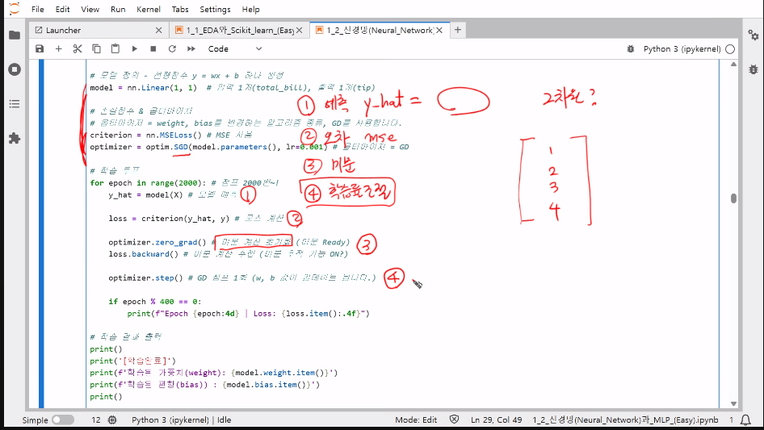

# 딥러닝 및 이미지 모델

# 1차시 : 이미지 딥러닝 모델

## 1. CNN 살펴보기

## 1-1. CNN vs FCN

## 1-1. FCN 모델

> **완전 연결층 (Fully-Connected Layer)**
> 
- 입력을 받아서 출력으로 변환하는 신경망의 기본 모듈
- FCN 변환 예시

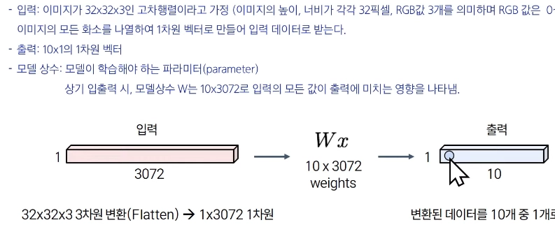

## 1-1. CNN 모델

> **합성곱 레이어 (Convolution Layer)**
> 
- 입력 이미지를 필터와 연산하여 특정 맵(feature map)을 뽑아내는 모듈
- 1차원 구조로 변환하는 FCN과 달리 3차원 구조를 그대로 보존하면서 연산
- Convolution(컨볼류션) : 필터를 이미지 상에서 이동시키면서 내적을 반복 수행, 내적으로 구한 모든 값을 출력 제공

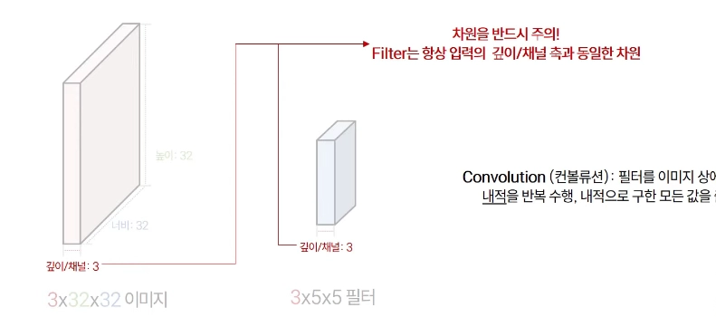

> **합성곱 레이어**
> 
- 예시 : 박스 필터

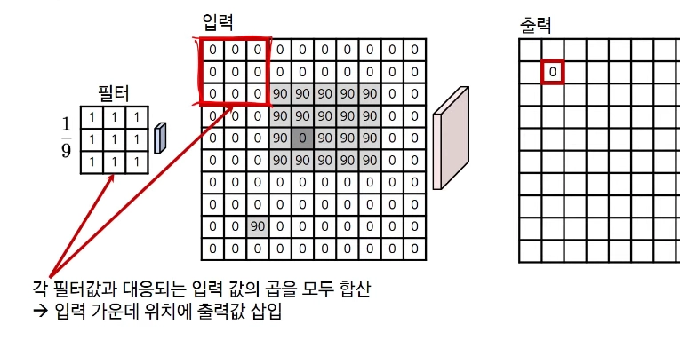

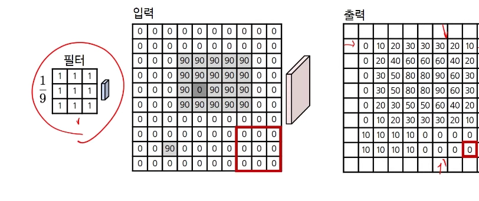

- 입력 이미지를 필터와 연산하여 특정 맵(feature map)을 뽑아내는 모듈

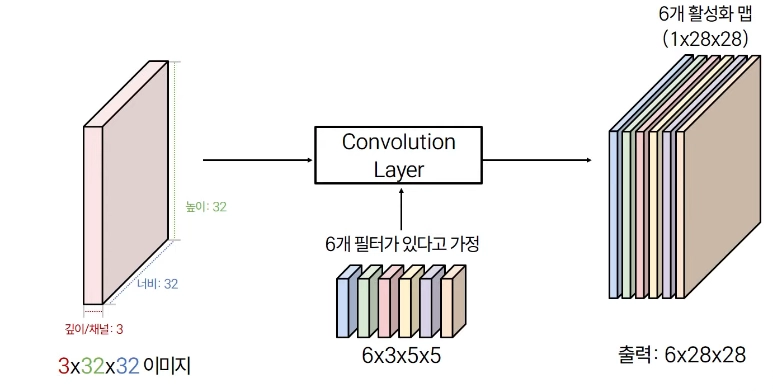

- 출력 해상도 = 입력 해상도 - 필터 해상도 + 1
    - ex) 8 = 10 - 3 + 1

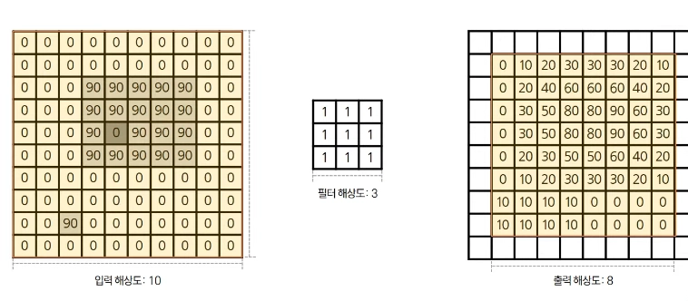

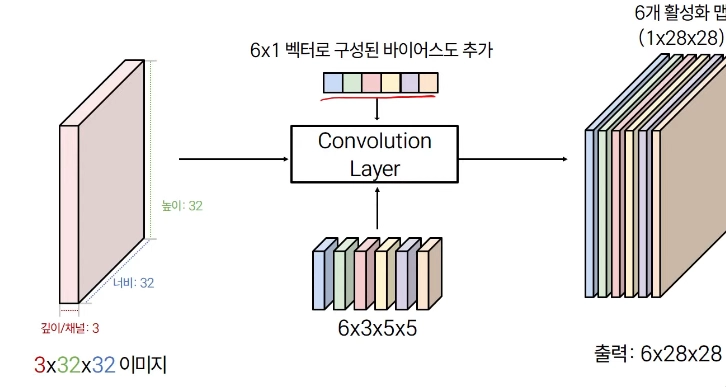

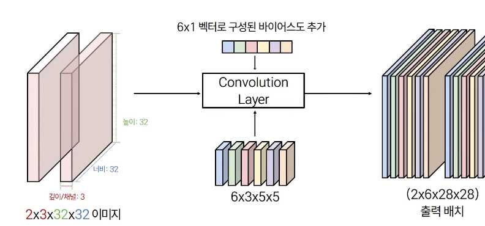

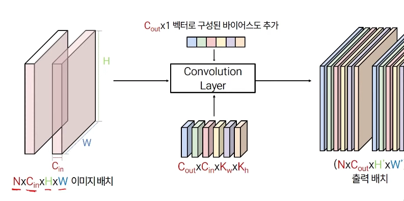

## 1-2. 모델 구조

## 1-2. CNN 모델 구조 - 중첩

> **합성곱 레이어**
> 
- 모델 상수(파라미터)를 증가시키면?

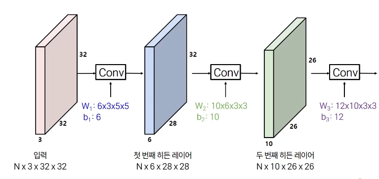

- 비선형 블록(Con[Linear] + ReLU[비선형 변환])과 함께하면 모델링 파워 향상

## 1-2. CNN 모델 구조 - 필터의 의미

> **필터 시각화**
> 
- 학습된 필터 시각화를 통해 각 모델(구조)이 학습한 정보를 이해 가능

## 1-2. CNN 모델 구조 - 수용영역 Receptive Field)

> **중첩과 수용영역**
> 
- CNN 레이어는 이미지 작은 부분인 “지역 정보”를 추출하는데 유리하게 설계
- 이미지 활용하는 다양한 작업에서 이미지 전체(예 : 맥락) 의미 파악이 필요
    - 따라서 “지역 정보 + 이미지 전체의 맥락”을 이해/활용하기 위한 설계가 필요함
    
    
    
- 수용영역이란?
    - CNN이 이미지를 처리하면서 한 번에 볼 수 있는 영역의 크기
    - 네트워크의 시야
    - 일반적으로 네트워크가 깊어질 수록 수용영역도 넒어짐 → 폭 넓은 맥락 이해 가능

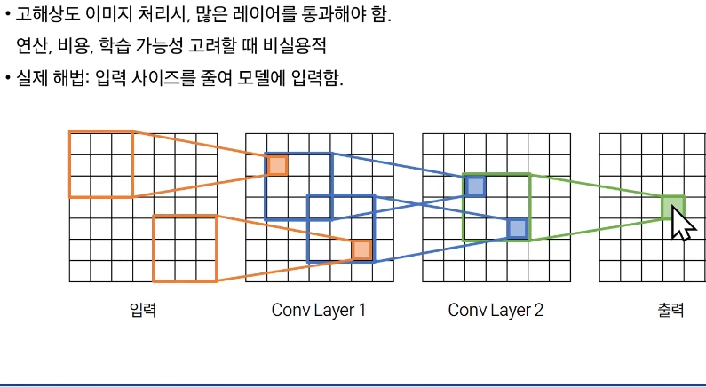

## 1-2. CNN 모델 구조 - 풀링

> **풀링 : 효율적 연산 및 위치 변화의 강건성 확보**
> 
- CNN 레이어의 출력을 줄여 연산 효율성을 확보 : 입력 크기가 줄면 CNN의 연산량이 크게 줄어듦
- 예시 : 2x2  풀링으로 입력의 해상도가 각각 1/2 로 줄었을 경우

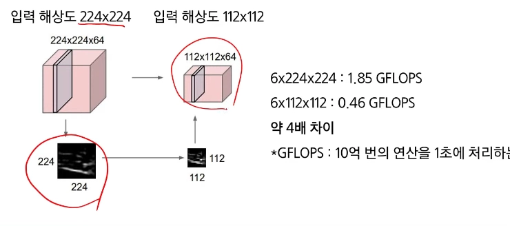

- 맥스 풀링 : 정해진 커널 사이즈 (예: 2x2) 로 이미지를 나누어 각 영역 내 가장 큰 값을 선택하는 연산

## 1-2. CNN 모델 구조 - 스트라이드 합성곱

> **스트라이으 합성곱 : 풀링 한계 개선**
> 
- 일반 합성곱 : 필터를 1칸씩 이동하면서 연산 수행 (출력값 계산)
- 스트라이드 합성곱 : 필터를 스트라이드 값만큼 (S칸) 이동한 후 출력 연산
- 효과 : 풀링 처럼 입력 해상도를 줄임 (연산 효율과 위치 강건성)
    - 풀이 vs 스트라이드 합성곱 : 풀링은 학습 상수가 없지만 스트라이드는 커널을 동시에 학습
    - 스트라이드 합성곱은 해상도 저하로 인한 정보 손실이 적고, 풀링 + 합성곱을 하나의 레이어로 대체함
    - 고도화된 CNN에서는 스트라이드 합성곱을 풀링 대신 활용하는 경향

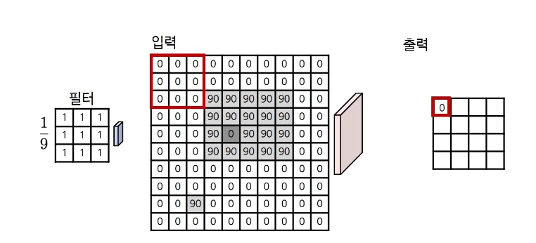

## 2. CNN 기반 모델 변천사

> **2010 ~ 2017년까지의 CNN 모델**
> 
- 세로축 : 에러율 (Error Rate, %), 낮을수록 성능이 좋은 모델
- 가로축 : (연도 & 모델명)

## 2-1. AlexNet / VGGNet

## 2-1. AlexNet

> 5개의 합성곱 계층과 3개의 완전연결 계층으로 구성된 8계층 CNN 모델
> 

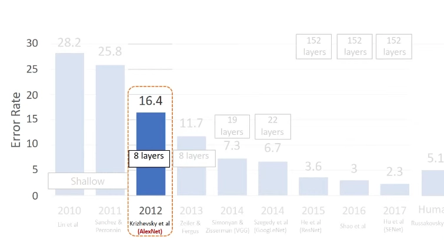

- 모델 구조 특징

- 입출력

> **Image input 224,2*GPU**
> 

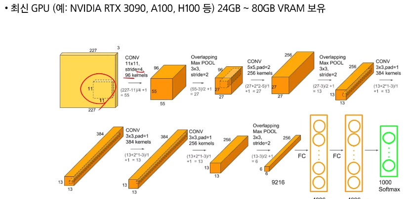

> **AlexNet 출력 사이즈 계산법[Conv1]**
> 

## 2-2. VGGNet

> **5개의 합성곱 블록 + 맥스 풀링 구조**
> 

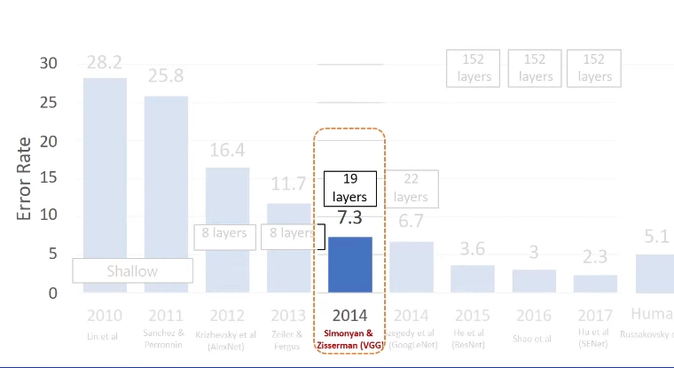

> **VGG-16 기준**
> 
- 모델 구조 특징

- 입출력

> **모델 비교**
> 

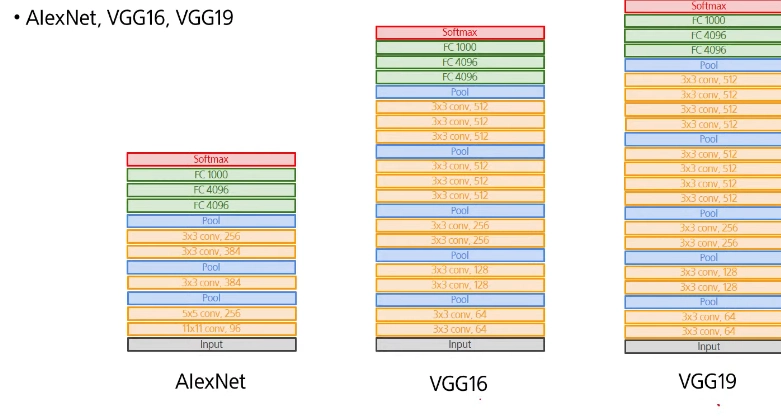

> VGG의 디자인 룰
> 

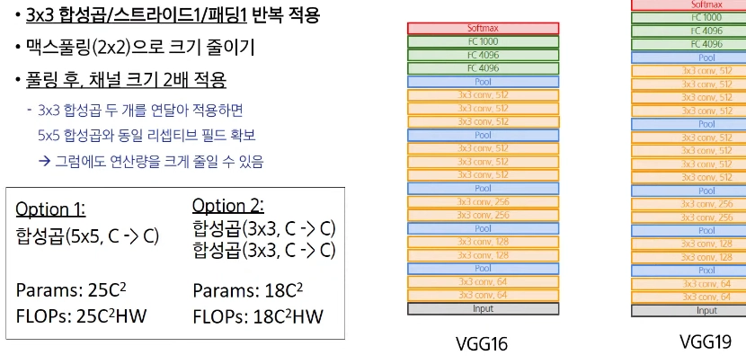

> **AlexNet vs VGGNet : VGG는 거대한 모델**
> 
- 메모리(Memory) 비교
- AlexNet(1.9MB) vs VGG-16(48.6MB) 약 25배

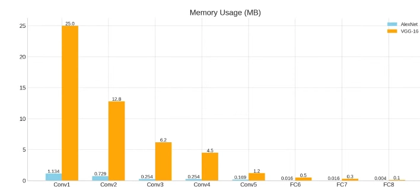

- 모델 상수 (Parameters) 비교
- AlexNet(61M) vs VGG-16(138M) 약 2.3배

> **모델 특징**
> 

## 2-3.ResNet (정말 중요한 모델)

> **합성곱 블록(VGG유사)과 잔차(Residual) 블록**
> 

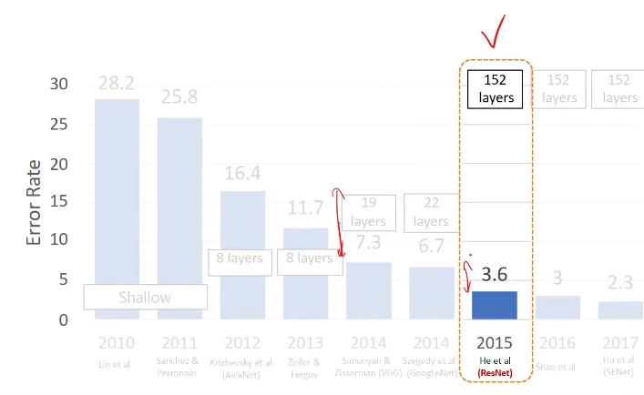

> **모델 구조 특징 (ResNet-50 기준)**
> 

> **ResNet의 등장 배경**
> 
- 배치 정규화 방식으로 10+ 레이어 학습 가능

- 깊다고 무조건 더 잘 학습되는 것은 아님(Degradation problem)

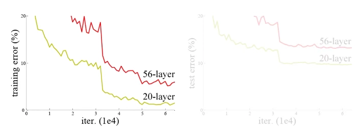

- 단순히 레이어를 깊게 하면 오히려 성능이 떨어짐

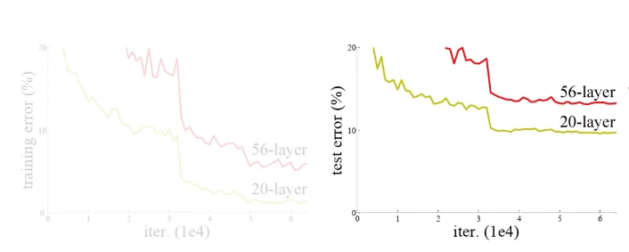

> **ResNet의 아이디어**
> 

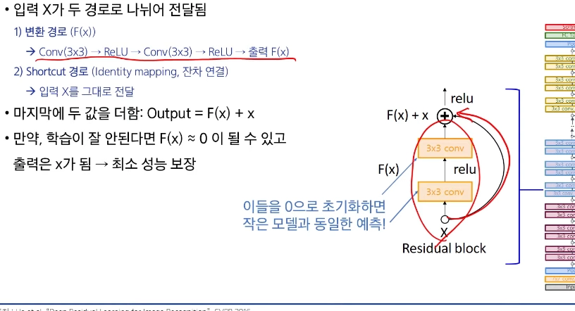

> **ResNet 잔차블록 (깊게 보기)**
> 

> **Stem 구조**
> 

> **ResNet-18과 ResNet-34**
> 

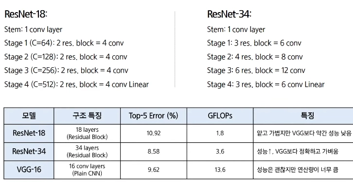

> **다양한 조합**
> 

> **잘 알려진 ResNet 학습 레시피**
> 

> **최종 요약**
> 

## 2-4. MobileNet

> **목표 : 모바일 / 임베디드 환경에서 구동 가능**
> 

> **깊이별 합성곱 / 화소별 합성곱 예시**
> 

> **이후 모델에 영향력**
> 
- 가볍고 빠른 모델로 엣지 디바이스에서 딥러닝 모델 실시간 실행 가능함을 보임
- 효율형 모델 구조의 표준 제시 : 깊이별 합성곱과 보틀넥 구조가 이후 경량 모델에서 지속적으로 채택

# 2차시 : 다양한 신경망 모델

## 1-1.CNN 구조의 장점

> **합성곱 구조의 특성**
> 
- 지역적인 특징 학습에 특화 : 작은 필터로 학습하여 패턴/경계선 특징 포착 용이
- 파라미터 효율성 우수 : 지역정 특징 추출 시 이미지 블록별 가중치를 공유하여 연산량 절감
- 위치 변화와 노이즈에 견고 : Pooling/Stride 합성곱이 세부 차이는 줄이고 이미지 전체 의미에 집중하게 함
- 이미지 분류/탐지 등 이미지 기반의 과업에서 표준 모델로 활양

## 1-2. CNN의 핵심 한계

> **CNN은 데이터 순서(order)를 무시**
> 
- 한계 : 순차적(sequential) 데이터의 순서 정보 (텍스트/음성의 시간 흐름 등)를 반영하기 어려움
- 예시

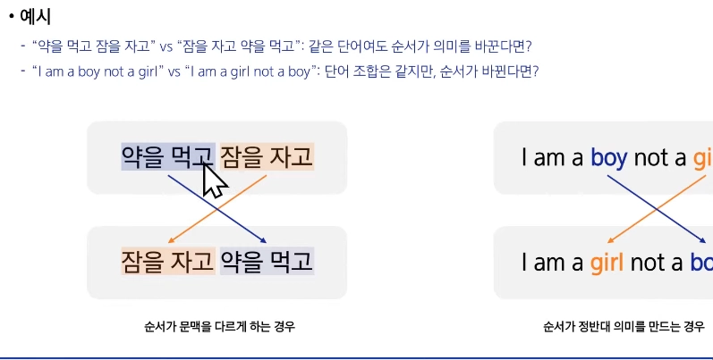

> **긴 거리 의존성 고려 부족**
> 
- 한계 : CNN은 국소정(로컬) 특징 추출에 강하지만, 이미지나 문장에서 멀리 떨어진 요소 간의 관계를 잘 학습하지 못함
- 이미지 예시

> **픽셀 단위 복원 한계**
> 

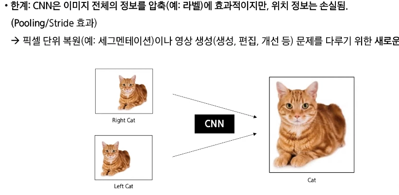

## 2. 시퀀스 데이터 처리 : RNN

## 2-1. RNN (Recurrent Neural Nets)

> **순차적(sequential) 데이터를 처리하기 위해 고안된 신경망 구조**
> 

> **RNN 셀**
> 

> **RNN 표현 방식**
> 

> **시계열 의존성**
> 

> **순수(vanilla) RNN**
> 

> **RNN 입출력 구조**
> 

## 2-1. RNN 계산 그래프

> **그래프 시각화**
> 

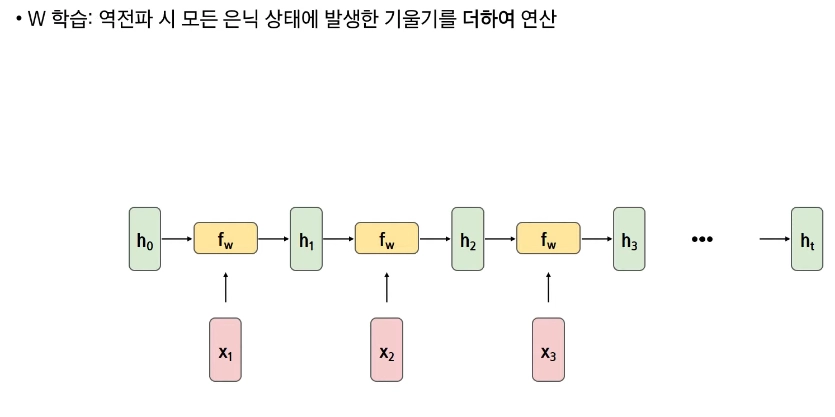

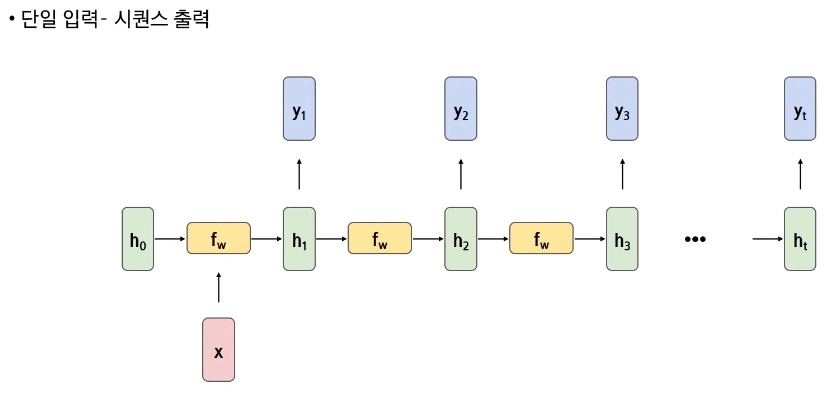

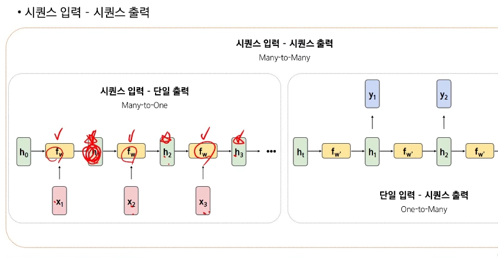

> **예시**
> 
- 언어 생성
    - 단위 데이터 : [h, e, l, o]

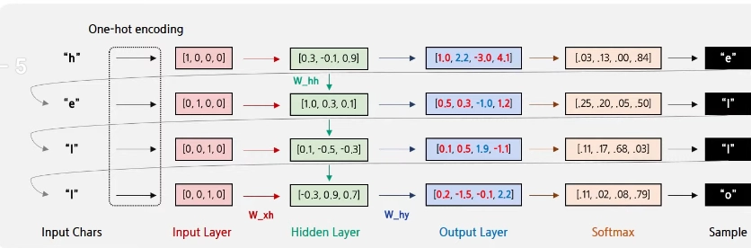

## 2-2. 단순 RNN 한계

> **기울기 폭발 혹은 소실 발생**
> 

## 2-3. 대안 모델

> **LSTM(Long Short-Term Memory)**
> 

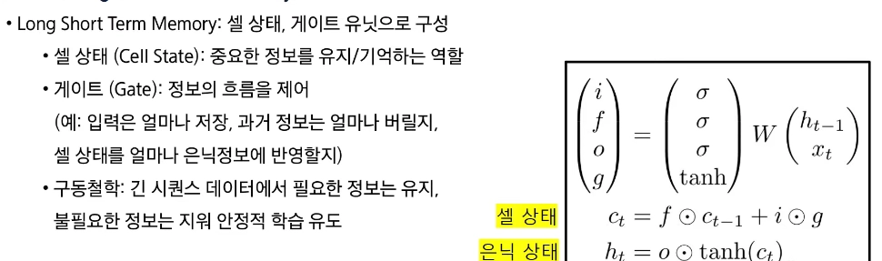

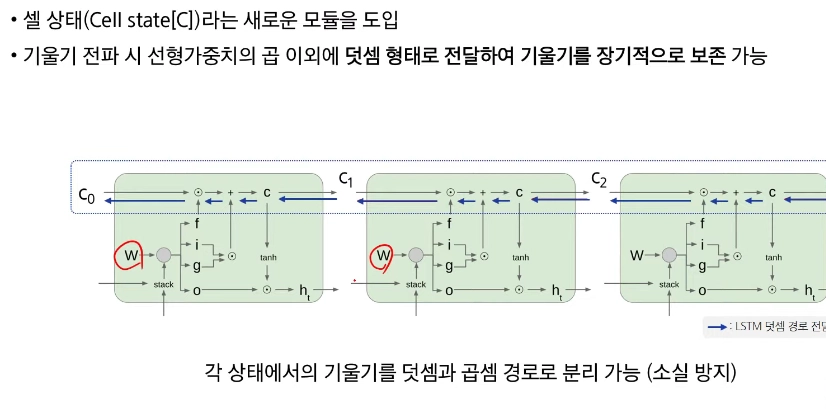

## 3. 긴거리 의존성 : 어텐션/ViT

## 3-1. 어텐션 메커니즘

> **이미지를 통해 어텐션 메커니즘 이해하기**
> 

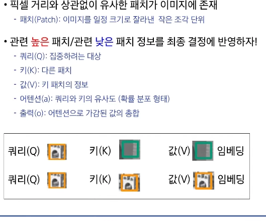

> **이미지에서 해석**
> 

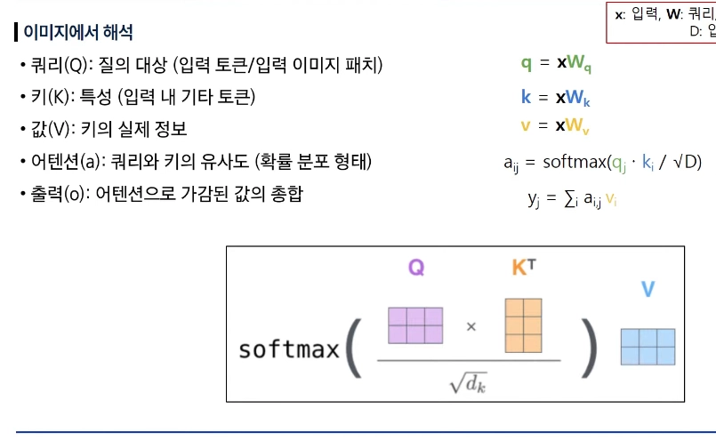

## 3-1. 교차 어텐션 (Cross-attention)

> **교차 어텐션 (Cross-attention) 이란**
> 

## 3-2. ViT 위치 인코딩

## 3-2. 모델 별 특성 정리

## 3-2. ViT 인코터

> **인코터 내부 구조**
> 

> **전역 관계 학습**
> 

## 3-2. ViT vs ResNet

## 3-2. ViT 학습 시 유의점

> **ViT 학습 기술이 중요!**
> 
- 막대한 상수를 보유
- 정규화 기법/데이터 증강 기술이 매우 중요!

> 증류학습[Knowledge Distillation = 지식 증류] 기술이 효과적 (DeiT2021)
> 
- 증류학습 방식

- 상당한 개선 효과 확인

## 3-2. Vision Transformer의 트렌드

> **다양한 변종이 존재**
> 

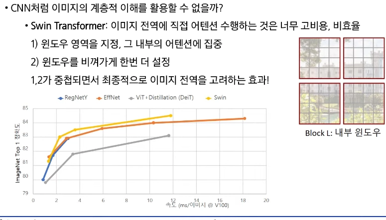

> **Vision 백본 vs 데이터 확장성 vs 멀티모달 모델**
> 

## 3-2. ViT 장단점

# 3차시 : 이미지 모델 학습 전략

## 1-1. 모델 구조

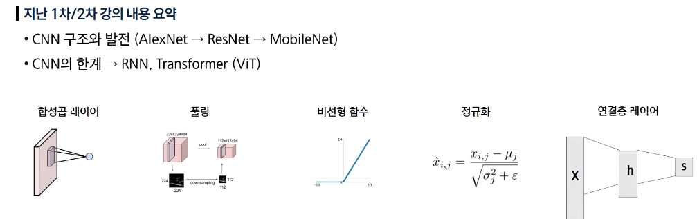

## 1-2. 좋은 모델 구조 = 우수한 성능?

> **좋은 구조만으로는 성능 보장 불가!**
> 
- 동일한 구조, 동일한 데이터 셋을 사용해도 성능 차이가 크게 남
- 이유 : 학습 과정에서 발생하는 불안정성, 과적합, 수렴 속도 문제

> **학습에서 자주 겪는 문제들**
> 
- 학습 불안정 : 손실 폭발, 학습 멈춤, 수렴 실패

- 과적합 : 훈련 데이터에는 맞지만 검증 / 실전 성능 저하

- 느린 수렴 : 최적점에 도달하기까지 불필요하게 많은 에폭 소모로 인한 학습 효율 저

## 1-3. 학습 전략

> **본 강의의 해결 방향**
> 

## “좋은 구조만으로는 충분하지 않다 → 훈련 전략이 필요하다”

## 2-1. 활성화 함수

> **정의**
> 
- 입력 신호의 총합을 출력 신호로 변환하는 함수
    - 예시 : 뉴런이 ‘켜질지/얼마나 반응할지’를 결정하는 스위

## 활성화 함수 선택

> **역할**
> 
- 신경망에 비선형성 부여 → 복잡한 패턴 학습 가능

## 대표 활성화 함수 : Sigmoid

> **Sigmoid**
> 

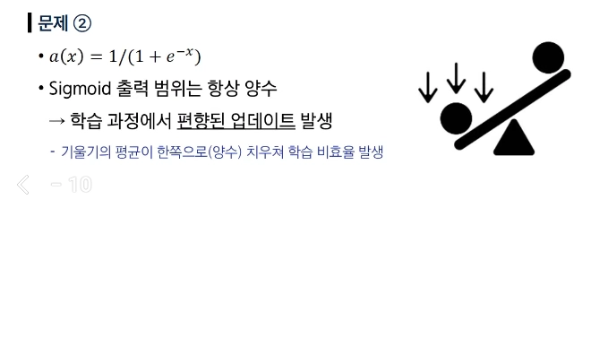

## 대표 활성화 함수 : Tanh

> **출력 범위**
> 
- [-1, 1]

> **역할**
> 

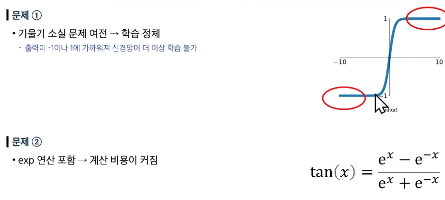

## 대표 활성화 함수 : ReLU

> **ReLU (Recitied Linear Unit)**
> 

> **장점**
> 

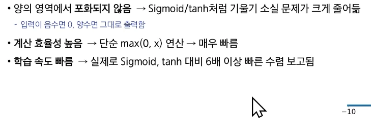

> **문제점**
> 

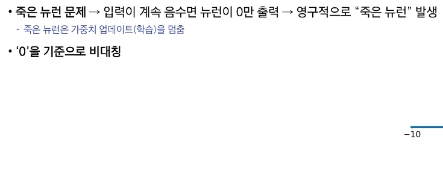

## 대표 활성화 함수 : Leaky ReLU

> **Leaky ReLu**
> 

> **장점**
> 

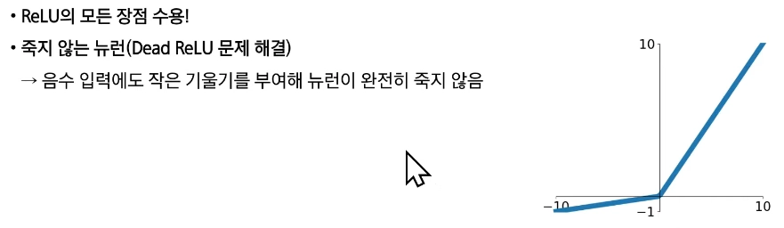

## 대표 활성화 함수 : ELU

## 다양한 활성화 함수

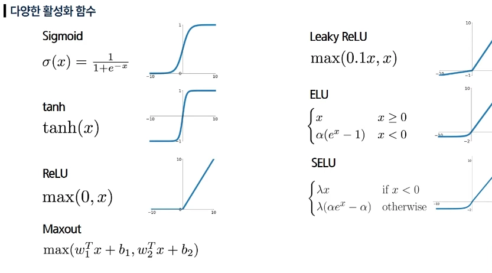

## 결론은?

> **큰 고민말고, 일단 ReLU부터 시도!**
> 

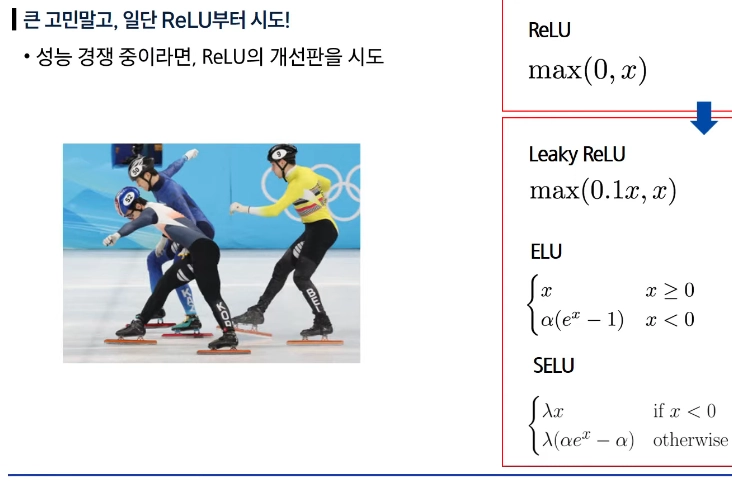

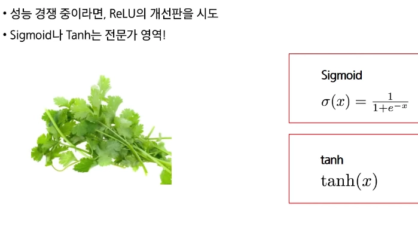

## 2-2. 데이터 전처리

## 데이터 형식 통일

> **이미지 조건을 일치**
> 

## 모델별 전처리 방식 예시

## 2-3. 모델 상수 초기화

## 아이디어1 : 0 으로 초기화

## 아이디어2 : 임의(랜덤) 초기화

- 깊지 않은 모델에서 동작하는 전략!

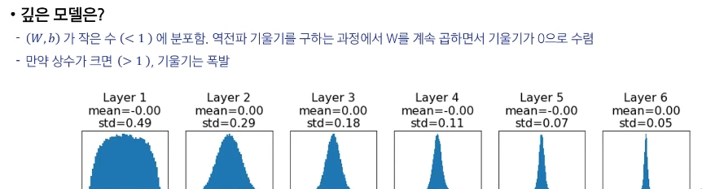

## 아이디어3 : 자비에 초기화

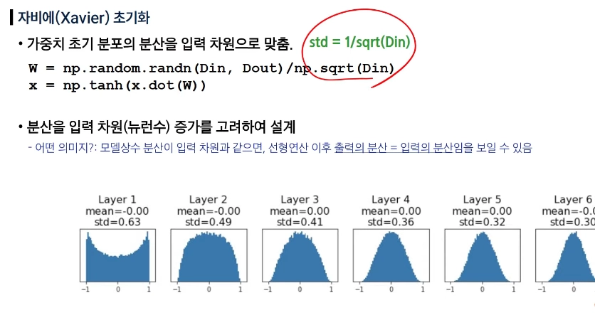

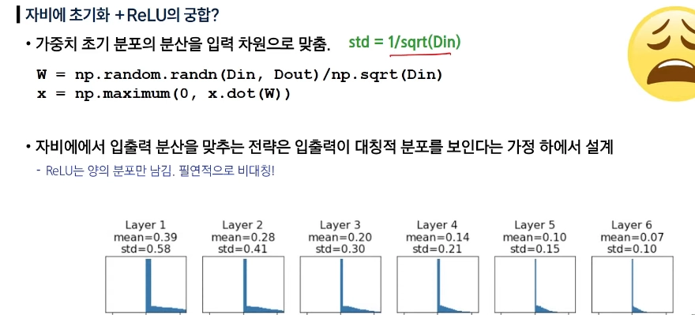

## 아이디어4 : 허 초기화

## ResNet의 등장 배경

## 주의사항 : ResNet

## 2-4. 모델 정규화

## 데이터 처리/초기화 이후 학습 가능

## 아이디어1 : 가중치 감소

## 아이디어2 : 드롭아웃

## 3. 학습 안정성 전력

## 3-1. 학습 비율 조정

## 학습 비율은 가장 중요한 하이퍼파라미터!

## 학습률 계단식 변경

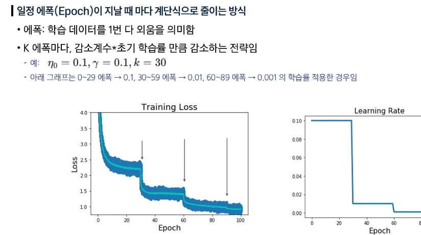

## 그 밖의 변경

## 학습 종료

## 3-2. 하이퍼 파라미터 선정

## 파라미터 vs 하이퍼 파라미터

## 주요 하이퍼 파라미터

## 하이퍼 파라미터 선택 비법

## 체크리스트 1

## 체크리스트 2

## 체크리스트 3

