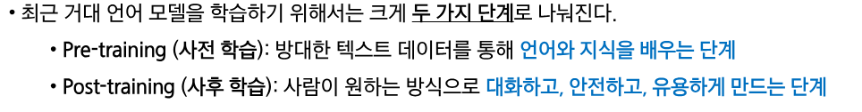

# 0325(AI / RLHF, Langchain).md

# Post-training(Instruction-tuning, RLHF)

## 1. Pre-traning vs Post-traning

> **거대 언어 모델 학습 패러다임**
> 

> **Pre-traning(사전 학습)**
> 

> **Pre-traning 후 모델의 응답 예시**
> 

> **Post-traning (사후 학습)**
> 

## 2. Instruction-tuning

> **사전 학습 후 언어모델의 한계**
> 

> **파인 튜닝이란?**
> 

> **Instruction-tuning 이란?**
> 

> **더 많은 태스크를 가진 데이터 학습**
> 

> **Instruction-tuned된 언어모델 평가 벤치마크**
> 

> **MMLU 예시**
> 

> **K-MMLU**
> 

> **MMLU 에서의 발전**
> 

> **최근 거대 언어 모델들**
> 

> **이로부터 우리는 무엇을 배웠는가?**
> 

## 3. Reinforcement Learning from Human Feedback (RLHF)

> **Instruction-tuning의 한계**
> 

> **인간의 선호도(Human Preference) 란?**
> 

> **InstructGPT (2022)**
> 

> **Intuition : Human-in-the-loop ML**
> 

> **인간의 선호를 반영한 최적화 (Optimizing for human preferences)**
> 

> **RLHF 파이프라인 큰 그림**
> 

> **인간의 선호도 (Juman preference) 를 어떻게 모델링 할 것 인가?**
> 

> **어떻게 최적화를 할 것인가? ,,, 강화학습**
> 

> **RLHF 는 pre-training과 instruction-tuning보다 더 나은 성능 향상을 제공한다**
> 

> **주의점 : 리워드 모델이 잘 작동하는지 먼저 잘 확인해야 한다**
> 

> **ChatGPT : Instruction-tuning + RLHF**
> 

## 4. What’s Next?

> **리워드 모델링의 한계점**
> 

## 4. DPO

> **RLHF 에서 ‘RL’을 제거하자**
> 

> **RLHF에서 수학 문제와 같이 답이 분명한 문제들은 정답 여부로 리워드를 주자**
> 

# Retrieval-augmented Language Models
(Information Retrieval, RAG)

## 1. Basic Concepts of Retrieval-augmented LM

> **Retrieval-augmented LM이란?**
> 

> **Retrieval-augmented LM 구성요소**
> 

> **Datastore**
> 

> **쿼리 (Query)**
> 

> **인덱스(Index)**
> 

> **검색(Retrieval)**
> 

> **Retrieval-augmented Generation (RAG)**
> 

## 2. Information Retrieval

> **Information Retrieval (정보검색)**
> 

> **Information Retrieval 이란?**
> 

> **정보검색(IR)의 활용**
> 

> **Retriever란?**
> 

> **Retriever 종류**
> 

> **Sparse Retriever –TF-IDF (Term Frequency-Inverse Document Frequency)**
> 

> **Sparse Retriever - 장/단점**
> 

> **Dense Retriever –임베딩모델(Embedding Models)**
> 

> **Dense Retriever –Bi-encoder**
> 

> **Dense Retriever –Cross-encoder**
> 

> 91**Dense Retriever –Bi-encoder vs Cross-encoder**
> 

> **Dense Retriever - 장/단점**
> 

## 3. Retrieval-augmented LM

> **Retrieval-augmented LM 이란?**
> 

> **Why Retrieval-augmented LM?**
> 

> **Retrieval-augmented LM파이프라인**
> 

> **Challenges of Retrieval-augmented LM?**
> 

> **Noise Robustness**
> 

> **Negative Rejection**
> 

> **Challenges of Retrieval-augmented LM?**
> 

# LLMs with Tool Usage
(LLM Agent, Tool Use, MCP)

## 1. Basic Concepts of LLM Agents

> **Agent 이란?**
> 

> **강화학습(Reinforcement Learning) –의사결정의 과학**
> 

> **LLM Agent 이란?**
> 

> **이것이 에이전트인가?**
> 

> **성공적인 에이전트가 갖추어야 할 요건들**
> 

> **LLM Agent 프레임워크**
> 

## 2. Tool Usage in LLMs

> **Tool 이란? (LLM 에이전트를 위한)**
> 

> **도구 사용 패러다임 (Tool Use Paradigms)**
> 

> **툴 러닝  (Tool Learning) 방식**
> 

> **툴러닝(Tool Learning)방식–모방학습(Imitation Learning)**
> 

> **툴 러닝(Tool Learning) 방식**
> 

> **툴 러닝(Tool Learning) 최근 접근–멀티 모달 툴 러닝(Multi-modal Tool Learning)**
> 

> **툴 러닝(Tool Learning) 최근 접근–강화 학습**
> 

## 3. Model Context Protocol(MCP)

> **Why MCP?**
> 

> **MCP란?**
> 

> **MCP 아키텍쳐**
> 

> **MCP 계층 (Layer)**
> 

> **예시 : MCP 이전 / 이후 툴 사용 요청 (tool execution request) 비교**
> 

> **MCP의 장점**
> 

> **MCP 서버 예시 코드**
> 

> **현재**
> 

# AI Agent & Langchain
(AI Agents, Langchain)

## 1. Environment Representation & Understanding

> **Recap : LLM Agent 이란?**
> 

> **Recap : 성공적인 에이전트가 갖추어야 할 요건들**
> 

> **LLM Agent 프레임워크**
> 

> **환경 (Environment)과 에이전트 활용 예시들**
> 

> **에이전트가 환경을 이해하기 위해 필요한 것**
> 

> **환경의 표현 (Representation) : 텍스트 (Text)**
> 

> **환경의 표현 (Representation) : 이미지 (Image)**
> 

> **이미지 기반 표현의 문제점(Problems w/ Image Representations)**
> 

> **환경의 표현(Representation): 텍스트 기반 웹(Textual Web Representations)**
> 

> **복잡한 환경은 어떻게 이해할 수 있을까?**
> 

> **복잡한 환경에 대한 이해 : 환경 특화 프롬프트(Environment-specific Prompts)**
> 

> **복잡한 환경에 대한 이해 : 비지도 프롬프트 유도(Unsupervised Induction of Prompts)**
> 

> **복잡한 환경에 대한 이해 : 환경 탐색(Environment Exploration)**
> 

> **복잡한 환경에 대한 이해 : 탐색 기반 궤적 기억(Exploration-based Trajectory Memorization)**
> 

## 2. Reasoning & Planning

> **Recap : 성공적인 에이전트가 갖추어야 할 요건들**
> 

> **LLM Agent 프레임워크**
> 

> **Controller : Planning 종류**
> 

> **Local Planning**
> 

> **Global planning**
> 

> **오류 식별과 회복(Error identification and Recovery)**
> 

> **계획 재검토(Revisiting Plans)**
> 

## 3. Langchain

> **Langchain 이란?**
> 

> **Langchain 특징**
> 

> **Langchain 주요 컴포넌트**
> 

> **Langchain 튜토리얼 (https://python.langchain.com/docs/tutorials/)**
> 

> **RAG w/ Langchain**
> 

> **Agent w/ Langchain**
> 

> **MCP w/ Langchain**
> 

