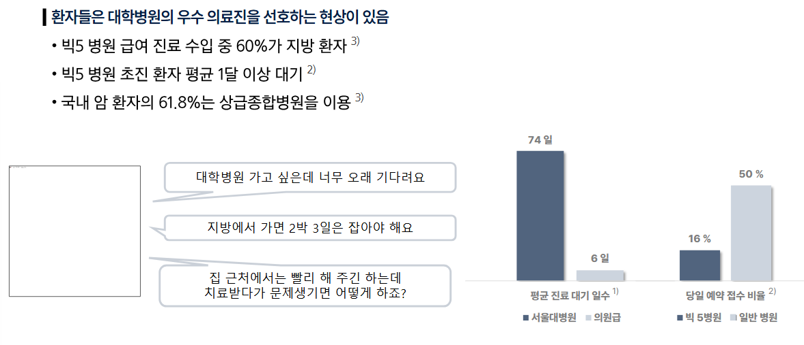

# 0328(AI / Agent 모델).md

# Mastering AI Agent

> **대형 언어 모델 (Large Language Model)의 등장과 발전**
> 

## 배경 : 대형 언어 모델 (LLM)이란 무엇인가?

## 최고의 의사를 Chatgpt가 대신할 수 있을까?

## 의료 분야에서의 AI Agent 예시

> **예시 : 의학 영상 판독**
> 

> **예시 : 의료 수술 보조 로봇**
> 

## 1. Introduction to AI Agent

> **산업 현장 사례**
> 

> **내 일상 속에서 찾아볼 수 있는 사례**
> 

## 1. AI Agent

> **인공지능의 새로운 지평**
> 

> **생성형 AI에서 에이전트형 AI로**
> 

> **지금은 AI 에이전트의 시대**
> 

> **에이전트란?**
> 

> **AI 에이전트?**
> 

> **AI vs AI 에이전트**
> 

> **AI 에이전트의 주요 특성**
> 

> **Challenges in AI Agent**
> 

## 2. Multi-Agent System

## 2-1. Multi-Agent System

> **대규모 언어 모델 (LLM)**
> 

> **왜 다중 에이전트 시스템이 필요한가?**
> 

> **LLM 기반 다중 에이전트 협업 시스템의 질의응답 활용 예시**
> 

> **LLM 기반 Multi Agent System**
> 

> **다중 에이전트 시스템의 주요 구성 요소**
> 

## 2. 방법론 : 협업 유형

> **협업 유형**
> 

> **협력**
> 

> **다중 에이전트 협업에 따른 반복 의사결정 과정**
> 

> **협업 예시 : 의학 영상 판독**
> 

> **경쟁**
> 

> **경쟁 (게임) 을 통한 AI 실험 예시**
> 

> **협력과 경쟁의 조합**
> 

## 3. 방법론 : 협업 전략

> **규칙 기반 프로토콜**
> 

> **역할 기반 프로토콜**
> 

> **AI 에이전트가 협업을 통해 자동 개발하는 과정**
> 

## 4. 방법론 : 커뮤니케이션 구조

> **중앙집중형 구조**
> 

> **탈중앙화 구조**
> 

> **다중 에이전트 시스템에 대한 우려의 시사점**
> 

## 3. **Memory & Tool inMulti Agent System**

## 3-1. Memory & Tool

> **패러다임의 전환 : 언어 모델에서 에이전트 시스템으로**
> 

> **패러다임 전환의 예시**
> 

> **메모리 & 도구**
> 

> **검색 증강 생성 (Retrieval-Augmented Generation, RAG)**
> 

> **멀티 에이전트 시스템을 위한 훈련 방법**
> 

> **모델 컨텍스트 프로토콜(MCP)**
> 

> **Agent2Agent 프로토콜**
> 

## 4. Reasoning and Planning in AI Agent

## 4-1. 대규모 언어 모델(LLM)의 추론 능력(Reasoning)

> **추론 능력이 있는 대규모 언어 모델**
> 

> **대규모 언어 모델의 추론 유도**
> 

> **대규모 언어 모델의 추론 능력 강화**
> 

## 4-2 LLM 에이전트의 계획 수립 (Planning)

> **LLM 에이전트의 Planning**
> 

> **LLM 에이전트의 Planning 개요**
> 

> **LLM 에이전트의 Planning 능력 강화**
> 

## 4-3 추론 시간 연산량 최적화 및 효율적 추론 접근법

> **추론 시간의 연산량 증대**
> 

> **추론 모델**
> 

> **추론 모델 강화**
> 

> **효율적인 추론**
> 

> **효율적인 추론**
> 

## 5. Domain-Specific AI Agent

## 5-1. Deep Research의 배경

> **패러다임의 전환**
> 

## 5-2. 에이전트 기반 심층 연구

> **핵심 개념**
> 

> **역동적인 환경에서의 어려움과 해결방안**
> 

> **강화학습 기반 훈련 및 보상 설계**
> 

> **Test-Time Scaling(TTS)**
> 

> **방법론 - 문제 해결 과정**
> 

> **역동적인 환경에서의 어려움과 해결방안**
> 

> **강화학습 훈련 프레임워크 및 보상**
> 

> **성능 분석**
> 

> **창발적 행동**
> 

## 5-4. 평가 및 발전 방향

> **한계점 및 고려사항**
> 

> **미해결 문제 및 발전 방향**
> 

## 총정리

