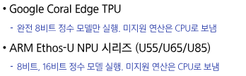

# 0330(AI / 가속기 구동을 위한 정수연산 양자화).md

# “가속기 구동을 위한 100% 정수 연산 양자화”

## 1. 100% 정수연산 양자화의 필요성

## 1-1. AI 가속기의 구동 특성

> **AI 가속기는 정수 연산만 지원하거나, 정수 연산에서 훨씬 효율적으로 동작함**
> 

## 1-2. 일반 양자화와 100% 정수연산 양자화의 차이

> **일반적 양자화: r이라는 실수 값을 q라는 정수로 표현하고 싶다!**
> 

## 2. 정수연산 양자화

## 2-1. 행렬 곱 연산 양자화

> **실수 행렬 𝑟3 = 𝑟1 𝑟2 (𝑟𝛼 ∈ R^𝑁×𝑁) 의 연산 과정을 양자화 관점에서 유도**
> 

> **비트 쉬프팅 (Bit Shifting)**
> 

## 2-2. 배치 정규화 계층 폴딩

> **배치 정규화 (Batch Normalization) 란?**
> 

> **배치 정규화 계층 폴딩**
> 

## 2-3. 비전 트랜스포머 연산 양자화

> **행렬 곱과 배치 정규화 폴딩 외에 추가적 연산 정수화가 필요함**
> 

# “테스트 타임 도메인 적응”

## 1. 분포 이동과 테스트타임 도메인 적응(TTA)

> **분포 이동 (Distribution Shift)**
> 

> **테스트타임 도메인 적응 (Test - Time Adaption : TTA)**
> 

## 2. TTA 기법

## 2-1. CNN 기반 TTA 기법

> **TENT : 배치 정규화 계층을 테스트 데이터에 최적화**
> 

> **SAR : 최적화를 더욱 안정적으로!**
> 

## 2-2. 비전언어모델 기반 TTA 기법

> **TPT (Test-Time Prompt Tuning) : 일관성 있는 예측을 돕자!**
> 

> **PromptAlign : 학습 데이터와 테스트 데이터를 직접 정렬 시키자!**
> 

# “적응적 센싱”

## 1. 초거대 AI의 근본 원리와 한계

## 1-1. 스케일링의 법칙과 초거대 AI

> **초거대 AI**
> 

> **분포 이동 (Distribution Shift)의 문제**
> 

> **스케일링 법칙 (Scaling Law)**
> 

## 1-2. 스케일링 법칙의 한계

> **질문 : 이 세상에서 일어날 수 있는 모든 경우의 수를 학습 데이터로 미리 준비하는 것이 가능할까?**
> 

## 2. 적응적 센싱을 통한 분포 이동 억제

## 2-1. 발상의 전환 : 인간의 인지체계

> **AI 거대화 전략과 인간 인지체계의 괴리**
> 

## 2-2. 적응적 센싱 : AI를 위한 안경

> **적응적 센싱의 개념**
> 

## 2-3. 적응적 센싱을 위한 데이터셋

> **ImageNet-ES (https://github.com/Edw2n/ImageNet-ES)**
> 

## 2-4. 적응적 센싱 기법 : Lens

> **Lens**
> 

## 2-5. 성능 효과

> **Lens vs. Auto - Exposure (AE)**
> 

> **Lens vs. 도메인 일반화**
> 

## 2-6. 특징과 함의

> **AI 모델이 더 잘 맞추는 사진은?**
> 

# “응용 분야 전문 지식을 활용한 모델 설계”

## 1. 도메인 전문지식의 중요성

> **도메인 특화 AI 모델을 제작하고자 한다면, 그 도메인의 전문지식을 이해해야 함**
> 

## 2. 의료 응용 : 수면 의학을 위한 AI

## 2-1. 수면 의학의 기본적 이해

 

## 2-2. 수면다윈검사의 한계점

## 3. 개발 사례 01 : 수면다윈검사 자동채점 AI

## 3-1. 수면단계 진단 AI의 필요성

## 3-2. 도메인 전문지식 주입 과정

> **핵심 아이디어 1 : 이미지 데이터 포멧 변환**
> 

> **핵심 아이디어 2 : 비전 트랜스포머 기반 신경망 학습**
> 

> **핵심 아이디어 3 : 에폭 간 맥락 파악 및 결과 보정**
> 

# 3-3. 성능 평가

> **에폭 간 맥락 파악 및 결과 보정**
> 

## 4. 개발 사례 02 : 비접촉식 수면 무호흡증 진단 AI

## 4-1. 비접촉식 수면 무호흡증 진단 AI의 필요성

## 4-2. 도메인 전문지식 주입 과정

## 4-3. 성능 평가

> **경량 모델, 엣지 디바이스, 빠른 실행**
> 

