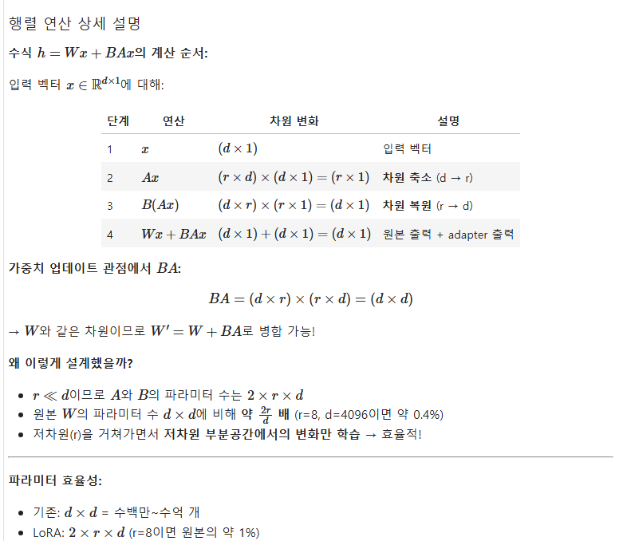

# 0331(AI / Fine-Tuning).md

- **PEFT(Parameter-Efficient Fine-Tuning)**: 전체 모델 파라미터 중 일부만 학습하여 메모리와 시간을 절약하는 기법입니다. 사전학습된 가중치는 고정(freeze)하고, 소수의 추가 파라미터(adapter)만 학습하여 Full Fine-tuning 대비 10~1000배 적은 파라미터로 유사한 성능을 달성합니다.

- **LoRA(Low-Rank Adaptation)**: 가중치 행렬을 저차원 행렬로 분해하여 학습 파라미터를 크게 줄이는 방법입니다. 원본 가중치 에 대해 업데이트를 로 표현하며, , (rank )입니다. 최종 출력은 로 계산됩니다.

- **QLoRA(Quantized LoRA)**: 양자화된 모델에 LoRA를 적용하여 더욱 효율적인 학습이 가능합니다. Base model을 4-bit NormalFloat(NF4) 양자화로 로드하고, LoRA adapter는 BFloat16으로 학습하여 16GB VRAM에서 7B 모델도 파인튜닝할 수 있습니다.

- **Unsloth**: LoRA/QLoRA 학습을 최적화한 프레임워크로 학습 속도와 메모리 효율을 향상시킵니다. 수작업으로 최적화된 GPU 커널(Triton 기반)을 사용하여 FlashAttention 2 대비 최대 30배 빠른 학습 속도와 30% 메모리 절감을 달성합니다.

- **SFTTrainer**: HuggingFace TRL 라이브러리의 Supervised Fine-Tuning 트레이너입니다. 데이터 로딩 → 토큰화 → 배치 구성 → 순전파 → 역전파 → 가중치 업데이트의 전체 파이프라인을 자동으로 관리하며, PEFT와의 통합을 지원합니다.

- **Text-to-SQL**: 자연어 질문을 SQL 쿼리로 변환하는 NLP 태스크입니다. "2023년 매출이 가장 높은 제품은?" → `SELECT product FROM sales WHERE year=2023 ORDER BY revenue DESC LIMIT 1`과 같이 변환합니다.

- **Chat Template**: LLM에 입력을 전달할 때 사용하는 표준화된 형식입니다. system/user/assistant 역할을 구분하여 모델이 대화 맥락을 이해할 수 있게 합니다. 각 모델마다 고유한 특수 토큰(예: `<start_of_turn>`, `<end_of_turn>`)을 사용합니다.

- **Label Masking**: instruction tuning에서 입력(instruction) 부분은 학습하지 않고 출력(response) 부분만 학습하도록 레이블을 -100으로 마스킹하는 기법입니다. CrossEntropyLoss는 -100 레이블을 무시하므로, 모델이 "답변 생성"에만 집중하도록 합니다.

### Concept Check: Unsloth란?

> **🧠 Unsloth란?**
Unsloth는 효율적인 LLM(대형 언어 모델) 파인튜닝 및 강화학습(RL) 프레임워크로, 속도와 메모리 관리 측면에서 최적화된 성능을 제공합니다.
> 

**주요 특징:**

- 수작업으로 최적화된 GPU 커널을 사용하여 기존보다 훨씬 빠른 학습 가능
- 오픈소스이며 무료 버전 제공
- 기존 FlashAttention 2 기반보다 최대 **30배 빠른 학습 속도**와 **메모리(VRAM) 30% 절감**
- QLoRA, LoRA, 4-/8-/16-bit 등 저정밀 훈련 지원

**왜 Unsloth를 사용하나요?**

- 16GB VRAM 환경에서도 대형 모델 파인튜닝 가능
- 표준 HuggingFace PEFT 대비 학습 속도 향상
- 간편한 API로 빠른 실험 가능
- 

### Concept Check: LoRA vs QLoRA — 무엇이 다른가?

이 실습에서는 **QLoRA**를 사용합니다. LoRA와 QLoRA의 차이를 이해하면 "지금 하고 있는 것"이 무엇인지 명확해집니다.

**LoRA vs QLoRA 비교:**

| 구분 | LoRA | QLoRA |
| --- | --- | --- |
| **Base Model** | FP16/BF16 (원본) | 4-bit 양자화 |
| **LoRA Adapter** | FP16/BF16 | FP16/BF16 (동일) |
| **핵심 차이** | 모델 로드 방식 | 모델 로드 방식 |
| **1B 모델 메모리** | ~2GB | ~0.5GB |
| **7B 모델 메모리** | ~14GB | ~4GB |

**QLoRA의 핵심 기술 3가지:**

1. **NF4 (4-bit NormalFloat)**
    - 가중치 분포에 최적화된 4-bit 양자화 방식
    - 일반 INT4보다 정보 손실이 적음
2. **Double Quantization**
    - 양자화 상수까지 다시 양자화하여 메모리 추가 절감
    - 약 0.5GB 추가 절약 (7B 모델 기준)
3. **Paged Optimizers**
    - GPU 메모리 부족 시 CPU 메모리로 자동 스왑
    - OOM 방지 및 더 큰 배치 사이즈 허용

> **핵심**: QLoRA = **Q**(양자화된 Base Model) + **LoRA**(저차원 Adapter)
> 
> 
> 아래에서 모델을 로드할 때 `bnb-4bit`가 바로 **"Q"** 부분입니다!
> 

### Concept Check: Full Fine-tuning이란?

**Full Fine-tuning**은 사전학습된 모델의 **모든 파라미터**를 업데이트하는 방식입니다.

**문제점:**

- 모든 파라미터의 gradient를 저장해야 하므로 **메모리 사용량이 매우 큼**
- 대형 모델(1B+ 파라미터)의 경우 일반 GPU로는 학습 불가능

**메모리 요구량 계산 (1B 모델 기준):**

```
모델 파라미터: 1B × 4 bytes (FP32) = 4GB
Gradient: 1B × 4 bytes = 4GB
Optimizer states (AdamW): 1B × 8 bytes = 8GB (momentum + variance)
Activations (배치 크기에 따라): ~4-16GB

총 필요 메모리: 약 20-32GB (FP32 기준)
```

16GB VRAM 환경에서는 **Full Fine-tuning이 사실상 불가능**합니다.

### Concept Check: 비트 정밀도(Bit Precision) — 4bit, 8bit, 16bit, 32bit의 차이

Full Fine-tuning의 메모리 문제를 이해하려면 먼저 **비트 정밀도**가 무엇인지 알아야 합니다.

---

### 1. 비트 정밀도란?

- *비트 정밀도(Bit Precision)**는 숫자 하나를 저장하는 데 사용하는 비트 수입니다. 딥러닝에서 모델의 가중치(weight)와 활성화(activation)를 저장하는 방식을 결정합니다.

| 정밀도 | 비트 수 | 파라미터당 메모리 | 표현 범위 | 주요 용도 |
| --- | --- | --- | --- | --- |
| **FP32** | 32-bit | 4 bytes | ±3.4×10³⁸ | 학습 기본값, Optimizer |
| **FP16/BF16** | 16-bit | 2 bytes | ±65,504 / ±3.4×10³⁸ | Mixed Precision 학습 |
| **INT8** | 8-bit | 1 byte | -128 ~ 127 | 추론 최적화 |
| **NF4** | 4-bit | 0.5 bytes | 16단계 | QLoRA (극한 효율) |

---

### 2. 각 정밀도의 특징

**FP32 (Full Precision)**

- 가장 정확하지만 **메모리를 가장 많이 사용**
- 전통적인 딥러닝 학습의 기본값
- Optimizer (AdamW)의 momentum, variance는 반드시 FP32로 저장

**FP16/BF16 (Half Precision)**

- FP32 대비 **메모리 50% 절감**
- FP16: 작은 수 표현에 강점 (CV, NLP 일반)
- BF16: 큰 수 표현에 강점 (LLM, Transformer 권장)
- **Mixed Precision**: FP16 연산 + FP32 accumulator로 정확도 유지

**INT8 (8-bit Integer)**

- **메모리 75% 절감** (FP32 대비)
- 추론(Inference)에 주로 사용
- 학습 시에는 gradient 정확도 문제로 제한적
- bitsandbytes의 `adamw_8bit` 옵티마이저가 여기 해당

**NF4 (4-bit NormalFloat)**

- **메모리 87.5% 절감** (FP32 대비)
- QLoRA의 핵심 기술
- 가중치 분포에 최적화된 비선형 양자화
- 일반 INT4보다 정보 손실이 적음

---

### 3. Trade-off: 정밀도 vs 메모리 vs 성능

```
정밀도 높음 ◀──────────────────────────────▶ 정밀도 낮음
   FP32          FP16/BF16        INT8          NF4
    │               │              │             │
    ▼               ▼              ▼             ▼
 메모리 大        메모리 中       메모리 小     메모리 極小
 정확도 高        정확도 高       정확도 中     정확도 中~低
 학습 가능        학습 가능       추론 전용*    추론 전용*
                                              (*QLoRA로 학습)
```

**핵심 Trade-off:**

| 항목 | 고정밀도 (FP32) | 저정밀도 (4-bit) |
| --- | --- | --- |
| **메모리** | 많이 사용 | 적게 사용 |
| **학습 속도** | 느림 | 빠름 |
| **수치 정확도** | 높음 | 낮음 (근사) |
| **모델 성능** | 최적 | 약간 손실 가능 |
| **학습 가능성** | Full FT 가능 | Adapter만 학습 |

> **실무 결론**: 4-bit 양자화는 성능 손실이 1-3% 수준으로 매우 작고, 메모리는 8배 절감됩니다. 이것이 QLoRA가 인기 있는 이유입니다.
> 

---

### 4. 실제 수치로 보는 메모리 차이

**1B (10억) 파라미터 모델 기준:**

| 정밀도 | 모델 메모리 | 7B 모델 환산 | 16GB로 가능? |
| --- | --- | --- | --- |
| FP32 | **4.0 GB** | 28 GB | ❌ 불가능 |
| FP16 | **2.0 GB** | 14 GB | ⚠️ 추론만 |
| INT8 | **1.0 GB** | 7 GB | ⚠️ 추론만 |
| NF4 | **0.5 GB** | 3.5 GB | ✅ QLoRA 학습 가능 |

**Full Fine-tuning에 필요한 총 메모리 (FP16 Mixed Precision):**

```
7B 모델 Full FT 예상 메모리:
├─ 모델 가중치 (FP16):    14 GB
├─ Gradient (FP16):       14 GB
├─ Optimizer (FP32):      28 GB (momentum + variance)
├─ Activations:           ~10-20 GB
└─ 총합:                  66-76 GB  ← A100 80GB 필요!

vs QLoRA (4-bit base + LoRA):
├─ 모델 가중치 (NF4):     3.5 GB
├─ LoRA Gradient:         ~0.1 GB (1% 파라미터만)
├─ Optimizer:             ~0.2 GB
├─ Activations:           ~4-8 GB
└─ 총합:                  8-12 GB  ← RTX 4090/5060ti 가능!
```

---

### 5. 언제 어떤 정밀도를 선택할까?

| 상황 | 권장 정밀도 | 이유 |
| --- | --- | --- |
| **학습 (충분한 GPU)** | FP16/BF16 + FP32 Optimizer | 속도와 정확도 균형 |
| **학습 (제한된 GPU)** | **NF4 + LoRA (QLoRA)** | 8배 메모리 절감 |
| **추론 (속도 중요)** | INT8 또는 NF4 | 빠른 응답 시간 |
| **추론 (정확도 중요)** | FP16 | 최소한의 손실 |

> **이 실습에서는**: NF4 (4-bit) base model + FP16 LoRA adapter = **QLoRA** 방식을 사용합니다!
> 

### Concept Check: PEFT가 필요한 이유

**Step 2에서 확인한 문제:**

- Full Fine-tuning은 모든 파라미터를 학습 → 메모리 폭발
- 16GB VRAM으로는 1B 모델도 Full FT 불가능

**해결책: PEFT (Parameter-Efficient Fine-Tuning)**

- 전체 파라미터 중 **일부만 학습**
- 사전학습된 가중치는 **고정(freeze)**
- 적은 수의 **추가 파라미터(adapter)**만 학습

**장점:**

- 메모리 사용량 대폭 감소
- 학습 시간 단축
- Full FT와 비슷한 성능 달성 가능

### Concept Check: LoRA의 원리

**LoRA (Low-Rank Adaptation)** 는 가장 널리 사용되는 PEFT 기법입니다.

**핵심 아이디어:**

- 기존 가중치 행렬 $W \in \mathbb{R}^{d \times d}$를 직접 업데이트하지 않음
- 대신 저차원 행렬 $B \in \mathbb{R}^{d \times r}, A \in \mathbb{R}^{r \times d}$를 학습 (r << d)
- 출력: $h = Wx + BAx$ (원본 가중치 + adapter)

```
┌─────────────────────────────────────────┐
│         Pretrained Weights (W)          │ ← 고정 (freeze) ❄️
│              d × d                      │
└─────────────────────────────────────────┘
                    +
┌──────────┐   ┌──────────┐
│    B     │ × │    A     │  ← 학습 (trainable) 🔥
│  d × r   │   │  r × d   │
└──────────┘   └──────────┘
        ↓           ↓
   (d×r) × (r×d) = (d×d) ← W와 같은 차원!
```

---



> **체감**: "1% 파라미터만 학습하면 되는구나! 메모리 문제가 해결되겠네"
> 

### Concept Check: LoRA 핵심 하이퍼파라미터

| 파라미터 | 설명 | 권장값 |
| --- | --- | --- |
| **r (rank)** | 저차원 행렬의 차원. 클수록 표현력↑, 메모리↑ | 8, 16, 32, 64 |
| **lora_alpha** | 스케일링 값. 출력에 α/r을 곱함. 클수록 adapter 영향↑ | r × 2 (예: r=8이면 alpha=16) |
| **target_modules** | LoRA를 적용할 레이어 | q_proj, k_proj, v_proj, o_proj 등 |
| **lora_dropout** | 드롭아웃 비율. 과적합 방지 | 0.0 ~ 0.1 |

**target_modules 선택:**

- **Attention**: q_proj, k_proj, v_proj, o_proj
- **MLP**: gate_proj, up_proj, down_proj
- 일반적으로 Attention 레이어에 적용하는 것이 효과적