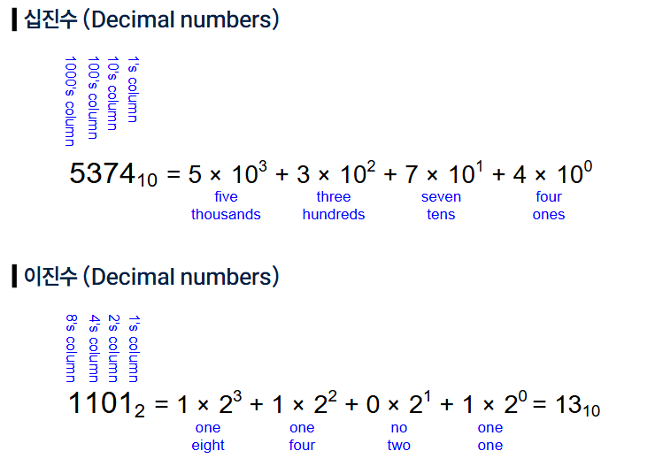

# 0401(AI / 리소스 효율적 학습법 , 모델 경량화).md

# 파인튜닝 및 AI모델 활용
” 리소스 효율적 AI 모델 “

## 1. 컴퓨터의 수 체계

## 1-1. 수 체계 (Number System)

## 1-1. 수 체계의 변환

> **이진수 → 십진수**
> 

> **십진수 → 이진수**
> 

## 1-1. 2의 거듭제곱 (Power of Two)

> **보다 큰 수를 쉽게 어림짐작 할 수 있음**
> 

## 1-1. 16진수 (Hexadecimal Numbers)

> **16진수 → 이진수**
> 

> **십진수 → 16진수**
> 

## 1-1. Bits, Bytes, Nibbles ,,,

## 1-1. 이진수의 값과 범위

## 1-1. 덧셈 (Addition)

## 1-1. 부호 있는 수 체계 (Signed Number System)

> **부호 - 크기 표현 방식 (signed-magnitude representation)**
> 

> **2의 보수 표현 방식 (two’s complement representation)**
> 

## 1-1. 부호-크기 표현 방식 (Signed-Magnitude Representation)

> **기존 덧셈에 문제 발생**
> 

## 1-1. 2의 보수 표현 방식 (Two’s Complement Representation)

> **기존 덧셈이 정상적으로 동작**
> 

> **2의 보수 표현에서 부호반전**
> 

## 1-1. 비트 폭 확장 (Increasing Bit Width)

> **N- bit 수를 M-bit 수로 확장 ( M > N )**
> 

## 1-1. 이진 수 체계 정리

> **C언어에서 정의된 정수 자료형 (data type)**
> 

> **int와 long의 역사**
> 

> **컴퓨터의 발전과 함께 혼란이  시작됨**
> 

> **크로스 플랫폼 개발 시 확인 필요**
> 

## 1-1. 고정소수점 수 체계 (Fixed-Point Number System)

> **N-bit 패턴이 꼭 정수일 필요는 없음**
> 

> **이진 소수점 위치는 실제 저장하지 않음!**
> 

## 1-2. 부동소수점 수 체계 (Floating-Point Number System)

> **아주 크거나 아주 작은 수를 효과적으로 표현해보자!**
> 

> **부동소수점**
> 

> **정해진 자리 수만 사용해서 부동소수점 “잘” 표현하기**
> 

> **유효숫자 그 다음은 어떻게 처리할까? (rounding scheme)**
> 

## 1-2. 이진 부동소수점 수 체계 (Binary Floating-Point Number System)

> **지수적 표현을 이진 수 체계에 어떻게 접목할 것인가**
> 

> **정규화된 이진 부동소수점 수 체계 (Normalized number)**
> 

> **정규화 표현의 한계**
> 

> **바이어스 / 편향 지수 (biased exponent)**
> 

> **이진 부동소수점의 표현 범위**
> 

> **다양한 (예전) 부동소수점 수 체계들**
> 

## 1-2. 부동소수점 표준 (IEEE 754 Standard)

> **컴퓨터 시스템에서 가장 널리 사용되는 이진 부동소수점 표준**
> 

## 1-2. IEEE Single-Precision 포맷

## 1-2. IEEE Double-Precision 포맷

## 1-3. 연산과 복잡도

## 1-3. 고정소수점 수 체계의 연산

> **이진 수 체계 정수의 덧셈**
> 

> **이진 수 체계 정수의 뺄셈**
> 

> **이진 고정소수점 수 체계 정수의 덧셈 / 뺄셈**
> 

> **이진 수 체계의 곱셈**
> 

> **이진 수 체계의 나눗셈**
> 

> **고정소수점 연산의 복잡도**
> 

> **이진 부동소수점 수 체계의 덧셈 / 뺄셈**
> 

> **이진 부동소수점 수 체계의 곱셈**
> 

> **이진 부동소수점 수 체계의 나눗셈**
> 

## 1-3. 상용 GPU의 다양한 연산자

## 2-1. 모델 경량화의 필요성

## 2-1. 바야흐로 AI/ML천하

> **(한계도 있지만) 이미 많은 영역에서 평균적으로 사람보다 우수함**
> 

## 2-1. AI/ML 세상의 어두운 면?

## 2-1. 모델 경량화 (Model compression)

> **선택이 아닌 필수가 되고 있음 (특히 추론/서비스 영역에서)**
> 

## 2-2. Quantization/Pruning/Distillation

## 2-2. 양자화 (Quantization)

> **연산/메모리 부하를 줄이는 가장 직관적인 방법**
> 

> **QAT vs. PTQ**
> 

> **Weight-activation vs. Weight only**
> 

> **Symmeytric vs. Asymmetric**
> 

> **Integer vs. Floation-Point**
> 

> **Mixed-precision quantizaion**
> 

## 2-2. 가지치기 (Pruning)

> **불필요한 (기여도가 적은) weight를 제거**
> 

> **Pruning rule?**
> 

> **Unstructured vs. Structured**
> 

> **Indexing data format**
> 

> **Fine-tuning/retraining 가능 여부**
> 

> **GPU  호환 여부**
> 

## 2-2. 지식 증류 (Knowledge Distillation)

> **작은 모델을 만드는 효과적 방법**
> 

> **어떻게 학생을 훈련 시키는가**
> 

> **보다 효율적인 지식 전달/증류 (Knowledge transfer/distillation)**
> 

> **LLM Distillation**
> 

## 2-3. LoRA/QLoRA

## 2-3. 파인 튜닝 (Fine Tuning)

> **모델 경량화 관점에서 파인 튜닝**
> 

> **모델 서비스 관점에서 (특히 LLM의 경우)**
> 

> **다양한 튜닝 방법론이 존재**
> 

> **파라미터 효율적 파인 튜닝 (Parameter Efficient Fine Tuning, PEFT)**
> 

> **그림으로 LoRA 이해하기**
> 

> **Quantized Low-Rank Adaptation (QLoRA)**
> 

