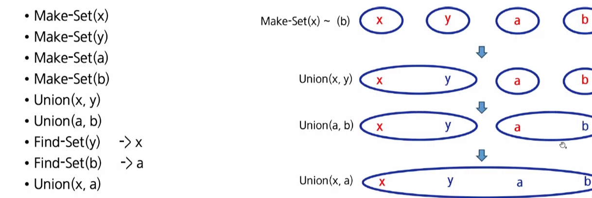
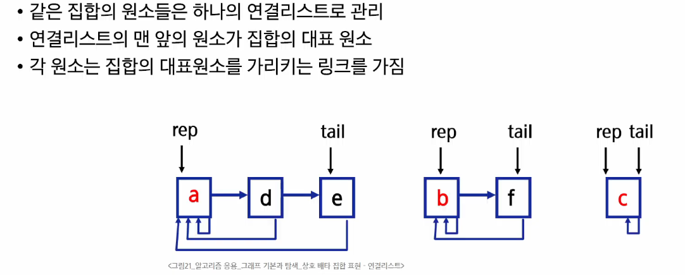

# 0406(Graph).md

## Union-Find (Disjoint Set) (서로소 집합)

> **서로소 집합 (Disjoint Set)**
> 
- 서로 공통 원소가 없는 집합
    - 교집합이 없는 집합들이다
- 대표자(representative)
    - 각 집합을 대표하는 하나의 원소를 말한다
- 상호 배타 집합
    - 확률, 논리, 집합론에서 동시에 일어날 수 없는 경우, 공통이 없는 경우를 말한다
    - 집합론에서 는 서로소와 같은 뜻으로 사용된다
- 표현 방법
    - 연결리스트로 표현할 수 있다
    - 트리를 이용해 표현할 수 있다

> **서로소 집합 연산**
> 
- Make-Set( x )
    - x를 원소로 가진 집합을 만든다
- Find-Set( x )
    - x가 속한 집합의 대표 원소를 반환한다
- Union( x, y)
    - y가 속한 집합과 x가 속한 집합의 합집합을 만든다
    - x가 합집합의 대표원소가 된다

> **상호배타 집합 예**
> 



> **상호 배타 집합 표현 - 연결리스트**
> 



> **상호 배타 집합 표현 - 트리**
> 


> **Union-find 학습**
> 
1. 개념과 기본 코드를 익힌다

```python
# 1. 각 집합을 만들어주는 함수
def make_set(n):
    # 1 ~ n 까지의 원소가 "각자 자기 자신이 대표자라고 설정"
    parents = [i for i in range(n + 1)]
    ranks= [0] * (n + 1)  # rank 를 모두 0으로 초기화
    return parents, ranks

# # 2. 집합의 대표자를 찾는 함수
# def find_set(x):
#     # 자신 == 부모 -> 해당 집합의 대표자
#     if x == parents[x]:
#         return x
#
#     # x 의 부모노드를 기준으로 다시 부모를 검색
#     return find_set(parents[x])

# [경로 압축 추가 코드]
def find_set(x):
    # 자신 == 부모 -> 해당 집합의 대표자
    if x == parents[x]:
        return x

    # 경로 압축 (path compression) 코드
    # - 내가 대표자를 바로 가리키도록
    parents[x] = find_set(parents[x])
    return parents[x]

# 3. 두 집합을 합치는 함수
def union(x, y):
    # 1. x, y 의 대표자를 검색
    rep_x = find_set(x)
    rep_y = find_set(y)

    # 만약 이미 같은 집합
    if rep_x == rep_y:
        return  # 같은 집합끼리는 합칠 필요가 없다

    # [기본] 그냥 둘 중 한 곳으로 연결하기
    # - 집합의 크기가 다른 경우 시간이 많이 느릴 수 있다.
    # parents[rep_y] = rep_x

    # [살짝 응용] 인덱스가 무조건 더 작은쪽으로 연결하자
    # - 집합의 크기가 다른 경우 시간이 많이 느릴 수 있다.
    # if rep_x < rep_y:
    #     parents[rep_y] = rep_x
    # else:
    #     parents[rep_x] = rep_y

    # 덩치가 더 작은 집합(==rank 가 더 낮은 집합)이 더 큰 집합 밑으로 가야한다.
    if ranks[rep_x] < ranks[rep_y]:
        parents[rep_x] = rep_y
    elif ranks[rep_x] > ranks[rep_y]:
        parents[rep_y] = rep_x
    else:
        # rank 가 동일하다
        # -> 한 쪽으로 병합하고, 대표자의 rank 를 + 1
        parents[rep_y] = rep_x
        ranks[rep_x] += 1

N = 6
parents, ranks = make_set(N)

union(2, 4)
union(4, 6)

if find_set(2) == find_set(6):
    print("2 와 6은 같은 집합")
else:
    print("다른 집합")

```

> **튜닝**
> 
1. find_set의 비효율적인 부분 제거 (경로 압축)
2. 대표자끼리 합치는 구간 (작은 집합 → 큰 집합 밑으로 / rank 활용)


> **Union-find 사용 문제**
> 
1. 집합 관련 문제
2. 그래프 사이클 여부를 체크할 때