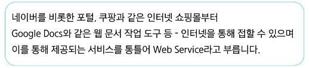

# 0409(Django / Intro & Design Pattern).md

# Django

# Web application (web service) 개발

- 인터넷을 통해 사용자에게 제공되는 소프트위어 프로그램을 구축하는 과정
- 다양한 디바이스 (모바일, 태블릿, PC 등)에서 웹 브라우저를 통해 접근하고 사용할 수 있다

## 클라이언트와 서버

> **웹의 동작 방식**
> 

→ 우리가 컴퓨터 혹은 모바일 기기로 웹 페이지를 보게 될 때까지 무슨 일이 일어날까?

> **클라이언트 - 서버 구조**
> 

- Client - 서비스를 요청하는 주체
    - 사용자의 웹 브라우저, 모바일 앱
- Server - 클라이언트의 요청에 응답하는 주체
    - 웹 서버, 데이터베이스 서버

## Frontend & Backend

> **Frontend (프론트엔드)**
> 

: 사용자 인터페이스 (UI)를 구성하고, 사용자가 애플리케이션과 상호작용할 수 있도록 한다

→ HTML, CSS, JavaScript, 프론트엔드 프레임워크 등

> **Backend (백엔드)**
> 

: 서버 측에서 동작하며, 클라이언트의 요청에 대한 처리와 데이터베이스와의 상호작용 등을 담당한다

→ 서버 언어 (Python, Java 등) 및 백엔드 프레임워크, 데이터베이스, API, 보안 등

## Framework

> **Web Framework**
> 

: 웹 애플리케이션을 빠르게 개발할 수 있도록 도와주는 도구

→ 개발에 필요한 기본 구조, 규칙, 라이브러리 등을 제공(로그인 / 로그아웃, 회원관리, 데이터베이스, 보안 등)

## Django Framework

## Django

**: Python 기반의 대표적인 웹 프레임워크**

> **다양성**
> 

: python 기반으로 웹, 모바일 앱 백엔드, API 서버 및 빅데이터 관리 등 광범위한 서비스 개발에 적합하다

> **확장성**
> 

: 대량의 데이터에 대해 빠르고 유연하게 확장할 수 있는 기능을 제공한다

> **보안**
> 

: 취약점으로부터 보호하는 보안 기능이 기본적으로 내장되어 있다

> **커뮤니티 지원**
> 

: 개발자를 위한 지원, 문서 및 업데이트를 제공하는 활성화 된 커뮤니티가 있다

## 가상 환경 (Virtual Environment)

**: 하나의 컴퓨터 안에서 또 다른 ‘독립된’ 파이썬 환경**

> **Python 환경 구조 예시**
> 
- Python global : 컴퓨터 전체에서 사용되는 기본 Python 환경을 지칭한다

> **가상 환경 생성 및 활성화 과정**
> 
1. 가상 환경 생성
    
    `$ python -m venv venv`
    
    - 현재 디렉토리 안에 venv 라는 폴더가 생성된다
    - venv 폴더 안에는 파이썬 실행 파일, 라이브러리 등을 담을 공간이 마련된다
    - venv라는 이름의 가상 환경을 생성한 것
    
2. 가상 환경 활성화
    
    `$ source venv/Scripts/activate` 
    
    - 활성화 후, 프롬프트 앞에 (venv)와 같이 표시된다면 성공 한 것이다
    
    ※ Mac / Linux 에서는 명령어가 다르니 주의
    
    → `$ source vevn/bin/activate` 
    
    
    

1. 가상 환경 종료
    
    `$ deactivate` 
    
    - 활성화 된 상태에서 deactivate 명령을 입력하면, 다시 Python Global 환경으로 돌아온다

## 의존성 패키지

> **의존성 (Dependencies)**
> 

: 하나의 소프트웨어가 동작하기 위해 필요로 하는 다른 소프트웨어나 라이브러리

> **의존성 패키지**
> 

: 프로젝트가 의존하는 “ 개별 라이브러리 “ 들을 가리키는 말

→ “ 프로젝트가 실행되기 위해 꼭 필요한 각각의 패키지 “

> **패키지 목록 확인**
> 

`$ pip list`

→ 현재 가상 환경에 설치된 라이브러리 목록을 확인하는 명령어

- pip : 외부 패키지들을 설치하도록 도와주는 파이썬의 패키지 관리 시스템
- 갓 생성된 가상 환경은 추가 설치된 패키지가 없다
    
    
    

## 의존성 관리 : 환경의 일치

> 
> 
> 
> **의존성 기록 (내보내기)**
> 

`$ pip freeze > requirements.txt` 

→ 현재 가상 환경에 설치된 모든 패키지와 버전을 파일로 저장한다

- pip freeze : 가상 환경에 설치된 모든 패키지를 버전과 함께 특정한 형식으로 출력하는 명령어이다

※ 다른 파일명으로도 가능하나 관례적으로  requirenments.txt를 사용한다

> 
> 
> 
> **의존성 설치 (가져오기)**
> 

`$ pip install -r requirements.txt`

→ requirements.txt 에 명시된 라이브러리를 한 번에 설치한다

> **의존성 리스트 예시**
> 
- requests 패키지 설치 후 현재 가상 환경의 패키지 목록 변화
    - requests : Python에서 HTTP 요청을 보낼 수 있게 해주는 패키지이다

> **의존성 패키지 관리가 필요한 이유**
> 
- 환경의 통일
    - 버전이 다른 경우 함수명이나 동작이 달라질 수 있음
    - “내 컴퓨터에선 되는데 네 컴퓨터에선 안돼” 문제 해결
- 협업 효율
    - 프로젝트가 커질수록 사용하는 패키지의 개수도 늘어나게 됨
    - 팀원 간 동일한 개발 환경을 즉시 구축 가능

## 가상 환경 주의사항

> **가상 환경 주의사항 및 권장사항**
> 
1. 가상 환경에 “들어가고 나오는” 것이 아니라 사용할 Python 환경을 “On/Off”로 전환하는 개념
    - 가상 환경 활성화는 현재 터미널 환경에만 영향을 끼친다
    - 새 터미널 창을 열면 다시 활성화해야 한다
2. 프로젝트마다 별도의 가상 환경을 사용
3. 일반적으로 가상 환경 폴더 venv는 관련된 프로젝트와 동일한 경로에 위치시킨다
4. 폴더 venv는 **.gitignore** 파일에 작성되어 원격 저장소에 공유하지 않는다
    - 저장소 크기를 줄여 효율적인 협업과 배포를 가능하게 하고
    - OS 별 차이점으로 인한 문제를 방지하기 위함이다
    - 대신 requirements.txt를 공유하여 각자의 가상 환경을 구성한다

> **가상 환경이 필요한 이유**
> 

## Django 프로젝트

### Django 프로젝트 생성 및 서버 실행

> **Django 프로젝트 생성 및 서버 실행 과정**
> 
1. Django 설치
2. 프로젝트 생성
3. 서버 실행

> **Django 설치**
> 

`$ pip install django`

- 현재 환경에서 Django 패키지를 설치

> **프로젝트 생성**
> 

`$ django-admin startproject firstpjt .`

- “firstpjt” 라는 이름의 django 프로젝트를 생성한다

> **서버 실행**
> 

`$ python [manage.py](http://manage.py) runserver`

- “manage.py” 와 동일한 위치에서 명령어를 진행한다

> **서버 확인**
> 

> **서버 종료**
> 

`ctrl + C`

## Django Design Pattern

### 디자인 패턴(Design Pattern)

: 소프트웨어 설계에서 반복적으로 발생하는 문제에 대한, 검증되고 재사용 가능한 일반적인 해결책

### MVC(Model, View, Controller) 디자인 패턴

: 하나의 애플리케이션을 구조화하는 대표적인 구조적 디자인 패턴이다

> **Model**
> 
- 데이터 및 비지니스 로직을 처리한다

> **View**
> 
- 사용자에게 보이는 화면을 담당한다

> **Controller**
> 
- 사용자의 입력을 받아 Model과 View를 제어한다

**→ 시각적 요소와 뒤에서 실행되는 로직을 서로 영향 없이, 독립적이고 쉽게 유지 보수할 수 있는 애플리케이션을 만들기 위함이다**

### MTV(Model, Template, View) 디자인 패턴

: Django에서 애플리케이션을 구조화하는 디자인 패턴

### 프로젝트와 앱

: Django에서 프로젝트와 앱의 관계

> **Django project**
> 
- 애플리케이션의 집합
    - DB 설정, URL 연결, 전체 앱 설정 등을 처리한다

> **Django application**
> 
- 독립적으로 작동하는 기능 단위 모듈
    - 각지 특정한 기능을 담당한다
    - 다른 앱들과 함께 하나의 프로젝트를 구성한다

> **앱 생성**
> 

`$ python [manage.py](http://manage.py) startapp articles`

- ‘articles’ 라는 폴더와 내부에 여러 파일로 새로 생성된다

> **앱 등록**
> 
- 반드시 앱을 생성한 후에 등록해야 한다 (등록 후 생성은 불가하다)
- 처음 서버를 만들때 생성했던 폴더 안에, [settings.py](http://settings.py) 파일 내부 내용에 등록

### 프로젝트 및 앱 구조

### 프로젝트 구조

> **settings.py**
> 

: 프로젝트의 모든 설정을 관리한다

> **urls.py**
> 

: 요청 들어오는 URL에 따라 이에 해당하는 적절한 views를 연결한다

> **__ init __.py**
> 

: 해당 폴더를 패키지로 인식하도록 설정하는 파일이다

> **asgi.py**
> 

: 비동기식 웹 서버와의 연결 관련을 설정한다

> wsgi.py
> 

: 웹 서버와의 연결 관련 설정을 한다

> **manage.py**
> 

: Django 프로젝트와 다양한 방법으로 상호작용하는 커맨드라인 유틸리티이다

### 앱 구조

> **admin.py**
> 

: 관리자용 페이지 설정

> **models.py**
> 

: DB와 관련된 Model을 정의 / MTV 패턴의 M

> **views.py**
> 

: HTTP 요청을 처리하고 해당 요청에 대한 응답을 반환한다 (url, model, template와 연동) / MTV 패턴의 V

> **apps.py**
> 

: 앱의 정보가 작성된 곳

> **tests.py**
> 

: 프로젝트 테스트 코드를 작성하는 곳

### 요청과 응답

> **URLs**
> 

> **View**
> 

→ index 함수 정의할 때 request라는 변수 선언 (Django에서 정해둔 규칙?)(사용자 요청 정보를 받아옴)

> **Template**
> 

> **Django에서 template을 인식하는 경로 규칙 (중요)**
> 

> **데이터 흐름에 따른 코드 작성하기**
> 

## 참고

### 가상 환경 생성 루틴

### Django 관련

### python 패키지 설치법

### render 함수

### MTV 디자인 패턴 정리

### Trailing Comma

### 프레임워크의 규칙 및 설계 철학

## 정리

