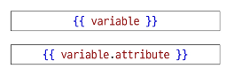

# 0414(Django / Template & URLs / Model).md

# Django Template System

: 파이썬 데이터 (context)를 HTML 문서 (Template)와 결합하여, 로직과 표현을 분리한 채 동적인 웹페이지를 생성하는 도구

> **Django Template system의 목적**
> 

:  ‘페이지 틀’에 ‘데이터’를 동적으로 결합하여 수 많은 페이지를 효율적으로 만들어 내기 위함이다

## Django Template Language(DTL)

: Template에서 조건, 반복, 변수 등의 프로그래밍적 기능을 제공하는 시스템

> **DTL Syntax**
> 
1. Variable
2. Filters
3. Tags
4. Comments

> **Vartiable**
> 

: Django Template에서의 변수

- render 함수의 세번째 인자로 딕셔너리 타입으로 전달된다
- 해당 딕셔너리 key에 해당하는 문자열이 template에서 사용 가능한 변수명이 된다
- dot(’.’) 을 사용하여 변수 속성에 접근할 수 있다

> **Filters**
> 

: 표시할 변수를 수정할 때 사용 ( 변수 + ‘ | ‘ + 필터 (

- chained(연결)이 가능하며 일부 필터는 인자를 받기도 한다
- 약 60개의 built-in template filters를 제공한다

> **Tags**
> 

: 반복 또는 논리를 수행하여 제어 흐름을 만든다

- 일부 태그는 시작과 종료 태그가 필요하다
- 약 24개의 built-in template tags를 제공한다

- if, else, endif 태그

- for 태그

→ 값을 만들 때 파이썬 문법 (range(1, 10, 1) 과 같은) 사용 가능

→ html에서 문법을 쓰는 것이 아니라, 데이터를 넘길때 py에서 문법을 활용하여 만든 후 넘기는 방식

> **Comments**
> 
- 주석

> **DTL 예시**
> 

## 템플릿 상속

> **기본 템플릿 구조의 한계**
> 
- 만약 모든 템플릿에 Bootstrap을 적용하려면?
    
    → 모든 템플릿에 Bootstrap CDN을 작성해야 할까?
    

> **템플릿 상속 (Template inheritance)**
> 
1. 페이지의 공통요소를 포함한다
2. 하위 템플릿이 재정의 할 수 있는 공간을 정의한다
    
    → 여러 템플릿이 공통요소(base.html)를 공유할 수 있게 해주는 기능이다
    

## 상속 관련 DTL 태그

> **‘extend’ tag**
> 

> **‘block’ tag**
> 

## 요청과 응답

## HTML form

> **데이터를 보내고 가져오기 (Sending and Retrieving form data)**
> 

: HTML ‘ form ‘ element를 통해 사용자와 애플리케이션 간의 상호작용 이해하기

> **HTML form**
> 

: HTTP 요청을 서버에 보내는 가장 편리한 방법이다

> **실제 웹 서비스에서 form이 사용되는 예시**
> 

> **‘form’ element**
> 

: 사용자로부터 할당된 데이터를 서버로 전송하는 HTML 요소

→ 웹에서 사용자 정보를 입력하는 여러 방식 (text, password, checkbox 등) 을 제공한다

### HTML form 핵심 속성

> **‘action’ & ‘method’**
> 

: form의 핵심 속성 2가지

→ 데이터를 어디 (action)로 어떤 방식 (method)으로 요청할지

> **‘input’ element**
> 

: 사용자의 데이터를 입력 받을 수 있는 HTML 요소,  type 속성 값에 따라 다양한 유형의 입력 데이터를 받음

→ 핵심 속성 - ‘name’

> **‘name’ attribute**
> 

> **Query String Parameters**
> 

: 사용자의 입력 데이터를 URL 주소에 따라 파라미터를 통해 서버로 보내는 방법

### HTML form 활용

> 
> 
> 
> **throw 로직 작성 (입력)**
> 

> 
> 
> 
> **catch 로직 작성 (처리)**
> 

### HTTP request 객체

: form으로 전송한 데이터 뿐만 아니라 Django로 들어오는 모든 요청 관련 데이터가 담겨있다.

(view 함수가 호출될 때 첫번째 인자로 전달된다)

- QueryDict → 유사 딕셔너리 형태의 장고의 데이터타입

## Django URLs

> **요청과 응답에서 Django URLs의 역할**
> 

: 요청 URL에 따라 실행될 view 함수가 달라진다

### URL dispatcher (운항 관리자, 분배기)

: URL 패턴을 정의하고 해당 패턴이 일치하는 요청을 처리할 view 함수를 연결 (매핑)

### Variable Routing

## App URL

### App URL mapping

: 각 앱에 URL을 정의하는 것

→ 프로젝트와 각 앱이 URL을 나누어 관리를 편하게 하기 위함이다

→ 각 어플리케이션 별로 urls.py를 만들어서 매핑하는 방식

### include 함수

> **include(’app.urls’)**
> 

: 프로젝트 내부 앱들의 URL을 참조할 수 있도록 매핑하는 함수이다

→ URL의 일치하는 부분까지 잘라내고, 남은 문자열 부분은 후속 처리를 위해 include된 URL로 전달

## URL 이름 지정

### Naming URL patterns

### DTL URL tag

> **‘url’ tag**
> 

****

: 주어진 URL 패턴의 이름과 일치하는 절대 경로 주소를 반환한다

## URL 이름 공간

### app_name 속성

## 참고

## 추가 템플릿 경로

## DTL 주의사항

## Trailing Slashes

> **render 함수**
> 

# Model

: 데이터베이스와 Python 클래스(객체)로 추상화된 형태로 상호작용

> **Model을 통한 DB(데이터베이스) 관리**
> 

## Model class

: DB의 테이블을 정의하고 데이터를 조작할 수 있는 기능들을 제공한다

## Model Field

: DF  테이블의 필드 (열) 정의, 데이터 타입 (Field types) 및 제약 조건 (Field options) 명시

### Field types

: 데이터베이스에 저장될 “데이터의 종류”를 정의한다

(models 모듈의 클래스로 정의되어 있음)

> **CharField( )**
> 

: 제한된 길이의 문자열을 저장  (필드의 최대 길이를 결정하는 max_length는 선택 옵션이다)

> **TextField( )**
> 

: 길이 제한이 없는 대용량 텍스트를 저장한다 (무한대는 아니며 사용하는 시스템에 따라 달라진다)

> **주요 필드 유형**
> 

### Field options

: 필드의 “ 동작 “ 과 “ 제약 조건 “ 을 정의한다

> **제약 조건 (Constraint)**
> 

: 특정 규칙을 강제하기 위해 테이블의 열이나 행에 적용되는 규칙이나 제한 사항

> **주요 필드 옵션**
> 

## Migrations

: model 클래스의 변경사항 (필드 생성, 수정 삭제 등)을 DB에 최종 반영하는 방법이다

> **Migrations 과정 핵심 정리**
> 

> **Migrations 핵심 명령어 2가지**
> 

> **Migration 경고 메시지**
> 

### 추가 Migrations

> **DateTimeField의 필드 옵션 (optional)**
> 

> **언제 Migration이 필요할까?**
> 

## Admin site

### 관리자 인터페이스 (Automatic admin interface)

: Django가 추가 설치 및 설정 없이 자동으로 제공하는 관리자 인터페이스

> **Django admin 계정 생성**
> 

> **DB에 생성된 admin 계정 확인**
> 

> **관리자 인터페이스 페이지**
> 

> **관리자 인터페이스 접속 확인**
> 

> **Admin site 모델 클래스 등록 및 확인**
> 

> **데이터 생성, 수정, 삭제 테스트**
> 

## 참고

### 데이터베이스 초기화

→ 반드시 서버 종류 후에 초기화 (그렇지 않으면 좀비처럼 데이터가 남아있음)

### Migrations 관련

### SQLite

