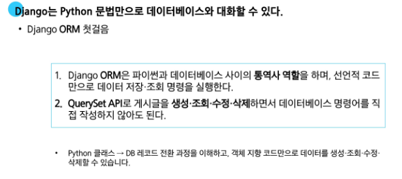

# 0415(Django / ORM / ORM with view).md

# ORM(Object-Relational-Mapping)

: 객체 지향 프로그래밍 언어의 객체 (Object) 와 데이터베이스의 데이터를 매핑 (Mapping) 하는 기술

- 매핑(Mapping) : 서로 다른 형태를 가진 코드 상의 ‘객체’와 데이터베이스의 ‘테이블(데이터)’이 서로 1:1 로 대응되도록 연결해 주는 것

> **ORM의 역할 : 번역자 역할**
> 

> **Django의 데이터 상호작용 : ORM이 일하는 방법**
> 
- ORM은 Django 개발자를 위해 ‘QuerySet API’라는 특별한 도구를 제공한다
    - QuerySet API는 ORM의 기능을 개발자가 Python 코드 안에서 객체 지향적이고 직관적인 방식으로 데이터베이스를 조작할 수 있도록 제공하는 **인터페이스**이다

## QuerySet API

: 데이터베이스의 복잡한 SQL 쿼리문을, 직관적인 Python 코드로 다룰 수 있게 해주는 강력한 번역기

> **QuerySet API와 ORM의 동작 방식**
> 
1. **Django → DB : Django (QuerySet API)에서 ORM을 통해 데이터베이스로 정보를 요청할 때**
    - SQL 쿼리로 변환되어 데이터베이스로 전달된다
2. **DB → Django : 데이터베이스가 요청에 대한 응답을 보낼 때**
    - ORM은 이 SQL 결과를 다시 파이썬이 이해할 수 있는 Python Object
    - QuerySet 또는 Instance 형태로 변환하여 Django로 반환한다

> **QuerySet API 구문 기본 구조**
> 

- **Article (모델 클래스)**
    - 역할 : 데이터베이스 테이블에 대한 Python 클래스 표현
    - articles_article 테이블의 스키마(필드, 데이터 타입 등)를 정의하며, Django ORM이 데이터베이스와 상호작용할 때 사용하는 기본적인 구조체이다
- **.Objects (매니저, manager)**
    - 역할 : 데이터베이스 조회(Query) 작업을 위한 기본 인터페이스
    - 모델 클래스가 데이터베이스 쿼리 작업을 수행할 수 있도록 하는 진입점이다
    - Django 는 모든 모델에 object라는 이름의 매니저를 자동으로 추가하며, 이 매니저를 통해 .all( ), .filter( ) 등의 쿼리 메서드를 호출한다
- **.all( ) (QuerySetAPI 메서드)**
    - 역할 : 특정 데이터베이스 작업 수행하는 명령
    - 매니저를 통해 호출되는 메서드로, 해당 모델과 연결된 테이블의 모든 레코드(rows)를 조회하라는 SQL 쿼리를 생성하고 실행한다

> **QuerySet API와 ORM의 동작 방식 예시**
> 

> **Query란?**
> 
- 데이터베이스에 특정한 데이터를 보여 달라는 요청이다
- “ 쿼리문을 작성한다. “
    - “  원하는 데이터를 얻기 위해(수정, 생성, 삭제) 데이터베이스에 요청을 보낼 **코드**를 작성한다. ”
- Django에서 Query가 처리되는 과정 정리
    1. 파이썬 코드 → ORM : 개발자의 QuerySet API (파이썬 코드) 가 ORM으로 전달
    2. ORM → SQL 변환 : ORM이 이를 데이터베이스용 SQL 쿼리로 변환하여 데이터베이스에 전달
    3. DB 응답 → ORM : 데이터베이스가 SQL 쿼리를 처리하고 결과 데이터를 ORM에 반환
    4. ORM → QuerySet 변환 : ORM이 데이터베이스의 결과를 QuerySet (파이썬 객체) 형태로 변환하여 우리에게 전달

> **QuerySet이란?**
> 
- 데이터베이스에서 전달받은 **객체 목록 (데이터 모음) → 유사 리스트**
- **순회(반복) 가능한 데이터**로 1개 이상 데이터를 불러와 사용 가능하다
- Django ORM을 통해 만들어진 자료형이다
- 단, 데이터베이스가 단일 객체를 반환할 때는 QuerySet이 아닌 모델 (Class) 의 인스턴스로 반환된다

### CRUD (Create Read Update Delete)

: 대부분의 소프트웨어가 가지는 기본적인 데이터 처리 기능인 생성, 조회, 수정, 삭제를 묶어 이르는 말

### Create

> **데이터 객체를 만드는 (생성하는) 3가지 방법**
> 
1. 빈 객체 생성 후 값 할당 및 저장

1. 초기 값과 함께 객체 생성 및 저장

> **save( ) 메서드**
> 

: 객체를 데이터베이스에 저장하는 인스턴스 메서드

1. create( ) 메서드로 한 번에 생성 및 저장

### Read

> **대표적인 조회 메서드**
> 
- QuerySet 반환 메서드
    - all( ) : 전체 데이터 조회
        
        
        
    - filter( ) : 주어진 매개변수와 일치하는 객체를 포합하는 QuerySet 반환
        
        
        
- QuerySet을 반환하지 않는 메서드
    - get( ) : 주어진 매개변수와 일치하는 **객체를 반환(오직 하나만 / 기본키나 식별가능한 후보키로)**
        
        
        
        - get( ) 의 특징
        
        
        

### Update

> **데이터 수정 방법**
> 
- 인스턴스 변수를 변경 후  save 메서드 호출

### Delete

> **데이터 삭제 방법**
> 
- 삭제하려는 데이터 조회 후 delete 메서드 호출

## ORM with view

### 전체 게시글 조회

> **View 함수에서 QuerySet API 활용하기**
> 

## 참고

### Field lookups : 데이터 필터링의 마법

: 단순 동치 비교 (=) 를 넘어 더 상세한 조건으로 데이터를 조회할 수 있도록 Django ORM이 제공하는 기능

> **Field lookups의 간단한 예시**
> 

> **다양한 조건의 Field lookups 조회 조건**
> 

### ORM, QuerySet API를 사용하는 이유

1. 데이터베이스 추상화
    - 개발자는 특정 데이터베이스 시스템에 종속되지 않고 일관된 방식으로 데이터를 다룰 수 있다
2. 생산성 향상
    - 복잡한 SQL 쿼리를 직접 작성하는 대신 Python 코드로 데이터베이스 작업을 수행할 수 있다
3. 객체 지향적 접근
    - 데이터베이스 테이블을 Python 객체로 다룰 수 있어 객체 지향 프로그래밍의 이점을 활용할 수 있다

# ORM with view

### Read

> **2가지 Read(조회) 진행**
> 
1. 전체 게시글 조회

1. 단일 게시글 조회

### Create

new → throw

create → catch

## HTTP request methods

### HTTP

: 네트워크 상에서 데이터(리소스) 를 주고 받기 위한 약속

> **HTTP request methods란?**
> 
- 데이터에 대해 수행을 원하는 작업(행동)을 나타내는 것
    - 서버에게 원하는 작업의 종류를 알려주는 역할
- 대표적인 메서드
    - GET : 리소스 조회 (URL에 데이터가 노출됨 , 캐싱 가능)
    - POST : 데이터 생성/전송 (요청 본문에 데이터, 데이터 노출 없음)
- 캐싱 : 자주 사용하는 데이터나 결과를 임시로 저장해두고 재활용하여 처리 속도를 높이는 기술이다

### GET method

> **‘GET’ Method**
> 

: 서버로부터 데이터를 요청하고 받아오는 데(조회) 사용한다

> **‘GET” Method 특징**
> 

### POST method

> **‘POST’ Method**
> 

: 서버에 데이터를 제출하여 리소스를 변경(생성, 수정, 삭제) 하는 데 사용

> **‘POST’ Method 특징**
> 

> **‘GET’  &  ‘POST’ Method 정리**
> 

### POST method 변경

### HTTP response status code

: 서버가 클라이언트의 요청에 대한 처리 결과를 나타내는 3자리 숫자

## CSRF (Cross-Site-Request-Forgery)

: 사이트 간 요청 위조

→ 사용자가 자신의 의지와는 무관하게 공격자가 의도한 행동 (글쓰기, 정보 수정, 송금 등)을 특정 웹사이트에 요청하게 만드는 해킹 방식이다

> **CSRF ( 위조된 인감도장)**
> 

> **CSRF 공격의 방어**
> 

> **CSRF Token 적용**
> 

> **요청 시 CSRF Token을 함께 보내야 하는 이유**
> 

> **그런데 왜 POST일 때만 Token을 확인할까?**
> 

> **게시글 작성 결과**
> 

## Redirect

> **현재 문제 상황 : 게시글 작성 후 응답 방식**
> 

> **게시글이 작성 성공 페이지 응답의 문제점**
> 

> **게시글이 작성 성공 후 적절한 응답 방법**
> 

> **게시글이 작성 성공 후 적절한 응답 방법**
> 

> **redirect( ) 함수 적용**
> 

## Delete

## Update

> **update - 기능 구현**
> 

## 참고

### 캐시 (Cache)

: 데이터나 정보를 임시로 저장하여, 다시 요청할 때 빠르게 제공하는 저장 공간이다

