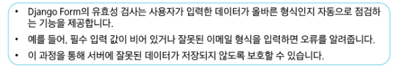

# 0416(Django Form).md

# Form

## Django Form

### HTML ‘form’

: 지금까지 사용자로부터 데이터를 제출 받기 위해 활용한 방법

(그러나 비정상적 혹은 악의적인 요청을 필터링 할 수 없다)

- 유효한 데이터인지에 대한 확인이 필요하다

### 유효성 검사

: 수집한 데이터가 정확하고 유효한지 확인하는 과정이다

## Form Class

### Django Form

: 사용자 입력 데이터를 수집하고, 처리 및 유효성 검사를 수행하기 위한 도구

> **Form Class 정의**
> 
- Form Class를 상속받아 내용과 제목에 대한 사용자 입력을 받는 ArticleForm을 정의하는 방법

> **Form Class를 적용한 new logic**
> 

### Widgets

: 폼 필드를 화면에 표시하는 HTML 입력 요소를 정의하는 구성 요소

→ HTML ‘input’ element의 표현을 담당한다

> **Widget 적용**
> 

## Django ModelForm

> **Form VS. ModelForm**
> 

> **ModelForm**
> 

: Model과 연결된 Form을 자동으로 생성해주는 기능을 제공한다

> **ModelForm class 정의**
> 

> **Django ModelForm**
> 

> **ModelForm class가 대체하는 것**
> 

### Meta class

: ModelForm의 정보를 작성하는 곳

> **‘ fields ‘ 및 ‘ exclude ‘ 속성**
> 

> **Meta class 주의사항**
> 
- Django에서 ModelForm에 대한 추가 정보나 속성을 작성하는 클래스 구조를 Meta 클래스로 작성 했을 뿐이며, 파이썬의 inner class와 같은 문법적인 관점으로 접근하지 말 것

### ModelForm 적용

> **ModelForm을 적용한 create 로직**
> 

> **is_valid( ) 활용**
> 
- is_valid( ) : 여러 유효성 검사를 실행하고, 데이터가 유효한지 여부를 Boolean으로 반환한다

> **공백 데이터가 유효하지 않은 이유와 에러 메시지가 출력되는 과정**
> 

> **ModelForm을 적용 edit 로직**
> 

> **ModelForm을 적용한 update 로직**
> 

### save 메서드

> **save( )**
> 

: 데이터베이스 객체를 만들고 저장하는 ModelForm의 인스턴스 메서드

> **save( ) 메서드가 생성과 수정을 구분하는 법**
> 

> **Django Form 정리**
> 

## HTTP 요청 다루기

### View 함수 구조 변화

> **new & create view 함수 간 공통점과 차이점**
> 

> **view 함수 구조화의 목적**
> 

### new & create 함수 결합

> **new & create 함수 결합**
> 

> **새로운 create view 함수**
> 

> **기존 new 관련 코드 수정**
> 

> **request method에 따른 요청의 변화**
> 

### edit & update 함수 결합

> **새로운 update view 함수**
> 

> **기존 edit 관련 코드 수정**
> 

## 참고

### ModelForm의 키워드 인자 구성

> **ModelForm 키워드 인자 data와 instance 살펴보기**
> 

### Widgets 응용

### 필드를 수동으로 렌더링

