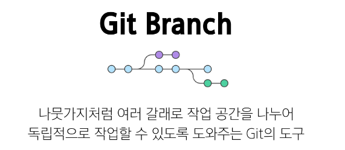

# 0417(Model 설계 / Git Branch).md

# GIT

## Git Branch

> **Branch의 장점**
> 
1. 독립된 개발 환경을 형성하기 때문에 원본(master)에 대해 안전
2. 하나의 작업은 하나의 브랜치로 나누어 진행되므로 체계적으로 협업과 개발이 가능
3. 손쉽게 브랜치를 생성하고 브랜치 사이를 이동할 수 있음

> **Branch를 꼭 사용해야 할까?**
> 

> **Master (main) 브랜치의 의미와 역할**
> 

### Branch Command

> **git branch**
> 

> **git switch**
> 

> **HEAD**
> 

> **git switch 주의 사항**
> 

### Branch Scenario

> **사전 준비**
> 

> **commit 진행 방향과 화살표 표기 방향이 다른 이유**
> 
- commit은 이전 commit 이후에 변경사항만을 기록한 것
- 즉, **이전 commit에 종속되어 생성**된다
- 일반적으로 화살표 방향을 이전 commit을 가리키도록 표기한다

### Branch 생성 및 조회

> **Branch 생성 및 조회**
> 

> **Branch 이동**
> 

> **Branch에서 commit 생성**
> 

### git branch 정리

## Git Merge

> **병합 전 확인 및 주의사항**
> 

> **Merge 종류**
> 
1. Fast-Forward Merge
2. 3-way Merge

### Fast-Forward Merge

> **Fast-Forward 동작 원리**
> 

> **Fast-Forward Merge**
> 

### 3-Way Merge

> **3-Way Merge 동작 원리**
> 

> **3-Way Merge**
> 

### Merge Conflict

> **git이 충돌을 표시하는 방식**
> 

> **git 충돌을 해결하는 과정**
> 

> **Merge Conflict**
> 

## Git workflow

### Feature Branch Workflow

## Git Flow

> **Git Flow란 무엇인가?**
> 

> **Git Flow 전체 흐름도**
> 

## Forking Workflow

