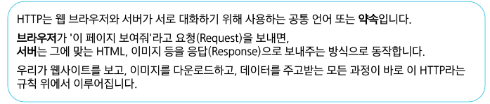

# 0421(Django / Authentication 01).md

# Authentication System

## Cookie & Session

### HTTP (HyperText Transter Protocol)

: HTML 문서와 같은 리소스들을 가져올 수 있도록 해주는 규약 (웹에서의 모든 데이터 교환의 기초)

> **HTTP 특징**
> 
1. **비 연결 지향 (connectionless)**
    - 서버는 요청에 대한 응답을 보낸 후 연결을 끊음
    - 클라이언트는 서버와 서로 연결되어 있는 상태가 아니다

1. **무상태(stateless)**
    - 연결을 끊는 순간 클라이언트와 서버 간의 통신이 끝나며 상태 정보가 유지되지 않는다
    - 무상태의 의미
        - 장바구니에 담은 상품을 유지할 수 없음
        - 로그인 상태를 유지할 수 없음

### 쿠키 (Cookie)

: 서버가 사용자의 웹 브라우저에 전송하는 작은 데이터 조각이다

> **쿠키 특징**
> 
- 서버가 사용자의 웹 브라우저에 전송하는 작은 데이터 조각
- 사용자 인증, 추적, 상태 유지 등에 사용되는 데이터 저장 방식
- key-value 형식의 데이터

> **쿠키 사용 예시**
> 
- 로그인 유지(세션 관리)
- 장바구니
- 언어, 테마 등 사용자 설정 기억

> **쿠키 동작 예시**
> 

> **쿠키를 이용한 장바구니 예시**
> 

> **쿠키의 작동 원리와 활용**
> 
1. **쿠키 저장 방식**
    - 브라우저 (클라이언트)는 쿠키를 KEY-VALUE의 데이터 형식으로 저장한다
    - 쿠키에는 이름, 값 외에도 만료 시간, 도메인, 경로 등의 추가 속성이 포함 된다
2. **쿠키 전송 과정**
    - 서버는 HTTP 응답 헤더의 Set-Cookie 필드를 통해 클라이언트에게 쿠키를 전송한다
    - 브라우저는 받은 쿠키를 저장해 두었다가, 동일한 서버에서 재요청 시 HTTP 요청 Header의 Cookie 필드에 저장된 쿠키를 함께 전송한다
3. **쿠키의 주요 용도**
    - 두 요청이 동일한 브라우저에서 들어왔는지 아닌지를 판단할 때 주로 사용된다
    - 이를 이용해 사용자의 로그인 상태를 유지할 수 있다
    - 상태가 없는 (stateless) HTTP 에서 상태 정보를 기억시켜 주는 역할이다

**→ 서버에게 “ 나 로그인 된(인증된) 사용자야!” 라는 인증 정보가 담긴 쿠키를 매 요청마다 계속 보내는 것**

> **쿠키 사용 목적**
> 
1. **세션 관리 (Session management)**
    - 로그인, 아이디 자동완성, 공지 하루 안 보기, 팝업 체크, 장바구니 등의 정보 관리
2. **개인화 (Personalization)**
    - 사용자 선호 설정 (언어 설정, 테마 등) 저장
3. **추적, 수집 (Tracking)**
    - 사용자 행동을 기록 및 분석

### 세션 (Session)

: 서버 측에서 생성되어 클라이언트와 서버 간의 상태를 유지, 상태 정보를 저장하는 데이터 저장 방식

> **세션 작동 원리**
> 
1. 클라이언트가 로그인 요청 후 인증에 성공하면 서버가 session 데이터를 생성 후 저장
2. 생성된 session 데이터에 인증 할 수 있는 session id를 발급
3. 발급한 session id를 클라이언트에게 응답 (데이터는 서버에 저장, 열쇠만 주는 것)
4. 클라이언트는 응답 받은 session id를 쿠키에 저장

1. 클라이언트가 다시 동일한 서버에 접속하면 요청과 함께 쿠키 (session id가 저장된)를 서버에 전달
2. 쿠키는 요청 때마다 서버에 함께 전송 되므로 서버에서 session id를 확인해 로그인 되어 있다는 것을 계속해서 확인하도록 함
3. 사용자의 요청을 처리하고 응답

> **세션 특징**
> 
- **서버 측에서 생성**되어 클라이언트와 서버 간의 상태를 유지
    - 서버의 메모리나 데이터베이스에 저장되므로, 서버 리소스를 사용 (효율적 관리 필요)
- 상태 정보를 저장하는 데이터 저장 방식
- 쿠키에 세션 데이터를 저장하여 매 요청시마다 세션 데이터를 함께 보냄
- 세션은 영구적으로 유지되지 않음

**※ 중요한 데이터를 저장함으로 보안을 신경써야 한다**

**※ 공격자가 세션 ID를 탈취하면, 해당 사용자인 것처럼 위장하여 서버에 접근이 가능하므로 유의하다**

> **세션 정리**
> 
1. **서버 측에서는 세션 데이터를 생성 후 저장**하고, 이 데이터에 접근할 수 있는 **세션 ID**를 생성한다
2. 이 ID를 클라이언트 측으로 전달하고, **클라이언트는 쿠키에 이 ID를 저장한다**
3. 이후 클라이언트가 같은 서버에 재요청 시마다 저장해 두었던 **쿠키도 요청과 함께 전송한다**
    - 로그인 상태 유지를 위해 로그인 되어있다는 사실을 입증하는 데이터를 매 요청마다 계속해서 보내는 것

> **쿠키와 세션의 목적**
> 
- 클라이언트와 서버 간의 **상태 정보를 유지하고 사용자를 식별**하기 위해 사용한다

## Django Authentication System

> **인증의 필요성**
> 
- 클라이언트와 서버 간의 상태 정보를 유지하기 위해서 쿠키와 세션을 사용한다
- 클라이언트와 서버는 각기 다른 사용자를 식별해야 하는 상태
- 그래서 사용자를 식별하기 위해서 필요하 ㄴ과정이 바로 ‘인증(Authentication)’
- 다양한 인증이 존재한다
    - 아이디와 비닐번호
    - 소셜 로그인(OAuth)
    - 생체인증

**→ Django 에서는 사용자 인증과 관련된 가장 중요하고 기본적인 뼈대를 제공한다**

**(Django Authentication System)**

> **Django Authentication System**
> 
- Django에서 사용자 인증과 관련된 기능을 모아 놓은 시스템
- 인증에 중요한 기본적인 기능을 제공한다
    - user Model : 사용자 인증 후 연결된 **user Model 관리**
    - Session 관리 : 로그인 상태를 유지하고 서버에 저장하는 방식을 관리한다
    - 기본 인증 (ID/Password) : 로그인/로그아웃 등 **다양한 기능을 제공한다**

**→ Django Authentication System을 활용하여 로그인 / 로그아웃 / 회원가입 / 회원정보수정 등 다양한 기능 구현 가능**

> **기본 User Model의 한계**
> 
- 인증후 사용되는 User Model은 별도의 User 클래스 정의 없이 **내장된 auth 앱에 작성된 User 클래스**를 사용했음
- 하지만, Django의 기본 User 모델은 username, password 등 제공되는 필드가 매우 제한적이다
- 추가적인 사용자 정보 (예 : 생년월일, 주소, 나이 등)가 필요하다면 이를 위해 기본 User Model을 변경하기 어렵다
    - 별도의 설정 없이 사용할 수 있어 간편하지만, 개발자가 직접 수정하기 어렵다

> **내장된 auth 앱**
> 
- 기본적으로 username, password, email 등의 필드를 가진 User 모델을 제공한다
- 단순히 로그인 여부만 확인하는 것을 넘어, 사용자별 또는 그룹별로 특정 행동에 대한 권한 부여가 가능

> **User Model 대체의 필요성**
> 
- 프로젝트의 특정 요구사항에 맞춰 사용자 모델을 **확장**할 수 있다
- 예를 들어
    - 이메일을 username으로 사용하거나, 다른 추가 필드를 포함시킬 수 있다
    - 기본 User 모델의 first_name, last_name 처럼 우리 프로젝트에 필요 없는 필드를 제거하여 데이터베이스 모델을 더 간결하게 관리할 수 있다

### Custom User Model

> **사전 준비**
> 
- 두 번째 app accounts 생성 및 등록
- auth와 관련한 경로나 키워드들을 django 내부적으로 accounts 라는 이름으로 사용하고 있기 때문에 되도록 ‘accounts’로 지정하는 것을 권장한다

> **Custom User Model로 대체하기**
> 

### AUTH_USER_MODEL

: Django 프로젝트의 User를 나타내는 데 사용하는 모델을 지정하는 속성이다

> **사용하는 User 테이블의 변화**
> 

> **프로젝트를 시작하며 반드시 User 모델을 대체해야 한다**
> 

## Login

> **로그인 기능 구현**
> 

**→ django.contrib.auth에 login 을 import 할때, 우리가 만든 함수 ‘login’함수가 재귀로 무한 호출 되는 것을 방지하기 위해서, import 할때, as(alias) 별칭을 사용하여 auth_login으로 재귀 현상 방지**

> **login(request, user)**
> 
- AuthenticationForm을 통해 인증된 사용자를 로그인 하는 함수
- request : 현재 사용자의 세션 정보에 접근하기 위해 사용
- user : 어떤 사용자가 로그인 되었는지를 기록하기 위해 사용

> **get_user( )**
> 
- AuthenticationForm의 인스턴스 메서드

**→ 유효성 검사를 통과했을 경우, 로그인 한 사용자 객체를 반환**

> **세션 데이터 확인하기**
> 

### Template with Authentication data

> **Template with Authentication data**
> 
- 템플릿에서 인증 관련 데이터를 출력하는 방법

> **현재 로그인 되어있는 유저 정보 출력하기**
> 

> **context processors**
> 
- 템플릿이 렌더링 될 때 호출 가능한 컨텍스트 데이터 목록
- 작성된 컨텍스트 데이터는 기본적으로 템플릿에서 사용 가능한 변수로 포함된다
- django에서 자주 사용하는 데이터 목록을 미리 템플릿에 로드 해 둔 것이다

## 참고

### AbstractUser class

### 쿠키의 수명

### 쿠키와 보안

### Django에서의 세션 관리

### AuthenticationForm 내부 코드

### User 모델 대체하기 Tip

