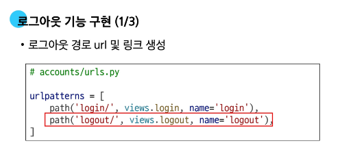

# 0422(Django / Authentication 02).md

# Authentication System 02

## Logout

> **Logout**
> 
- 로그아웃은 Session을 Delete 하는 과정
- 서버의 세션 데이터를 비우고, 클라이언트의 세션 쿠키를 삭제한다

> **Cookie**
> 

: 서버가 사용자의 웹 브라우저에 전송하는 작은 데이터 조각

> **logout(request)**
> 
1. DB에서 현재 요청에 대한 Session Data를 삭제한다
2. 클라이언트의 쿠키에서도 Session ID를 삭제한다

> **로그아웃 기능 구현**
> 

## 회원 가입

> **회원 가입**
> 
- User 객체를 create 하는 과정
- 사용자로부터 아이디, 비밀번호 등의 정보를 입력 받아, DB에 새로운 User 객체를 생성하고 저장한다

> **회원 가입 기능 구현**
> 

> **회원 가입 기능 에러 발생 및 해결**
> 

### get_user_model( )

: “현재 프로젝트에서 활성화된 사용자 모델 (active user model)” 을 반환하는 함수

> **User 모델을 직접 참조하지 않는 이유**
> 
- get_user_model( ) 을 사용해 User 모델을 참조하면 커스텀 User 모델을 자동으로 반환해주기 때문
- Django는 필수적으로 User 클래스를 직접 참조하는 대신 get_user_model( )을 사용해 참조해야 한다고 강조하고 있음

> **회원 가입 로직 완성**
> 
- 내장 Form 이었던 UserCreationForm을 CustomUserCreationFrom으로 변경

## 회원 탈퇴

> **회원 탈퇴**
> 
- User 객체를 Delete하는 과정
- request.user.delete( )를 활용해서 유저 객체 삭제를 진행한다

> **회원 탈퇴 로직 작성**
> 

## 인증된 사용자에 대한 접근 제한

> **인증된 사용자에 대한 접근 제한**
> 
1. **is_authenticatied 속성**
2. **login_required 데코레이터**

### is_authenticated 속성

> **is_authenticated 속성**
> 
- **사용자가 인증 되었는지 여부를 알 수 있는 User model의 읽기 전용 속성**
- 인증 사용자에 대해서는 항상 True, 비인증 사용자에 대해서는 항상 False
- 사용되는 경우
    - 사용자의 로그인 상태에 따라 다른 메뉴를 보여줄 때
    - view 함수 내에서 특정 기능을 로그인한 사용자에게만 허용하고 싶을 때

> **is_authenticated 적용하기**
> 

### login_required 데코레이터

> **데코레이터**
> 

: 기존 함수를 감싸, 특별한 기능(인증 등)을 추가하는 함수이다

> **login_required 데코레이터**
> 
- 인증된 사용자에 대해서만 view함수를 실행시키는 데코레이터
- 비인증 사용자의 경우 / accounts / login / 주소로 redirect 시킨다
- 사용되는 경우
    - 게시글 작성, 댓글 달기 등 누가 작성했는지 중요한 곳에서 사용한다

> **login_requred 적용하기**
> 

## 참고

### is_authenticated 코드

> **is_authenticated 코드**
> 
- 메서드가 아닌 속성 값임을 주의

### 회원 가입 후 자동 로그인

> **회원 가입 후 로그인까지 이어서 진행하려면?**
> 

### 회원 탈퇴 개선

> **탈퇴와 함께 기존 사용자의 Session Data 삭제 방법**
> 

### Auth built-in form 코드

> **Auth built-in form github 코드**
> 

