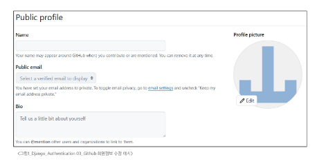

# 0423(Django / Authentication 03).md

# Authentication 03

## 회원정보 수정

> **회원정보 수정**
> 
- User 객체를 Update 하는 과정이다
- 수정할 대상 User 객체를 가져오고, 입력받은 새로운 정보로 기존 내용을 갱신한다

> **회원정보 수정 기능 구현**
> 

> **UserChangeForm 사용 시 문제점**
> 
- User 모델의 모든 정보들(fields)까지 모두 출력된다
- 일반 사용자들이 접근하면 안되는 정보는 출력하지 않아야 한다

→ CustomUserChangeForm에서 출력 필드를 다시 조정하기

> **CustomUserChangeForm 출력 필드 재정의**
> 
- User Model의 필드 목록 확인

> **회원정보 수정 로직 완성**
> 

### 비밀번호 변경

> **비밀번호 변경**
> 
- 인증된 사용자의 Session 데이터를 Update 하는 과정이다
    - Session : 로그인 후, 브라우저를 닫기 전까지 사용자를 기억하는 방법
- 기존 비밀번호를 통해 사용자를 인증하고, 새로운 비밀번호를 암호화하여 갱신한다

> **비밀번호 변경 기능 구현 작성**
> 

### 세션 무효화 방지

> **암호 변경 시 세션 무효화**
> 
- 비밀번호가 변경되면 기존 세션과의 회원 인증 정보가 일치하지 않게 되어 버려 로그인 상태가 유지되지 못하고 로그아웃 처리된다
- 비밀번호가 변경되면서 기존 세션과의 회원 인증 정보가 일치하지 않기 때문

**→ 암호 변경시 세션 무효화를 막는 방법은?**

> **암호 변경 시 세션 무효화를 막아주는 함수 - “update_session_auth_hash”**
> 

`update_session_auth_hash(request,user)` 

- 암호가 변경되면 새로운 password의 Session Data로 기존 session을 자동으로 갱신한다
- update_session_auth_hash를 password 함수에 적용한다

### 비밀번호 암호화

> **우리가 사용하는 비밀번호는 어떻게 저장되고 있을까?**
> 

### 해시(Hash)

: **임의의 크기**를 가진 데이터를 고정된 크기의 **고유한 값**으로 변환하는 것

> **해시 함수 (Hash function)**
> 

: 임의 길이 데이터를 입력 받아 고정 길이(정수)로 변환해 주는 함수이다

> **해시 (Hash)**
> 
- 데이터를 고정된 크기의 값으로 변환하는 과정이다
- 작은 변화에도 해시 값이 크게 달라지는 특성으로 인해 변조 여부를 쉽게 확인할 수 있다
- 입력 값이 들어오더라도 해시 함수에 의해서 다른 값으로 바뀌며, 동일한 값은 항상 동일한 해시 값을 생성한다

> **Django는 기본적으로 SHA-256 해시 함수를 사용해서 암호화**
> 
- 입력한 비밀번호의 길이와는 상관없이 동일한 길이의 해시 값을 생성
- 1글자만 다르더라도 전혀 다른 해시 값을 생성

> **SHA-256 (Secure Hash Algorithm - 256)**
> 

: 현재 가장 널리 사용되는 표준 암호화 해시 알고리즘

> **해시 함수를 활용해 단방향 암호화를 하면 더 이상 문제가 없을까?**
> 
- 비밀번호를 해시 값으로 저장하면 공격자가 유출된 데이터베이스를 봐도 원래 비밀번호를 알 수 없으니 안전해 보일 수 있다
- 하지만, 공격자들은 해시 값을 미리 계산해두는 방식으로 공격을 시도

→  이 방식이 **‘레인보우 테이블’** 공격

> **레인보우 테이블 (Rainbow Table)**
> 

> **솔트 (Salt)**
> 

> **무차별 대입 공격 (Brute-force Attack)**
> 

> **키 스트레칭 (Key Stretching)**
> 

> **Django에서의 비밀번호 암호화**
> 

> **비밀번호 암호화 정리**
> 

## 참고

### 비밀번호 초기화

> **비밀번호 초기화**
> 
- 비밀번호를 잊어버린 사용자가 이메일을 활용하여 비밀번호를 다시 설정하는 과정이다
- 비밀번호 초기화 과정
    1. 비밀번호를 찾으려고 하는 이메일 입력
    2. 이메일로 비밀번호 재설정 링크를 전송
    3. 비밀번호 재설정 페이지에서 새로운 비밀번호 설정
    4. 초기화 후 다시 로그인

> 
> 
> 
> **비밀번호를 찾으려고 하는 이메일 입력**
> 

> **이메일로 비밀번호 재설정 링크를 전송**
> 

> **비밀번호 재설정 페이지에서 새로운 비밀번호 설정**
> 

> **초기화 후 다시 로그인**
> 

> **Django에서는 수 많은 ‘완성된 기능 모듈’을 제공**
> 

### PasswordChangeForm 인자 순서

> **PasswordChangeForm의 인자 순서**
> 

### Auth built-in form 코드

> Auth built-in form github 코드
> 
- UserChangeForm( )
    - https://github.com/django/django/blob/5.2/django/contrib/auth/forms.py#L292

- PasswordChangeForm( )
    - https://github.com/django/django/blob/5.2/django/contrib/auth/forms.py#L422

