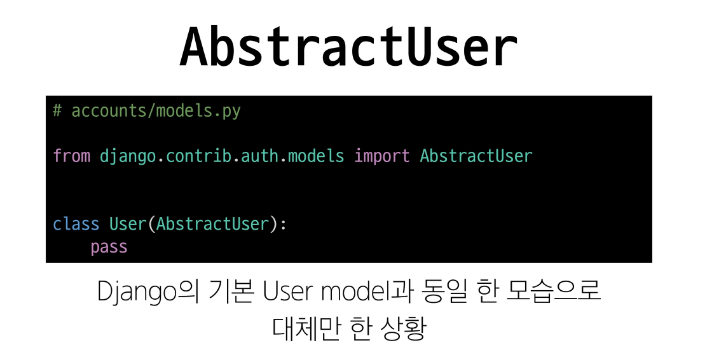

# 0424(Django / AbstractUser).md

# AbstractUser

> **AbstractUser의 필드**
> 

> **AbstractUser를 사용하는 이유**
> 
- “기존 User 모델은 그대로 쓰되, 우리가 원하는 필드만 몇 개 더 추가하고 싶다.”
- Django의 기본 User 모델에는 username, email, password 등 필수적인 필드들이 이미 포함되어 있다
- AbstractUser를 상속 받아 커스텀 유저 모델을 만들면, 기존의 편리한 필드들은 그대로 물려 받으면서, 우리가 원하는 추가적인 필드 (예 : 닉네임, 프로필 사진, 생년월일 등) 만 손쉽게 정의하여 확장할 수 있기 때문이다

> **AbstractUser 커스터마이징 예시**
> 

## Model Fields 심화

### choices 속성

> **choices 속성**
> 
- “모델 필드에 미리 정해진 선택지를 부여하는 속성”
- 이 속성을 사용하면, 데이터베이스에는 실제 값이 저장되지만 사용자에게는 더 이해하기 쉬운 이름 (레이블) 을 보여주는 드롭다운(Dropdown) 메뉴를 손쉽게 만들 수 있다

> **choices 사용 방법**
> 
- (저장될 실제 값, 사용자에게 보여줄 이름) 형태의 튜플을 담은 리스트 또는 튜플로 정의한다

> **choices 동작 원리**
> 
- Django는 choices속성이 지정된 필드를 발견하면, ModelForm이나 관리자 페이지에서 자동으로 기본 텍스트 입력 창 대신 드롭다운(select) 위젯으로 렌더링한다
- 사용자가 ‘진행 중’ 을 선택하고 저장하면, 데이터베이스의 status 필드에는 ‘DOING’이라는 문자열이 저장된다

> **choices 변수명 정의 하는 방법**
> 
- STATUS_CHOICES처럼 전체 대분자(UPPERCASE) 로 명명하는 것이 Django 커뮤니티의 오랜 관례(convention)이다
- 왜 대문자를 사용할까?
    - 파이썬의 공식 스타일 가이드인 PEP 8의 ‘상수(Constants)’명명 규칙을 따르는 것이다
    - choices에 할당되는 리스트나 튜플은 한 번 정의된 후 프로그램이 실행되는 동안 값이 변하지 않는 ‘상수’로 취급된다
    - 코드 작성자들은 다른 개발자에게 “이 변수는 고정된 값이니, 절대 수정하지 마세요!”라는 시각적인 신호를 주기 위해 전체 대문자로 변수명을 짓는 것을 선호한다

**→ 필수는 아니지만, ‘상수’임을 명확히 하여 코드의 가독성과 안정성을 높이기 위한 좋은 습관**

### choices 속성 실습

> **사전 준비**
> 
1. 마이그레이션 과정 진행
    - `python [manage.py](http://manage.py) makemigrations`
    - `python [manage.py](http://manage.py) migrate`
2. 관리자 계정 생성
    - `python [manage.py](http://manage.py) createsuperuser`

> **STATUS_CHOICES 리스트 정의 (CharField와 choices 1/3)**
> 
- DB에는 ‘TODO’, ‘DOING’, ‘DONE’이 저장된다
- Admin site나 Django Form에서는 “할 일”, “진행 중”, “완료” 라는 레이블로 표시된다

> **필드 정의 (CharField와 choices 2/3)**
> 
- choices : 미리 정의된 값들만 선택할 수 있도록 제한
- default : 사용자가 값을 입력하지 않았을 때 자동으로 할당되는 기본 값
- help_text : Admin이나 Form에서 해당 필드 옆에 간단한 안내문으로 표시되는 설명
- verbose_name : Admin이나 Form에서 필드의 라벨로 표시될 텍스트

> **Admin Site 결과 확인 (CharField와 choices 3/3)**
> 
- 새로운 할 일 등록시 출력되는 라벨과 help text를 확인 할 수 있다

> **PRIORITY_CHOICES 리스트 정의 (IntegerField와 choices 1/2)**
> 
- DB에는 정수 1, 2, 3이 저장
- Admin site나 Django Form에서는 “낮음”, “보통”, “높음”으로 표시됨

> **Admin Site 결과 확인 (IntegerField와 choices 2/2)**
> 

> **DTL 랜더링 결과 예시**
> 

> **choices 속성 정리**
> 
- choices는 마치 자판기의 상품 코드와 같음
- 개발자 (자판기 내부)
    - 상품을 관리하기 위해 간결하고 규칙적인 코드 (item_01, item_02)를 사용
- 사용자 (자판기 외부)
    - 상품을 쉽게 알아볼 수 있도록 친절한 이름 ( “콜라”, “사이다” )을 보고 버튼을 누름

→ choices는 이처럼, **데이터베이스에는 정해진 값 (코드)을 저장**하여 데이터의 일관성을 유지하고, **사용자 화면에는 친절한 이름(레이블)을 보여주어** 사용성을 높이는 역할이다.

## PositiveIntegerField

> **PositiveIntegerField 란**
> 
- “0을 포함한 양의 정수만 저장할 수 있도록 강제하는 Django 모델 필드”
- 데이터베이스에는 일반 정수Integer) 타입으로 생성되지만, Django의 유효성 검사(validation)를 통해 음수 값이 저장되려고 하면 오류를 발생시켜 데이터의 무결성을 보장한다
- 주요 활용 사례
    - 수량 : 재고 수량, 주문 개수 ,,
    - 수치 : 나이, 조회수, 좋아요 수 ,,
    - 포인트 및 금액 : 포인트, 가격, 예산 ,,
    
    **→ ‘음수’ 가 될 수 없는 모든 종류의 숫자 데이터에 사용하는 것이 적합하다**
    

> **PositiveIntegerField의 사용 예시**
> 
- 데이터 무결성
    - 실제 우선순위가 음수가 될 일은 없으므로, 애초에 DB에 음수가 들어가지 않도록 방지한다
- 유효성 검사
    - Django가 자동으로 0이상 값만 허용하므로, 음수 입력 시 ValidationError 발생
- 가독성/의도 표현
    - **“우선순위” = 양의 정수”** 라는 로직이 모델 정의에 드러나, 코드 유지보수에 유리하다

- 유저 관련 프로필 모델 예시

## blank vs null

> **blank vs null 비교**
> 
- Form에서 빈 값 허용(blank=True)은 DB의 NULL과 직접 대응하지 않는다
- DB 컬럼을 NULL 허용(null=True)해도, 폼 입력에서는 여전히 필수 값이 될 수 있다

> **blank=True의 의미**
> 
1. Form 유효성 검사 차원
    - blank=True로 지정된 필드는 폼에서 필수 입력이 아니다
    - Admin이나 ModelForm에서 해당 필드를 비워 제출해도 검증 에러가 발생하지 않는다
2. DB와는 무관
    - 단지 Django의 Form이나 admin에서 “비워둘 수 있다”는 의미
    - DB에는 “(빈 문자열)로 저장될 수 있지만, 실제르 DB가 NULL 상태가 되는 것은 아니다 (기본적으로 null=False일 때)

> **null=True의 의미**
> 
1. DB 스키마 레벨
    - null=True면 해당 컬럼에 NULL 값을 저장 가능
2. Form 검증과는 별개
    - Django Form에서 blank=True가 아니면 여전히 필수 입력으로 간주
    - 즉, DB에서 NULL을 허용하더라도, Form에서 공백 제출을 막을 수 있음

> **문자열 필드에 null=True를 설정하는 것은 일반적으로 권장하지 않음**
> 

> **정리**
> 
- blank=True : 웹 페이지의 ‘서류 양식’에 대한 규칙
    - “이 칸은 비워둔 채로 제출해도 괜찮습니다.” 라는 의미로, 유효성 검사(validation) 단계와 관련이 있음
- null=True : 데이터가 저장되는 ‘서류 보관함(DB)’에 대한 규칙
    - “이 칸에 해당하는 서류가 아예 없어도(NULL) 괜찮습니다.” 라는 의미로, 데이터베이스 스키마 단계와 관련이 있음

## Django Form 심화

> **Django Form을 활용한 이점**
> 
- “자동 검증과 편의성, 필요하다면 ModelForm을 통해 DB까지 손쉽게 연결할 수 있음”

## 다양한 Form 살펴보기

## MultipleChoiceField

> **핵심 특징 및 사용법**
> 
- HTML 렌더링
    - 기본적으로 여러 줄 선택이 가능한 <select multiple> 태그로 렌더링 되지만, widget 옵션을 통해 체크박스 (Checkbox) 형태로 더 편리하게 바꿀 수 있음

### MultipleChoiceField 실습

## cleaned_data

