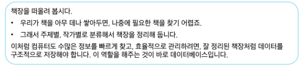

# 0427(SQL 01 / about DB, DML ,,).md

# SQL 01

## Database

### Database란?

> **데이터베이스 (Database)**
> 

: 체계적으로 정리된 데이터의 모음



> **데이터 (Data)**
> 

: 저장이나 처리를 위해 변환된 정보


> **파일 (File) 이용**
> 
- 어디에서나 쉽게 사용 가능
- 데이터를 구조적으로 관리하기 어려움


> **스프레드 시트 (Spreadsheet) 이용**
> 
- 테이블의 열과 행을 사용하여 데이터를 구조적으로 관리 가능


> **스프레드 시트의 한계**
> 
- 크기
    - 일반적으로 약 100만 행까지만 저장 가능
- 보안
    - 단순히 파일이나 링크 소유 여부에 따른 순한 접근 권한 기능 제공
- 정확성
    - 만약 공식적으로 “강원”의 지명이 “강언”으로 바뀌었다고 가정한다면?
    - 이 변경으로 인해 테이블 모든 위치에서 해당 값을 업데이트 해야 한다
    - 만약 데이터가 여러 시트에 분산되어 있다면 변경에 누락이 생기거나 추가 문제가 발생할 수 있다

> **데이터베이스 역할**
> 


### Relational Database

> **관계형 데이터베이스 (Relational Database)**
> 

: 데이터 간에 관계가 있는 데이터 항목들의 모음


- 테이블, 행, 열의 정보를 구조화하는 방식
- 서로 관련된 데이터 포인터를 저장하고 이에 대한 액세스를 제공


> **관계**
> 

: 여러 테이블 간의 (논리적) 연결


> **관계로 할 수 있는 것**
> 
- 이 관계로 인해 두 테이블을 사용하여 데이터를 다양한 형식으로 조회할 수 있음
    - 특정 날짜에 구매한 모든 고객 조회
    - 지난 달에 배송일이 지연된 고객 조회 등


> **관계형 데이터베이스 예시**
> 


> **관계형 데이터베이스 관련 키워드**
> 


## RDBMS

> **DBMS (Database Management System)**
> 

: 데이터베이스를 관리하는 소프트웨어 프로그램


- 데이터 저장 및 관리를 용이하게 하는 시스템
- 데이터베이스와 사용자 간의 인터페이스 역할
- 사용자가 데이터 구성, 업데이트, 모니터링, 백업, 복구 등을 할 수 있도록  도움

> **RDBMS (Relational Database Management Syetem)**
> 

: 관계형 데이터베이스 관리 소프트웨어 프로그램


> **RDBMS 서비스 종류**
> 
- SQLite
- MySQL
- PostgreSQL
- Oracle Database
- ,,,


> **SQLite**
> 
- 경량의 오픈 소스 데이터베이스 관리 시스템
- 설치 없이 가볍게 실행 가능하여 모바일 앱이나 소규모 프로그램에 적합하다

→ 컴퓨터나 모바일 기기에 내장되어 간단하고 효율적인 데이터 저장 및 관리를 제공한다


> **데이터베이스 정리**
> 
- Table은 데이터가 기록되는 곳이다
- Table에는 행에서 고유하게 식별 가능한 기본 키라는 속성이 있으며,
외래 키를 사용하여 각 행에서 서로 다른 테이블 간의 관계를 만들 수 있다
- 데이터는 기본 키 또는 외래 키를 통해 결합(join)될 수 있는 여러 테이블에 걸쳐 구조화 된다

## SQL

> **SQL (Structure Query Language)**
> 

: 테이블의 형태로 구조화 된 관계형 데이터베이스에게 요청을 질의(요청)


> **SQL Syntax**
> 

`SELECT column_name FROM table_name;`

1. SQL 키워드는 대소문자를 구분하지 않는다
    - 하지만 대문자로 작성하는 것을 권장 (명시적 구분)
2. 각 SQL Statements의 끝에는 세미콜론(’;’)이 필요하다
    - 세미콜론은 각 SQL Statements를 구분하는 방법이다 (명령어의 마침표)

### SQL Statements

> **SQL Statements**
> 
- SQL을 구성하는 가장 기본적인 코드 블록

> **SQL Statements 예시**
> 

`SELECT column_name FROM table_name;`

- 해당 예시 코드는 SELECT Statement라고 부른다
- Statement는 SELECT, FROM 2개의 keyword로 구성

> 수행 목적에 따른 SQL Statements 4가지 유형
> 
1. DDL - 데이터 정의
2. DQL - 데이터 검색
3. DML - 데이터 조작
4. DCL - 데이터 제어


### Querying data


## DQL

### SELECT

> **SELECT syntax**
> 
- SELECT statement : 테이블에서 데이터를 조회

```sql
SELECT
	select_list
FROM
	table_name;
```

- SELECT 키워드 이후 데이터를 선택하려는 필드를 하나 이상 지정
- FROM 키워드 이후 데이터를 선택하려는 테이블의 이름을 지정

> **SELECT 활용**
> 


> **SELECT 정리**
> 
- 테이블의 데이터를 조회 및 반환
- ‘ * ‘ (asterisk)를 사용하여 모든 필드 선택 가능

## Sorting data

### ORDER BY

> **ORDER BY syntax**
> 
- ORDER BY statement : 조회 결과의 레코드를 정렬

```sql
SELECT
	select_list
FROM
	table_name
ORDER BY
	column1 [ASC|DESC],
	column2 [ASC|DESC],
	,,,;
```

- FROM clause 뒤에 위치
- 하나 이상의 컬럼을 기준으로 결과를 오름차순(ASC, 기본 값), 내림차순(DESC)으로 정렬

> **ORDER BY 활용**
> 


> **정렬에서의 NULL**
> 
- NULL 값이 존재할 경우 오름차순 정렬 시 결과에 NULL이 먼저 출력


> **SELECT statement 실행 순서**
> 


## Filtering data

> **Filtering data 관련 Keywords**
> 
- Clause : SQL 문장에서 특정 기능을 수행하도록 지정하는 문장 구성 요소
    - DISTINCT
    - WHERE
    - LIMIT
- Operator : SQL에서 조건을 비교하거나 데이터를 선택하기 위해 사용하는 명령 기호 또는 키워드
    - BETWEEN
    - IN
    - LISKE
    - Comparison
    - Logical

### DISTINCT

> **DISTINCT syntax**
> 
- DISTINCT statement : 조회 결과에서 중복된 레코드를 제거

```sql
SELECT DISTINCT
	select_list
FROM
	table_name;
```

- SELECT 키워드 바로 뒤에 작성해야 한다
- SELECT DISTINCT 키워드 다음에 고유한 값을 선택하려는 하나 이상의 필드를 지정

> **DISTINCT 활용 전**
> 


> **DISTINCT 활용 후**
> 


### WHERE

> **WHERE syntax**
> 
- WHERE statement : 조회 시 특정 검색 조건을 지정

```sql
SELECT
	select_list
FROM
	table_name
WHERE
	search_condition;
```

- FROM clause 뒤에 위치
- search_condition은 비교연산자 및 논리연산자(AND, OR, NOT 등)를 사용하는 구문이 사용된다

> **WHERE 활용**
> 


## Operators

> **Comparison Operators**
> 
- 비교 연산자
    - =, ≥, ≤, ≠
    - IS, LIKE, IN
    - BETWEEN … AND
- IN Operator : 값이 특정 목록 안에 있는지 확인
- LIKE Operator : 값이 특정 패턴에 일치하는지 확인 (Wildcards와 함께 사용)

> **Logical Operators**
> 
- 논리 연산자
    - AND(&&)
    - OR(||)
    - NOT(!)

> **Wildcard**
> 


### LIMIT

> **LIMIT syntax**
> 
- LIMIT statement : 조회하는 레코드 수를 제한

```sql
SELECT
	select_list
FROM
	table_name
LIMIT [offset, ] row_count;
```

- 하나 또는 두 개의 인자를 사용 (0 또는 양의 정수)
- row_count는 조회하는 최대 레코드 수를 지정

> **LIMIT & OFFSET 예시**
> 


> **LIMIT 활용**
> 


## Grouping data

### GROUP BY

> **GROUP BY syntax**
> 
- GROUP BY statement : 레코드를 그룹화하여 요약본 생성 (’집계 함수’와 함께 사용)

```sql
SELECT
	c1, c2, ... , cn, aggregate_function(ci)
FROM
	table_name
GROUP BY
	c1, c2, ... , cn;
```

- FROM 및 WHERE 절 뒤에 배치
- GROUP BY 절 뒤에 그룹화 할 필드 목록을 작성

> **집계 함수 (Aggregation Functions)**
> 


> **GROUP BY 예시**
> 


> **GROUP BY 활용**
> 


### HAVING

> **HAVING clause**
> 

: 집계 항목에 대한 세부 조건을 지정


> **WHERE 와 HAVING 비교**
> 


> **SELECT statement 실행 순서**
> 


## 참고

### Query

> **Query**
> 

: “데이터베이스로부터 정보를 요청” 하는 것
일반적으로 SQL로 작성하는 코드를 쿼리문(SQL문)이라 한다

### NULL 비교

> **NULL**
> 
- SQL에서 NULL은 실제 값이 아니라 “값이 없음” 또는 “알 수 없음”을 의미한다
    - 때문에 일반적인 등호(”=”)연산자로 NULL을 비교하면 의도한 대로 작동하지 않는다

> **SQL의 3값 논리**
> 
- SQL은 논리 연산에 대해 세 가지 값을 사용한다
    1. TRUE
    2. FALSE
    3. UNKNOWN (알 수 없음)
- 예를 들어, ‘NULL = NULL’ 의 결과는 TRUE가 아니라 ‘UNKNOWN’이 된다
- 이는 두 NULL이 실제로 어떤 값을 가지고 있지 않기 때문이다


