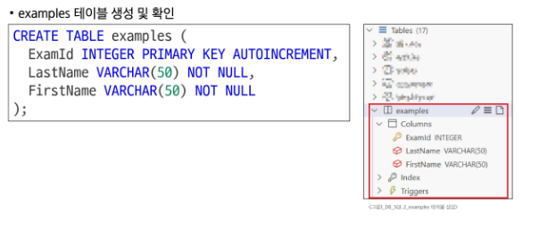

# 0428(SQL 02 / DDL, JOIN ,, ).md

# SQL 02

## Managing Tables

## DDL (Data Definition Language)

### CREATE TABLE

> **CREATE TABLE syntax**
> 
- CREATE TABLE statement : 테이블 생성

```sql
CREATE TABLE table_name (
	column_1 data_type constraints,
	column_2 data_type constraints,
	...,
);
```

- 각 필드에 적용할 데이터 타입 작성
- 테이블 및 필드에 대한 제약조건(constraints) 작성

> **CREATE TABLE 활용**
> 



> **PRAGMA**
> 
- 테이블 schema(구조) 확인

`PRAGMA table_info('examples');`


> **CREATE TABLE Statement 구성**
> 


> **SQLite 데이터 타입**
> 
- NULL
    - 아무런 값도 포함하지 않음을 나타냄
- INTEGER
    - 정수
- REAL
    - 부동 소수점
- TEXT
    - 문자열
- BLOB
    - 이미지, 동영상, 문서 등의 바이너리 데이터

> **제약 조건이란?**
> 


> **대표 제약 조건 3가지**
> 
- **PRIMARY KEY**
    - 해당 필드를 기본 키로 지정
    
    ※ INTEGER 타입에만 적용되며 INT, BIGINT 등과 같은 다른 정수 유형은 적용되지 않는다
    
- **NOT NULL**
    - 해당 필드에 NULL 값을 허용하지 않도록 지정
- **FOREIGN KEY**
    - 다른 테이블과의 외래 키 관계를 정의

> **AUTOINCREMENT 특징**
> 
- AUTOINCREMENT keyword : 자동으로 고유한 정수 값을 생성하고 할당하는 필드 속성
- 필드의 자동 증가를 나타내는 특수한 키워드
- 주로 primary key 필드에 적용한다
- INTEGER PRIMARY KEY AUTOINCREMENT가 작성된 필드는 항상 새로운 레코드에 대해 이전 최대 값보다 큰 값을 할당한다
- 삭제된 값은 무시되며 재사용할 수 없게 된다

### ALTER TABLE

> **ALTER TABLE 역할**
> 
- ALTER TABLE statement : 테이블 및 필드 조작


> **ALTER TABLE ADD COLUMN syntax**
> 
- ADD COLUMN : 필드 추가

```sql
ALTER TABLE
	table_name
ADD COLUMN
	column_definition;
```

- ADD COLUMN 키워드 이후 추가하고자 하는 새 필드 이름과 데이터 타입 및 제약 조건 작성

※ 단, 추가하고자 하는 필드에 NOT NULL 제약조건이 있을 경우 NULL이 아닌 기본 값 설정 필요

> **ALTER TABLE ADD COLUMN 활용**
> 


> **ALTER TABLE RENAME COLUMN syntax**
> 
- RENAME COLUMN : 필드명 변경

```sql
ALTER TABLE
	table_name
RENAME_COLUMN
	current_name T0 new_name;
```

- RENAME COLUMN 키워드 뒤에 이름을 바꾸려는 필드의 이름을 지정하고 TO 키워드 뒤에 새 이름을 지정

> **ALTER TABLE RENAME COLUMN 활용**
> 


> **ALTER TABLE DROP COLUMN syntax**
> 
- DROP COLUMN : 지정 필드 삭제

```sql
ALTER TABLE
	table_name
DROP COLUMN
	column_name;
```

- DROP COLUMN 키워드 뒤에 삭제 할 필드 이름 지정

> **ALTER TABLE DROP COLUMN 활용**
> 


> **ALTER TABLE RENAME TO syntax**
> 
- RENAME TO : 테이블 명 수정

```sql
ALTER TABLE
	table_name
RENAME TO
	new_table_name;
```

- RENAME TO 키워드 뒤에 새로운 테이블 이름 지정

> **ALTER TABLE RENAME TO 활용**
> 


### DROP TABLE

> **DROP TABLE syntax**
> 
- DROP TABLE statement : 테이블 삭제

`DROP TABLE table_name;`

- DROP TABLE statement 이후 삭제할 테이블 이름 작성

> **DROP TABLE 활용**
> 
- new_examples 테이블 삭제

`DROP TABLE new_examples;`

## DML (Data Manipulation Language)

### INSERT

> **사전 준비**
> 
- 생성하려는 테이블과 동일한 이름을 가진 테이블이 존재하는지 확인
- 불필요한 테이블이라면 DROP TABLE 명령어로 테이블 삭제
- 정상적으로 삭제 되었는지 PRAGMA 활용하여 체크

```sql
SELECT * FROM articles;
DROP TABLE articles;
PRAGMA table_info('articles');
```

- 실습 테이블 생성

```sql
CREATE TABLE articles(
	id INTEGER PRIMARY KEY AUTOINCREMENT,
	title VARCHAR(100) NOT NULL,
	content VARCHAR(200) NOT NULL,
	createdAt DATE NOT NULL
);
```


> **INSERT syntax**
> 
- INSERT statement : 테이블 레코드 삽입

```sql
INSERT INTO table_name (c1, c2, ... )
VALUES (v1, v2, ... );
```

- INSERT INTO 절 다음에 테이블 이름과 괄호 안에 필드 목록 작성
- VALUES 키워드 다음 괄호 안에 해당 필드에 삽입할 값 목록 작성

> **INSERT 활용**
> 


### UPDATE

> **UPDATE syntax**
> 
- UPDATE statement : 테이블 레코드 수정

```sql
UPDATE table_name
SET column_name = expression,
[WHERE
	condition];
```

- SET 절 다음에 수정할 필드와 새 값을 지정
- WHERE 절에서 수정할 레코드를 지정하는 조건 작성
- WHERE 절을 작성하지 않으면 모든 레코드를 수정

> **UPDATE 활용**
> 


### DELETE

> **DELETE syntax**
> 
- DELETE statement : 테이블 레코드 삭제

```sql
DELETE FROM table_name
[WHERE
	condition];
```

- DELETE FROM 절 다음에 테이블 이름 작성
- WHERE 절에서 삭제할 레코드를 지정하는 조건 작성
- WHERE 절을 작성하지 않으면 모든 레코드를 삭제

> **DELETE 활용**
> 


## Multi table queries

### Join

> **관계의 필요성**
> 


> **JOIN이 필요한 순간**
> 
- 테이블을 분리하면 데이터 관리는 용이해질 수 있으나 출력시에는 문제가 있다
- 테이블 한 개만을 출력할 수 밖에 없어 다른 테이블과 결합하여 출력하는 것이 필요해진다

→ 이때 사용하는 것이 ‘JOIN’


> **JOIN 종류**
> 
- JOIN clause : 둘 이상의 테이블에서 데이터를 검색하는 방법
1. INNER JOIN
2. LEFT JOIN

> **사전 준비**
> 


### INNER JOIN

> **INNER JOIN syntax**
> 
- INNER JOIN clause : 두 테이블에서 값이 일치하는 레코드에 대해서만 결과를 반환


```sql
SELECT
	select_list
FROM
	table_a
INNER JOIN table_b
	ON table_b.fk = table_a.pk;
```

- FROM 절 이후 메인 테이블 지정 (table_a)
- INNER JOIN 절 이후 메인 테이블과 조인할 테이블을 지정 (table_b)
- ON 키워드 이후 조인 조건을 작성
- 조인 조건은 table_a와 table_b 간의 레코드를 일치시키는 규칙을 지정

> **INNER JOIN 예시**
> 


> **INNER JOIN 활용**
> 


### LEFT JOIN

> **LEFT JOIN syntax**
> 
- LEFT JOIN clause : 오른쪽 테이블의 일치하는 레코드와 함께 왼쪽 테이블의 모든 레코드 반환


```sql
SELECT
	select_list
FROM
	table_a
LEFT JOIN table_b
	ON table_b.fk = table_a.pk;
```

- FROM 절 이후 왼쪽 테이블 지정 (table_a)
- LEFT JOIN 절 이후 오른쪽 테이블 지정 (table_b)
- ON 키워드 이후 조인 조건을 작성
    - 왼쪽 테이블의 각 레코드를 오른쪽 테이블의 모든 레코드와 일치시킴

> **LEFT JOIN 예시**
> 


> **LEFT JOIN 특징**
> 
- 왼쪽 테이블의 모든 레코드를 표기
- 오른쪽 테이블과 매칭되는 레코드가 없으면 NULL을 표시


> **LEFT JOIN 활용**
> 


## 참고

### 타입 선호도

> **타입 선호도 (Type Affinity)**
> 


> **SQLite 타입 선호도의 목적**
> 
1. 유연한 데이터 타입 지원
    - 데이터 타입을 명시적으로 지정하지 않고도 데이터를 저장하고 조회할 수 있음
    - 컬럼에 저장되는 값의 특성을 기반으로 데이터 타입을 유추
2. 간편한 데이터 처리
    - INTEGER Type Affinity를 가진 열에 문자열 데이터를 저장해도 SQLite는 자동으로 숫자로 변환하여 처리
3. SQL 호환성
    - 다른 데이터베이스 시스템과 호환성을 유지

### NOT NULL


### 날짜와 시간


