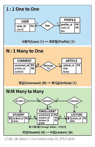

# 0429(Many To One Relationships 01).md

# Many To One Relationships 01

## 모델 관계

### 관계 (relationship)

: 데이터베이스 내 여러 테이블 간의 논리적인 연결 관계를 나타낸다

> **관계의 종류**
> 
- 1:1 (One to One) 관계
    - 한 테이블의 레코드가 다른 테이블의 단 하나의 레코드로만 1:1로 매칭되는 관계
    - 예시 ) 한 명의 사용자는 오직 하나의 프로필 정보(상세정보)만 갖는다
- N:1 (Many to One) 관계
    - 여러 개의 레코드(N)가 하나의 레코드(1)에 소속되는 관계
    - 예시) 하나의 게시글(1)에는 여러 개의 댓글(N)이 달릴 수 있다.
    하지만, 특정 댓글 하나가 여러 게시글에 동시에 달릴 수는 없다.
- N:M (Many to Many) 관계
    - 여러 레코드가 여러 레코드와 양방향으로 연결되는 관계
    - 두 테이블 사이에 연결을 위한 중개 테이블(Through Table)이 필요하다
    - 예시 ) 한 명의 학생은 여러 수업을 신청할 수 있다
    동시에 하나의 수업에는 여러 명의 학생이 수강한다

### Many to one relationships (N:1 or 1:N)

: 한 테이블의 0개 이상의 레코드가 다른 테이블의 레코드 한개와 관련된 관계

> **Many to one relationships 예시**
> 

> **댓글과 게시글의 관계**
> 

> **테이블 관계 설정**
> 

## 댓글 모델 정의

### ForeignKey 필드

> **ForeignKey(to, on_delete)**
> 

: 한 모델이 다른 모델을 참조하는 관계를 설정하는 필드

→ N:1 관계 표현할 때 사용한다

→ 데이터베이스에서 외래 키로 구현된다

> **ForeignKey 필드**
> 

**ForeignKey(to, on_delete)**

- 데이터 무결성 : 데이터가 정확하고 일관되며, 신뢰할 수 있도록 유지되는 상태
- to 속성
    - 참조하는 모델 class 모델 (N:1에서 N이 아닌 1의 class 정보)
- on_delete 속성
    - 외래 키가 참조하는 객체(1)가 사라졌을 때, 외래 키를 가진 객체(N)을 어떻게 처리할  지를 정의하는 설정 (데이터 무결성)

**※ to와 on_delete 속성은 ForeignKey 설정에 필수 요소**

> **on_delete 속성 종류**
> 
- **CASCADE**
    - 참조 된 객체 (부모 객체)가 삭제 될 때 이를 참조하는 모든 객체도 삭제되도록 지정한다
    - 예 ) 게시글이 삭제되면 해당 게시글의 모든 댓글을 삭제한다
- **PROTECT**
    - 삭제 하려는 부모 객체에 자식 객체가 존재한다면 해당 부모 객체를 삭제하지 못하도록 지정한다
    - 예 ) 게시글을 삭제할 때 해당 게시글에 댓글이 존재하면 게시글 삭제 불가
- **SET_NULL**
    - 부모 객체가 삭제되면, 해당 필드에 값이 NULL이 저장되도록 지정한다
    - 단, 해당 ForeignKey 필드 설정이 null = True가 설정 되어야 한다
- 기타 on_delete 설정 값 참고 페이지
    - [https://docs.djangoproject.com/en/5.2/ref/models/fields/#arguments](https://docs.djangoproject.com/en/5.2/ref/models/fields/#arguments)

> **댓글 모델 정의하기**
> 
- ForeignKey 클래스의 인스턴스 이름은 참조하는 모델 클래스 이름의 단수형으로 작성하는 것을 권장

> **Migration 이후 댓글 테이블 확인**
> 
- 만들어 지는 필드 이름 규칙
    - ‘작성한 외래 키 필드명’ + ‘_’ + ‘id’
- 댓글 테이블의 article_id 외래 키 필드 확인
    - bigint 자료형 확인

→ 참조하는 클래스 이름의 소문자(단수형)로 작성하는 것이 권장 되었던 이유

### 댓글 생성 연습

> **댓글 생성 연습 준비하기**
> 
- 연습을 위한 shell 환경에서 진행
- ipython 설치 필요 ($ pip install ipython)
- django shell 시작 후 댓글 작성를 위한 게시글 하나 작성

> **댓글 생성 연습**
> 

## 관계 모델 참조

> **참조**
> 

: 직접 대상의 정보를 저장하고 필요할 때 활용하는 것

> **특정 게시글(Article)의 댓글(Comment) 정보 조회하기**
> 

## 역참조

> **역참조 정의**
> 

: 누가 나를 참조하는지 거꾸로 조회 하는 것

> **역참조 기본 구조**
> 

> **related manager (역참조 이름) 이름 규칙**
> 
- **모델 클래스명 + _set** 이  기본 값이며 Django에서 자동으로 생성해준다
- 관계를 직접 정의하지 않은 모델에서 연결된 객체들을 조회할 수 있게 한다
- 특정 댓글의 게시글 **참조** (Comment → Article)
    - comment.article
- 특정 게시글의 댓글 목록 **역참조** (Article → Comment)
    - article.comment_set.all( )

> **related manager 연습**
> 

## 댓글 구현

### 댓글 CREATE

> **댓글 CREATE 구현**
> 

### 댓글 READ

> **댓글 READ 구현**
> 

### 댓글 DELETE

> **댓글 DELETE 구현**
> 

## 참고

### 데이터 무결성

> **데이터 무결성이란**
> 
- 데이터베이스에 저장된 데이터의 정확성, 일관성, 유효성을 유지하는 것
- 데이터베이스에 저장된 데이터 값의 정확성을 보장하는 것
- 중요성
    - 데이터의 신뢰성 확보
    - 시스템 안정성
    - 보안 강화

### admin site 댓글 등록

> admin site에 댓글 등록하기
> 
- 작성된 Comment 모델에 대해 Admin site에서 관리할 수 있도록 아래와 같이 등록

### 댓글 추가 구현

> **댓글이 없는 경우 대체 콘텐츠 출력**
> 

> **댓글 개수 출력하기**
> 

