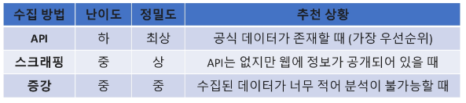

# 0430(데이터 수집 / 크롤링).md

## 데이터 수집

> **데이터 수집 (Data Collection) 이란?**
> 
- 산재한 정보를 목적에 맞는 형태로 추출 및 저장하는 가정을 의미한다
- 가공되지 않은 상태(Raw Data)의 정보는 프로젝트나 모델 학습에 바로 활용하기 어렵다
- 따라서 데이터 수집은 분석 및 활용 가능한 구조적 데이터로 전환하는 첫 단계이다

> **웹 데이터 수집의 장점**
> 
- 실시간으로 업데이트되는 세상의 흐름을 즉시 반영할 수 있다
- 사용자의 실제 목소리(댓글, 리뷰 등) 가 담긴 생생한 데이터를 확보한다
- 웹에 존재하는 방대한 정보를 내 프로젝트에 변환하여 활용 가능하다

> **우리가 직접 수집해야 하는 이유?**
> 
- 실제 프로젝트에서는 바로 사용할 수 있는 데이터가 항상 존재하지 않는다
- 공개 API가 없거나, 호출 횟수, 형식 제약이 있는 경우가 많다
- 필요한 데이터는 있지만, 흩어져 있는  경우도 많다

### 데이터 수집 방법

> **데이터 수집 방법 01 : API**
> 
- 정해진 방법을 통해 데이터를 제공 받는다 (받아오는 것)

> **데이터 수집 방법 02 : 스크래핑**
> 
- 웹 페이지에서 직접 추출 (긁어 오는 것)

> **데이터 수집 방법 03 : 증강 데이터**
> 
- 기존 데이터에 새 데이터 생성 (만들어 내는 것)

> **언제 어떤 방법을 사용하는 것이 유리할까?**
> 
- 상황에 따라 수집 방법을 선택해야 한다

> **최우선은 API를 이용**
> 
- API를 활용할 수 없는 경우 웹 스크래핑 & 크롤링을 고려한다
- 데이터가 부족하다면 데이터 증강으로 보강한다
- 데이터 수집에는 정답이 아니라 우선순위와 선택 기준이 있다

## 핵심 용어

> **Data Collection**
> 

: 정보를 프로젝트에서 사용할 수 있는 데이터 형태로 가져오는 과정이다

> **Crawling**
> 

: 여러 웹 페이지를 자동으로 이동하며 데이터가 존재하는 페이지나 URL을 수집하는 과정이다

> **Scraping**
> 

: 특정 웹 페이지에서 필요한 데이터만 선택적을 추출하는 과정이다

> **Preprocessing**
> 

: 수집한 데이터를 사용 가능한 형태로 정리하고 정제하는 과정이다

> **Data Augmentation**
> 

: 기존 데이터를 기반으로 새로운 데이터를 생성하여 데이터의 양과 다양성을 늘리는 과정이다

> **Pipeline**
> 

: 데이터 수집 → 전처리 → 증강 → 저장까지의 전체 흐름을 하나의 과정으로 묶은 개념이다

## 실습

> **실습 목표 / Data Pipeline 구축**
> 
- 데이터 수집(스크래핑) → 전처리 → 증강 → 저장

> **Selenium을 활용한 실시간 데이터 수집과 LLM 데이터 증강**
> 
- Selenium을 활용하여 웹사이트에서 데이터를 수집
- 수집된 데이터를 전처리
- LLM을 활용해 텍스트 데이터 증강
- 원본 데이터와 가공, 증강 데이터 통합 출력

