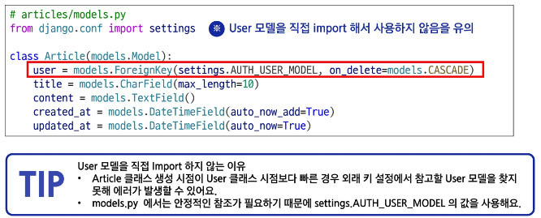

# 0504(Many To One Relationships 02).md

# Many To One Relationships 02

## Article & User

### 모델 관계 설정

> **Article - User 모델 관계 설정**
> 
- User 외래 키 정의

**→ Django의 시작 시 순서**

1. **settings.py를 읽는다  → AUTH_USER_MODEL 문자열은 여기서 사용 가능함**
2. **모델들을 로드하기 시작한다**
3. **accounts.User 클래스가 만들어진다 → get_user_model( ) 사용 가능 시점**
4. **articles.Article이 만들어진다**
5. **모든 모델 로드가 완료된다**
6. **View 함수들 실행 시작**

> **User 모델을 참조하는 2가지 방법**
> 
- **settings.AUTH_USER_MODEL**
    - [settings.py](http://settings.py)에서 정의된 AUTH_USER_MODEL 설정 값을 가져온다
    - 반환 값 : ‘accounts.User’ (문자열)
    - models.py에서 User 모델을 참조할 때 주로 사용한다
- **get_user_model( )**
    - 현재 settings.py에 정의되어 활성화된 User 모델을 가져온다
    - 반환 값 : UserObject (객체)
    - [models.py](http://models.py)를 제외한 다른 모든 위치에서 사용한다

> **Migration**
> 

### 게시글 CREATE

> **게시글 CREATE 구현**
> 

### 게시글 READ

> **게시글 READ 구현**
> 

**작성자 : {{ article.user.username }} 을 하지 않고  {{ article.user }} 이라고만 작성해도 객체가 반환되는 것이 아니라, username이 반환되는 이유?**

→ AbstractUser 내부적으로 _ _ str _ _ (매직메서드)로 user을 호출 시 username을 반환하도록 설정되어 있기 때문이다.

### 게시글 UPDATE

> **게시글 UPDATE 구현**
> 

### 게시글 DELETE

> **게시글 DELETE 구현**
> 

## Comment & User

### 모델 관계 설정

> **Comment - User 모델 관계 설정**
> 
- User은 여러 개의 댓글을 작성할 수 있다
- Comment는 한 명의 작성자가 작성해야 한다
- Comment 모델 클래스에 User 필드를 참조하도록 외래 키 (ForeignKey)를 설정해준다

> **Migration**
> 

### 댓글 CREATE

> **댓글 CREATE 구현**
> 

### 댓글 READ

> **댓글 READ 구현**
> 

### 댓글 DELETE

> **댓글 DELETE 구현**
> 

## View decorators

> **View decorator**
> 

: View 함수의 동작을 수정하거나 추가 기능을 제공하는데 사용되는 python 데코레이터

> **View decorators 종류**
> 
- Allowed HTTP methods
    - 뷰가 허용하는 HTTP 요청 방식 (GET, POST 등)을 제한
- Conditional view processing
    - 클라이언트가 보낸 조건을 확인한 후, 조건에 따른 응답 처리
- GZip compression
    - 서버에서 응답 데이터를 압축해서 전송
- ,,,
- 추가 view decorators는 아래 공식 문서 참고
    - [https://docs.djangoproject.com/en/5.2/topics/http/decorators/](https://docs.djangoproject.com/en/5.2/topics/http/decorators/)

### Allowed HTTP methods

> **Allowed HTTP methods**
> 

: 특정 HTTP method로만 View 함수에 접근할 수 있도록 제한하는 데코레이터이다

> **주요 Allowed HTTP methods**
> 
- require_http_methods([”METHOD1”, “METHOD2”, … ])
    - 지정된 HTTP method만 허용
- require_safe( )
    - GET과 HEAD method만 허용
- require_POST( )
    - POST method만 허용

※ 허용되지 않은 method 로 요청하는 경우 405 (Method Not Allowed) 오류 반환

> **Allowed HTTP methods 안내 / require_http_methods(request_method_list)**
> 

> **Allowed HTTP methods 안내 / require_safe( )**
> 

> **Allowed HTTP methods 안내 / require_POST( )**
> 

## ERD (Entity-Relationship Diagram)

> **ERD (Entity-Relationship Diagram)**
> 

: 데이터베이스의 구조를 시각적으로 표현하는 도구이다

> **ERD 예시**
> 

### ERD 구성 요소

> **ERD의 구성 요소**
> 
- **엔티티 (Entity)**
    - 데이터베이스에 저장되는 객체나 개념
        - 데이터베이스에서 주로 테이블로 표현된다
    - ex ) ‘게시글’, ‘댓글’, ‘회원’
- **속성 (Attribute)**
    - 엔티티가 가지는 고유한 데이터 항목
        - 테이블의 컬럼으로 표현된다
    - ex ) ‘게시글’ 엔티티의 ‘제목’, ‘내용’, ‘작성일자’, ‘생성일자’
- **관계 (Relationship)**
    - 엔티티 간의 연관성을 나타낸다
        - 테이블 간의 연결된 선으로 표현된다
    - ex ) 게시글을 ‘작성’한 회원, 게시글에 ‘달린’ 댓글

> **개체와 속성 표현 방법**
> 
- 개체 : 회원 (User)
- 속성 : 회원번호 (id), 이름 (name), 주소 (address) 등
    - 개체가 지닌 속성 및 속성의 데이터 타입

> **관계**
> 
- 관계 : 회원과 댓글 간의 관계
    - 회원이 ‘작성’한 댓글

> **Cardinality**
> 

※ 데이터베이스에서의 Cardinality와 ERD 에서의 Cardinality는 다른 맥락의 단어이다. (다른 뜻)

: 한 엔티티와 다른 엔티티 간의 수적 관계를 나타내는 표현

- 일대일 (1 : 1)
    - 한 엔티티의 레코드가 다른 엔티티의 하나의 레코드와만 연결되는 관계
    - ex ) 한 ‘사람’은 하나의 ‘여권’만 소유하고, ‘여권’도 한 ‘사람’에게만 발급
- 다대일 (N : 1)
    - 여러 레코드가 하나의 엔티티와 연결되며, 반대 방향에서는 하나만 연결되는 관계
    - ex ) 여러 명의 ‘학생’이 하나의 ‘학교’에 소속된다
- 다대다 (M : N)
    - 양쪽 모두 여러 레코드와 연결되는 관계
    - ex ) ‘학생’은 여러 ‘과목’을 수강할 수 있고, ‘과목’도 여러 ‘학생’이 수강할 수 있다

> **Cardinality 표현**
> 
- 선의 끝부분에 표시되며 일반적으로 숫자나 기호 (Crow’s foot)로 표현된다

> **Cardinality 적용**
> 
- 회원은 여러 댓글을 작성한다
- 각 댓글은 하나의 회원만 존재한다

> **ERD의 중요성**
> 

### ERD 제작 사이트

> **무료 ERD 제작 사이트**
> 
- [Draw.io](http://Draw.io) (diagrams.net)
    - 별도의 회원가입 없이 바로 사용 가능
    - 다양한 다이어그램 템플릿 제공
    - [https://app.diagrams.net/](https://app.diagrams.net/)
- ERDCloud
    - 실시간 협업 기능 지원
    - [https://www.erdcloud.com/](https://www.erdcloud.com/)

## 참고

### 추가 기능 구현

> **인증된 사용자만 댓글 작성 및 삭제**
> 
- 로그인 된 사용자만 댓글을 작성할 수 있도록 데코레이터 추가

### 정리

