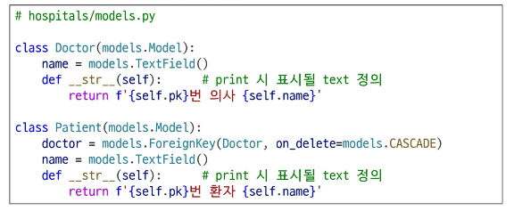

# 0506(Many To Many Relationships 01).md

# Many To Many Relationships 01

> **다대다 관계 (Many To many relationships) / (N : M) or (M : N)**
> 

: 한 테이블의 0개 이상의 레코드가 다른 테이블의 0개 이상의 레코드와 관련된 경우

## N : 1의 한계

> **의사와 환자 간 모델 관계 설정**
> 
- 한 명의 의사에게 여러 환자가 예약할 수 있도록 models 클래스 정의
    - Patient(환자) 모델에 Doctor 모델을 참조하도록 정의
- Migration 까지 진행하여 데이터베이스에 적용

> **의사와 환자 데이터 생성**
> 

> **N : 1의 한계 상황**
> 

## 중개 모델

> **중개 모델**
> 

: 다대다 관계에서 두 모델을 연결하는 역할을 하는, 특별한 기능을 가진 모델

> **예약 모델 생성**
> 
- 환자 모델의 외래 키를 삭제하고 별도의 예약 모델을 새로 생성
- 예약 모델은 의사와 환자에 각각 N : 1 관계를 갖는다

> **예약 데이터 생성**
> 
- 데이터베이스 초기화 후 Migration 진행 및 shell 실행
- 의사와 환자 데이터 생성 후 예약 정보 추가하기

> **예약 정보 조회**
> 
- 의사와 환자가 예약 모델을 통해 각각 본인의 진료 내역 확인
    - 각각의 의사 혹은 환자 데이터에서 중개 테이블의 역참조를 통해 예약 내역을 확인할 수 있음

> **추가 예약 생성**
> 
- 1번 의사에게 새로운 환자 예약 생성

> **예약 정보 조회**
> 
- 1번 의사의 전체 예약 정보 조회
    - 예약 테이블의 역참조를 활용해서 어떤 예약이 있는지 확인할 수 있음

- 이렇게 다대다 관계 (Many to many relationship)의 경우 중개 테이블을 생성해서 데이터를 효율적으로 관리할 수 있음
- Django에서는 ‘ManyToManyField’를 통해 두 모델 간의 중간 테이블 (중개 모델)이 자동으로 만들어짐

### ManyToManyField

> **ManyToManyField( )**
> 

: M : N 관계 설정 모델 필드

> **ManyToManyField 조작**
> 
- **.add( ) 메서드**
    - 중개 테이블에 새로운 데이터를 추가할 때 사용한다
    - 인자로 연결할 대상 모델의 인스턴스를 넣어서 사용한다

- **.remove( ) 메서드**
    - 중개 테이블에 있는 데이터를 삭제할 때 사용한다
    - 인자로 전달한 인스턴스를 중개 테이블에서 제거하며, 대상 객체 자체는 삭제되지 않는다

> **Django ManyToManyField 실습**
> 

> **기본 ManyToManyField의 한계**
> 
- 기본 ManyToManyField로 생성된 예약 중개 테이블은 의사와 환자의 외래 키 정보만 저장하고 있음
- 만약 예약 중개 테이블에 병의 증상, 예약 일정, 방문 횟수에 대한 추가 정보가 필요한 경우, 기본 ManyToManyField를 그대로 사용할 수 없음
- 추가 정보를 저장하기 위해서는 사용자가 직접 중개 테이블을 정의해야 함
    - 사용자가 직접 중개 테이블을 정의하면 .add( ), .remove( )에 메서드를 사용할 수 없음
- ManyToManyField에 ‘through’ 속성을 통해 사용자가 작성한 중개 테이블을 등록하면 추가 정보 저장 및 .add( ), .remove( ) 메서드를 그대로 활용할 수 있게 됨

### ‘through’ argument

> **ManyToManyField의 ‘through’ 속성**
> 

> **‘through’ 속성 실습**
> 

> **M : N 관계 주요 사항 정리**
> 
- M : N 관계로 맺어진 두 테이블에는 물리적인 변화가 없음
- ManyToManyField는 중개 테이블을 자동으로 생성
- ManyToManyField는 M : N 관계를 맺는 두 모델 어디에 위치해도 상관 없음
    - 대신 필드 작성 위치에 따라 참조와 역참조 방향을 주의할 것
- N : 1은 완전한 종속의 관계였지만 M : N은 종속적인 관계가 아니며 ‘의사에게 진찰받는 환자’ & ‘환자를 진찰하는 의사’ 이렇게 2가지 형태 모두 표현 가능

### ManyToManyField(to, **options)

> **ManytoManyField의 특징**
> 

> **ManyToManyField의 대표 인자 3가지**
> 
1. **related_name**
    - 역참조 이름을 변경할 때 설정하는 인자
2. **symmetrical**
    - 관계 설정 시 대칭에 대한 설정을 하는 인자
3. **through**
    - 직접 생성한 중개 테이블을 등록하는 인자

> **‘related_name’ argument**
> 
- 역참조시 사용하는 manager name을 변경
    - 기본 값인 ‘역참조모델명_set’을 다른 이름으로 변경할 때 사용
    - 이름을 변경하면 더 이상 기본 값(’역참조모델명_set’)을 사용할 수 없음

> **‘symmetrical’ argumanet**
> 
- 관계 설정 시 대칭 유무 설정
- ManyToManyField가 동일한 모델을 가리키는 정의에서만 사용
- 기본 값 : True

- source 모델 : 관계를 시작하는 모델
- target 모델 : 관계의 대상이 되는 모델
- symmetrical 값이 True인 경우
    - source 모델의 인스턴스가 target 모델의 인스턴스를 참조하면 자동으로
    target 모델 인스턴스도 source 모델 인스턴스를 자동으로 참조하도록 함(대칭)
    - 즉, 내가 당신의 친구라면 자동으로 당신도 내 친구가 된다
- symmetrical 값이 False인 경우
    - True와 반대 (대칭되지 않는다)

> **‘through’ argument**
> 
- 사용하고자 하는 중개모델을 지정한다
- 일반적으로 “추가 데이터를 M : N 관계와 연결하려는 경우”에 활용한다

## 좋아요 기능 구현

### 모델 관계 설정

> **다대다 관계 설정**
> 

> **좋아요 기능의 모델 관계 설정**
> 

> **역참조 매니저 충돌**
> 
- 게시글의 작성자 저장을 위해 설정한 ForeignKey의 역참조
    - “유저가 작성한 게시글”을 확인하기 위해서는 ‘article_set’를 사용해야 한다
    - user.article_set.all( )
- 좋아요 기능을 위해 설정한 ManyToManyField의 역참조
    - “유저가 좋아요 한 게시글”을 확인하기 위해서는 ‘article_set’을 사용해야 한다
    - user.article_set.all( )
- ‘article_set’의 역참조 이름이 겹치게 되어 충돌이 발생하고 있다
- User와 Article 모델 사이에 ForeignKey(작성자)와 ManyToManyField(좋아요) 두 관계가 공존하면서 ‘article_set’이라는 역참조 이름이 충돌하여 어떤 데이터에 접근해야 하는지 알 수 없게 된다
- ‘user가 작성한 글 (user.article_set)’과 ‘user가 좋아요를 누른 글(user.article_set)’을 구분할 수 있도록 코드 수정이 필요하다

**→ 두 관계 중 하나에 related_name을 설정해야 하는데, 일반적으로 ManyToManyField쪽에 related_name을 추가하는 것을 권장한다**

> **M : N 관계를 바꾸는 것이 더 좋은 이유 2가지**
> 

> **충돌 해결하기**
> 
- **user.article_set.all( )**
    - “이 유저가 작성한 모든 글” (소유 관계, 기본)
- **user.like_articles.all( )**
    - “이 유저가 좋아요를 누른 모든 글” (행위 관계, 명시적)

→ 핵심적인 ‘소유’ 관계(N : 1)는 기본값을 유지하고, 부가적인 ‘행위’ 관계 (M : N)에 구체적인 이름을 붙여주는 것으로 설계하기

- related_name 작성 후 Migration 재진행

- 생성된 중개 테이블 확인

> **User - Article 간 사용 가능한 전체 related manager**
> 
- article.user
    - 게시글을 작성한 유저 - N : 1
- user.article_set
    - 유저가 작성한 게시글(역참조) - N : 1
- article.like_users
    - 게시글을 좋아요 한 유저 - M : N
- user.like_articles
    - 유저가 좋아요 한 게시글(역참조) - M : N

### 기능 구현

> **좋아요 기능 구현**
> 

## 정리

