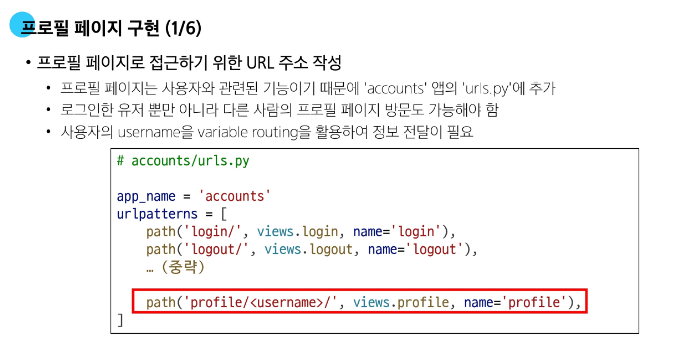

# 0507(Many To Many Relationship 02).md

# Many To Many Relationship 02

## 팔로우 기능 구현

### 프로필 페이지

> **프로필 페이지**
> 
- 각 회원의 개인 프로필 페이지에 팔로우 기능을 구현하기 위해 프로필 페이지를 먼저 구현하기
- 프로필 페이지에 해당 사용자의 추가 정보를 같이 볼 수 있게 내용 추가
    - 해당 사용자가 작성한 게시글 목록
    - 해당 사용자가 작성한 댓글 목록
    - 해당 사용자가 좋아요를 누른 게시글 목록

> **프로필 페이지 구현**
> 

### 모델 관계 설정

> **팔로우 기능의 모델 관계**
> 

> **팔로우 모델 관계 설정**
> 

### 기능 구현

> **팔로우 기능 구현**
> 

## Fixtures

> **Fixtures**
> 

> **Fixtures 사용 목적**
> 
- 초기 데이터 세팅
    - 웹 서비스가 처음 시작될 때 필요한 기본 데이터 (기본 권한 그룹, 상품 카테고리 등)를 미리 세팅할 수 있다
- 테스트 샘플 데이터 준비
    - 테스트할 때, 항상 동일하고 예측 가능한 데이터 환경을 구축하여 테스트의 신뢰성과 반복 가능성을 높이는 데 활용
- 협업 시 동일한 데이터 환경 맞추기
    - 팀원들이 각자의 개발 환경을 설정할 때, 모두 동일한 초기 데이터나 특정 테스트 데이터 셋을 쉽게 공유하고 적용
    - 개발 환경 간의 일관성을 유지하고 협업 효율을 높이는 데 도움을 준다

> **초기 데이터의 필요성**
> 
- 협업하는 유저 A, B가 있다고 생각 했을 때
    1. A가 먼저 프로젝트를 작업 후 원격 저장소에 push를 진행
        - .gitignore로 인해 DB는 업로드 하지 않기 때문에 A가 생성한 데이터도 업로드 X
    2. B가 원격 저장소에서 A가 push한 프로젝트를 pull (혹은 clone)
        - 결과적으로 B는 DB가 없는 프로젝트를 받게 된다
- 이처럼 프로젝트의 앱을 처음 설정할 때 동일하게 준비 된 데이터로 데이터베이스를 미리 채우는 것이 필요한 순간이 있다
- Django에서는 fixtures를 사용하여 앱에 초기 데이터 (initial data)를 제공한다

> **Fixtures 관련 명령어**
> 
- ‘dumpdata’
    - 데이터베이스에서 데이터를 내보낼 때 사용하는 명령어
    - 주로 파일(JSON) 형태로 추출한다
    - 특정 테이블의 데이터만 추출도 가능하다
- ‘loaddata’
    - 데이터베이스에 데이터를 불러올 때 사용하는 명령어
    - 내보내기 형태로 저장된 JSON을 읽어와서 데이터베이스에 저장한다

> **Fixtures 실습 사전 준비**
> 
- M : N 까지 모두 작성된 Django 프로젝트에서 유저, 게시글, 댓글 데이터 준비하기
    - 유저 데이터
        - 최소 3명의 유저를 회원가입을 통해 준비
    - 게시글
        - 유저 별로 1~2개의 게시글 생성을 통해 데이터 준비
    - 댓글
        - 게시글 당 2~3개씩 작성하여 데이터 준비
        - 유저 별로 0~2개 정도 작성되도록 준비

### dumpdata

> **dumpdata**
> 

> **dumpdata 기본 명령어**
> 

`$ python [manage.py](http://manage.py) dumpdata [앱이름.모델이름] [옵션] > 추출파일명.json` 

- 앱 이름만 지정
    - 해당 앱의 모든 모델에 대한 데이터를 추출
- 앱이름.모델이름 지정
    - 특정 모델의 데이터를 추출
- 앱 혹은 모델명을 지정하지 않은 경우
    - 프로젝트 전체의 모델 데이터를 추출
- --format 옵션을 통해 JSON, YAML 등의 형식 지정 가능 (기본값 : JSON)

> **dumpdata 명령어 예시**
> 

`$ python [manage.py](http://manage.py) dumpdata --indent 4 articles.article > articles.json`

- articles 앱의 Article 모델 데이터를 추출
    - ‘--indent 4’는 들여쓰기를 4칸을 한다는 옵션
- 명령어 실행 후 프로젝트 폴더에 articles.json 파일이 생성된다
- articles.json 파일에는 Article 모델의 모든 데이터가 JSON 형식으로 작성 되어 있다
- Fixtures 파일명은 자유롭게 작성 가능

- article 앱의 comment 모델과 account 앱의 user 모델의 데이터를 추출

`$ python [manage.py](http://manage.py) dumpdata --indent 4 articles.comment > comments.json
 $ python manage.py dumpdata --indent 4 accounts.user > users.json` 

> **dumpdata 정리**
> 
- dumpdata 명령어를 사용하면 프로젝트 내 특정 앱 혹은 모델에 대한 데이터를 JSON 등 원하는 포맷으로 추출 가능하다
- 이렇게 생성된 데이터 파일은 추후 다른 환경에서 loaddata로 불러와 동일한 데이터 상태를 재현할 수 있으며, 협업 및 배포에 큰 장점이 있다

### loaddata

> **loaddata**
> 

> **loaddata 기본 명령어**
> 
- Fixtures 파일의 기본 경로에 있는 파일을 DB에 반영한다
    
    `$ python [manage.py](http://manage.py) loaddata 파일경로` 
    
- Fixtures 파일의 기본 경로
    - app_name/fixtures/
- Django는 설치된 모든 app의 디렉토리에서 fixtures 폴더 이후의 경로로 fixtures 파일을 찾아 load를 진행

> **loaddata 실습 사전 준비**
> 
- ‘articles’ 폴더 내에 ‘fixtures’ 폴더를 생성 후 해당 폴더에 dumpdata로 생성한 파일들을 위치

- ‘db.sqlite3’ 파일 삭제 후 migrate 진행하여 데이터베이스 초기화

> **loaddata 명령어 예시**
> 
- dumpdata로 생성한 파일들을 모두 DB에 반영
- 파일을 한 번에 작성하면, Django가 자동으로 우선 순위가 높은 파일부터 불러오므로 json파일의 작성 순서는 상관없다
    
    `$ python [manage.py](http://manage.py) loaddata articles.json users.json comments.json`
    
- 단, loaddata를 한번에 실행하지 않고 별도로 실행한다면 모델 관계에 따라 load 순서가 중요할 수 있다
    - comment는 article에 대한 key 및 user에 대한 key가 필요
    - article은 user에 대한 key가 필요
- 즉, 현재 모델 관계에서는 user → article → comment 순으로 data를 load해야 오류가 발생하지 않는다
    
    `$ python [manage.py](http://manage.py) loaddata users.json
     $ python manage.py loaddata articles.json
     $ python manage.py loaddata comments.json`
    
- 첫 번째로 comment.json을 먼저 loaddata 하게 되면 아래와 같이 에러가 발생
    - 게시글 정보를 찾을 수 없어 에러가 발생한다

> **loaddata 주의 사항**
> 
- loaddata를 실행하기 전에 해당 모델에 대한 마이그레이션이 완료되어 있어야 한다
- 같은 PK를 가진 데이터가 이미 있는 경우 중복 에러가 발생할 수 있다
    - 이 경우 기존 데이터를 지우거나, 새로운 Fixture 파일을 사용해야 한다

> **loaddata 정리**
> 
- loaddata 명령어는 dumpdata로 추출한 Fixture 파일을 DB로 불러오는 명령어이며, 개발 환경 준비나 협업 시 매우 유용하다
- 마이그래이션 상태를 먼저 확인하고, 인코딩 문제 등을 사전에 해결하면 매끄럽게 데이터를 복원할 수 있다

## Improve query

> **Improve query**
> 

> **N + 1 Problem**
> 

### 사전 준비

> **Improve query 실습 사전 준비**
> 

### annotate

> **Django annotate**
> 
- SQL의 GROUP BY를 사용
    - 각 행(row)별로 계산된 필드를 추가한다
- 쿼리셋의 각 객체에 계산된 필드를 추가
    - 기존 필드에 새로운 필드를 추가하여 계산된 값을 넣어 반환
- 집계 함수(Count, Sum, Avg, Max, Min 등)와 함께 자주 사용 된다
    - 집계 함수 : 여러 데이터를 요약하여 분석할 때 사용하는 함수

> **annotate 예시**
> 

> **N + 1 Problem 상황**
> 

> **annotate 적용**
> 

### select_related

> **select_related**
> 

> **select_related 예시**
> 

> **N + 1 Problem 상황**
> 

> **select_related 적용**
> 

### prefetch_related

> **prefetch_related**
> 

> **prefetch_related 예시**
> 

> **N + 1 Problem 상황**
> 

> **prefetch_related 적용**
> 

### select_related & prefetch_related

> **N + 1 Problem 상황**
> 

> **prefetch_related 적용**
> 

> **select_related & prefetch_related 적용**
> 

## 참고

### ‘exists’ method

> **.exists( ) 특징**
> 
- QuerySet에 결과가 하나 이상 존재하는지 여부를 확인하는 메서드
    - 결과가 포함되어 있으면 True를 반환하고 결과가 포함되어 있지 않으면 False를 반환
- 데이터베이스에 최소한의 쿼리만 실행하여 효율적이다
- 전체 QuerySet을 평가하지 않고 결과의 존재 여부만 확인한다
    - 해당 데이터를 불러오지 않고, 데이터베이스 수준에서 빠르게 판단이 가능하다

→ 대량의 QuerySet에 있는 특정 객체 검색에 유용하다

> **exists 적용 예시**
> 

### 한꺼번에 dump 하기

> **한꺼번에 dump 하기**
> 

### loaddata 인코딩 에러

> **인코딩 문제**
> 

> **인코딩 문제 해결 방법**
> 

### 정리

