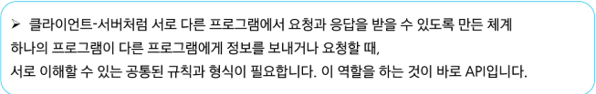

# 0511(DRF 01 / Single).md

# DRF 01

## REST API

### API

> **API (Application Programming Interface)**
> 

: 두 소프트웨어가 서로 통신 할 수 있게 하는 메커니즘

> **API 예시**
> 

> **API 역할**
> 

> **Web API**
> 
- 웹 서버 또는 웹 브라우저를 위한 API
- 현대 웹 개발은 Open API들을 활용
- 대표적인 Third Party Open API 서비스 목록
    - youtube API
    - Google Map API
    - Naver Papago API
    - Kakao Map API
- Open API : 누구나 접근할 수 있도록 공개된, 외부 소프트웨어와 통신하기 위한  인터페이스
- Thrid Party : 직접 개발하지 않은 외부의 서비스나 소프트웨어를 제공하거나 활용하는 주체

### REST API

> **REST (Representational State Transfer)**
> 

:  API Server를 개발하기 위한 일종의 소프트웨어 설계 방법론

> **RESTful API**
> 

: “자원을 정의” 하고 “자원에 대한 주소를 지정” 하는 전반적인 방법을 서술

> **REST API 활용 예시**
> 

> **REST에서 자원을 정의하고 주소를 지정하는 방법**
> 
- 자원의 “식별”
    - URL
- 자원의 “행위”
    - HTTP Methods
- 자원의 “표현”
    - JSON 데이터
    (궁극적으로 표현되는 데이터 결과물)

### 자원의 식별

> **URI (Uniform Resource Identifier) (통합 자원 식별자)**
> 

: 인터넷에서 리소스(자원)를 식별하는 문자열

- 자 원 (Resource) : 웹에서 고유한 주소를 통해 접근할 수 있는 데이터나 기능의 대상

→ 가장 일반적인 URI는 웹 주소로 알려진 URL

> **URL (Uniform Resource Locator) (통합 자원 위치)**
> 

: 웹에서 주어진 리소스의 주소

→ 네트워크 상에 리소스가 어디 있는지를 알려주기 위한 약속

> **Schema (or Protocol)**
> 
- 브라우저가 리소스를 요청하는 데 사용해야 하는 규약
- URL의 첫 부분은 브라우저가 어떤 규약을 사용하는지를 나타낸다
- 기본적으로 웹은 http(s)를 요구
    - 메일을 열기위한 mailto:, 파일을 전송하기 위한 ftp: 등 다른 프로토콜도 존재

> **Domain Name**
> 
- 요청 중인 웹 서버를 나타낸다
- 어떤 웹 서버가 요구되는 지를 가리키며 직접 IP 주소를 사용하는 것도 가능하지만,
사람이 외우기 어렵기 때문에 주로 Domain Name으로 사용한다
- 예 ) 도메인 [google.com](http://google.com) 의 IP 주소는 142.251.42.142

> **Port**
> 
- 웹 서버의 리소스에 접근하는데 사용되는 기술적인 문(Gate)
- HTTP 프로토콜의 표준 포트
    - HTTP - 80
    - HTTPS - 443
- 표준 포트만 작성 시 생략 가능하다

> **Path**
> 
- 웹 서버의 리소스 경로
- 초기에는 실제 파일이 위치한 물리적 위치를 나타냈지만,
오늘날에는 실제 위치가 아닌 추상화된 형태의 구조를 표현한다
- 예 ) /articles/create/라는 주소가 실제 articles 폴더 안에 create 폴더 안을 나타내는 것은 아니다

> **Parameters**
> 
- 웹 서버에 제공하는 추가적인 데이터
- ‘ & ‘ 기호로 구본되는 key-value 쌍 목록이다
- 서버는 리소스를 응답하기 전에 이러한 파라미터를 사용하여 추가 작업을 수행할 수 있다

> **Anchor**
> 
- 일종의 “ 북마크 “ 를 나타내며 브라우저에 해당 지점에 있는 콘텐츠를 표시한다
- ‘ # ‘ (fragment identifier, 부분 식별자) 이후 부분은 서버에 전송되지 않는다
- [https://docs.djangoproject.com/en/4.2/intro/install/#quick-install-guide](https://docs.djangoproject.com/en/4.2/intro/install/#quick-install-guide) 요청에서
#quick-install-guide는 서버에 전달되지 않고 브라우저에게 해당 지점으로 이동할 수 있도록 한다

### 자원의 행위

> **HTTP Request Methods**
> 

: 리소스에 대한 행위 수행하고자 하는 동작을 정의

> **HTTP Request Methods 종류**
> 
- GET
    - 서버에 리소스의 표현을 요청한다
    - GET을 사용하는 요청은 데이터만 검색해야 한다
- POST
    - 데이터를 지정된 리소스에 제출한다
    - 서버의 상태를 변경한다
- PUT
    - 요청한 주소의 리소스를 수정한다
- DELETE
    - 지정된 리소스를 삭제한다

> **HTTP response status codes**
> 

: 특정 HTTP 요청이 성공적으로 완료 되었는지 여부를 나타낸다

> **HTTP response status codes**
> 
- Informational response (100 - 199)
    - 요청을 계속 진행 중이라는 중간 응답
- Successful response (200 - 299)
    - 요청이 정상적으로 처리되었음을 의미
- Redirection messages (300 - 399)
    - 요청한 리소스가 다른 위치로 옮겨졌을 때 사용
- Client error responses (400 - 499)
    - 클라이언트 요청에 문제가 있을 때 반환
- Server error responses (500 - 599)
    - 서버 내부의 문제로 요청을 처리하지 못했을 때 사용

### 자원의 표현

> **그동안 서버가 응답(자원을 표현) 했던 것**
> 
- 지금까지 Django 서버는 사용자에게 페이지(html)만 응답하고 있었다(교육 과정 중)
- 하지만, 서버가 응답할 수 있는 것은 페이지 뿐만 아니라 다양한 데이터 타입을 응답할 수 있다
- REST API는 이 중에서도 JSON 타입으로 응답하는 것을 권장한다

※ JSON은 데이터만을 전달하기 위한 최소한의 형식

- JSON : 데이터를 구조화된 텍스트 형태로 표현하는 형식

※ 어떤 클라이언트와도 언어와 플랫폼에 독립적으로 통신할 수 있게 해준다 

> **응답 데이터 타입의 변화**
> 

### JSON 데이터 응답

> **사전 준비**
> 

> **python으로 json 데이터 처리하기**
> 

> **코드 실행 방법**
> 

## DRF with Single Model

### Django REST Framework

> **Django REST framework**
> 

: Django에서 Restful API 서버를 쉽게 구축할 수 있도록 도와주는 오픈소스 라이브러리

> **프로젝트 준비**
> 

> **Postman**
> 
- 화면 구성 안내

## Serializer

> **Serialization 예시**
> 

> **Serializer (직렬화) 정의**
> 

> **Serialize 담당 부분**
> 

> **Serializer**
> 

: Serialization을 진행하여 Serialized data를 반환해주는 클래스

> **ModelSerializer**
> 

: Django 모델과 연결된 Serializer 클래스

→ 일반 Serializer와 달리 사용자 입력 데이터를 받아 자동으로 모델 필드에 맞추어 Serializtion을 진행

> **ModelSerializer class 사용 예시**
> 

### CRUD with ModelSerializer

> **URL과 HTTP requests methods 설계**
> 

### GET method - 조회

> **GET - List**
> 

> **ModelSerializer의 인자 및 속성**
> 
- many 옵션
    - Serialize 대상이 QuerySet인 경우 입력
    
    `serializer = ArticleListSerializer(articles, many=True)`
    
    ※  many 옵션을 지정하지 않으면 단일 객체로 처리된다
    
- data 속성
    - Serialized data 객체에서 실제 데이터를 추출
    
    `return Response(serializer.data)`
    

> **과거 view함수와의 응답 데이터 비교**
> 

> **‘api_view’ decorator**
> 
- DRF view 함수에서는 필수로 작성되며 view 함수를 실행하기 전 HTTP 메서드를 확인
- 허용하도록 지시한 메서드에 대해서만 올바르게 답변하며,
목록에 추가하지 않은 다른 메서드 요청에 대해서는 405 method Not Allowed로 응답한다
- DRF view 함수가 응답해야 하는 HTTP 메서드 목록을 작성

> **GET - Detail**
> 

### POST method - 생성

> **POST**
> 
- 게시글 데이터 생성하기
1. 데이터 생성이 성공 했을 경우 201 Created 응답
2. 데이터 생성이 실패 했을 경우 400 Bad request 응답

### DELETE method - 삭제

> **DELETE**
> 

> **DELETE 응답 시 Response 구성 방식**
> 

> **DELETE 응답 시 데이터를 반환하는 방법**
> 
- 일반적으로 DELETE 요청은 204 No Content로 본문 없이 응답하는 것이 RESTful 한 설계방식
- 하지만, 특정 상황에서는 삭제된 객체의 정보를 함께 반환해야 할 수도 있다
    - 클라이언트에서 삭제 대상 데이터를 확인하거나, UI에서 알림 메시지로 활용할 경우
        
        → 예 : “ 게시글 ‘Django 소개’ 가 삭제 되었습니다.”
        
    - 삭제된 데이터가 실제로 무엇이었는지 사용자에게 피드백을 주기 위해

> **DELETE 처리 후, 추가 응답 데이터 반환**
> 

### PUT method - 수정

> **PUT**
> 

> **‘partial’ argument**
> 
- “부분 업데이트”를 허용하기 위한 인자
- partial 인자의 기본 값은 False
- partial 인자를 False로 설정하면, 게시글의 title만 수정하려고 하더라도
content와 같은 다른 필수 필드들도 함께 전송해야 함
- 이는 serializer 기본적으로 모든 필수 필드에 대한 값이 전달되었는지 확인하기 때문
- 따라서 일부 필드만 수정하고 싶다면, partial=True로 설정하여 일부 필드만 전달되도록 허용해야 한다

> **PATCH 메서드 - 일부 필드만 수정하기**
> 
- PATCH는 리소스의 전체가 아닌, 일부만 수정할 때 사용하는 HTTP 메서드
- Django REST framework에서는 partial=True 설정을 통해 부분 수정을 구현
    - 게시글의 title만 바꾸고 싶을 때, 전체 필드를 다 보낼 필요 없이 해당 필드만 전송하면 된다

> **PUT vs PATCH**
> 

## 참고

### raise_exception

> **raise_exception**
> 

### 정리

