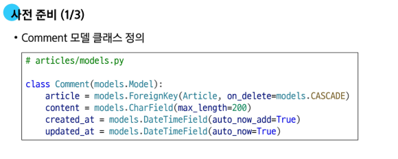

# 0512(DRF 02 / Many).md

# DRF 02

## DRF with  N : 1 Relation

> **사전 준비**
> 

> **URL 및 HTTP request method 구성**
> 

### GET method

> **GET - List**
> 
- 댓글 목록 조회를 위한 CommentSerializer 정의

- url 작성

- view함수 작성

> **GET -Detail**
> 
- 단일 댓글 조회를 위한 url 및 view 함수 작성

### POST method

> **POST**
> 
- 단일 댓글 생성을 위한 url 및 view함수 작성

- serializer 인스턴스의 save( ) 메서드는 특정 Serializer 인스턴스를 저장하는 과정에서 추가 데이터를 받을 수 있다

- 데이터를 전송 받은 시점에
” 유효성 검사에서 제외시키고, 데이터 조회 시에는 출력” 하는 필드

### 읽기 전용 필드

> **read_only_fields (읽기 전용 필드)**
> 

: 서버가 조회 요청에 대한 응답 시에만 값을 표시하는 필드

> **읽기 전용 필드 사용 목적**
> 
- 클라이언트 측에서 직접 수정하면 안되는 경우
- 서버 로직에 의해 자동 생성 / 관리되는 값 활용
- 입력은 받지 않지만 정보를 제공해야 하는 경우
- 새로운 필드 값(추가 계산, 가공)을 만들어 제공해야 하는 경우
    
    → 댓글 개수 ,,, 
    

> **읽기 전용 필드 특징 및 주의사항**
> 
- 유효성 검사에서 제외된다
    - 읽기 전용 필드는 클라이언트가 보내는 요청 데이터에서 고려되지 않으므로, 유효성 검사 대상에서 제외된다
    - 즉, 클라이언트가 해당 필드에 값을 넣어도 무시되며 검증 오류를 일으키지 않는다
- 생성 / 수정 요청 모두에서 적용 가능하다
    - 읽기 전용 필드라 해서 생성 (POST) 단계에서만 무의미한 것은 아니다
    - 수정 (PUT) 요청에서도 해당 필드는 여전히 클라이언트 입력을 받지 않고, 응답 시에만 노출된다

### DELETE & PUT method

> **DELETE & PUT**
> 
- 단일 댓글 삭제 및 수정을 위한 view 함수 작성

## 응답 데이터 재구성

> **댓글 조회 시 게시글 출력 내역 변경**
> 
- 댓글 목록 조회 시 게시글 번호만 제공해주는 것이 아닌 ‘ 게시글의 제목 ‘ 까지 제공하기

- Comment 모델은 Article을 참조하고 있다
    - Comment가 article과 N : 1 관계를 맺고 있고, Django는 기본적으로 이 관계를 통해 숫자 (id) 값만 응답에 포함한다

- CommentSerializer는 Comment의 정보를 가지고 있다
    - Comment 모델의 Article을 참조하고 있어, 그 정보를 id로 field에 제공할 수 있는 것이다

- Serializer는 DRF에서 응답 구조를 결정하는 주체
    - Serializer를 통해 어떤 필드를 포함할지 직접 지정하여 사용하고 있다
        
        `fields = ('id', 'title', 'cotent', )`
        
    - 또한, 특정 필드를 어떤 형식으로 보여줄지도 지정하여 사용할 수 있다
    - 즉,  article 필드가 “id가 아닌 게시글의 제목”을 보여 주도록 지정할 수 있다
- 하지만, CommentSerializer는 Comment의 정보만 가지고 있을 뿐, Article에 대한 정보는 없다
    - article의 정보를 포함하고 있고, 그 중 title 필드의 정보만 반환하는 Serializer를 별도로 정의해야 한다

- ArticleTitleSerializer는 어디에 정의해야 하나?
    - CommentSerializer에서만 사용할 용도라면, 굳이 독립적으로 선언할 필요가 없다
    - 코드의 응집도를 높이고, 명확한 범위를 지정하기 위해서 CommentSerializer 내부에 정의한다
- Comment 모델의 article 필드를 ArticleTitleSerializer로 재정의한다
    - 이제, article 필드는 게시글의 title 필드만 포함한 구조로 응답한다

### 읽기 전용 필드 주의 사항

> **읽기 전용 필드 지정 주의 사항**
> 
- 특정 필드를 재정의 혹은 추가한 경우 read_only_fields는 동작하지 않는다
- 이런 경우 새로운 필드에 read_only 키워드 인자로 작성해야 한다

> **read_only_fields 속성과 read_only 인자**
> 
- **read_only_fields**
    - 기존 외래 키 필드 값을 그대로 응답 데이터에 제공하기 위해 지정하는 경우

- **read_only**
    - 기존 외래 키 필드 값의 결과를 다른 값으로 덮어쓰는 경우
    - 새로운 응답 데이터 값을 제공하는 경우

## 역참조 데이터 구성

> Article → Comment 간 역참조 관계를 활용한 JSON 데이터 재구성
> 
- 아래 2가지 사항에 대한 데이터 재구성하기
    1. 단일 게시글 조회 시 해당 게시글에 작성된 댓글 목록도 함께 붙여서 응답
    2. 단일 게시글 조회 시 해당 게시글에 작성된 댓글 개수도 함께 붙여서 응답

### 단일 게시글 + 댓글 목록

> **단일 게시글 + 댓글 목록**
> 
- Nested relationships (역참조 매니저 활용)
    - 모델 관계 상으로 참조하는 대상( N )은 참조되는 대상 ( 1 )에 표현에도 포함되거나 중첩될 수 있다
    - Comment가 Article에 대한 정보를 article field를 사용하여 표현하였듯이,
    Article은 자신을 참조하고 있는 comment들에 대한 정보를 역참조 매니저를 통해 표현할 수 있다

> **단일 게시글 조회 시, 댓글 개수도 함께 제공하고 싶다면?**
> 
- 기본적으로 게시글(Article)을 조회하면 참조 중인 댓글(Comment)의 개수는 알 수 없다
    - Comment 모델과의 관계는 Article.comment_set으로 연결되지만,
    댓글의 개수를 저장하는 별도 필드는 Article 모델에 정의한 적 없기 때문
- 따라서, 댓글 수를 응답하려면, 직접 계산하여 응답에 포함시켜야 한다

> **View 로직 개선 : annotate 사용**
> 
- View 에서 Article 객체를 조회할 때 annotate를 활용하여 num_of_comments 필드를 추가
    
    ※ annotate는 Django ORM 함수로, SQL의 집계 함수를 활용하여 쿼리 단계에서 데이터 가공을 수행
    
- View에서 Article 객체를 조회할 때 annotate를 활용하여 num_of_comments 필드를 추가
- 다음과 같이 댓글 수를 세어 num_of_comments라는 필드를 추가
    - 이제 serializer.data가 반환하는, article 객체에는 num_of_comments라는 “주석(annotate) 필드”가 포함되어 있다

> **annotate를 사용하여 추가한 “주석 필드”를 serializer에 추가하려면?**
> 
- 단순히 fields = ‘_ _ all _ _’ 만으로는 annotate된 필드가 포함되지 않는다
    - annotate( ) 는 실제 모델 필드를 생성하지 않기 때문
    - annotate( ) 는 쿼리 시점에만 존재하는 임시 필드를 추가하는 기능
    - 즉, Article 모델 클래스에는 num_of_comments라는 필드가 실제로 존재하지 않는다
- _ _ all _ _은 모델의 필드 기준으로 작동하기 때문에, annotate로 만들어진 필드는 여기에 포함되지 않는다
- 이런 동적으로 계산된 필드를 응답에 포함하려면, SerializerMethodField를 사용하여야 한다

> **Serializer 개선 : SerializerMethodField 사용**
> 
- SerializerMethodField는 읽기 전용 필드를 커스터마이징 하는데 사용
- 이 필드를 선언한 뒤 get_<필드명> 메서드를 정의하면, 해당 메서드의 반환 값이 직렬화 결과에 포함된다

- 이제 [serializer.data](http://serializer.data) 호출 시, get_num_of_comments 메서드가 실행되어 num_of_comments 값이 자동으로 응답 할 데이터 필드에 포함되어 제공된다
- 추가적으로 view에서 data를 딕셔너리로 변환하거나 수정할 필요 없이, serializer.data를 바로 반환해도 최종 JSON 응답에 num_of_comments 값이 반영된다

### SerializerMethodField

> **SerializerMethodField 동작 원리**
> 
- SerializerMethodField를 Serializer 클래스 내에서 필드로 선언하면, DRF는 get_<필드명>이라는 이름을 가진 메서드를 자동으로 찾는다
- 예를 들어, full_name = serializers.SerializerMethodField( )라고 선언하면,
 DRF는 get_full_name(self, obj) 메서드를 찾아 해당 값을 직렬화 결과에 넣어준다

- obj는 현재 직렬화 중인 모델 인스턴스이며, 이 메서드에서 obj의 속성이나 annotate된 필드를 활용하여 새 값을 만들 수 있다

> **SerializerMethodField 주의 사항**
> 
- **읽기 전용**
- 생성(POST), 수정(PUT) 요청 시에는 사용되지 않는다
- get_메서드는 반드시 (self, obj) 형태로 정의해야 하며, obj는 현재 직렬화 중인 모델 인스턴스를 의미

> **SerializerMethodField 사용 목적**
> 
- **유연성**
    - 다양한 계산 로직을 손쉽게 추가 가능
- **가독성**
    - 데이터 변환 과정을 Serializer 내부 메서드로 명확히 분리
- **유지보수성**
    - view나 model에 비해 Serializer 측 로직 변경이 용이
- **일관성**
    - view에서 별도로 data 수정 없이도 직렬화 결과를 제어

### 역참조 데이터 구성 참고

> **역참조 매니저 활용 참고**
> 

> **annotate 활용 참고**
> 

## API 문서화

### OpenAPI Specification

> **RESTful API를 설명하고 시각화하는 표준화된 방법**
> 

### 문서화 활용

> drf-spectacular 라이브러리
> 

> **“설계 우선” 접근법**
> 
- OAS의 핵심 이점
- API를 먼저 설계하고 명세를 작성한 후, 이를 기반으로 코드를 구현하는 방식
- API의 일관성을 유지하고, API 사용자는 더 쉽게 API를 이해하고 사용할 수 있다
- 또한, OAS를 사용하면 API가 어떻게 작동하는지를 시각적으로 보여주는 문서를 생성할 수 있으며,
이는 API를 이해하고 테스트하는 데 매우 유용하다

→ 이런 목적으로 사용되는 도구가 Swagger-UI 또는 ReDoc

## 참고

### 올바르게 404 응답하기

> **HTTP Response Shortcuts**
> 

> **get_object_or_404 적용 예시**
> 

> **왜 사용해야 하나?**
> 

### View와 Serializer의 역할

> **View와 Serializer**
> 
- view나 queryset 로직에서는 비지니스 로직(데이터 가공, annotate, 필터링)을 처리
- serializer는 그 결과물을 직렬화하는 역할에 집중하는 것이 일반적인 권장 사항이다
- 복잡한 query나 로직은 View 함수에서 진행
    - 여러 모델을 조인하거나 복잡한 집계가 필요한 경우 View 함수에서 처리
    - 필요한 경우 View 함수에서 select_related( ) 나 prefetch_related( )를 사용하여 query 를 최적화

### DRF 학습 이유

> **왜 DRF 를 알아야 하나?**
> 

### 정리

