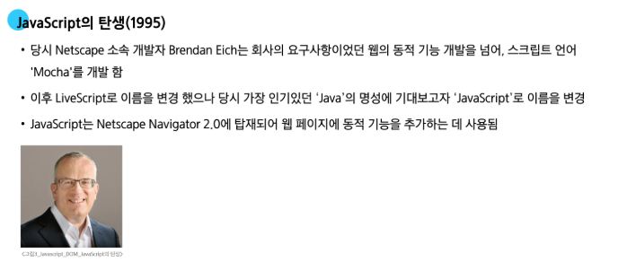

# 0513(JavaScript / DOM).md

# JavaScript

## 변수

> **JavaScript 문법 학습**
> 
- ECMAScript 2015 (ES6) 이후의 문법을 기준으로 설명
- 권장 스타일 가이드
    - [https://standardjs.com/rules-kokr.html](https://standardjs.com/rules-kokr.html)

### 변수 작성 규칙

> **식별자(변수명) 작성 규칙**
> 
- 반드시 문자, 달러( ’$’ ) 또는 밑줄 ( ‘_’ )로 시작
- 대소문자를 구분
- 예약어 사용 불가
    - for, if, function 등

> **식별자 (변수명) Naming Convention**
> 
- 카멜 케이스 (camelCase)
    - 변수, 객체, 함수에 사용
- 파스칼 케이스 (PascalCase)
    - 클래서, 생성자에 사용
- 대문자 스네이크 케이스 (SNAKE_CASE)
    - 상수 (constants)에 사용
    - 상수 (constants) : 한 번 선언하면 값을 바꿀 수 없도록 잠가버리는 특별한 변수

### 변수 선언 키워드

> **변수 선언 키워드 3가지**
> 
1. let
    - 재할당이 필요한 변수를 선언할 때 사용
2. const
    - 재할당이 불가능한 상수를 선언할 때 사용
3. ~~var~~
    - 재선언 / 재할당이 가능하고, 현재는 호이스팅(Hoisting) 문제로 사용을 권장하지 않는다

> **let**
> 

> **const**
> 

> **블록 스코프 (block scope)**
> 
- if, for, 함수 등의 ‘ 중괄호 ({ }) 내부 ’를 가리킨다
- 블록 스코프를 가지는 변수는 블록 바깥에서 접근 불가능

> **어떤 변수 선언 키워드를 사용해야 할까?**
> 
- **“const를 기본으로 사용할 것”**
    - 코드의 의도 명확화
        - 해당 변수가 재할당되지 않을 것임을 명확히 표현
        - 개발자들에게 변수의 용도와 동작을 더 쉽게 이해할 수 있게 해준다
    - 버그 예방
        - 의도치 않은 변수 값 변경으로 인한 버그를 예방
        - 큰 규모의 프로젝트나 팀 작업에서 중요
- 필요한 경우에만 let으로 전환 (재할당이 필요한 경우)
    - let을 사용하는 것은 해당 변수가 의도적으로 변경될 수 있음을 명확히 나타낸다
    - 코드의 유연성을 확보하면서도 const의 장점을 최대한 활용할 수 있다

# DOM

> **웹 브라우저에서의 JavaScript**
> 
- 웹 페이지에서 동적인 기능을 담당

## 문서 구조

> **Document structure**
> 

> **DOM (The Document Object Model)**
> 

> **DOM API**
> 
- 다른 프로그래밍 언어가 웹 페이지에 접근 및 조작할 수 있도록, 페이지 요소들을 객체 형태로 제공하며 관련된 메서드(Method)도 함께 제공
- HTML 구조와 내용을 조작하는 명령어 모음

### document 객체

> **document 객체**
> 
- 웹 페이지를 나타내는 DOM 트리의 최상위  객체
    - DOM 트리 : HTML 태그들의 관계를 나무 모양으로 만든 계층 구조
- HTML 문서의 모든 콘텐츠에 접근하고 조작할 수 있는 진입점

- DOM에서 모든 요소, 속성, 텍스트는 하나의 객체
- 모두 document 객체의 하위 객체로 구성된다

> **document 객체 예시**
> 
- HTML의 <title> 변경하기

## DOM Tree

> **DOM Tree**
> 
- HTML 태그를 나타내는 elements의 node는 문서의 구조를 결정한다
- 이들은 다시 자식 node를 가질 수 있다 (ex, document.body)
    
    → 객체 간 상속 구조가 존재함
    

> **DOM 핵심 포인트**
> 

## DOM 선택

> **DOM 조작 시 기억해야 할 것**
> 

### 선택 메서드

> **document.querySelector(selector)**
> 
- 요소 한 개 선택
- 제공한 선택자 (selector)와 일치하는 첫 번째 요소를 하나 선택
- 제공한 선택자를 만족하는 첫 번째 element 객체를 반환 (없다면 null 반환)
- selector :  찾고 싶은 html 요소를 지정하는 검색 조건
( ex , ‘.content’, ‘#id’, ,,, ,)

> **document.querySelectorAll(selector)**
> 
- 요소 여러 개 선택
- 제공한 선택자와 일치하는 여러 element를 선택
- 제공한 선택자를 만족하는 NodeList를 반환

> **DOM 선택 실습**
> 

## DOM 조작

> **DOM 조작**
> 
1. **속성 (attribute) 조작**
    - 클래스 속성 조작
    - 일반 속성 조작
2. HTML 콘텐츠 조작
3. DOM 요소 조작
4. 스타일 조작

### 속성 조작

> **속성 조작**
> 
1. **클래스 (Class) 속성 조작**
    - 스타일링 및 상태 제어를 위한 클래스 목록을 동적으로 추가 / 제거
2. **일반 속성 (Attribute) 조작**
    - id, href 등 요소의 모든 HTML 속성 값을 직접 설정 / 조회

> **클래스 속성 조작**
> 

> **classList 메서드**
> 
- element.classList.add( )
    - 지정한 클래스 값을 추가
- element.classList.remove( )
    - 지정한 클래스 값을 제거
- element.classList.toggle( )
    - 클래스가 존재한다면 제거하고 false를 반환 (존재하지 않으면 클래스를 추가하고 true를 반환)
    - toggle : 있으면 제거하고, 없으면 추가하는 식으로 상태를 바꾸는 기능

> **클래스 속성 조작 실습**
> 

> **일반 속성 조작 메서드**
> 
- Element.getAttribute( )
    - 해당 요소에 지정된 값을 반환 (조회)
- Element.setAttribute(name, value)
    - 지정된 요소의 속성 값을 설정
    - 속성이 이미 있으면 기존 값을 갱신 (그렇지 않으면 지정된 이름과 값으로 새 속성이 추가)
- Element.removeAttribute( )
    - 요소에서 지정된 이름을 가진 속성 제거

> **일반 속성 조작 실습**
> 

## HTML 콘텐츠 조작

> **‘textContent’ property**
> 

> **HTML 콘텐츠 조작 실습**
> 

### DOM 요소 조작

> **DOM 요소 조작 메서드**
> 
- document.createElement ( tagName )
    - 작성한 tagName의 HTML 요소를 생성하여 반환
- Node.appendChild( )
    - 한 Node를 특정 부모 Node의 자식 NodeList 중 마지막 자식으로 삽입
    - 추가된 Node 객체를 반환
- Node.removeChild( )
    - DOM에서 자식 Node를 제거
    - 제거된 Node를 반환

> **DOM 요소 조작 실습**
> 

### style 조작

> **‘style’ property**
> 

> **style 조작 실습**
> 

## 참고

### DOM 속성 확인 Tip

> **DOM 속성 확인 Tip**
> 
- F12 (개발자도구)

### 용어 정리

> **Node**
> 

> **NodeList**
> 

> **Element**
> 

> **Parsing**
> 

### 세미콜론

> **세미콜론 (semicolon)**
> 
- 자바스크립트는 문장 마지막 세미콜론 (’ ; ‘)을 선택적으로 사용 가능
- 세미콜론이 없으면 ASI에 의해 자동으로 세미콜론이 삽입된다
    - ASI (Automatic Semicolon Insertion, 자동 세미콜론 삽입 규칙)

### var

> **var**
> 

> **함수 스코프 (function scope)**
> 

### 호이스팅

> **호이스팅 (hoisting) 이란?**
> 

> **모든 선언은 호이스팅 된다.**
> 
- var, let, const, function, class 등 모든 선언은 호이스팅 된다
- 다만, ‘초기화’ 가 함께 이루어지느냐에 따라 동작 방식과 에러 발생 여부가 달라진다

> **변수의 생성 단계와 호이스팅 차이**
> 
- 자바스크립트 엔진은 변수를 선언(Declaraion) → 초기화(Initialization) → 할당(Assignment) 단계로 생성된다
- 호이스팅은 이 단계 중 어디까지 진행되느냐가 핵심이다

> **일시적 사각지대 (TDZ, Temporal Dead Zone)**
> 
- 스코프의 시작 지점부터 변수의 초기화가 이루어지는 지점 (실제 코드 선언부) 까지의 구간

> **함수 선언문의 호이스팅**
> 
- 함수 선언문 (function a( ) { } )은 var보다 더 강력하게 호이스팅 된다
- 선언, 초기화, 할당(함수 본체)이 모두 동시에 최상단으로 끌어 올려지므로, 선언 전에도 함수를 문제없이 호출 할 수 있다

> **호이스팅 요약 비교**
> 

### 정리

