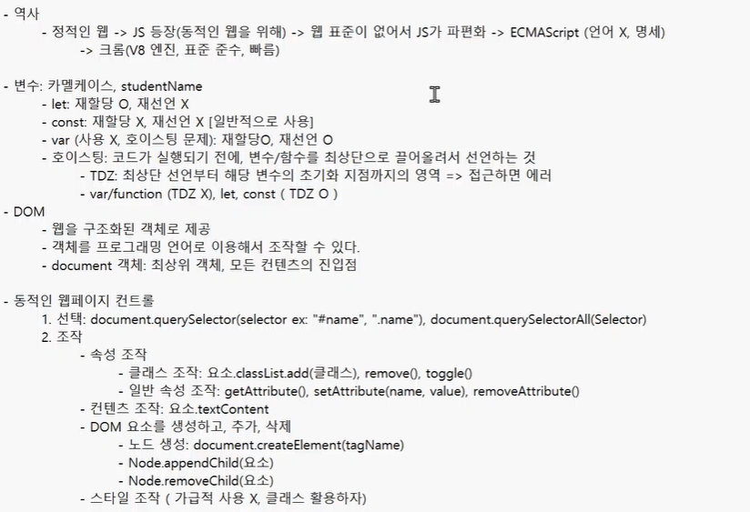

# 0514(JavaScript / Basic Syntax 01).md

# Basic Syntax 01



## 데이터 타입

> **원시 자료형 (Primitive type)**
> 
- 값 (value) 자체가 변수에 직접 저장되는 자료형
- 불변 (immutable) 이며, 변수 간 할당 시 값이 복사
- Number, String Boolean, null, undefined

> **참조 자료형 (Reference type)**
> 
- 데이터가 저장된 메모리의 주소가 변수에 저장되는 자료형
- 가변 (Mutable) 이며, 변수 간 할당 시 주소가 복사
- Objects(Object, Array, Function)


> **원시 자료형 예시**
> 
- 변수에 할당될 때 값이 복사된다
    
    → 변수 간에 서로 영향을 미치지 않는다
    
    → 기존 원시 자료형을 변경해서 사용하고 싶다면? 새로운 변수에 할당하여 사용해야 한다
    
    ex ) aUpper = a.toUppercase( )
    
    → a = ‘bar’ / aUpper = ‘BAR’
    


> **참조 자료형 예시**
> 
- 객체를 생성하면 객체의 메모리 주소를 변수에 할당
    
    → 변수 간에 서로 영향을 미친다
    


### 원시 자료형

> **원시 자료형 종류**
> 
- Number
- String
- null
- undefined
- Boolean

> **원시 자료형 - Number**
> 
- **정수와 실수 구분이 없고, 모든 숫자를 단일 타입으로 처리**
    
    → 10 과 10.00 은 똑같이 Number 타입 (동일한 타입)
    


> **원시 자료형 - String**
> 


> **Template literals (템플릿 리터럴) (파이썬에서의 f 스트링)**
> 
- 내장된 표현식을 허용하는 향상된 문자열 작성 방식
- Backtick(` `)을 이용하며, 여러 줄에 걸쳐 문자열을 정의할 수도 있고,
JavaScript의 변수를 문자열 안에 바로 연결할 수 있다
- 표현식은 ‘ $ ‘와 중괄호 ({ experssion }) 로 표기
- ES6+ 부터 지원

```jsx
const age = 100
const message = `홍길동은 ${age}세 입니다.`
console.log(message)  // 홍길동은 100세 입니다.
```

> **null**
> 
- 프로그래머가 의도적으로 ‘값이 없음’을 나타낼 때 사용

```jsx
let a = null
console.log(a) // null
```

> **undefined**
> 
- 시스템이나 JavaScript 엔진이 ‘값이 할당되지 않음’을 나타낼 때 사용

```jsx
let b
console.log(b) // undefined
```


> **원시 자료형 - Boolean**
> 


> **자동 형변환**
> 


## 연산자

> **연산자 종류**
> 
- 할당 연산자
- 증가 & 감소 연산자
- 비교 연산자
- 동등 연산자
- 일치 연산자
- 논리 연산자

> **할당 연산자**
> 
- 오른쪽에 있는 피연산자의 평가 결과를 왼쪽 피연산자에 할당하는 연산자
- 단축 연산자 지원
- 단축 연산자 : x = x + 1 을 x += 1처럼 코드를 짧게 줄여주는 연산자

```jsx
let a = 0

a += 10
console.log(a) // 10

a -= 3
console.log(a) // 7

a *= 10
console.log(a) // 70

a %= 7
console.log(a) // 0
```

> **증가 & 감소 연산자**
> 
- 증가 연산자 (’++’)
    - 피연산자를 증가 (1을 더함) 시키고 연산자의 위치에 따라 증가하기 전이나 후의 값을 반환
- 감소 연산자 (’- -’)
    - 피연산자를 감소 (1을 뺌) 시키고 연산자의 위치에 따라 감소하기 전이나 후의 값을 반환

→ 코드의 가독성을 위해 a += 1과 같이 더 명시적인 표현을 권장한다

```jsx
let x = 3
const y = x++
console.log(x, y) // 4 3

let a = 3
const b = ++a
console.log(a, b) // 4 4
```

> **비교 연산자**
> 
- 피연산자들 (숫자, 문자, Boolean 등) 을 비교하고 결과 값을 boolean으로 반환하는 연산자

```jsx
3 > 2 // true
3 < 2 // false

'A' < 'B' // true
'Z' < 'a' // true
'가' < '나' // true
```

> **동등 연산자 (==)**
> 
- 두 피연산자가 같은 값으로 평가되는지 비교한 후 boolean 값을 반환
- ‘암묵적 타입 변환’ 을 통해 타입을 일치키신 후 같은 값인지 비교
- 두 피연산자가 모두 객체일 경우 메모리의 같은 객체를 바라보는지 판별

```jsx
console.log(1 == 1) // true
console.log('hello' == 'hello') // true
console.log('1' == 1) // true
console.log(0 == false) // true
```


> **일치 연산자 (===)**
> 
- 두 피연산자의 값과 타입이 모두 같은 경우 true를 반환
- 같은 객체를 가리키거나, 같은 타입이면서 같은 값인지를 비교
- 엄격한 비교가 이뤄지며 암묵적 타입 변환이 발생하지 않는다
- 특별한 경우를 제외하고는, 예측하지 못한 결과를 방지하기 위해 일치 연산자(===) 사용을 권장

```jsx
console.log(1 === 1) // true
console.log('hello' === 'hello') // true
console.log('1' === 1) // false
console.log(0 === false) // false
```

> **논리 연산자**
> 
- and 연산
    - &&
- or 연산
    - ||
- not 연산
    - !
- 단축 평가 지원

```jsx
true && false // false
true && true // true

false || true // true
false || false // false

!true // false

1 && 0 // 0
0 && 1 // 0
4 && 7 // 7
1 || 0 // 1
0 || 1 // 1
4 || 7 // 4
```

## 조건문

> **if 조건문**
> 


> **삼항 연산자**
> 

삼항 연산자 표현식 : 

```jsx
condition ? expression1 : expression2
```

- 간단한 조건부 로직을 간결하게 표현할 때 유용하다
- 복잡한 로직이나 대다수의 경우에는 가독성이 떨어질 수 있으므로 적절한 상황에서만 사용할 것
- condition : 평가할 조건 (true 또는 false로 평가)
- expression1 : 조건이 true 일 경우 반환할 값 또는 표현식
- expression2 : 조건이 false 일 경우 반환할 값 또는 표현식

```jsx
const age = 20
const message = (age >= 18) ? '성인' : '미성년자'
console.log(message) // '성인'
```

## 반복분

> **반복문 종류**
> 
- while
- for
- for ,,, in
- for ,,, of

> **while 반복문**
> 


> **for 반복문**
> 


> **for 동작 원리**
> 


### for ,,, in

> **for ,,, in 반복문**
> 

→ 실무에서 주로 사용 X 


### for ,,, of

> **for ,,, of 반복문**
> 


### for ,,, in 과 for ,,, of

> **for ,,, in**
> 
- 배열과 객체


> **for ,,, of**
> 
- 배열과 객체


> **배열 반복과 for ,,, in**
> 
- 객체의 관점에서 보면, 배열의 인덱스도 “정수 형태의 이름을 가진 열거 가능한 속성”
- for ,,, in은 정수가 아닌 이름과 속성을 포함하여 열거 가능한 모든 속성을 반환
- 내부적으로 for ,,, in 은 배열의 반복자가 아닌 속성 열거를 사용하기 때문에
특정 순서에 따라 인덱스를 반환하는 것을 보장할 수 없다

→ 따라서 for ,,, in은 인덱스의 순서가 중요한 배열에서는 사용하지 않는다

→ 배열에서는 for 문, for ,,, of를 사용!

- 객체 관점에서 배열의 인덱스는 정수 이름을 가진 속성이기 때문에 인덱스가 출력된다 (순서 보장X)

```jsx
const arr = ['a', 'b', 'c']
for (const i in arr) {
		console.log(i) // 0, 1, 2
	}
for (const i of arr) {
		console.log(i) // a, b, c
	}
```


> **반복문 사용 시 const 사용 여부**
> 
- for 문
    - for (let i = 0; i < arr.length; i++) { ,,, } 의 경우에는 최초 정의한 i를 “재할당”히면서
    사용하기 때문에 const를 사용하면 에러 발생
- for ,,, in, for ,,, of
    - 재할당이 아니라, 매 반복마다 다른 속성 이름이 변수에 저장되는 것이므로
    const를 사용해도 에러가 발생하지 않는다
    - 단, const 특징에 따라 블록 내부에서 변수를 수정할 수 없다

> **반복문 정리**
> 


## 함수

> **Function**
> 
- 참조 자료형에 속하며 모든 함수는 Function object


### 함수 정의

> **함수 구조**
> 

```jsx
function name ([param[, param,[..., param]]]) {
	statements
	return value
}
```

- function 키워드
- 함수의 이름
- 함수의 매개변수
- 함수의 body를 구성하는 statements

※ return 문이 없거나 return 뒤에 값이 없으면, 함수는 undefined를 반환한다

> **함수 정의 2가지 방법**
> 


> **함수 선언식 특징**
> 
- 호이스팅이 된다
- 코드의 구조와 가독성 면에서는 표현식에 비해 장점이 있다

```jsx
add(1, 2) // 3

function add (num1, num2) {
	return num1 + num2
}
```


> **함수 표현식 특징**
> 
- 호이스팅이 되지 않는다
    - 변수 선언만 호이스팅되고 함수 할당은 실행 시점에 이루어진다
- 함수 이름이 없는 ‘익명 함수’를 사용할 수 있다
- 익명 함수 : 이름 없이, 필요할 때 즉시 만들어서 사용하는 일회용 함수

```jsx
sub(2, 1) // ReferenceError : Cannot access 'sub' before initialization

const sub = function (num1, num2) {
	return num1 - num2
}
```

> **함수 표현식 사용을 권장하는 이유**
> 
- 예측 가능성
    - 호이스팅의 영향을 받지 않아 코드 실행 흐름을 더 명확하게 예측할 수 있다
- 유연성
    - 변수에 할당되므로 함수를 값으로 다루기 쉽다
- 스코프 관리
    - 블록 스코프를 가지는 let이나 const와 함께 사용하여 더 엄격한 스코프 관리가 가능하다

### 매개 변수

: 함수가 외부로부터 값을 전달받기 위해 만들어 놓은 변수

> **매개변수 정의 방법**
> 
1. 기본 함수 매개 변수
2. 나머지 매개 변수

> **기본 함수 매개변수 (Default function parameter)**
> 
- 함수 호출 시 인자를 전달하지 않거나  undefined를 전달할 경우, 지정된 기본 값으로 매개변수를 초기화

```jsx
const greeting = function (name = 'Anonymous') {
	return `Hi ${name}`
}

greeting( ) // Hi Anonymous
```

> **나머지 매개변수 (Rest parameter)**
> 
- 정해지지 않은 개수의 인자들을 배열로 모아서 받는 방법
- 작성 규칙
    - 함수 정의 시 나머지 매개변수는 하나만 작성할 수 있다
    - 나머지 매개변수는 함수 정의에서 매개변수 마지막에 위치해야 한다

```jsx
const myFunc = function (param1, param2, ... restPrams) {
	return [param1, param2, restPrams]
}

myFunc(1, 2, 3, 4, 5) // [1, 2, [3, 4, 5]]
myFunc(1, 2) // [1, 2, []]
```

> **매개변수와 인자 개수가 불일치 할 때**
> 
- 매개변수 개수 > 인자 개수
    
    → 누락된 인자는 undefined로 할당
    

```jsx
const threeArgs = function (param1, param2, param3) {
	return [param1, param2, param3]
}

threeArgs() // [undefined, undefined, undefined]
threeArgs(1) // [1, undefined, undefined]
threeArgs(2, 3) // [2, 3, undefined]
```

- 매개변수 개수 < 인자 개수
    
    → 초과 입력한 인자는 사용하지 않는다
    

```jsx
const noArgs = function() {
	return 0
}
noArgs(1, 2, 3) // 0

const twoArgs = function(param1, param2) {
	return [param1, param2]
}
twoArgs(1, 2, 3) // [1, 2]
```

### Spread syntax

> **Spread syntax ‘ … ‘**
> 
- 전개 구문
- 배열이나 문자열처럼 반복 가능한 (iterable) 항목들을 개별 요소로 펼치는 것
- 전개 대상에 따라 역할이 다르다
    
    → 배열이나 객체의 요로를 개별적인 값으로 분리하거나 다른 배열이나 객체의 요소를 현재 배열이나 객체에 추가하는 등 ,,,
    

> **전개 구문 활용처**
> 
1. 함수와의 사용
    1. 함수 호출 시 인자 확장
    2. 나머지 매개변수 (압축)
2. 객체와의 사용 (객체 파트에서 진행)
3. 배열과의 활용 (배열 파트에서 진행)

> **전개 구문 활용**
> 
- 함수와의 사용
    1. 인자 확장 (함수 호출 시)
    
    
    
    1. 나머지 매개변수 (압축)
    
    
    

### 화살표 함수 표현식

> **화살표 함수 표현식**
> 


> **화살표 함수 작성 과정**
> 
1. function 키워드 제거 후 매개변수와 중괄호 사이에 화살표 (⇒) 작성


1. 함수의 매개변수가 하나 뿐이라면, 매개변수의 ‘( )’ 제거 가능
    
    (단, 생략하지 않는 것을 권장)
    
    
    
2. 함수 본문의 표현식이 한 줄이라면, ‘{ }’ 와 ‘return’ 제거 가능


## 참고

### NaN 예시

> **NaN을 반환하는 경우 예시**
> 
1. 숫자로서 읽을 수 없음 (Number(undefined))
2. 결과가 허수인 수학 계산식 (Math.sqrt(-1))
3. 피연산자가 NaN (7 ** NaN)
4. 정의할 수 없는 계산식 (0 * Infinity)
5. 문자열을 포함하면서 덧셈이 아닌 계산식 (’가’ / 3)


### null & undefined

> ‘값이 없음’에 대한 표현이 null과 undefined 2가지인 이유
> 


### 화살표 함수 심화

> **화살표 함수 심화**
> 
- 2번 처럼 쓰는거에 많이 익숙해질 필요 !

```jsx
// 1. 인자가 없다면 ( ) or _ 로 표시 가능
const noArg1 = ( ) => 'No args'
const noArg2 = _ => 'No args'

// 2-1. object를 return 한다면 return을 명시적으로 작성해야 한다
const returnObject1 = ( ) => { return { key : 'value' } }

// 2-2. return을 작성하지 않으려면 객체를 소괄호로 감싸야 한다
const returnObject2 = ( ) => ({ key : 'value' })
```

## 정리


