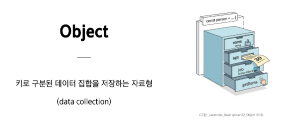

# 0518(JavaScript / Basic Syntax 02).md

# Basic syntax 02

## 객체

### 객체 기초 (정의, 구조, 접근)

> **Object**
> 



> **객체 구조**
> 
- 중괄호 ‘{ }’를 이용하여 작성
- 중괄호 안에는 key : value  쌍으로 구성된 속성 (property)를 여러 개 작성 가능하다
- key는 문자형만 허용 ( 백틱은 생략하고 적는데 표준 )
- value는 모든 자료형 허용

```jsx
const user = {
	name: 'Alice',
	'key with space': true,
	greeting: function ( ) {
		return 'hello'
		}
	}
```

> **속성 참조**
> 
- 점(’ . ‘) 표기법 또는 대괄호 (’[ ]’) 표기법으로 객체 속성에 접근
- key 이름에 띄어쓰기 같은 구분자가 있으면 대괄호 접근만 가능

```jsx
// 조회
console.log(user.name) // Alice
console.log(user['key with space']) // true

// 추가
user.address = 'korea'
console.log(user) // {name: 'Alice', key with space: true, address: 'korea', greeting: f}

// 수정
user.name = 'Bella'
cosole.log(user.name) // Bella

// 삭제
delete user.name
console.log(user) // {key with space:  true, address: 'korea', greeting: f}
```

> **‘ in ’ 연산자**
> 
- 속성이 객체에 존재하는지 여부를 확인
- 객체의 키나 배열의 인덱스 존재 여부를 확인하는 연산자
- 프로토타입 : 객체들이 기능을 물려받는 원본, 즉 ‘부모’ 역할을 하는 객체
- 프로토타입 체인 : 자신에게 없는 속성이나 기능을 부모, 조상 순으로 찾아가는 것

```jsx
console.log('greeting' in user) // true
console.log('country' in user) // false
```


## 메서드와 this

> **Method**
> 


> **Method  기본 문법**
> 
- 메서드도 값이 함수인 속성

```jsx
const myObj2 = {
	numbers: [1, 2, 3],
	myFunc: function() {
		this.numbers.forEach(function (number) {
			console.log(this) // window
			})
		}
	}
console.log(myObj2.myFuc())
```

- 메서드와 일반 함수의 차이는?
    - 메서드는 자신이 속한 객체의 다른 속성들에 접근할 수 있다
        
        → 이를 위한 방법이 바로 this!
        


> **‘ this ‘ keyword**
> 


> **Method & this 사용 예시**
> 

```jsx
const person = {
	name: 'Alice',
	greeting: function() {
		return `Hello my name is ${this.name}`
		},
	}

console.log(person.greeting()) // Hello my name is Alice
```

> **JavaScript에서 this는 함수를 “호출하는 방법”에 따라 가리키는 대상이 달라진다**
> 


> **단순 호출 this**
> 
- 가리키는 대상  ⇒ 전역 객체

```jsx
const myFunc = function() {
	return this
}

console.log(myFunc()) // window
```

> **메서드 호출 시 this**
> 
- 가리키는 대상 ⇒ 메서드를 호출한 객체

```jsx
const myObj = {
	data: 1,
	myFunc: function () {
		return this
		}
	}
	
console.log(myObj.myFuc()) // myObj
```

> **중첩된 함수에서의 this 문제점**
> 
- forEach의 인자로 전달된 콜백 함수는 일반 함수로 호출되므로, this는 전역 객체를 가리킨다

```jsx
const myObj2 = {
	numbers: [1, 2, 3],
	myFunc: function() {
		this.numbers.forEach(function (number) {
			console.log(this) // window
			})
		}
	}
console.log(myObj2.myFuc())
```

> **해결책**
> 
- **화살표 함수는 자신만의 this를 가지지 않는다**
- 따라서 외부 함수 (myFunc)에서의 this 값을 가져온다

```jsx
const myObj3 = {
	numbers: [1, 2, 3],
	myFunc: function() {
		this.numbers.forEach((number) => {
			console.log(this) // myObj3
			})
		}
	}
console.log(myObj3.myFuc())
```

> **JavaScript ‘this’ 정리**
> 
- JavaScript의 함수는 호출될 때 this를 암묵적으로 전달 받는다
- JavaScript에서 this는 함수가 “호출되는 방식”에 따라 결정되는 현재 객체를 나타낸다
- Python의 self와 Java의 this가 선언 시점에 이미 값이 정해지는 것과 달리
JavaScript의 this는 함수가 호출될 때 동적으로 결정한다
- 장점
    - 함수(메서드)를 하나만 만들어 여러 객체가 공유하여 각자 자신의 데이터로 동작하게 할 수 있다
- 단점
    - 이런 유연함이 실수로 이어질 수 있다


## JSON

> **JSON**
> 


> **Object ⇒ JSON**
> 
- JSON.stringfy( )를 사용하여 객체를 문자열로 변환

```jsx
const jsObject = {
	coffee: 'Americano',
	iceCream: 'COokie and cream',
}

// Object => JSON
const objToJson = JSON.stringfy(jsObject)

// {"coffee": "Americano", "iceCream": "Cookie and cream"}
console.log(objToJson)

// string
console.log(typeof objToJson)
```

> **JSON ⇒ Object**
> 
- JSON.parse( ) 를 사용하여 문자열을 객체로 변환

```jsx
// JSON -> Object
const jsonToObj = JSON.parse(objToJson)

// { coffee: 'Americano', iceCream: 'Cookie and cream' }
console.log(jsonToObj)

// object
console.log(type of jsonToObj)
```

### 추가 객체 문법

> **추가 객체 문법**
> 
1. 단축 속성
2. 단축 메서드
3. 계산된 속성 (computed property name)
4. 구조 분해 할당 (destructng assignmnet)
5. 객체와 전개 구문 (Spread Syntax)
6. Object Keys() / values() / entries()
7. Optional chaining(’?.’)


## 배열과 함수

### 배열 기초

> **배열**
> 


> **배열 구조**
> 
- 대괄호 ‘[ ]’ 를 이용하여 작성
- 요소의 자료형은 제약이 없다
- length 속성을 사용하여 배열에 담긴 요소 개수 확인이 가능하다

```jsx
const names = ['Alice', 'Bella', 'Cathy']

console.log(names[0]) // Alice
console.log(names[1]) // Bella
console.log(names[2]) // Cathy

console.log(names.length) // 3
```

> **배열 기본 조작 메서드**
> 
- push( )
- pop( )
- unshift( )
- shift( )

→ 모두 원본 배열을 직접 수정하는 메서드

> **push( )**
> 
- 배열 끝에 요소를 추가
- 원본 배열을 직접 수정
- 반환 값 : 추가된 후의 새로운 배열의 길이

```jsx
const names = ['Alice', 'Bella', 'Cathy']

names.push('Dan')

// ['Alice', 'Bella', 'Cathy', 'Dan']
console.log(names)
```

> **pop( )**
> 
- 배열 끝 요소를 제거
- 원본 배열을 직접 수정
- 반환 값 : 제거한 요소

```jsx
const names = ['Alice', 'Bella', 'Cathy']

console.log(names.pop()) // Dan

// ['Alice', 'Bella', 'Cathy']
console.log(names)
```

> **unshift( )  (가급적 사용 X)**
> 
- 배열 앞에 요소를 추가
- 원본 배열을 직접 수정
- 반환 값 : 추가된 후의 새로운 배열의 길이
- 배열의 모든 요소를 뒤로 한 칸씩 밀어야 하므로, 배열이 클수록 성능이 저하

```jsx
names.unshift('Eric')

// ['Eric', 'Alice', 'Bella', 'Cathy']
console.log(names)
```

> **shift( )  (가급적 사용 X)**
> 
- 배열 앞 요소를 제거하고, 제거한 요소를 반환
- 원본 배열을 직접 수정
- 반환 값 : 제거한 요소
- 배열의 모든 요소를 당겨와야 하므로, 배열이 클수록 성능이 저하

```jsx
console.log(names.shift()) // Eric

// ['Alice', 'Bella', 'Cathy']
console.log(names)
```

### 함수의 확장 : 콜백 함수

> **콜백 함수 (Callback function)**
> 


> **기본 동작 원리**
> 
- 콜백 함수는 배열이 아닌 일반적인 함수에서도 사용된다

```jsx
// 1. 인자로 받을 콜백 함수 정의
const greeting = function (name) {
	console.log(`Hello, ${name}!`)
	}
	
// 2. 함수를 인자로 받는 메인 함수
const processUserInput = function (callback) {
	const name = 'Anna'
	// 넘겨 받은 함수 (callback)를 여기서 실행
	callback(name)
	}

// 3. 실행 (힘수를 데이터처럼 전달)
processUserInput(greeting) // 출력 : Hello, Anna!
```

> **왜 사용할까?**
> 


> **배열과 콜백 함수**
> 
- 지금까지 배운 콜백 함수의 특징
1. 함수를 인자로 넘긴다
2. 받은 쪽에서 그 함수를 실행한다
3. 반복적인 작업을 시킬 때 아주 유용하다

> **주요 Array Helper Methods**
> 
- forEach
    - 배열 내의 모든 요소 각각에 대해 함수(콜백함수)를 호출
    - 반환 값은 없다
- map
    - 배열 내의 모든 요소 각각에 대하여 함수(콜백함수)를 호출
    - 함수 호출 결과를 모아 새로운 배열을 반환한다

### 배열의 진화 : Array helper method

> **배열의 진화**
> 
- 과거에는 `for (let i = 0; ...)` 처럼 “어떻게(How) 순회할지”를 일일이 코딩
- 이제는 Array Helper Method를 통해 “무엇을(What) 할지”만 함수 (콜백)로 전달

> **Array Helper Methods**
> 


> **주요 Array Helper Methods**
> 
1. 순회 : forEach
2. 변형 : map
3. 선별 : filter
4. (심화) 집계 : reduce (map + filter)

#### 순회 : for Each

> **forEach 란?**
> 
- 인자로 넘겨준 콜백 함수를 배열의 요소 개수만큼 반복해서 호출
- 특징
    - 가장 기본적인 순회 메서드
    - 별도의 반환 값(Return)이 없다 (단순 실행용)

> **구조 및 사용 방법**
> 

```jsx
// forEach 구문
arr.forEach(callback(item[, index[, array]]))

// 기본 구문
array.forEach(function (item, index, array) {
	// do something
	})
```

- 매개변수
1. `item` (필수) : 현재 처리 중인 배열의 요소
2. `index` (선택) : 현재 처리 중인 요소의 인덱스 (0, 1, 2 …)
3. `array` (선택) : 메서드를 호출한 배열 본체


> **forEach 사용하기 (Arrow Function)**
> 

```jsx
const names = ['Alice', 'Bella', 'Cathy']

// [기존] 일반 함수 (function 키워드)
names.forEach(function (name) {
	console.log(name)
	})
	
// [권장] 화살표 함수 (Arrow Function)
names.forEach(name) => {
	console.log(name)
	})
	
// 출력 결과

Alice
Bella
Cathy

Alice
Bella
Cathy
```


> **forEach 사용하기 (매개변수 활용)**
> 

```jsx
const names = ['Alice', 'Bella', 'Cathy']

names.forEach(name, index, array) => {
	console.log(`${name} / ${index} / ${array}`)
	})
	
// 출력 결과
Alice / 0 / Alice, Bella, Cathy
Bella / 1 / Alice, Bella, Cathy
Cathy / 2 / Alice, Bella, Cathy
```

> **주의 사항**
> 
1. **반환 값이 없다 (undefined)**
    1. forEach는 결과를 모아서 돌려주지 않는다. 변수에 할당해도 undefined만 저장된다
    2. 무언가 새로운 배열을 만들고 싶다면 → map을 사용해야 한다
2. **멈출 수 없다 (No break)**
    1. forEach는 배열의 끝까지 무조건 진행한다. break나 continue를 사용할 수 없다
    2. 중간에 멈춰야 한다면 → for … of 반복문을 사용해야 한다

#### 변형 : map

> **map 이란?**
> 
- 원본 배열의 요소를 1:1로 매핑(Mapping)하여 새로운 배열을 반환
- 핵심 동작 원리
    - Input : 원재료 (원본 배열)
    - Process : 가공 기계 (콜백 함수)
    - Output : 완제품 (새로운 배열)
    - 특징 : 원본 배열의 개수와 결과 배열의 개수는 항상 같다

> **구조 및 차이점**
> 

```jsx
// map 구문
arr.map(callback(item[, index[, array]]))

// 기본 구조
const newArr = array.map(function (item, index, array) {
	// do something
	})
```

- forEach와 구조는 완전히 동일하다 (인자 : item, index, array)
- 단, 반드시 return이 필요하다

```jsx
// forEach : 반환값이 없다
const result1 = arr.forEach(item) => {
	return item * 2 // (의미 없음)
	})
console.log(result1) // undefined

// map : 새로운 배열을 반환
const result2 = arr.map(item) => {
	return item * 2 // (필수) 이 값이 새로운 배열에 담긴다
	})
console.log(result2) // [2, 4, 6]
```

> **왜 map을 사용할까?**
> 


> **map 실전 활용**
> 


> **Python map 과의 비교**
> 
- Python의 map과 개념적으로 동일하나 문법적 차이가 존재한다
- Python : map(함수, 리스트) → list( ) 로 형변환이 필요
- JavaScript : 배열.map(함수) → 즉시 배열로 반환


#### 선별 : filter

> **filter란?**
> 
- 콜백 함수의 반환 값이 true인 요소만 모아서 새로운 배열을 만든다
- 핵심 동작
    - Input : 원본 배열 (전체 데이터)
    - Condition : 판별 기준  (콜백 함수)
    - Output : 조건을 통과한 요소들로 구성된 새로운 배열

> **구조 및 동작 원리**
> 

```jsx
// filter 구문
arr.filter(callback(item[, index[, array]]))

// 기본 구조
const newArr = array.filter(function (item, index, array) {
	// do something
	})
```

- forEach, map과 구조는 완전히 동일 (인자 : item, index, array)
- 단, return 값이 반드시 Boolean (true/false) 여야 한다
    - true : 요소를 유지한다 (통과)
    - false : 요소를 버린다 (탈락)

```jsx
const numbers = [1, 2, 3, 4, 5]

// 짝수만 걸러내기
const eves = numbers.filter(num) => {
	return num % 2 === 0 // 조건이 true면 남기고, false면 버린다
	})
	
const.log(event) // [2, 4]
```

> **map vs filter**
> 
- 두 메서드 모두 새로운 배열을 반환하지만, 목적이 다르다


> **filter 실전 활용 (삭제 기능)**
> 


### 기타 유용한 메서드

> **기타 유용한 Array Helper Methods**
> 


### 배열과 ‘전개 구문’

> **배열 with ‘전개 구문’**
> 
- ‘ … ‘ 은 배열의 괄호를 없애고 내용물만 꺼내기 때문에, 배열을 합치거나 중간에 삽입할 때 유용하다
- 전개 구문은 항상 새로운 배열을 만든다. (원본 배열은 전혀 변경되지 않는다)
- 배열 안의 객체는 데이터가 아닌, 주소 값만 복사된다. 복사본의 객체를 수정하면 원본도 바뀐다

```jsx
let parts = ['어깨', '무릎']
let lyrics = ['머리', ...parts, '발']

console.log(lyrics) // ['머리', '어깨', '무릎', '발']
```

### 배열 순회 종합

> **배열 순회 정리**
> 


> **Array Helper Methods 정리**
> 


## 참고

### (심화) 집계 : reduce

> **reduce 란?**
> 
- 배열을 숫자 하나, 문자열 하나, 혹은 완전히 다른 형태의 객체나 배열로 변환할 때 사용한다

→ 실무에서 아주 많이 쓰인다

> **구조 및 핵심 파라미터**
> 

```jsx
arr.reduce((acc, cur, index, array) => {
	return nextAccValue
	}, initialValue)
```

- 필수 요소 3가지
1. acc (Accumulator, 누적 값) : 이전 단계까지 계산된 결과 / return한 값이 다음 단계의 acc가 된다
2. cur (Current, 현재 값) : 지금 처리 중인 배열의 요소
3. initialValue(초기 값) : 생략 가능하지만, 명시하는 것을 강력 권장

> **기초 활용 : 숫자 합계 (Sum)**
> 
- acc가 어떻게 변하는지 흐름을 살펴보기


> **[심화] 데이터 변형 : 등장 횟수 세기 (Array → Object)**
> 
- 이름 목록을 { 이름 : 횟수 } 형태의 객체로 변환하기

```jsx
const names = ['Alice', 'Bob', 'Alice', 'Charlie', 'Bob']

const nameCounts = names.reduce((acc, name) => {
	// 현재 이름이 있으면 + 1 , 없으면 0에서 시작해서 + 1
	arr[name] = (acc[name] || 0) + 1
	return acc // 수정된 객체를 다음 단계로 넘긴다
	}, {}) // 중요! 초기값으로 '빈 객체 {}' 설정
	
	console.log(nameCounts) // 결과 : { Alice: 2, Bob: 2, Charlie: 1}
```


> **[심화] 만능 도구 (Map + Filter)**
> 
- reduce 하나만 있으면 map, filter의 기능을 모두 구현할 수 있다
- 한 번의 순회로 필터링과 변형을 동시에 처리할 수 있어 효율적일 때가 있다

```jsx
const nums = [1, 2, 3, 4, 5]

const result = nums.reduce((newArr, cur) => {
		if (cur % 2 === 0) {  // 1. Filter 역할 (짝수일 때만)
			newArr.push(cur * 2)  // 2. Map 역할 (2배 해서 push)
		}
		return newArr
	}, [])  // 초기 값은 빈 배열 []
	
console.log(result) // [4, 8]
```


### forEach의 중요성


### 배열은 객체다


### 클래스


> **new 연산자**
> 


### 정리


